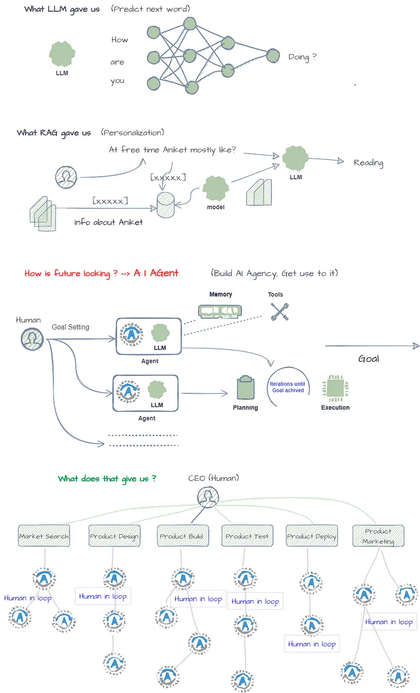
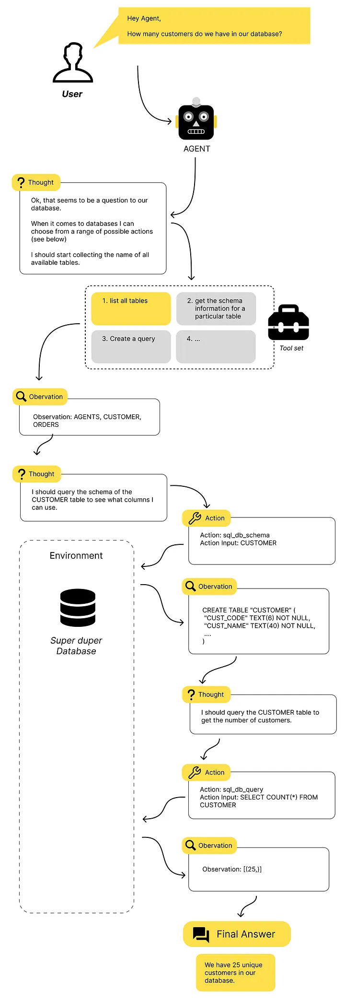

## References
- [A busy person’s Intro to AI Agents](https://medium.com/@mayaakim/a-busy-persons-intro-to-ai-agents-d9779d50cd84)
- [Navigating the World of LLM Agents: A Beginner’s Guide](https://towardsdatascience.com/navigating-the-world-of-llm-agents-a-beginners-guide-3b8d499db7a9)

======
======

# [Why do we need AI Agent, when we have LLM & RAG?](https://medium.com/@learn-simplified/why-entire-ai-field-is-headed-towards-ai-agents-a268ac9661ed)

While LLMs and RAG models have pushed the boundaries of what’s possible with language generation, the development of AI agents represents a step towards more intelligent, autonomous, and multi-capable systems that can work alongside humans in a wider variety of scenarios. The shift towards agents is about creating AI systems that can truly understand, learn, and solve problems in the real world.

There are several key reasons why AI agents needed.

1.  **Goal-oriented behavior**: LLMs and RAG models are primarily focused on generating human-like text based on patterns in their training data. However, they lack the ability to set and pursue specific goals in a flexible, intelligent manner. AI agents, on the other hand, can be designed to have explicit goals and to plan and take actions to achieve those goals.
2.  **Memory and state tracking**: Most current language models have no persistent memory or state tracking capabilities. Each input is processed independently. AI agents can maintain an internal state, accumulating knowledge over time and using that state to inform future decisions and actions.
3.  **Interaction with the environment**: LLMs operate solely in the text domain, without any direct interaction with the physical world. AI agents can perceive and act upon their environment, whether that is the digital world, robotic systems, or even the physical world through sensors and actuators.
4.  **Transfer and generalization**: While LLMs excel at language tasks similar to their training data, they often struggle to transfer knowledge to entirely new domains or tasks. AI agents, with their ability to learn, reason, and plan, have the potential for better transfer and generalization to novel situations.
5.  **Continual learning**: Most language models are static once trained. AI agents can continuously learn and adapt their knowledge and skills as they interact with new environments and situations over time.
6.  **Multi-task capability**: LLMs are typically specialized for particular language tasks. AI agents can be designed as general, multi-task systems capable of fluidly combining various skills like language, reasoning, perception, and control to tackle complex, multi-faceted problems.

=====
=====

> **An agent is a component that has access to a range of tools.** It‘s main feature lies in its ability to make informed decisions and employing the appropriate tools until it achieves a good enough answer.
>
> The concept of agents is perhaps the most fascinating development when it comes to LLM applications. It makes us dream of an AI that autonomously controls processes, conducts research or rescues our superhero by finding the scenario with the highest probability of survival.
>
> When we apply the concept of Agents, we use the LLM not just to answer questions, but rather as the brain that processes the observations it sees and makes decisions about what to do next. We humans do that all the time. We have a task to solve and are looking for ways and tools that help us to solve this task as easily as possible.