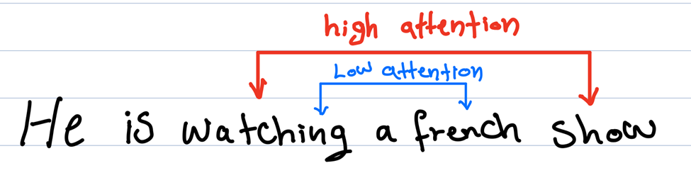
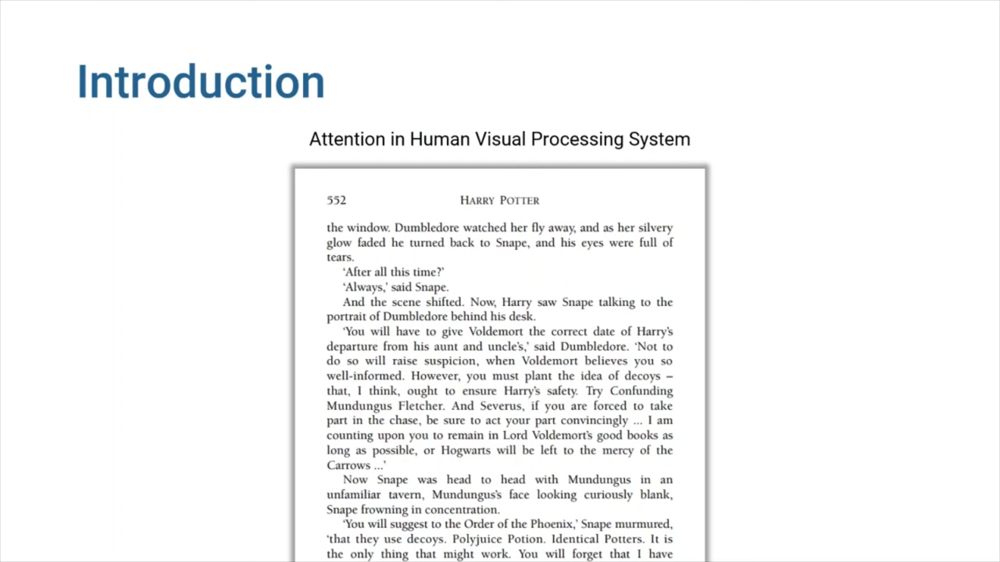
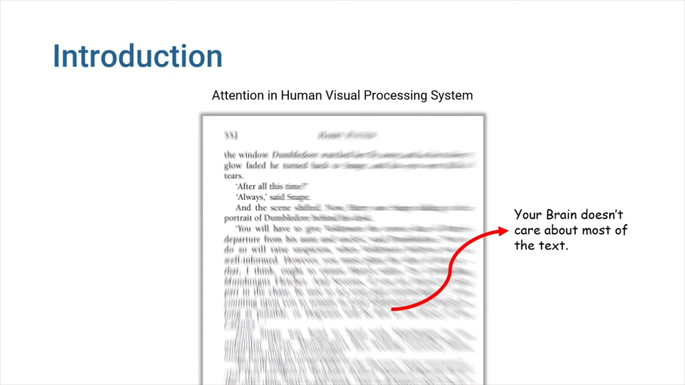
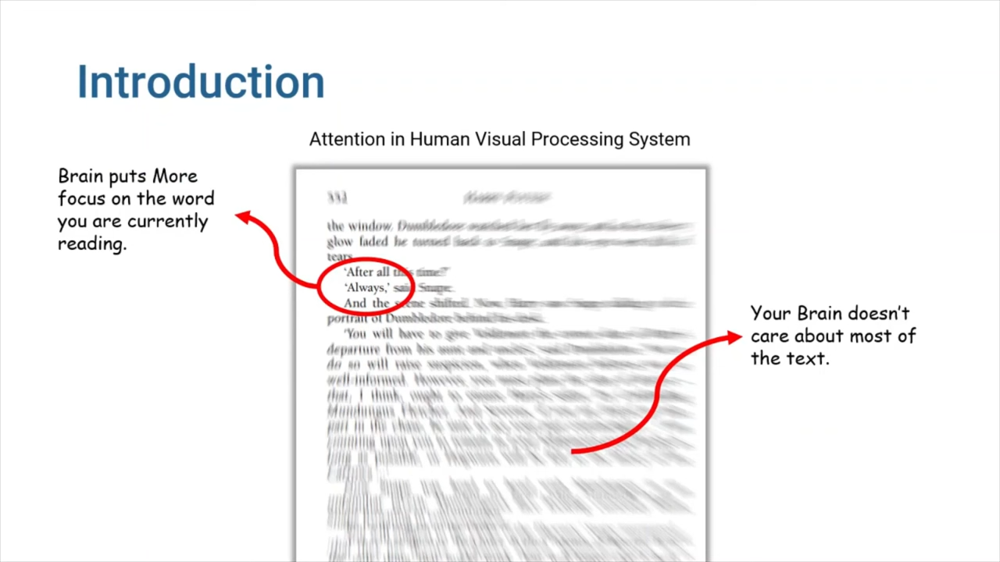
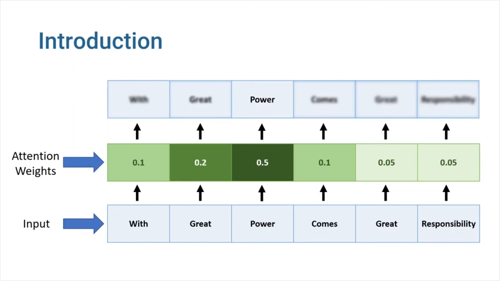
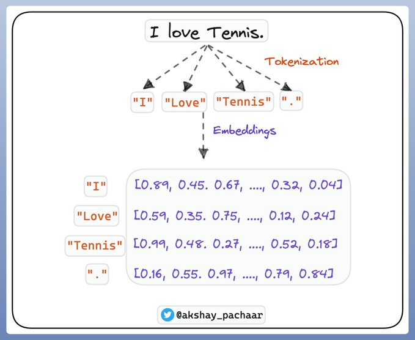
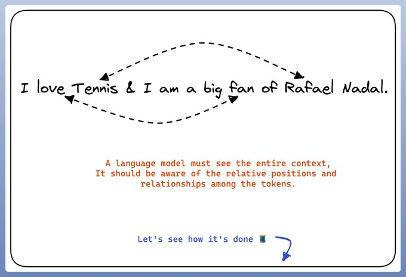
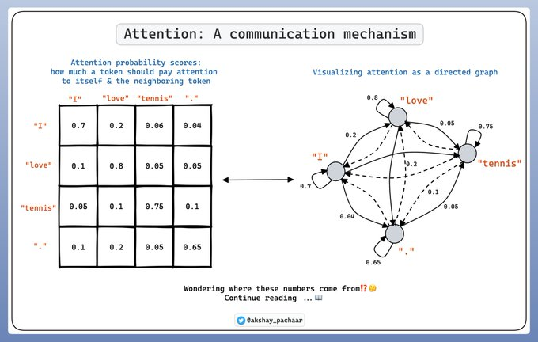
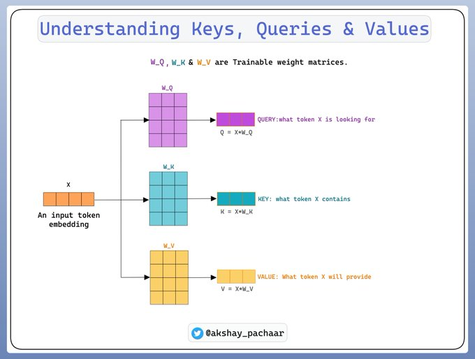
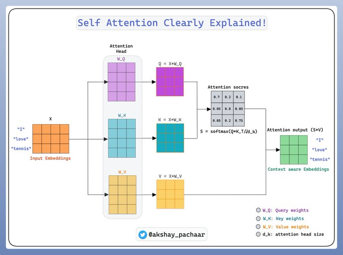

## References
- [Self-attention in transformers clearly explained](https://x.com/akshay_pachaar/status/1784923112813035592)
- [The math behind Attention: Keys, Queries, and Values matrices](https://www.youtube.com/watch?v=UPtG_38Oq8o)
- [Attention Mechanism In a nutshell](https://www.youtube.com/watch?v=oMeIDqRguLY)

====
====

## [The ABC of Self-Attention Mechanism: Simplifying AI’s Game-Changer](https://medium.com/@tommyadeliyi/the-abc-of-self-attention-mechanism-simplifying-ais-game-changer-e2346a8a1f79)

> To appreciate the innovation behind self-attention, consider how we, as humans, process information. When we read a book or engage in a conversation, our understanding isn’t linear. We don’t focus on each word or idea equally; instead, we draw on the broader context, emphasising certain details over others based on their relevance. This process of focusing our attention is analogous to the self-attention mechanism in AI.

> **Self-attention** allows an AI model to weigh the importance of different parts of the input data when performing a task. It enables the model to view and analyse the entire context of the input, such as a sentence or sequence of events, in one go. This is a departure from earlier methods where models processed data sequentially, often struggling with long-range dependencies or the broader context.

====
====

Self-attention as a directed graph!

Self-attention is at the heart of transformers, the architecture that led to the LLM revolution that we see today.

In this post, I'll clearly explain self-attention & how it can be thought of as a directed graph.

Before we start a quick primer on **tokenization**!

> **Raw text → Tokenization → Embedding → Model**

Embedding is a meaningful representation of each token (roughly a word) using a bunch of numbers.

This embedding is what we provide as an input to our language models.

The core idea of Language modelling is to understand the structure and patterns within language.

By modeling the relationships between words (tokens) in a sentence, we can capture the context and meaning of the text.

Now self attention is a communication mechanism that help establish these relationships, expressed as probability scores.

Each token assigns the highest score to itself and additional scores to other tokens based on their relevance.

You can think of it as a directed graph 👇

To understand how these probability/attention scores are obtained:

We must understand 3 key terms:

- Query Vector
- Key Vector
- Value Vector

These vectors are created by multiplying the input embedding by three weight matrices that are trainable.

Now here's a broader picture of how input embeddings are combined with Keys, Queries & Values to obtain the actual attention scores.

After acquiring keys, queries, and values, we merge them to create a new set of context-aware embeddings.

------
------
## Use-cases

Certainly! The attention mechanism, as visualized in the image, is a key component in many advanced natural language processing (NLP) applications. Here are some practical use cases:

### 1. Machine Translation
In machine translation, the attention mechanism helps the model to focus on different parts of the input sentence while generating each word of the output sentence.

**Example:**
- **Input (English):** "I love tennis."
- **Output (French):** "J'aime le tennis."

While translating the word "J'aime" (I love), the model will pay more attention to the words "I" and "love" from the input sentence.

### 2. Text Summarization
For summarizing long documents, attention mechanisms help the model to identify and focus on the most relevant parts of the text.

**Example:**
- **Input:** A long news article about climate change.
- **Output:** A summary highlighting the main points about the impact of climate change.

The model will focus on sentences and phrases that are crucial for understanding the overall content.

### 3. Question Answering
In question-answering systems, the attention mechanism helps the model to focus on relevant parts of the context to find the correct answer to a given question.

**Example:**
- **Input:**
    - **Context:** "The Eiffel Tower is located in Paris. It was completed in 1889."
    - **Question:** "When was the Eiffel Tower completed?"
- **Output:** "1889"

The model will focus on the part of the context mentioning the completion date of the Eiffel Tower.

### 4. Sentiment Analysis
In sentiment analysis, attention mechanisms allow models to focus on words or phrases that contribute most to the sentiment of a sentence or document.

**Example:**
- **Input:** "The movie was fantastic, but the ending was disappointing."
- **Output:** Mixed sentiment (with high attention on "fantastic" and "disappointing")

The model will pay more attention to the words "fantastic" and "disappointing" to determine the overall sentiment.

### 5. Text Generation
In text generation tasks such as writing assistants or chatbots, attention mechanisms help the model to generate coherent and contextually appropriate responses.

**Example:**
- **Input:** "I am planning to visit Paris next month."
- **Output:** "That sounds exciting! Make sure to visit the Eiffel Tower."

The model will focus on "visit Paris" to generate a relevant and coherent response.

### 6. Image Captioning
In image captioning, attention mechanisms help models to generate descriptive captions by focusing on different parts of an image.

**Example:**
- **Input:** An image of a dog playing with a ball.
- **Output:** "A dog playing with a ball in the park."

The model will focus on different regions of the image (e.g., the dog, the ball, the park) to generate the caption.

### Conclusion
These use cases demonstrate how the attention mechanism allows models to dynamically focus on the most relevant parts of the input, enhancing their ability to understand and generate natural language. This mechanism is critical in achieving state-of-the-art performance in various NLP tasks.

----
----
## Machine Translation without and without self-attention

Great question! To understand the difference between using attention and not using attention in machine translation, let's consider both scenarios using the example "I love tennis."

### Without Attention
Without attention, the model processes the sentence in a more rigid, sequential manner. Each word is translated independently without considering the context provided by the surrounding words. This often results in less accurate translations because the model cannot effectively capture the relationships between words.

### With Attention
With attention, the model dynamically focuses on different parts of the input sentence as it translates each word. This allows the model to understand the context and relationships between words, leading to more accurate and contextually appropriate translations.

### Detailed Comparison

#### Without Attention
1. **Rigid Translation Process:**
    - The model translates "I" to "Je".
    - Then it translates "love" to "aime".
    - Finally, it translates "tennis" to "tennis".

2. **Result:**
    - The translated sentence is: "Je aime tennis."
    - This translation might miss some grammatical correctness because the model did not fully understand the context.

#### With Attention
1. **Dynamic Translation Process:**
    - The model looks at the entire sentence and assigns attention scores to each word.
    - For "I", it focuses heavily on itself with an attention score of 0.7.
    - For "love", it focuses heavily on itself with an attention score of 0.8.
    - For "tennis", it focuses heavily on itself with an attention score of 0.75.

2. **Combining Words:**
    - When translating "I love", the model considers "I" and "love" together, understanding that they should be combined to form "J'aime".
    - For "tennis", the model recognizes that "tennis" remains "tennis" in French and adds the article "le" to make it grammatically correct.

3. **Result:**
    - The translated sentence is: "J'aime le tennis."
    - This translation is more accurate and grammatically correct because the model used attention to understand the context.

### Simplified Illustration

#### Without Attention:
- "I" -> "Je"
- "love" -> "aime"
- "tennis" -> "tennis"
- Result: "Je aime tennis."

#### With Attention:
- Focus on "I" and "love" together: "I love" -> "J'aime"
- Focus on "tennis" with context: "tennis" -> "le tennis"
- Result: "J'aime le tennis."

### Why Attention Makes a Difference
- **Context Awareness:** Attention allows the model to consider the context of each word. For example, understanding that "I love" translates to "J'aime" and needs to be treated as a single unit rather than two separate translations.
- **Grammatical Correctness:** Attention helps the model produce grammatically correct translations by focusing on the relationships between words. For instance, adding "le" before "tennis" in the French translation.
- **Flexibility:** The model can dynamically adjust which parts of the input sentence it focuses on, leading to more accurate and nuanced translations.

### Summary
Using attention in machine translation allows the model to produce more accurate and contextually appropriate translations by dynamically focusing on different parts of the input sentence. Without attention, the model translates words in a more rigid and isolated manner, often resulting in less accurate translations.