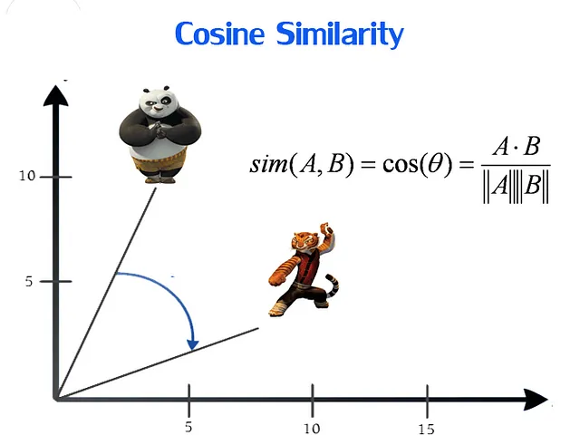

## Word Prediction
Chắc chắn rồi! Hãy cùng đi qua một ví dụ chi tiết từng bước về cách Gen AI đoán từ từ word embedding.

### Bối cảnh: Dự đoán từ còn thiếu trong câu "The quick brown fox jumps over the lazy ___"

#### Bước 1: Chuẩn bị Dữ liệu
Giả sử chúng ta có câu: "The quick brown fox jumps over the lazy ___".

#### Bước 2: Chuyển đổi Từ thành Vector
Sử dụng mô hình word embedding (ví dụ: Word2Vec), mỗi từ trong câu sẽ được biểu diễn dưới dạng vector. Giả sử các vector có dạng như sau:

- "The" → `[0.1, 0.2, 0.3, ...]`
- "quick" → `[0.4, 0.5, 0.6, ...]`
- "brown" → `[0.7, 0.8, 0.9, ...]`
- "fox" → `[1.0, 1.1, 1.2, ...]`
- "jumps" → `[1.3, 1.4, 1.5, ...]`
- "over" → `[1.6, 1.7, 1.8, ...]`
- "the" → `[0.1, 0.2, 0.3, ...]`
- "lazy" → `[1.9, 2.0, 2.1, ...]`

#### Bước 3: Xây dựng Ngữ cảnh
Từ cần đoán là từ sau từ "lazy". Các từ xung quanh trong ngữ cảnh là: "The", "quick", "brown", "fox", "jumps", "over", "the", "lazy".

#### Bước 4: Tính Toán Vector Ngữ Cảnh
Các vector của các từ xung quanh sẽ được kết hợp lại. Một phương pháp đơn giản là tính trung bình của các vector từ:

- Vector ngữ cảnh = ( `[0.1, 0.2, 0.3, ...]` + `[0.4, 0.5, 0.6, ...]` + `[0.7, 0.8, 0.9, ...]` + `[1.0, 1.1, 1.2, ...]` + `[1.3, 1.4, 1.5, ...]` + `[1.6, 1.7, 1.8, ...]` + `[0.1, 0.2, 0.3, ...]` + `[1.9, 2.0, 2.1, ...]` ) / 8

Giả sử kết quả tính toán ra vector ngữ cảnh là:

- Vector ngữ cảnh = `[0.8875, 1.0125, 1.1375, ...]`

#### Bước 5: So Sánh và Đoán Từ
So sánh vector ngữ cảnh này với các vector từ trong từ điển word embedding. Từ nào có độ tương đồng cosine cao nhất sẽ được chọn.

- Giả sử vector của từ "dog" là `[0.9, 1.0, 1.1, ...]`
- Tính độ tương đồng cosine giữa vector ngữ cảnh `[0.8875, 1.0125, 1.1375, ...]` và vector của từ "dog" `[0.9, 1.0, 1.1, ...]`

- Giả sử độ tương đồng cosine cao nhất là với từ "dog", AI sẽ dự đoán từ này.

#### Bước 6: Phản hồi và Cải thiện (nếu có)
Nếu mô hình đang được huấn luyện hoặc có phản hồi từ người dùng, kết quả dự đoán sẽ được sử dụng để điều chỉnh mô hình, giúp cải thiện khả năng đoán từ trong các lần sau.

### Tổng kết
Flow cụ thể trong ví dụ này:

1. **Chuẩn bị Dữ liệu**: "The quick brown fox jumps over the lazy ___"
2. **Embedding**: Chuyển đổi từng từ thành vector
3. **Ngữ cảnh**: Xác định các từ xung quanh từ cần đoán
4. **Tính toán vector ngữ cảnh**: Tổng hợp các vector từ xung quanh thành một vector ngữ cảnh
5. **Đoán từ**: So sánh vector ngữ cảnh với từ điển vector, chọn từ có độ tương đồng cao nhất (ví dụ: "dog")
6. **Cải thiện**: Điều chỉnh mô hình (nếu có phản hồi)

Qua các bước này, Gen AI có thể đoán từ thiếu dựa trên ngữ cảnh một cách chính xác và hiệu quả.