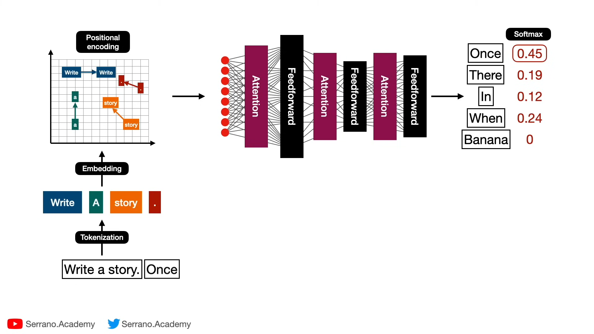

## References
- [LLM University](https://cohere.com/llmu)
- **[What are Transformer Models and how do they work?](https://www.youtube.com/watch?v=qaWMOYf4ri8)**
- **[The math behind Attention: Keys, Queries, and Values matrices](https://www.youtube.com/watch?v=UPtG_38Oq8o)**

=====
=====

## Overview

Tất nhiên, tôi sẽ giải thích cách hoạt động của mô hình transformer này bằng một ví dụ minh họa đơn giản. Giả sử chúng ta đang sử dụng mô hình này để dự đoán từ tiếp theo trong câu "Write a story. Once".

1. Tokenization (Phân tách từ):
   Câu được chia thành các token: "Write", "a", "story", ".", "Once"

2. Embedding (Nhúng):
   Mỗi token được chuyển đổi thành một vector số. Ví dụ:
   "Write" -> [0.1, 0.3, -0.1, ...]
   "a" -> [0.2, -0.1, 0.4, ...]
   ...

3. Positional Encoding (Mã hóa vị trí):
   Thông tin về vị trí của mỗi từ được thêm vào vector nhúng. Điều này giúp mô hình hiểu thứ tự của các từ.

4. Attention Layers (Các lớp chú ý):
   Mỗi từ "chú ý" đến tất cả các từ khác trong câu. Ví dụ, khi xử lý "Once", nó sẽ chú ý nhiều đến "Write" và "story" vì chúng quan trọng để dự đoán từ tiếp theo.

5. Feedforward Layers (Các lớp truyền xuôi):
   Xử lý thêm thông tin từ lớp chú ý. Feedforward giúp mô hình "suy nghĩ sâu hơn" về thông tin từ Attention, cho phép nó học và áp dụng các quy luật phức tạp của ngôn ngữ mà đơn giản chỉ nhìn vào các từ riêng lẻ không thể nắm bắt được.

6. Quá trình này lặp lại qua nhiều lớp (trong hình có 3 cặp lớp Attention-Feedforward).

7. Softmax Output (Đầu ra Softmax):
   Cuối cùng, mô hình dự đoán xác suất cho từ tiếp theo. Trong ví dụ này:
   "Once" : 0.45 (45% khả năng)
   "There" : 0.19 (19% khả năng)
   "In" : 0.12 (12% khả năng)
   "When" : 0.24 (24% khả năng)
   "Banana" : 0 (0% khả năng)

Trong trường hợp này, mô hình dự đoán từ có khả năng xuất hiện tiếp theo nhất là "Once", có thể bắt đầu một câu mới như "Once upon a time...".

Quá trình này cho phép mô hình hiểu ngữ cảnh và mối quan hệ giữa các từ trong câu, từ đó đưa ra dự đoán chính xác hơn về từ tiếp theo.

=====
=====

## Word Embeddings

=====
=====

## Positional Encoding

Tôi sẽ giải thích positional encoding với một ví dụ minh họa cụ thể. Hãy xem xét câu: "Tôi thích ăn phở"

1. Embedding ban đầu (giả sử vector 4 chiều):
   - Tôi:    [0.2, 0.5, 0.1, 0.8]
   - thích:  [0.4, 0.3, 0.7, 0.2]
   - ăn:     [0.1, 0.6, 0.3, 0.9]
   - phở:    [0.5, 0.2, 0.8, 0.4]

2. Positional encoding (giả sử):
   - Vị trí 1: [0.00, 0.01, 0.00, 0.01]
   - Vị trí 2: [0.01, 0.02, 0.01, 0.02]
   - Vị trí 3: [0.02, 0.03, 0.02, 0.03]
   - Vị trí 4: [0.03, 0.04, 0.03, 0.04]

3. Kết hợp embedding và positional encoding:
   - Tôi:    [0.20, 0.51, 0.10, 0.81]
   - thích:  [0.41, 0.32, 0.71, 0.22]
   - ăn:     [0.12, 0.63, 0.32, 0.93]
   - phở:    [0.53, 0.24, 0.83, 0.44]

4. Minh họa tác động:

a) Phân biệt từ giống nhau ở vị trí khác:
Giả sử có câu: "Tôi thích phở phở":
- "phở" ở vị trí 3: [0.52, 0.23, 0.82, 0.43]
- "phở" ở vị trí 4: [0.53, 0.24, 0.83, 0.44]

Mô hình có thể phân biệt hai từ "phở" này.

b) Nắm bắt quan hệ dựa trên vị trí:
Trong câu "Tôi thích ăn phở":
- "thích" (vị trí 2) có quan hệ gần với "Tôi" (vị trí 1) và "ăn" (vị trí 3)
- Mô hình có thể hiểu "Tôi" là chủ thể của "thích", và "ăn" là hành động được thích

c) Xử lý câu dài hơn:
Nếu câu dài hơn: "Tôi thích ăn phở vào buổi sáng"
- Các từ mới sẽ có positional encoding tương ứng:
  - vào:    [0.04, 0.05, 0.04, 0.05]
  - buổi:   [0.05, 0.06, 0.05, 0.06]
  - sáng:   [0.06, 0.07, 0.06, 0.07]

5. Ứng dụng trong self-attention:
    - Khi tính toán attention cho từ "thích", mô hình có thể:
        + Chú ý nhiều đến "Tôi" (chủ thể)
        + Chú ý ít hơn đến "phở" (đối tượng xa hơn)

6. Lợi ích trong các tác vụ:

   a) Dịch máy:
   - "Tôi thích ăn phở" -> "I like eating pho"
   - Giữ được thứ tự từ khi dịch

   b) Phân tích cảm xúc:
   Hiểu "thích" liên quan đến "Tôi", không phải "phở"

   c) Trả lời câu hỏi:
   - Câu hỏi: "Ai thích ăn phở?"
   - Mô hình có thể xác định "Tôi" là chủ thể của "thích"

Ví dụ này minh họa cách positional encoding giúp mô hình transformer nắm bắt thông tin vị trí và quan hệ giữa các từ trong câu, dẫn đến hiệu suất tốt hơn trong nhiều tác vụ xử lý ngôn ngữ tự nhiên.

=====
=====
## Attention Mechanism
Attention trong transformer là một cơ chế cho phép mô hình tập trung vào các phần quan trọng của dữ liệu đầu vào khi xử lý thông tin. Hãy giải thích đơn giản như sau:

1. Tưởng tượng bạn đang đọc một đoạn văn dài. Khi trả lời câu hỏi về đoạn văn đó, bạn không cần nhớ mọi từ, mà chỉ tập trung vào những từ hoặc cụm từ quan trọng liên quan đến câu hỏi.

2. Attention hoạt động tương tự. Nó giúp mô hình "chú ý" vào những phần quan trọng của dữ liệu đầu vào, thay vì xử lý mọi thứ với mức độ quan trọng như nhau.

3. Cơ chế này cho phép mô hình xác định mối quan hệ giữa các phần khác nhau của dữ liệu đầu vào, bất kể vị trí của chúng trong chuỗi.

4. Trong quá trình xử lý, mô hình sẽ tính toán "trọng số attention" cho mỗi phần của dữ liệu đầu vào, quyết định mức độ quan trọng của từng phần đối với nhiệm vụ hiện tại.

5. Nhờ vậy, mô hình có thể hiểu ngữ cảnh tốt hơn và tạo ra kết quả chính xác hơn trong nhiều nhiệm vụ như dịch máy, tóm tắt văn bản, hoặc trả lời câu hỏi.

-----

## Multi-headed attention
Multi-headed attention là một phiên bản mở rộng của cơ chế attention thông thường. Hãy giải thích nó một cách đơn giản:

1. Thay vì chỉ có một cơ chế attention (một "head"), multi-headed attention sử dụng nhiều head attention song song.

2. Mỗi head attention hoạt động độc lập và tập trung vào các khía cạnh khác nhau của dữ liệu đầu vào.

3. Tưởng tượng bạn đang đọc một cuốn sách với nhiều người bạn. Mỗi người sẽ chú ý đến những chi tiết khác nhau:
    - Một người tập trung vào cốt truyện chính
    - Người khác chú ý đến mô tả nhân vật
    - Người thứ ba quan tâm đến bối cảnh lịch sử

4. Tương tự, mỗi head trong multi-headed attention có thể học để tập trung vào các mối quan hệ hoặc đặc điểm khác nhau trong dữ liệu.

5. Kết quả từ tất cả các head sau đó được kết hợp lại để tạo ra một biểu diễn phong phú và đa chiều của dữ liệu đầu vào.

6. Lợi ích chính của multi-headed attention là nó cho phép mô hình nắm bắt nhiều loại mối quan hệ và thông tin khác nhau từ dữ liệu đầu vào, dẫn đến hiệu suất tốt hơn trong nhiều nhiệm vụ.

Multi-headed attention giúp mô hình có cái nhìn toàn diện hơn về dữ liệu, tương tự như việc bạn nhận được nhiều góc nhìn khác nhau về một cuốn sách khi thảo luận với nhiều người bạn.

=====
=====
## Feedforward Neural Network

Tôi hiểu rồi. Hãy đi sâu vào một ví dụ phức tạp hơn với "The cat _____", mô phỏng một Feedforward Neural Network phức tạp hơn:

Hãy tưởng tượng một tòa nhà nhiều tầng, mỗi tầng có nhiều phòng xử lý thông tin:

1. Tầng đầu tiên (Input Layer):
    - Nhận thông tin về "The cat"
    - 10 phòng, mỗi phòng phân tích một khía cạnh:
        1. Ngữ cảnh trước đó
        2. Vị trí trong câu
        3. Thời gian ngữ pháp
        4. Chủ ngữ (cat)
        5. Các từ đi kèm thường gặp
        6. Emotion/tone của câu
        7. Thể loại văn bản
        8. Độ phức tạp của câu
        9. Tần suất xuất hiện của cụm từ
        10. Các yếu tố văn hóa/địa lý

2. Tầng ẩn thứ nhất (Hidden Layer 1):
    - 20 phòng xử lý, mỗi phòng kết hợp thông tin từ tầng trước
    - Ví dụ:
        - Phòng 1: Phân tích hành vi mèo phổ biến
        - Phòng 2: Xem xét cấu trúc câu phổ biến với "cat"
        - Phòng 3: Đánh giá ngữ cảnh văn học/phi văn học
          ...

3. Tầng ẩn thứ hai (Hidden Layer 2):
    - 15 phòng xử lý, tập trung vào các khía cạnh cụ thể hơn
    - Ví dụ:
        - Phòng 1: Hành động vật lý của mèo
        - Phòng 2: Trạng thái tinh thần của mèo
        - Phòng 3: Tương tác của mèo với môi trường
          ...

4. Tầng ẩn thứ ba (Hidden Layer 3):
    - 12 phòng, mỗi phòng đại diện cho một nhóm từ cụ thể:
        1. Động từ chuyển động (jumped, ran, climbed)
        2. Động từ tĩnh (sat, slept, rested)
        3. Động từ âm thanh (meowed, purred, hissed)
        4. Động từ ăn uống (ate, drank, licked)
        5. Động từ tương tác (played, scratched, cuddled)
           ...

5. Tầng đầu ra (Output Layer):
    - 100 phòng, mỗi phòng đại diện cho một từ cụ thể có thể theo sau "The cat"
    - Ví dụ: sat, jumped, purred, watched, hunted, slept, climbed, ate, played, scratched...

Kết quả cuối cùng:
Mỗi phòng ở tầng đầu ra sẽ có một "điểm số" dựa trên tất cả thông tin đã được xử lý qua các tầng. Điểm số này được chuyển đổi thành xác suất. Ví dụ:

1. "sat" - 25%
2. "jumped" - 15%
3. "purred" - 12%
4. "watched" - 10%
5. "hunted" - 8%
   ...và còn nhiều từ khác với xác suất thấp hơn.

Trong quá trình này:
- Mỗi "phòng" tương đương với một neuron trong mạng.
- Việc truyền thông tin giữa các phòng và tầng tương đương với việc áp dụng trọng số và hàm kích hoạt trong mạng neural.
- Mạng học cách tinh chỉnh "quy trình xử lý" của mỗi phòng để đưa ra kết quả chính xác hơn qua thời gian (quá trình training).

Feedforward Neural Network phức tạp này cho phép mô hình xem xét nhiều khía cạnh và mối quan hệ tinh tế trong ngôn ngữ để đưa ra dự đoán chính xác về từ tiếp theo.

====
====

