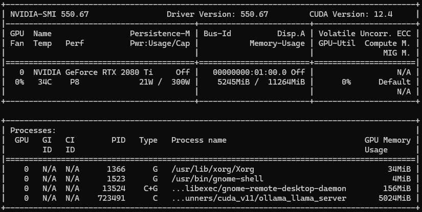
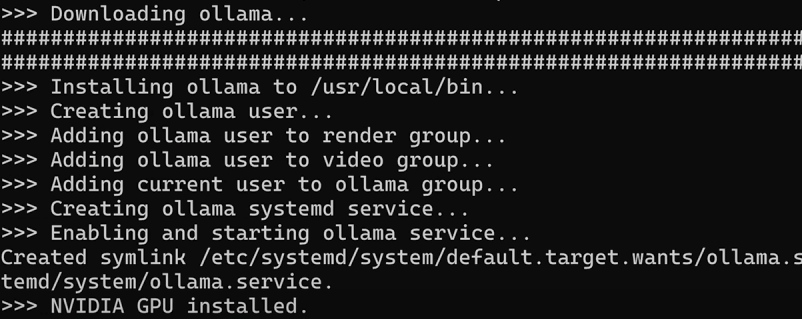

## References
- [Host ALL your AI locally](https://www.youtube.com/watch?v=Wjrdr0NU4Sk&t=158s)
- [Open-webui doesn't detect Ollama](https://github.com/open-webui/open-webui/discussions/803)
- [ollama](https://github.com/ollama/ollama)

====
====
## [Create your own Self-Hosted Chat AI Server with Ollama and Open WebUI](https://noted.lol/ollama-openwebui/)

I'm really impressed by the potential of self-hosted AI chat, but when it comes down to it, I think it's essential to keep my data under my own roof. Hosting it myself gives me peace of mind knowing that my personal info isn't being siphoned off for who-knows-what purposes.

I decided to build a mid-range AI processing server using some extra hardware I had in storage. Here's a glance inside and here are the specs.

-   32GB of RAM
-   i5 10600K CPU
-   NVIDIA GeForce GTX 2080 Ti
-   2TB SSD


Nothing super fancy but it will be plenty powerful enough for my use case. I may upgrade to a larger CPU and SSD some time in the future but it has been performing wonderfully so far.

## What is Ollama?

[OLLAMA](https://ollama.com/?ref=noted.lol) lets you take the reins and create your own unique chat experiences from scratch. With their cutting-edge NLP and ML tech, you can craft conversations that feel like they're coming straight from a human (or almost as good, at least!).


According to OLLAMA's mission, they're all about giving people and businesses the power to build custom AI-powered chats that fit perfectly with their online presence - whether that's a website, mobile app, customer service hub or a simple self-hosted chat you can use privately.

Just FYI, I'm not affiliated with OLLAMA (just a curious observer), but they seem like a pretty cool platform for anyone looking to get creative with AI-powered conversations!

In an earlier article, we went over [how to install OLLAMA using Docker](https://noted.lol/ollama/) with some basic understanding of how the tool works. In this article We will be installing OLLAMA on bare metal along side Open WebUI as our chat server.

OLLLAMA uses the Linux terminal as its foundation to generate conversations powered by large language models. To make it even more engaging, we'll be processing our chats through Open WebUI, which will provide a more versatile and intuitive experience for users.

## What is Open WebUI?

[Open WebUI](https://github.com/open-webui/open-webui?ref=noted.lol) is an open-source gem that brings command-line applications to the web, making them more accessible and user-friendly for everyone. By providing a graphical interface, Open WebUI lets you interact with Linux terminals and other command-line tools in a way that feels more like a desktop application than a traditional terminal session. This means you can enjoy the power of AI-powered chat systems like OLLAMA without having to navigate the complexities of a terminal interface. Perfect for those who want to get started quickly with AI chat.

## Setting up OLLAMA on PopOS 22.04 LTS (NVIDIA)

I'm fortunate enough to have a "powerful" NVIDIA GeForce GTX 2080 Ti with an "impressive" 11GB of video RAM (VRAM). When it came time to choose an operating system, I decided on [Pop!\_OS 22.04 LTS (NVIDIA)](https://pop.system76.com/?ref=noted.lol), which comes with all the necessary drivers pre-installed. This was a no-brainer for me, as it ensures that my GPU is recognized and utilized by OLLAMA, our AI app of choice.

Using OLLAMA without the right GPU support would mean relying on CPU processing power alone, which can be quite limited when working with complex models or larger datasets. By contrast, with this "powerful" GPU at my disposal, I'm able to run more demanding models and take full advantage of OLLAMA's capabilities.

I can punch in `nvidia-smi` in my terminal and see all the cool stats for my GPU.

> watch -n 0.5 nvidia-smi



If you don't have Pop!\_OS with the NVIDIA driver, no worries! You can still use OLLAMA and other AI apps that need a GPU like yours. Just make sure to install CUDA on your system so it can work properly with your NVIDIA card. And while OLLAMA doesn't strictly require a GPU, having one can make a big difference in performance.

This system handles large 7B and 8B models without any issues, making it perfect for AI-related tasks. And while 13B models might be slightly slower due to the larger size, you won't even notice a significant delay in responses. Compared to other options out there, this setup is quite affordable and capable of tackling a wide range of demanding AI projects.

To run a 70 billion (70B) AI model, it's essential to have a powerful setup with significant computational resources. Here are the key recommendations:

-   GPU memory (VRAM): At least 24GB, but ideally more like 40GB or 80GB, provided by a GPU such as the NVIDIA A100
-   CPU performance: A high-performance multi-core processor, such as an Intel i9 or AMD Ryzen 9 with at least 16 cores
-   Disk space: A solid-state drive (SSD) with at least 4TB of capacity for saving model files and temporary workspace
-   Memory (RAM): At least 128GB, preferably more
-   Cooling system: An efficient cooling solution to prevent overheating during training

## Installing OLLAMA

It's easy. But first, make sure you run an update and upgrade on your system before installing.

```
sudo apt update
sudo apt upgrade -y
```

Just hop on over to the [OLLAMA website](https://ollama.com/download/linux?ref=noted.lol) and grab the one line bash script command.

```
curl -fsSL https://ollama.com/install.sh | sh
```

Paste this into your terminal and watch the magic happen. This will install OLLAMA on your PopOS system. When you are done, it should show you something like this.



Sweet! With Pop!\_OS and NVIDIA drivers on board, my system is able to detect my trusty GeForce GTX 2080 Ti GPU. As a result, I'm all set to get started with OLLAMA. No need to worry about compatibility issues or performance issues.

## Installing LLMs for OLLAMA

To add a model to use with OLLAMA, simply type `ollama pull llama3` into your terminal. This will download the default llama3 8B model to your system and store it in `/usr/share/ollama/.ollama/models/blobs.` OLLAMA has several models you can pull down and use. See the complete [OLLAMA model list here](https://ollama.com/library?ref=noted.lol).

Now you can chat with OLLAMA by running `ollama run llama3` then ask a question to try it out!


Using OLLAMA from the terminal is a cool experience, but it gets even better when you connect your OLLAMA instance to a web interface. This allows for an improved overall experience and easier interaction with all the features of OLLAMA. 😄

## Installing Open WebUI with Docker

By adopting Open WebUI, you'll find it simpler and more intuitive to manage OLLAMA. This means you'll have better control over adding, removing, or customizing models, as well as working with documents and developing your own models! You can even create user accounts to share access to OLLAMA, and decide which models each user can utilize.

Don't have Docker installed and need a simple guide? Check out our [guide on Installing Docker](https://noted.lol/install-docker-and-portainer/) here.

Just remember that OLLAMA's API operates on port 11434. To confirm it's working, visit http://127.0.0.1:11434 in your web browser and you should see "Ollama is running." We'll utilize this address to link OLLAMA with Open WebUI using the following Docker command in our environment.

```
sudo docker run -d -p 8080:8080 --network=host -v /media/jeremy/docker/data/open-webui:/app/backend/data -v /media/jeremy/docker/docs:/data/docs -e OLLAMA_BASE_URL=http://127.0.0.1:11434 --name open-webui --restart always ghcr.io/open-webui/open-webui:main
```

Or if you prefer Docker Compose

```undefined
services: open-webui: image: 'ghcr.io/open-webui/open-webui:main' restart: always network_mode: "host" container_name: open-webui environment: - 'OLLAMA_BASE_URL=http://127.0.0.1:11434' volumes: - '/media/jeremy/docker/docs:/data/docs' - '/media/jeremy/docker/data/open-webui:/app/backend/data' ports: - '8080:8080'
```

Since I have a separate SSD installed for Docker and self-hosted apps, I mounted the volumes to that drive. You can mount the volumes where you feel so be sure to change those.

Since everything is done locally on the machine it is important to use the `network_mode: "host"` so Open WebUI can see OLLAMA.

Now, by navigating to localhost:8080, you'll find yourself at Open WebUI. To get started, please create a new account (this initial account serves as an admin for Open WebUI). Please note that everything here is being run locally for now but you can expose this using Cloudflare if you choose.


You will notice when you browse around Open WebUI that it is quite amazing the things you can do. There's so much to cover but I wanted to touch on my favorite feature about Open WebUI called Memory.

Memory is a new experimental feature that allws you to input your preferred personal details, such as past events or experiences, and our Large Language Model (LLM) will aim to recall them in the future. Access this feature through Settings > Personalization > Memory.


This feature can help you set reminders, remember special dates or events, keep track of what you eat (great for those aiming to lose weight or following specific dietary restrictions), and even manage code snippets and compose files. It can output code from memory! These are just a few examples of how it can be useful! As you use it more, I'm sure you will discover many other ways to take advantage of its capabilities!


I added a few memories today as an example. I will ask OLLAMA what size socket my ATV uses for the oil plug because I always forget.


It remembered! 17mm is the memory I added and it was super fast at responding.

I think you get the idea. It's time for you to explore Open WebUI for yourself and learn about all the cool features. You can feed in documents through Open WebUI's document manager, create your own custom models and more. It just keeps getting more advanced as AI continues to evolve.

I hope you found this enjoyable and get some great use out of OLLAMA and Open WebUI!