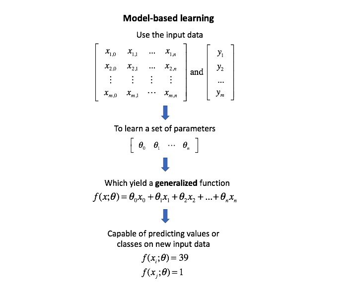
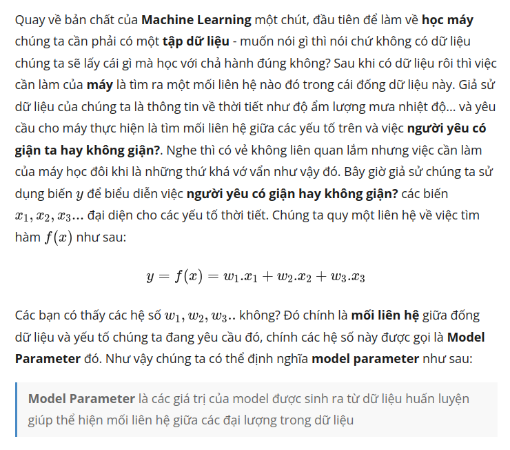

## References
- [Hyperparameter tuning for machine learning models](https://www.jeremyjordan.me/hyperparameter-tuning/)
- [Model parameter là gì](https://viblo.asia/p/mot-vai-hieu-nham-khi-moi-hoc-machine-learning-4dbZNoDnlYM)

====
====

====
====

## Các tham số của một mô hình AI được xác định như thế nào?

Tất nhiên, tôi sẽ đưa ra một ví dụ đơn giản để minh họa quá trình xác định tham số của một mô hình AI. Hãy xem xét một bài toán hồi quy tuyến tính đơn giản để dự đoán giá nhà dựa trên diện tích.

Ví dụ: Mô hình hồi quy tuyến tính y = wx + b

Trong đó:
y: Giá nhà (đầu ra)
x: Diện tích nhà (đầu vào)
w: Hệ số (trọng số)
b: Độ chệch (bias)

Bước 1: Khởi tạo tham số
- Khởi tạo ngẫu nhiên w = 0.5 và b = 1

Bước 2: Huấn luyện
Giả sử có 3 mẫu dữ liệu:
(50m², 100,000$), (100m², 200,000$), (150m², 300,000$)

Lặp lại các bước sau:

1. Lan truyền tiến:
   Với x = 50, tính y_pred = 0.5 * 50 + 1 = 26,001$

2. Tính lỗi:
   error = y_true - y_pred = 100,000 - 26,001 = 73,999

3. Lan truyền ngược (tính gradient):
   dw = -x * error = -50 * 73,999 = -3,699,950
   db = -error = -73,999

4. Cập nhật tham số (giả sử tốc độ học là 0.0000001):
   w = w - 0.0000001 * dw = 0.5 + 0.37 = 0.87
   b = b - 0.0000001 * db = 1 + 7.4 = 8.4

Lặp lại quá trình này cho tất cả các mẫu và qua nhiều epoch.

Bước 3: Đánh giá
Sau khi huấn luyện, giả sử ta có w = 2000 và b = 0

Bước 4: Sử dụng mô hình
Để dự đoán giá của một căn nhà 75m²:
y = 2000 * 75 + 0 = 150,000$

Đây là một ví dụ rất đơn giản, nhưng nó minh họa các nguyên tắc cơ bản về cách xác định tham số trong mô hình AI:
1. Khởi tạo tham số
2. Sử dụng dữ liệu để điều chỉnh tham số
3. Lặp lại quá trình cho đến khi đạt được kết quả mong muốn

Trong thực tế, mô hình phức tạp hơn nhiều, với hàng triệu tham số và các kỹ thuật tối ưu hóa phức tạp. Bạn có muốn tôi giải thích thêm về bất kỳ phần nào của ví dụ này không?

-----
### More detail

Được, tôi sẽ giải thích chi tiết hơn một chút nhưng vẫn giữ ở mức độ dễ hiểu:

1. Chuẩn bị dữ liệu:
    - Ví dụ: (50m², 100,000$), (100m², 200,000$), (150m², 300,000$)

2. Chọn mô hình:
    - Công thức: Giá = (Hệ số) x (Diện tích) + (Độ lệch)

3. Khởi tạo:
    - Chọn số ngẫu nhiên: Hệ số = 1000, Độ lệch = 10000

4. Dự đoán:
    - Với nhà 50m²: Giá dự đoán = 1000 x 50 + 10000 = 60,000$

5. So sánh:
    - Giá thực: 100,000$
    - Sai số = Giá thực - Giá dự đoán = 100,000$ - 60,000$ = 40,000$

6. Điều chỉnh:
    - Tăng Hệ số lên một chút (vì dự đoán thấp hơn thực tế)
    - Ví dụ: Hệ số mới = 1000 + 10 = 1010
    - Độ lệch mới = 10000 + 100 = 10100

7. Lặp lại:
    - Thực hiện bước 4-6 cho tất cả mẫu dữ liệu
    - Sau đó lặp lại toàn bộ quá trình nhiều lần

8. Kết thúc:
    - Giả sử sau nhiều lần lặp, ta có:
    - Hệ số cuối = 2000, Độ lệch cuối = 0
    - Công thức cuối: Giá = 2000 x Diện tích + 0

9. Sử dụng:
    - Với nhà 75m²: Giá dự đoán = 2000 x 75 + 0 = 150,000$

Điểm quan trọng:
- Mỗi lần điều chỉnh, ta chỉ thay đổi Hệ số và Độ lệch một chút
- Việc điều chỉnh dựa trên sai số giữa dự đoán và thực tế
- Quá trình này được lặp lại hàng nghìn lần để tìm ra Hệ số và Độ lệch tốt nhất

Đây là cách AI "học" từ dữ liệu để tìm ra mối quan hệ giữa diện tích và giá nhà. Trong thực tế, mô hình phức tạp hơn nhiều, nhưng nguyên lý cơ bản vẫn tương tự.

----
### Rộng hơn một chút. Với những mô hình như GPT có thể đưa ra câu trả lời cho gần như mọi lĩnh vực thì quá trình train model diễn ra như thế nào? Người dùng có thể nhập vào bất cứ câu hỏi nào ở bất kì lĩnh vực nào, vậy thì làm sao có thể kiểm tra và tinh chỉnh hết được?

Đúng vậy, đây là một thách thức lớn trong việc phát triển và đảm bảo chất lượng cho các mô hình ngôn ngữ lớn như GPT. Tôi sẽ giải thích cách các nhà phát triển AI giải quyết vấn đề này:

1. Đánh giá trên tập dữ liệu đa dạng:
    - Sử dụng nhiều bộ dữ liệu chuẩn từ các lĩnh vực khác nhau.
    - Tạo ra các bộ câu hỏi-đáp tự động để kiểm tra nhiều khía cạnh.

2. Kiểm tra tổng quát:
    - Thay vì kiểm tra từng câu hỏi cụ thể, tập trung vào khả năng hiểu và xử lý ngôn ngữ tổng quát.
    - Đánh giá tính nhất quán, logic và khả năng suy luận.

3. Phương pháp few-shot và zero-shot:
    - Kiểm tra khả năng mô hình thực hiện các tác vụ mới với ít hoặc không có ví dụ.
    - Đánh giá khả năng áp dụng kiến thức tổng quát vào các tình huống cụ thể.

4. Kiểm tra tự động:
    - Sử dụng AI để tạo ra và đánh giá các câu hỏi-đáp.
    - Phát hiện các lỗi logic, mâu thuẫn hoặc thông tin sai lệch.

5. Đánh giá của chuyên gia:
    - Chuyên gia từ nhiều lĩnh vực đánh giá chất lượng câu trả lời trên mẫu ngẫu nhiên.

6. Phản hồi từ người dùng:
    - Thu thập và phân tích phản hồi từ người dùng thực tế.
    - Sử dụng thông tin này để cải thiện mô hình.

7. Tinh chỉnh liên tục:
    - Cập nhật mô hình dựa trên phản hồi và đánh giá.
    - Sử dụng kỹ thuật học tăng cường từ phản hồi của con người.

8. Xử lý các trường hợp đặc biệt:
    - Xác định và xử lý riêng các lĩnh vực nhạy cảm hoặc đòi hỏi độ chính xác cao.

9. Giới hạn và minh bạch:
    - Thừa nhận rõ ràng các giới hạn của mô hình.
    - Khuyến khích người dùng kiểm chứng thông tin quan trọng.

10. Cập nhật liên tục:
    - Cập nhật mô hình định kỳ với dữ liệu và kiến thức mới.

Mặc dù không thể kiểm tra mọi câu hỏi có thể, nhưng các phương pháp này giúp đảm bảo mô hình có khả năng xử lý đa dạng các tình huống và liên tục cải thiện. Quan trọng là nhận ra rằng mô hình vẫn có thể mắc lỗi và cần được sử dụng một cách có trách nhiệm.

----
----

## What is parameter in language model AI?

In the context of large language models (LLMs) like me, parameters are essentially the adjustable dials that fine-tune the model's performance.  Imagine them like tiny knobs on a complex machine.

Here's a breakdown of how they work:

* **Function:**  Parameters are variables within the LLM that get adjusted during training. They determine how the model interprets and transforms input data (text) into the desired output (text generation, answering questions, etc.).
* **Analogy:**  Think of them like the connections between neurons in a human brain. By adjusting the strength of these connections (parameters), the model learns to identify patterns and relationships in the massive amount of text data it's trained on.
* **More Parameters, Better Performance (generally):** The number of parameters in a LLM is often used as a benchmark for its potential capability. Generally, a higher number of parameters allows the model to capture more nuances in the training data, leading to better performance in tasks like generating different creative text formats,  answering your questions in an informative way, or translating languages.

Here are some additional points to consider:

* There's a trade-off: While more parameters can improve performance, they also increase the computational resources required to train and run the model.
* There are different types of parameters: There's a distinction between parameters and hyperparameters. Parameters are adjusted during training, while hyperparameters are set by humans before training and define how the training process works.

I hope this explanation clarifies the role of parameters in language models!

----
----

## Tell me more

Sure, diving deeper into LLM parameters:

* **Inner workings:** Imagine a simplified LLM with two words as input ("cat" and "nap") and the goal of predicting the next word. Each parameter might represent the strength of the connection between these two words and other words in the LLM's vocabulary. During training, the model sees examples where "cat" is often followed by "nap" (or similar words). It adjusts the relevant parameters to reflect this connection, making it more likely to predict "nap" after "cat" in the future.
* **Not all parameters are equal:** Not all connections within the LLM are equally important. Some parameters might have a larger influence on the final output compared to others. The training process constantly refines these values to prioritize the most significant connections.
* **Training data matters:** The quality and volume of training data significantly impacts the effectiveness of parameters. A well-trained LLM with a vast amount of diverse text data will have more meaningful parameters compared to a model trained on limited data.
* **Beyond just numbers:** The number of parameters is a metric, but it's not the whole story. The architecture of the LLM (how the parameters are interconnected) also plays a crucial role in its capabilities.

**Additional complexities:**

* **Random initialization:** Parameters are initially assigned random values before training. This randomness helps the model explore different possibilities and avoid getting stuck in local minima (suboptimal solutions) during training.
* **Optimization algorithms:** Complex algorithms guide the adjustment of parameters during training. These algorithms aim to minimize the difference between the model's predictions and the actual data, leading to better performance.

**Future of parameters:**

* **Focus on efficiency:**  Research is ongoing to develop LLMs that achieve good performance with fewer parameters. This would make them more efficient to train and run.
* **Interpretability:**  Another area of exploration is making LLM parameters more interpretable. This would allow us to better understand how the model arrives at its outputs and identify potential biases.

By understanding parameters, we gain a deeper appreciation of how LLMs learn and make predictions. This knowledge is crucial for researchers to continue developing these powerful language models.

----
----

## Tell me more

Absolutely! Let's delve even deeper into the fascinating world of parameters in language models:

**The Dance of Weights and Biases:**

Imagine each parameter as having two parts: weight and bias.

* **Weight:** This reflects the strength of the connection between two pieces of information the model processes. A higher weight signifies a stronger connection, influencing the model's output more. During training, the weights are adjusted based on how well the model performs.
* **Bias:** This acts like a baseline value that gets added to the weighted sum of inputs. It can nudge the model's prediction in a certain direction. Biases are also fine-tuned during training.

**The Learning Process: Backpropagation Unveiled**

When an LLM makes a mistake in its prediction, a process called backpropagation kicks in. Here's a simplified view:

1. **Error Calculation:** The difference between the predicted output and the actual output is calculated.
2. **Error Distribution:** This error is then apportioned backwards through the LLM's layers, tweaking the weights and biases of each parameter along the way.
3. **Gradient Descent:** This technique helps the model adjust parameters in the direction that minimizes the overall error. Imagine rolling down a hill towards the lowest point (minimum error).

**Regularization: Preventing Overfitting**

A key challenge is overfitting. This occurs when the LLM memorizes the training data too well and struggles with unseen examples. To prevent this, techniques like regularization are used:

* **L1/L2 Regularization:** These methods penalize models with very large weights, encouraging them to rely on a broader range of parameters and avoid overfitting to specific training data patterns.

**Exploring Different Parameter Types:**

* **Word Embeddings:** These are a specific type of parameter that represent words as vectors in a high-dimensional space. Words with similar meanings will have vectors closer together in this space. By adjusting these embedding parameters, the model learns semantic relationships between words.
* **Hidden Layer Parameters:** These parameters reside within the hidden layers of the LLM's artificial neural network architecture. They capture complex relationships between different aspects of the input data.

This is just a glimpse into the intricate world of LLM parameters. As research progresses, we can expect even more sophisticated techniques for parameter optimization and interpretation, leading to even more powerful and nuanced language models.

----
----

## Tell me more

Of course! Here are some more advanced aspects of parameters in large language models (LLMs):

**Initialization Techniques:**

* **Pre-training:**  LLMs can be pre-trained on massive datasets of text and code (like books, articles, and code repositories) before being fine-tuned for specific tasks. This pre-training helps establish meaningful initial values for the parameters, giving the model a strong foundation for further learning.
* **Transfer Learning:** Parameters learned for one task can be leveraged as a starting point for a different task. This can be particularly helpful when the tasks are related or share some underlying structure. For example, a model trained for sentiment analysis might have parameters that can be adapted for question answering tasks.

**Parameter Sparsity and Pruning:**

* **Sparsity:**  This concept focuses on reducing the number of non-zero parameters in the LLM. By strategically setting certain parameters to zero, we can make the model more efficient in terms of memory usage and computational cost.
* **Pruning:** This technique involves identifying and removing unimportant parameters after training. This can help reduce the overall size of the LLM without significantly impacting its performance.

**The Future of Parameters in LLMs:**

* **Hardware-Aware Training:**  Researchers are exploring ways to tailor parameter optimization to specific hardware architectures. This can lead to LLMs that are better suited for deployment on particular computing platforms.
* **Quantization:**  This technique involves representing parameters with lower precision (e.g., using fewer bits) while maintaining model accuracy. This can significantly reduce the memory footprint of the LLM and enable faster inference on resource-constrained devices.

**Ethical Considerations:**

* **Bias in Parameters:**  LLMs can inherit biases from the data they are trained on. It's crucial to carefully evaluate and mitigate potential biases within the parameters to ensure fair and responsible AI development.
* **Interpretability and Explainability:**  As LLMs become more complex, understanding how parameters contribute to the final output becomes more challenging. Research into interpretable AI methods is crucial for building trust and ensuring responsible use of these powerful language models.

Understanding parameters is fundamental to appreciating the inner workings of LLMs. By continuing to explore and refine parameter optimization techniques, we can pave the way for even more capable and versatile language models in the future. 
