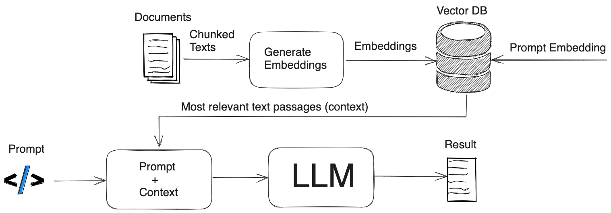
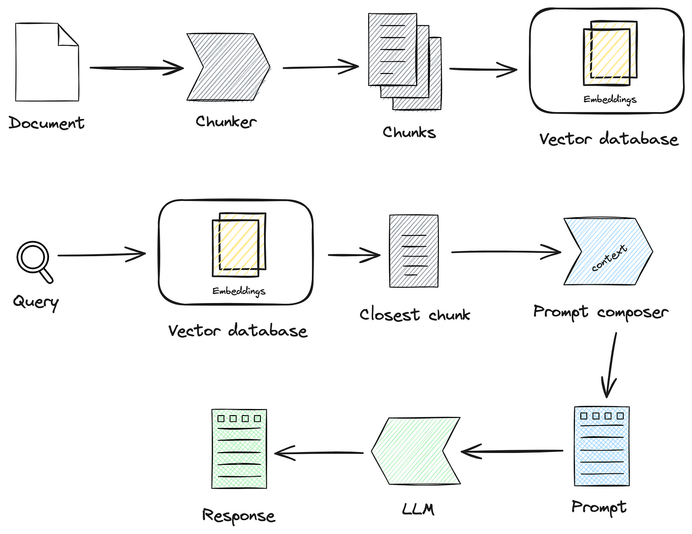

## References
- [A comprehensive guide to building RAG-based LLM applications for production](https://github.com/ray-project/llm-applications)

-----

### 1. Chọn và Huấn luyện Mô hình Ngôn ngữ Lớn (LLM)

#### a. Chọn mô hình cơ bản
- **Lựa chọn mô hình:** Bạn có thể chọn các mô hình có sẵn như GPT-3, BERT, T5, hay các biến thể nhỏ hơn như GPT-2, DistilBERT, tùy thuộc vào khả năng tính toán và yêu cầu cụ thể.
- **Tài nguyên:** Các mô hình lớn như GPT-3 yêu cầu tài nguyên máy tính mạnh mẽ, bao gồm GPU và bộ nhớ lớn. Nếu bạn có tài nguyên hạn chế, có thể bắt đầu với các mô hình nhỏ hơn.

#### b. Thu thập và tiền xử lý dữ liệu
- **Thu thập dữ liệu:** Thu thập các văn bản liên quan đến lĩnh vực mà bạn quan tâm. Dữ liệu này có thể đến từ các nguồn như tài liệu nội bộ, website, bài báo khoa học, diễn đàn, v.v.
- **Tiền xử lý:** Bao gồm làm sạch dữ liệu (loại bỏ các ký tự không mong muốn, xử lý lỗi chính tả, v.v.), chuẩn hóa (đưa tất cả văn bản về một dạng thống nhất), và token hóa (chuyển đổi văn bản thành các đơn vị nhỏ hơn như từ hoặc các token).

#### c. Huấn luyện mô hình
- **Fine-tuning:** Sử dụng dữ liệu đã tiền xử lý để fine-tune mô hình ngôn ngữ. Fine-tuning là quá trình điều chỉnh một mô hình đã được huấn luyện trước (pre-trained) trên một tập dữ liệu lớn để nó phù hợp hơn với nhiệm vụ cụ thể của bạn.

### 2. Tạo Cơ sở Dữ liệu Vector

#### a. Chọn công cụ cơ sở dữ liệu vector
- **FAISS:** Một thư viện mã nguồn mở của Facebook AI, tối ưu cho tìm kiếm và truy xuất các vector hiệu quả.
- **Milvus:** Một nền tảng cơ sở dữ liệu vector mã nguồn mở, dễ sử dụng và mạnh mẽ.
- **Pinecone:** Một dịch vụ cơ sở dữ liệu vector được quản lý, cung cấp các tính năng như truy xuất vector theo thời gian thực.
- **ElasticSearch:** Một công cụ tìm kiếm mạnh mẽ với plugin hỗ trợ tìm kiếm vector.

#### b. Nhúng tài liệu
- **Nhúng (Embedding):** Sử dụng mô hình ngôn ngữ đã huấn luyện để chuyển đổi mỗi tài liệu thành một vector nhúng (embedding vector), là một biểu diễn số học của văn bản mà mô hình có thể hiểu và xử lý.
- **Lưu trữ:** Lưu trữ các vector nhúng này trong cơ sở dữ liệu vector đã chọn.

#### c. Tạo chỉ mục
- **Chỉ mục:** Tạo chỉ mục trên các vector nhúng để tăng tốc độ tìm kiếm. Chỉ mục này giúp nhanh chóng xác định các vector gần nhau trong không gian vector, tương ứng với các tài liệu có nội dung tương tự.

### 3. Triển khai Hệ thống RAG (Retrieval-Augmented Generation)

#### a. Thiết lập hệ thống truy vấn
- **Chuyển đổi truy vấn:** Khi nhận được truy vấn từ người dùng, hệ thống sẽ chuyển đổi truy vấn thành một vector nhúng sử dụng cùng mô hình đã dùng để nhúng tài liệu.

#### b. Truy xuất tài liệu
- **Truy xuất:** Sử dụng cơ sở dữ liệu vector để tìm các tài liệu có vector nhúng gần nhất với vector nhúng của truy vấn. Đây là quá trình tìm kiếm các tài liệu tương tự trong không gian vector.

#### c. Tạo phản hồi
- **Tạo phản hồi:** Kết hợp các tài liệu truy xuất được với mô hình ngôn ngữ để tạo ra phản hồi hoàn chỉnh cho truy vấn. Điều này có thể bao gồm việc kết hợp các thông tin từ các tài liệu khác nhau để đưa ra câu trả lời chính xác và hữu ích.

### 4. Tích hợp và Triển khai

#### a. Xây dựng API
- **API:** Xây dựng một API (Application Programming Interface) để tương tác với hệ thống LLM và cơ sở dữ liệu vector. API này sẽ nhận các truy vấn từ người dùng, thực hiện truy vấn cơ sở dữ liệu vector, và trả về kết quả.

#### b. Đánh giá và cải thiện
- **Đánh giá:** Đánh giá hiệu suất của hệ thống bằng cách kiểm tra độ chính xác của câu trả lời, độ trễ (thời gian phản hồi), và khả năng mở rộng.
- **Cải thiện:** Dựa trên phản hồi từ người dùng và kết quả đánh giá, điều chỉnh và cải thiện hệ thống để đáp ứng tốt hơn nhu cầu thực tế.

### Tổng Kết

Việc xây dựng một hệ thống LLM + RAG với cơ sở dữ liệu vector yêu cầu sự kết hợp giữa mô hình ngôn ngữ mạnh mẽ, hệ thống truy vấn và cơ sở dữ liệu hiệu quả. Bằng cách thực hiện các bước trên một cách cẩn thận và chi tiết, bạn có thể xây dựng một hệ thống cung cấp các câu trả lời chính xác và nhanh chóng cho các truy vấn của người dùng.

-----
-----

## Cho ví dụ minh họa

Chắc chắn rồi! Dưới đây là một ví dụ đơn giản minh họa cách xây dựng một hệ thống LLM + RAG sử dụng cơ sở dữ liệu vector.

### Bước 1: Chọn và Huấn luyện Mô hình Ngôn ngữ Lớn (LLM)

#### a. Chọn mô hình cơ bản
Giả sử chúng ta chọn mô hình BERT đã được huấn luyện trước (pre-trained) vì tính hiệu quả và khả năng xử lý ngôn ngữ tự nhiên mạnh mẽ của nó.

#### b. Thu thập và tiền xử lý dữ liệu
- **Dữ liệu:** Thu thập một bộ dữ liệu nhỏ gồm các bài viết hoặc tài liệu liên quan đến một chủ đề cụ thể, ví dụ như "công nghệ AI".
- **Tiền xử lý:** Làm sạch và chuẩn hóa dữ liệu, sau đó token hóa dữ liệu bằng công cụ tokenization của BERT.

#### c. Huấn luyện mô hình
- **Fine-tuning:** Sử dụng bộ dữ liệu đã tiền xử lý để fine-tune mô hình BERT nhằm tăng cường khả năng của nó trong việc hiểu ngữ cảnh và nội dung của chủ đề cụ thể.

### Bước 2: Tạo Cơ sở Dữ liệu Vector

#### a. Chọn công cụ cơ sở dữ liệu vector
Giả sử chúng ta chọn FAISS của Facebook để tạo cơ sở dữ liệu vector vì nó dễ sử dụng và hiệu quả cao.

#### b. Nhúng tài liệu
- **Nhúng:** Sử dụng mô hình BERT để chuyển đổi các tài liệu thành các vector nhúng. Ví dụ, chúng ta có 3 tài liệu:
    1. "AI is transforming the world of technology."
    2. "Machine learning is a subset of AI."
    3. "Deep learning enables AI systems to learn from data."
- **Lưu trữ:** Lưu trữ các vector nhúng này trong cơ sở dữ liệu FAISS.

#### c. Tạo chỉ mục
- **Chỉ mục:** Tạo chỉ mục trên các vector nhúng để tăng tốc độ tìm kiếm.

### Bước 3: Triển khai Hệ thống RAG (Retrieval-Augmented Generation)

#### a. Thiết lập hệ thống truy vấn
- **Chuyển đổi truy vấn:** Khi nhận được truy vấn từ người dùng như "What is AI?", hệ thống sẽ chuyển đổi truy vấn thành một vector nhúng sử dụng BERT.

#### b. Truy xuất tài liệu
- **Truy xuất:** Sử dụng FAISS để tìm các tài liệu có vector nhúng gần nhất với vector nhúng của truy vấn. Giả sử truy vấn trả về hai tài liệu:
    - "AI is transforming the world of technology."
    - "Machine learning is a subset of AI."

#### c. Tạo phản hồi
- **Tạo phản hồi:** Kết hợp thông tin từ hai tài liệu được truy xuất để tạo ra một phản hồi hoàn chỉnh cho truy vấn. Ví dụ, phản hồi có thể là:
  "AI, or artificial intelligence, is transforming the world of technology. It encompasses various techniques, including machine learning, which is a subset of AI."

====
====

## Chunk

Chắc chắn rồi, dưới đây là những lý do chi tiết và cụ thể hơn về việc tại sao cần chia tài liệu thành các chunk nhỏ trong các hệ thống xử lý ngôn ngữ tự nhiên và truy xuất thông tin:

### 1. **Quản lý Tài Nguyên**
#### Giới hạn Kích Thước Đầu Vào
- **Các mô hình NLP**: Các mô hình như BERT, GPT-3 có giới hạn về số lượng token (từ hoặc ký tự) mà chúng có thể xử lý trong một lần. Ví dụ, BERT thường giới hạn ở khoảng 512 token, trong khi GPT-3 có thể xử lý nhiều hơn nhưng vẫn có giới hạn.
- **Chia nhỏ tài liệu**: Giúp đảm bảo rằng mỗi đoạn văn bản nằm trong giới hạn này, từ đó tránh việc mô hình phải cắt bớt hoặc bỏ qua thông tin quan trọng.

#### Hiệu Quả Xử Lý
- **Tài nguyên tính toán**: Xử lý các đoạn văn bản nhỏ hơn yêu cầu ít bộ nhớ và CPU/GPU hơn so với xử lý toàn bộ tài liệu dài. Điều này đặc biệt quan trọng trong các hệ thống với tài nguyên hạn chế.
- **Tăng tốc độ**: Các chunk nhỏ hơn cho phép xử lý nhanh hơn, từ đó giảm thời gian chờ đợi cho người dùng.

### 2. **Cải Thiện Độ Chính Xác**
#### Ngữ Cảnh Tập Trung
- **Fokus ngữ cảnh**: Mỗi chunk nhỏ có thể tập trung vào một phần ngữ cảnh cụ thể của tài liệu, giúp mô hình nắm bắt thông tin quan trọng một cách rõ ràng và chính xác hơn.
- **Giảm phức tạp**: Với các tài liệu dài, mô hình có thể bị lạc trong nhiều ngữ cảnh khác nhau, làm giảm độ chính xác trong việc hiểu và trả lời.

#### Giảm Nhiễu
- **Thông tin không liên quan**: Tài liệu dài thường chứa nhiều thông tin không liên quan đến truy vấn. Chia nhỏ thành các chunk giúp dễ dàng loại bỏ hoặc giảm thiểu những phần không liên quan.
- **Tăng độ tập trung**: Tập trung vào các chunk có nội dung liên quan giúp tăng độ chính xác và chất lượng của câu trả lời.

### 3. **Tối Ưu Hóa Tìm Kiếm**
#### Tìm Kiếm Nhanh Chóng
- **Tìm kiếm trên các chunk nhỏ**: Việc này nhanh hơn so với tìm kiếm trên toàn bộ tài liệu dài, do kích thước dữ liệu cần xử lý nhỏ hơn.
- **Sử dụng các thuật toán tìm kiếm**: Các thuật toán như TF-IDF, cosine similarity hoạt động hiệu quả hơn trên các chunk nhỏ.

#### Khả Năng Mở Rộng
- **Cập nhật dễ dàng**: Khi thêm tài liệu mới, chỉ cần thêm các chunk tương ứng vào hệ thống mà không cần xử lý lại toàn bộ cơ sở dữ liệu.
- **Quản lý dữ liệu lớn**: Chia nhỏ giúp dễ dàng quản lý và tổ chức cơ sở dữ liệu lớn, làm tăng khả năng mở rộng của hệ thống.

### 4. **Truy Xuất Thông Tin Tốt Hơn**
#### Chi Tiết Cụ Thể
- **Thông tin cụ thể**: Các chunk nhỏ hơn giúp hệ thống tìm kiếm và trả lời các truy vấn với thông tin chi tiết và cụ thể hơn, thay vì cung cấp câu trả lời chung chung từ toàn bộ tài liệu.
- **Tăng độ chính xác**: Chunk có thể chứa thông tin cụ thể và chính xác liên quan đến truy vấn, từ đó cải thiện độ chính xác của câu trả lời.

### 5. **Linh Hoạt Trong Xử Lý**
#### Xử Lý Song Song
- **Parallel Processing**: Chia tài liệu thành các chunk nhỏ giúp hệ thống có thể xử lý nhiều chunk cùng một lúc bằng cách sử dụng nhiều luồng hoặc nhiều máy tính, từ đó tăng cường hiệu suất và tốc độ xử lý.
- **Distributed Systems**: Trong các hệ thống phân tán, việc chia nhỏ tài liệu giúp dễ dàng phân chia công việc giữa các node khác nhau, tăng cường khả năng mở rộng và độ tin cậy của hệ thống.

### Ví dụ Cụ Thể

- **Ví dụ về tài liệu dài**: Giả sử bạn có một tài liệu dài 10000 từ về lịch sử thế giới. Nếu bạn cần tìm thông tin về "Cách mạng Công nghiệp", việc tìm kiếm trên toàn bộ tài liệu có thể chậm và không chính xác. Tuy nhiên, nếu tài liệu được chia thành các chunk 500 từ, hệ thống có thể nhanh chóng xác định các chunk liên quan đến "Cách mạng Công nghiệp" và cung cấp thông tin chi tiết hơn.

- **Ví dụ về hệ thống RAG**: Trong hệ thống RAG, khi nhận được truy vấn từ người dùng, hệ thống đầu tiên tìm kiếm trong các chunk tài liệu để xác định những chunk có độ tương đồng cao với truy vấn. Sau đó, chỉ những chunk liên quan này mới được sử dụng để tạo ra câu trả lời, giúp cải thiện độ chính xác và chất lượng của kết quả.

Những lý do trên giúp giải thích tại sao việc chia tài liệu thành các chunk nhỏ là một bước quan trọng trong việc tối ưu hóa hệ thống xử lý ngôn ngữ tự nhiên và truy xuất thông tin, đặc biệt là trong các hệ thống có tài nguyên hạn chế.