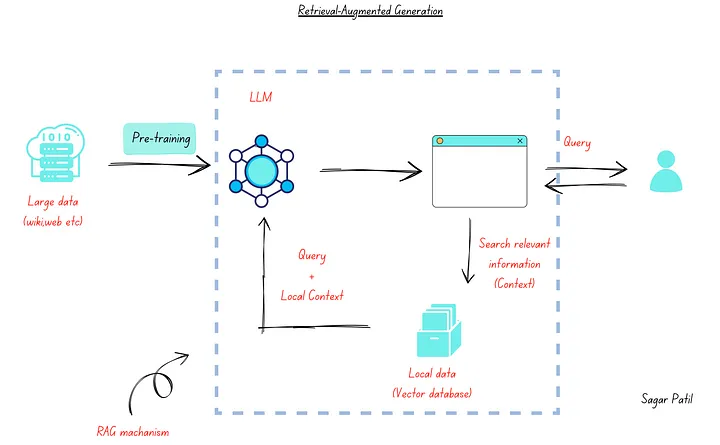

## References
- [Fine-Tuning Vs RAG in Generative AI](https://ai.plainenglish.io/fine-tuning-vs-rag-in-generative-ai-64d592eca407)

====
====

## What is RAG?

Retrieval-augmented generation (RAG) là một kỹ thuật cải thiện độ chính xác và độ tin cậy của các mô hình AI sinh ra văn bản bằng cách sử dụng thông tin từ các nguồn bên ngoài. Hãy nghĩ về RAG giống như cách thẩm phán tham khảo luật trước khi đưa ra phán quyết.

Các mô hình ngôn ngữ lớn (LLM) được đào tạo trên một lượng lớn dữ liệu văn bản, nhưng kiến thức của chúng bị hạn chế bởi dữ liệu đó. RAG giúp LLMs vượt qua hạn chế này bằng cách cho phép chúng truy cập vào các nguồn tri thức bên ngoài, chẳng hạn như Wikipedia hoặc kho lưu trữ nội bộ của công ty.

Khi bạn cung cấp cho RAG một truy vấn, nó sẽ thực hiện hai bước:

1. **Tìm kiếm thông tin:** RAG sẽ tìm kiếm các tài liệu có liên quan đến truy vấn của bạn trong nguồn tri thức bên ngoài.
2. **Sinh văn bản:** RAG sẽ sử dụng thông tin tìm được để cung cấp cho LLM một ngữ cảnh phong phú hơn. LLM sau đó sẽ sử dụng ngữ cảnh này để tạo ra câu trả lời chính xác và đáng tin cậy hơn cho truy vấn của bạn.

RAG có một số lợi ích quan trọng:

* **Cải thiện độ chính xác:** Bằng cách sử dụng thông tin từ các nguồn đáng tin cậy, RAG có thể giúp giảm thiểu việc LLM cung cấp thông tin sai lệch.
* **Mở rộng kiến thức:** RAG cho phép LLMs truy cập vào kiến thức mới nhất mà không cần đào tạo lại toàn bộ mô hình.
* **Linh hoạt theo miền:** RAG có thể được điều chỉnh để hoạt động với các lĩnh vực cụ thể bằng cách sử dụng các nguồn tri thức chuyên ngành.

Nhìn chung, RAG là một kỹ thuật hứa hẹn giúp cải thiện khả năng và độ tin cậy của các hệ thống xử lý ngôn ngữ tự nhiên.

====
====

## [_About retrieval models_](https://colabdoge.medium.com/what-is-rag-retrieval-augmented-generation-b0afc5dd5e79)

Retrieval models are a type of language model that focus on _finding_ relevant information from a dataset, in response to a given query. These models can benefit from vast stores of knowledge and are usually trained to produce meaningful and context-specific results. The most common examples of retrieval models:

Retrieval models are generally designed to find and rank relevant pieces of information from a dataset in response to a query. Here are some examples of popular retrieval models and algorithms:

1.  Neural Network Embeddings: Neural network embeddings (Such as OpenAI’s embeddings or Cohere’s embeddings) ranks documents based on their similarity in the vector space.
2.  BM25 (Best Match 25): A widely used text retrieval model based on probabilistic information retrieval theory. It ranks documents based on term frequencies and inverse document frequencies, considering both the relevance and rarity of terms within a corpus.
3.  TF-IDF (Term Frequency — Inverse Document Frequency): A classic information retrieval model that measures the importance of a term within a document relative to the whole corpus. It combines term frequency (how often a term appears in a document) and inverse document frequency (how rare the term is in a corpus) to rank documents in relevance.
4.  Hybrid Search: a combination of the above methodologies with different weightings.
5.  There are a few other methods but such as LDA but they’re not particularly powerful by themselves as of yet.

====
====

## Does RAG use BM25?

Yes, RAG can use BM25.  BM25 (Best Match 25) is a retrieval algorithm commonly used in RAG for the first stage, information retrieval.

RAG utilizes a hybrid search approach, combining keyword-based methods like BM25 with semantic searching techniques. BM25 helps identify documents relevant to the user query based on keyword matching and factors like document frequency. This retrieved information provides context for the LLM in the second stage, where it generates text.

Here are some additional points to consider:

* BM25 is not the only option for retrieval in RAG. Other methods like TF-IDF (Term Frequency-Inverse Document Frequency) can also be used.
* RAG implementations can leverage BM25 through libraries or tools designed for the algorithm.
* While BM25 offers advantages in efficiency and ease of use, it focuses on keywords. RAG can benefit from combining BM25 with semantic search for a more comprehensive approach.