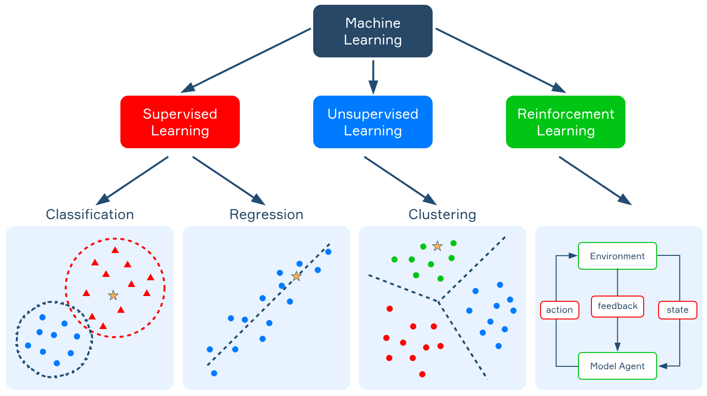
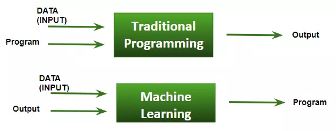

## References
- [Intro to Machine Learning](https://hyperskill.org/learn/step/10403)

====
====

## Intro to Machine Learning

When you open your mailbox, you don't see that many spam emails these days as they are automatically filtered into a separate folder. If you receive a document in an unknown language, you can easily translate it into any other language you understand in just one click. Your bank blocks your credit card based on some suspicious activity before you even realize that it had been stolen. Your favorite streaming service always suggests the movies you will enjoy, and the special offers you get from your favorite stores are always exactly what you need.

All this is thanks to **Machine Learning (ML)**, a subfield of now-booming Artificial Intelligence (AI). The scope of problems that can be solved with the help of ML is vast, and we will only briefly describe some here. Machine learning constantly aids us in real life — clinicians are partially automating the process of diagnosing patients, and there are multiple applications that provide assistance for users with disabilities, such as visual impairment, by using optical character recognition (text recognition) and text-to-voice systems. ML algorithms are at the core of many security systems, for example, credit card fraud detection, which falls under the broader category of anomaly detection. Facial recognition is applied to problems ranging from automated law enforcement to phone screen unlocking. We might even predict the future based on historical data — weather forecasting, currency exchange rates prediction, or demand estimation for items are all provided by time-series forecasting.

This topic will be a brief introduction to the world of machine learning.

## What is machine learning?

You might have heard the term **machine learning** a lot, but what does it actually mean? Well, the goal of ML is to create **algorithms** that can learn from past experiences and transfer this knowledge to new cases. Let's consider an example.

Suppose we want to create an ML-based spam filtering system. For that, we will need to collect some emails received in the past, both informative and those marked as spam, and introduce them to the algorithm along with their labels. The algorithm, in turn, will try to learn how to distinguish between the two types of mail. Once the learning process is over, our **model** will be able to analyze new incoming emails and filter out the spam ones. A model in ML is the representation of what was learned by an algorithm — the result of running an algorithm on data. The main difference between a model and an ML algorithm is that the algorithm simply describes the procedures, while the model has both the data and the set of procedures in order to make predictions.

The key point here is that we don't teach the algorithm how the two types of emails differ from each other — we just show some examples from the past and let the algorithm figure it out on its own. Pretty cool, right?

It's important to mention that the notion of spam may be different for different users of the same mail client. Indeed, while an email about a machine learning summer school can be of interest to you, someone studying medieval music will probably consider it spam. So, if you apply the same ML algorithm to different datasets (for example, your mailbox and that of a friend of yours), you will end up with completely different spam filters.

ML can be applied to solve many different problems. In a nutshell, there are three main ML settings, namely **supervised, unsupervised,** and **reinforcement learning**.

Note that this classification is not exhaustive, and there are mixed-setting approaches.

## Supervised learning

In **supervised learning**, our goal is to predict an output after we ran an algorithm on data that has a correct output associated with it — we call it **labeled data**. The model's goal is to capture the underlying relationship between the data and the labels and, when given some input, predict the correct output.

If the label can take on just a few distinct values, the problem is referred to as **classification**. Spam filtering described above is a typical example of a classification problem. Each email belongs to either of the two categories: spam or general. Let's consider another scenario: we want to train an ML model that recognizes hand-written digits. Then, each image of a digit must be associated with one of the 10 classes, from 0 to 9.

Another example of classification is text categorization. There is a large number of pre-defined topics (for instance, politics, economy, sports, culture, hobbies, and so on), and each text can cover several of them (for instance, politics and economy, hobbies and sports). The task will then be to predict the correct topics for every text.

If the label is numerical, the problem is referred to as **regression**. An example of a regression problem would be predicting the yearly income of a person based on their education, occupation, background, and other factors, or predicting real estate prices based on the location and size of the property.

## Unsupervised learning

Another machine learning setting is **unsupervised learning**. The input data contains no information about the property that we want to predict.

A typical example of an unsupervised ML algorithm is **clustering**. Its goal is to group examples from the data into so-called **clusters**, or groups, based on how similar they are. Clustering is often used in market research in order to identify similar groups of consumers based on their purchasing behavior. In bioinformatics, clustering helps categorize genes with similar functions and gain insights into structures inherent to populations.

Unsupervised techniques are also commonly used to solve so-called **anomaly detection** tasks, the goal of which is to automatically detect suspicious events that are significantly different from the rest of the data. Anomaly detection techniques are widely used by banks to detect fraudulent transactions, in aviation, health monitoring systems, and so on.

The differences between the supervised and the unsupervised approaches lie in the usage of labeled data and actually knowing the expected results from the model in the supervised setting, in contrast to the unsupervised approach, where the algorithm has to find the underlying structures in data without a correct label present.

## Reinforcement learning

In the **reinforcement learning (RL)** setting, we have an agent that interacts with the environment and has to figure out a set of optimal decisions purely by trial and error. The problem is usually formulated in terms of maximizing the reward by taking different steps and forming strategies. There is no pre-existing data that can tell the optimal strategy beforehand (that is to say, there are no ground truth labels in RL).

Some real-life applications of RL include finance — having historical data might not be enough to decide when to sell, buy, or hold the stocks, and, in this setting, RL gives the optimal strategy to maximize the returns. Perhaps one of the most famous examples of RL applications is AlphaGo, a program that combines supervised learning with RL to play the board game Go, and it was the first Go program to defeat a professional player back in 2015.

## Conclusions

-   Machine learning algorithms are able to learn from collected data and apply the knowledge to unknown cases.

-   Supervised learning refers to a setting where we want to learn to predict the value of a specific target variable from the data.

-   In unsupervised learning, there is no target attribute to predict. The goal is to explore the hidden structure of the data.

-   In reinforcement learning, we aim to find an optimal strategy by trial and error.

=====
=====

> Arthur Samuel, người tiên phong trong lĩnh vực trí tuệ nhân tạo và lập trình game, đã đặt ra thuật ngữ “Machine Learning”. Ông định nghĩa máy học là một “Lĩnh vực nghiên cứu cung cấp cho máy tính khả năng học hỏi mà không cần lập trình rõ ràng”. Theo cách phổ thông hơn, Machine Learning (ML) có thể được giải thích là tự động hóa và cải thiện quá trình học tập của máy tính dựa trên kinh nghiệm của chúng mà không được lập trình thực sự, tức là không có bất kỳ sự trợ giúp nào của con người. Quá trình bắt đầu bằng việc cung cấp dữ liệu chất lượng tốt và sau đó đào tạo máy móc (máy tính) bằng cách xây dựng các mô hình máy học sử dụng dữ liệu và các thuật toán khác nhau. Việc lựa chọn thuật toán phụ thuộc vào loại dữ liệu và loại nhiệm vụ đang cố gắng tự động hóa.

