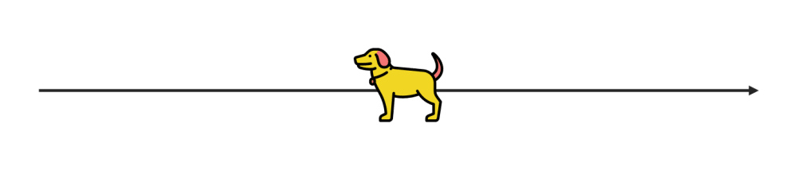
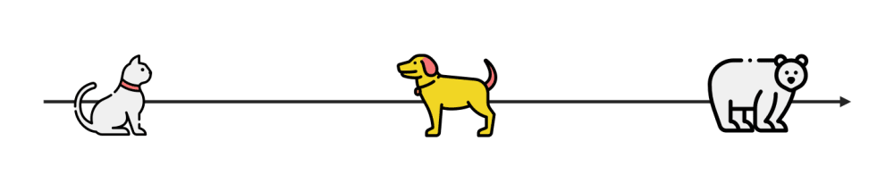
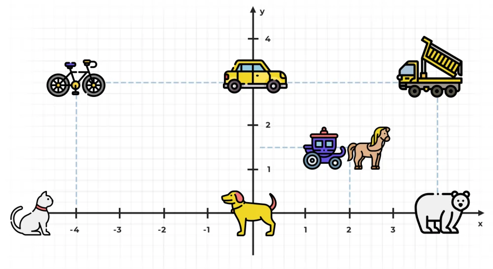
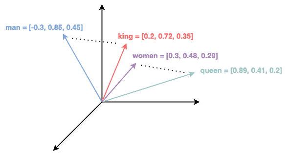

## References
- [Embedding Projector](https://projector.tensorflow.org/)
- [Dimensionality of Word Embeddings](https://www.baeldung.com/cs/dimensionality-word-embeddings)
- [What is a High Dimensional space in ML??](https://www.reddit.com/r/learnmachinelearning/comments/t2e5sx/what_is_a_high_dimensional_space_in_ml/)
- [If “Multi-Dimensional” hurts your brain …](https://towardsdatascience.com/if-multi-dimensional-hurts-your-brain-c137c9c572d6)
- [A.I. Experiments: Visualizing High-Dimensional Space](https://www.youtube.com/watch?v=wvsE8jm1GzE)

----
----

## Definition
- [What is Word2Vec? A Simple Explanation](https://www.youtube.com/watch?v=hQwFeIupNP0)
- [The Illustrated Word2vec](http://jalammar.github.io/illustrated-word2vec/)

---
---

## What are word embeddings?

While working on a similar solution, we can represent each word in our set as a vector in single or multi-dimensional space. If you were to place a word like “dog” on an axis representing size, where would you put it? At this point there is nothing else so let’s just put it in the middle and make it our point of reference.

Since we have the reference point, we can now place other words alongside this magnificent golden retriever based on where we feel they should be. Let’s do that with a cat and a bear as well.

The animals are placed on the axis based on their size: the cat is small, the bear is big, and the dog sits somewhere in between.

**But how would something like a car tie into that?** Vehicles can have different sizes as well but let’s say tiger and bike are the same size, so they would be in the same place on our axis, even if they’re clearly two different things.

We need another dimension to specify the difference between, for example, animals and vehicles. We can add a Y axis and some new words to visualize the correlation.

Now that we have everything visualized, the embedded words are basically vectors, representing their coordinates in the “however many dimensions we created” space:

-   Cat (-5, 0)
-   Dog (0, 0)
-   Bear (4, 0)
-   Harley (-4, 3)
-   Supra (0, 3)
-   Tank (4, 3)
-   Carriage (2, 1.5)

Of course **using just two dimensions we can’t accurately represent large amounts of different words**. It kinda worked for our small vocabulary size (seven words) but you’d typically use an “embedding size” of 64/128 or 256 dimensions: the more dimensions, the more accurate the representation you will get, but also the training will be slower and you’ll need a bigger dataset.

> **Summing up:** word embeddings are vector representations of words that represent their position in our vocabulary space.

---
---

## High Dimensional Space

You don't need to imagine or pictures higher dimensions. 1-d array is a group of numbers. 2-d array is a group of groups. 3-d one is a group of groups of groups. And so on. N-d is just a group of ...

To be clear, let say you have 1 D array [1, 2, 3]. 2D array is a group of 1D array like this [[1, 2, 3], [1, 2, 3]].

N-d array is just 1d array that we organise into groups. Let say you have 1D array [1, 2, 3, 4, 5, 6].

Turn it into 2D by grouping 123 into a group, 456 into one. [[1, 2, 3], [4, 5, 6]]

Turin it into 3D by putting each value into a group. [[[1], [2], [3]], [[4], [5], [6]]]

In real life beyond deep learning, you can take a book as examples of 5D array of letters. This array has shape (c, p, s, w, l). A book has a C chapters. Each chapter has P paragraphs. Each paragraph has S sentences. Each sentence has W words. Each words has L letters.

And the library is a 7D array of letters. The library has G genres. Each genre has B books.

----
### [Dimensionality of Word Embeddings](https://www.baeldung.com/cs/dimensionality-word-embeddings)

In general, **the dimensionality of word embedding refers to the number of dimensions in which the vector representation of a word is defined**. This is typically a fixed value determined while creating the word embedding. 
> **The dimensionality of the word embedding represents the total number of features that are encoded in the vector representation**.

Different methods to generate word embeddings can result in different dimensionality. Most commonly, word embeddings have dimensions ranging from 50 to 300, although higher or lower dimensions are also possible.

For example, the figure below shows the word embeddings for “king”, “queen”, “man”, and “women” in a 3-dimensional space:

---
### [If “Multi-Dimensional” hurts your brain …](https://towardsdatascience.com/if-multi-dimensional-hurts-your-brain-c137c9c572d6)

> Dimensions are just **independent ways of describing something and don’t necessarily have anything to do with space**. In everyday language, we’re used to thinking of **dimensions** as length, width, and height.

