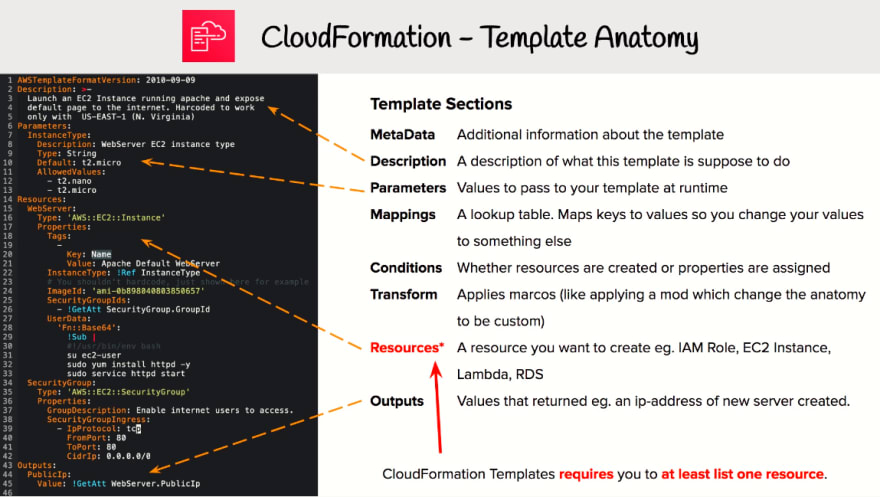
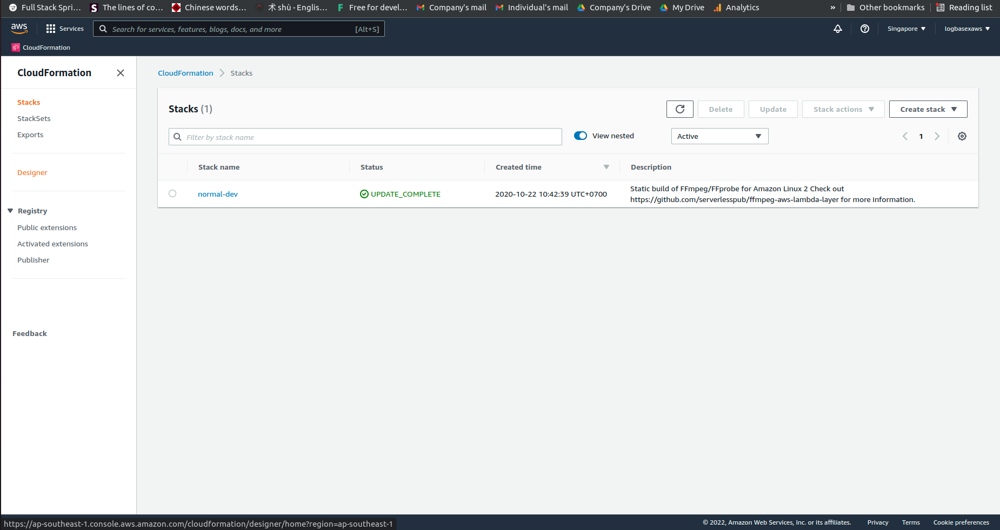
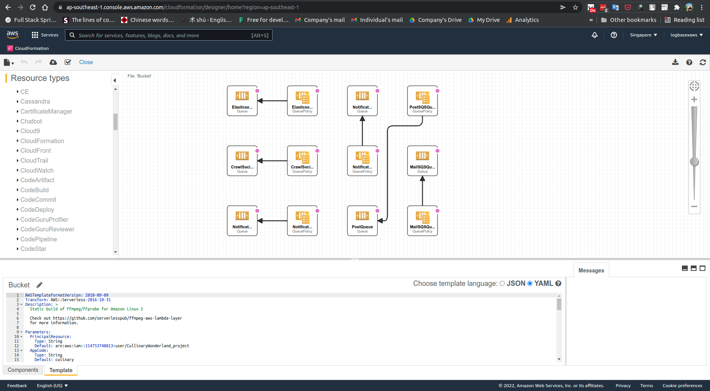

# [Template](https://docs.aws.amazon.com/AWSCloudFormation/latest/UserGuide/template-reference.html)

## [Intrinsic function](https://docs.aws.amazon.com/AWSCloudFormation/latest/UserGuide/intrinsic-function-reference.html)

[What is the difference between `Ref: logicalName` and `!Ref logicalName` in AWS Cloudformation templates in YAML?](https://stackoverflow.com/questions/56050242/what-is-the-difference-between-ref-logicalname-and-ref-logicalname-in-aws)

- [**YAML** : Syntax for the full function name](https://docs.aws.amazon.com/AWSCloudFormation/latest/UserGuide/intrinsic-function-reference-ref.html):
    ```
    Ref: logicalName
    ```

- Syntax for the short form:
    ```
    !Ref logicalName
    ```
[ !Ref is a shortcut for Fn:Ref.](https://jennapederson.com/blog/2021/5/10/introduction-to-aws-cloudformation/)

## [Template structure](https://docs.aws.amazon.com/AWSCloudFormation/latest/UserGuide/template-anatomy.html)




## [Cloud formation designer](https://docs.aws.amazon.com/AWSCloudFormation/latest/UserGuide/working-with-templates-cfn-designer-walkthrough-updatebasicwebserver.html)





