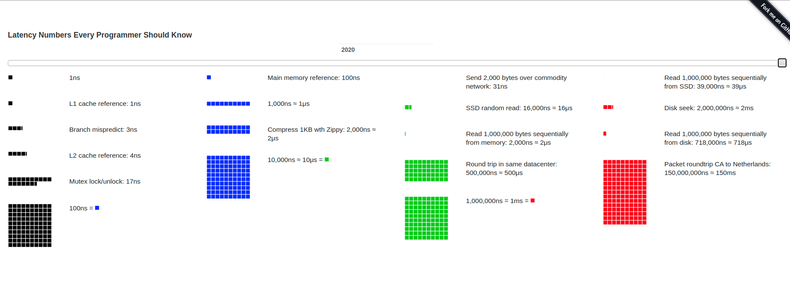

## Primary storage
ROM: Unlike RAM, Read Only Memory (ROM) is both a non-volatile and permanent form of primary storage. ROM retains its contents even if the device loses power. You cannot change the data on it, but rather just read it. ROM is a more reliable form of storage and it will often boot instructions and other mission-critical data.

PROM: Programmable Read Only Memory is an advanced form of ROM that will allow writing data – but only once. Similar to a blank CD or DVD, PROM does not comes with data stored on the chip. But once you have written data to it, you cannot modify or delete that information anymore.

Cache memory: Also known as CPU memory, cache memory stores instructions computer programs frequently call upon during operation for faster access. Since it is physically closer than RAM, this is the first pace the processor looks for instructions. If it finds the data it needs here, the processor can bypass the more time-consuming process of reading RAM or other storage devices.

Primary storage provides fast access to CPU, which allows active programs to deliver optimal performance to the end-user. Speed and usefulness aside, the fact that the loss of power means the loss of data makes RAM a short-term storage solution. In fact, it’s lack of long-term viability is the reason it makes sense to save your progress when working in one program or another.


## Secondary Storage
Hard drives: The hard drive is the face of secondary storage in modern computing. Many computers bundle hard drives as internal storage mediums. But you can also connect them externally via USB or firewire. System administrators will often create redundant arrays out of multiple hard disks to prevent accidental data loss. To absolutely make sure data weathers the storm, they will keep two or more backup files of everything on different devices for speedy recovery.

Optical media: CDs and DVDs are the most well known members in the class of optical storage. These mediums are the more efficient successors of the 3.5-inch disk drives. You had to use these in spades in order to store any substantial amount of data. Optical media actually have exceptionable read speeds, capacity, and portability. This is why they are still a viable form of secondary storage today, even if better options have come along.

Magnetic tape: In use for well over half a century, magnetic tape was once the very foundation of backup systems. Tape lives inside cassettes and cartridges, and thanks to recent innovations, can store a TB of data or more. There has been much debate regarding its reliability over the years, but tape is still an option for secondary storage and backup across corporate environments worldwide.

Secondary storage is named as such because it doesn’t have direct access to CPU. As a result, it is considerably slower than primary storage. Luckily it compensates for that lack of speed in a number of ways. Aside from offering greater data retention, secondary storage is usually twice as cheap in comparison to its primary counterpart. It can also store significantly more information. An 8GB stick of RAM is a decent size, while new computers generally have 1TB hard drives. There is no comparison on capacity.

- https://blog.storagecraft.com/primary-vs-secondary-storage-difference/

--------------

## SSD (Solid State Drive)
- [How SSD works in fully details and why SSD faster than HDD](https://arstechnica.com/information-technology/2012/06/inside-the-ssd-revolution-how-solid-state-disks-really-work/)
    - Solid-state drives provide an immediate boost to the subjective speed of the computer because they take a big chunk out of the largest amount of latency you experience. Firstly and more obviously, solid-state drives don't have moving heads and rotating platters; every block is accessible at the same speed as every other block, whether they're stored right next to each other or in different physical NAND chips. Reading and writing data to and from the solid-state drive is faster as well, so not only does the computer have to wait fewer milliseconds for its requests to be serviced, but the solid-state drive can also effectively read and write data faster. Quicker responses (lower latency) plus faster transfer speeds (more bandwidth) mean that an SSD can move more data faster—its throughput is higher.

- [How SSD works video animation](https://www.youtube.com/watch?v=5Mh3o886qpg)
- [What is the difference between an SSD and a USB Flash Drive?](https://www.quora.com/What-is-the-difference-between-an-SSD-and-a-USB-Flash-Drive/answer/Dimitrios-Tolios)
    - The basic principles are the same, and both use similar technology of NAND memory chips to store data.
      
      SSDs have more powerful controllers that allow them to communicate in parallel (simultaneously) to more NAND chips at the same time (think of it as a "RAID array" of USB sticks) aggregating their through-output in both reads and writes, and also have large quantities of RAM buffer that can give great burst speeds ontop of that.

- **How SSD and Flash Memory works (English and Vietnamese)**
    - https://tinhte.vn/thread/tim-hieu-ssd-flash-nand-va-controller-quyet-dinh-hieu-nang.2530113/
    - https://kythuatlythu.blogspot.com/2019/09/tim-hieu-sau-ve-bo-nho-flash.html
    - https://computer.howstuffworks.com/solid-state-drive.htm

- SSD tech stored electron in it will not last long as HDD (?)
- [What is DRAM on SSDs? Does it even matter?](https://www.quora.com/What-is-DRAM-on-SSDs-Does-it-even-matter)
    - DRAM is high-speed memory, like the RAM in your computer. Most SSDs have had on-board RAM that acts as a cache, because of a weird quirk in the way NAND flash works.
      
      **You can’t write just one byte to an SSD. You have to read a whole block, erase that entire block, then re-write the whole block.**
      
      Most SSDs use on-board RAM primarily to speed up writes. They can cache a big chunk of data to be written and then go through the whole painful read/erase/write an entire chunk in the most efficient way possible.
      
      **DRAM-less SSDs are ultra-cheap SSDs for people without a lot of money. They cost less (RAM chips ain’t cheap) but their performance, especially when writing data, is poor.**
      
      Don’t get me wrong, they’re still miles faster than old-fashioned spinning rust. They’re just way slower than the same SSD with on-board RAM.
      
    - **By the nature of the technology, SSDs can be slower at writing than reading because the wear-level controller might have to shuffle some data.**
      
      The DRAM is giving you a write buffer, and the SSD’s logic board will sort out any issue while your computer keeps working.
      
      It is also common for `prefetch` buffers to exist on CPUs. A prediction of the next likely set of instructions is made and these are loaded so that the CPU doesn’t have to wait on the RAM.  

## HDD (Hard Disk Drive)

## Clock Cycle

- [ELI5](https://www.reddit.com/r/explainlikeimfive/comments/34y4qv/eli5_what_is_clock_cycle_in_cpu/)
    - A CPU is a massive logic circuit working in sync with a clock. The reason you need a clock is because the CPU needs to follow a sequential list of instructions. One of the basic circuits inside a CPU is a counter, when the clock ticks the counter will increment. This counter is wired to lookup the numbered instruction that corresponds to the "program counter" as it is called. It basically goes Tick->Increment, Load Instruction->Tick->Load data based on instruction -> Tick -> perform operation on data based on instruction -> Tick -> write data
      
      So to improve the number of instructions the CPU can perform in a given amount of time, you decrease the clock cycle time (make it tick faster). However, the minimum cycle time depends on the hardware. These things are switches that take time to turn on and off, so your clock cycle can only be as short as the slowest switch. The race became centered on who could make the fastest clock and hardware, thereby having the fastest processor, which is a hardware design problem.
      
      The issue was that eventually we reached a point where clock times couldn't practically get faster. To go faster, you need more power, with more power the hardware gets hotter, when it gets hotter it needs more power and the circuitry performs worse so you need better cooling... all the while computers were expected to get smaller and more efficient, laptops for example are limited in battery power so you can't spend hundreds of watts just for a fast clock.
      
      What's cool is that while the hardware that loads the instruction may only load a single instruction at a time, it doesn't necessarily need to wait for the instruction to be performed several clock ticks later by other hardware. This is the basis for "pipelining" and all modern processors use it in some way. When the clock tick forces the other hardware to perform an instruction, the program counter can still increment and load the next instruction. Then on the subsequent tick it can begin to perform the instruction while the hardware down the line is working on a previous instruction.
      
      It gets complicated when you consider the fact that one instruction may depend on a previous one. For example, say you want to add two numbers then print half their sum. The hardware that does division needs to wait until the addition is finished before it can work. This is where the difference in instruction sets comes into play. More clever engineers find better ways to pipeline these basic instructions to make the CPU do more work out of fewer cycles. Now this is a software problem, how do you figure out the most efficient means of pipelining your instructions to use the fewest clock cycles?
      
      This is where the race is now. Right now, Intel's instruction set is the best. They found the best ways to use each clock cycle the most efficiently, thereby making their processors perform more instructions in less time without increasing the clock time. They were then able to turn the clock down to use less power and operate more efficiently while still increasing performance.
      
      This is why you can't use clock rate as a performance benchmark any more. A 4GHz AMD will be crushed by a 3 GHz Intel even though it has a billion more clock ticks per second. Sorry for the novel, I just think this stuff is cool.

- [The CPU and the fetch-execute cycle](https://www.bbc.co.uk/bitesize/guides/zws8d2p/revision/2)    
    - **Clock Speed**
    
        CPUs can only carry out one instruction at a time.
      
      It might seem like CPUs can perform many instructions simultaneously, since it is possible for you to do homework, read instant messages and listen to music at the same time. However, the CPU is able to carry out instructions at such speed that it can seem like it is simultaneous.
      
      The speed at which the CPU can carry out instructions is called the clock speed. This is controlled by a clock. With every tick of the clock, the CPU fetches and executes one instruction. The clock speed is measured in cycles per second, and one cycle per second is known as 1 hertz. This means that a CPU with a clock speed of 2 gigahertz (GHz) can carry out two thousand million (or two billion) cycles per second. 
    
    - **Cores**
    
        A CPU is traditionally made up of a processor with a single core. Most modern CPUs have two, four or even more cores.
        
        A CPU with two cores, called a dual core processor, is like having two processors in one. **A dual core processor can fetch and execute two instructions in the same time it takes a single core processor to fetch and execute just one instruction. A quad core processor has four cores and can carry out even more instructions in the same period of time.**
    
   - **The fetch-execute cycle**
   
     The basic operation of a computer is called the ‘fetch-execute’ cycle. The CPU is designed to understand a set of instructions - the instruction set. It fetches the instructions from the main memory and executes them. This is done repeatedly from when the computer is booted up to when it is shut down.
     
     The CPU fetches the instructions one at a time from the main memory into the registers. One register is the program counter (pc). The pc holds the memory address of the next instruction to be fetched from main memory.
     The CPU decodes the instruction.
     The CPU executes the instruction.
     Repeat until there are no more instructions.
     A single piece of program code might require several instructions. Look at this Python (3.x) code:
     
     area = length * width
     First, the computer needs to load in the value of the variable length into the immediate access store (registers). Next it needs to load in the value of the variable width. Then it needs to multiply the two numbers together, and finally it needs to store the result in the variable area.   
     
------
## Instructions

- [How are the instructions of a program executed by a computer?](How are the instructions of a program executed by a computer?)
- [What is pipelining](https://www.quora.com/What-is-pipelining)
    - A CPU is a very complex piece of hardware. Traditionally, the way a CPU works is like this: we have a storage location (the “memory”) that contains a bunch of instructions written into it. These instructions are the “machine code”— i.e. they’re the bytes of an executable that the CPU must interpret and execute. In order to execute these instructions, the CPU must do (very roughly) the following things in sequence:
      
      - Read an instruction from memory.
      - Interpret the bit pattern of the instruction, to understand what operation the instruction wants us to do.
      - Perform the requested operation.
      - Go to the next instruction in memory, and repeat.
      
      In a CPU implementation, a hardware designer would design each of these “stages” as an individual module, and lay out each of the modules in a straight line— the wires that bring the instruction out of the memory feed directly into the bit-pattern interpreter unit (aka the “decoder”), whose outputs feed directly into the instruction execution unit (aka the “ALU”), whose outputs feed back into the memory module, all in a closed loop.
      
      Now, this design seems pretty straightforward, and it is. However, this setup means that your processor clock speed is going to be very, very slow.
      
      **Why? The first rule of practical digital electronics is that the electrical voltage signals do not propagate through your circuit instantaneously. This means there is going to be a very noticeable delay between when the instruction is issued, and when the signals finally make it through the entire circuit to give the final result of that instruction.**
      
      Your CPU clock cannot be faster than the total delay time of your circuit. If the clock cycles faster than the voltage signals can make it through to the end of your circuit, that means your circuit gets interrupted before it has enough time to perform the final calculation, which means the “results” of your computation are going to be a steaming pile of useless hot garbage. Because of this, your clock speed (and, by extension, the rate at which you can execute instructions) is limited by the combined delay times of all stages in your circuit— i.e. the time between clock cycles must be greater than the sum of all the stages’ individual delay times.
      
      We’re in the middle of the information age. We want our CPU to be fast, dammit. How do we optimize this design to get around the signal-delay problem?
      
      Consider a trip to the laundry room. You may think to yourself, “what does laundry have anything to do with CPUs?” to which I reply, “laundry has a lot to do with CPUs”. I am dead serious.
      
      In our current setup, the instruction must be fed through all of the processor’s stages before it is considered “finished”. Only when the instruction is “finished” can the next instruction then be executed— each instruction must wait in line for its own turn to be executed.
      
      This is analogous to a laundry task where we have many loads of clothing lined up in a row. Each clothing load must be cleaned, then dried, then folded before you can start dealing with the next load. Until the first load is completely folded, you cannot begin cleaning the second load, and so on, and so forth.
      
      Notice the obvious inefficiency?
      
      The clear way to speed up this process is to put load #1 in the washer, and when that’s done, put it in the dryer. Since the washer is free now, just immediately start washing load #2. When the dryer is done with load #1, move the load #2 into the dryer, and immediately start washing load #3. While that’s happening, fold load #1.
      
      This strategy is called pipelining. The key point that pipelining takes advantage of is the fact that, at any given point in time during your laundry chores, the washer and the dryer and the folding can all happen at the same time, each one dealing with a different load. This is exactly why factory assembly lines (for example, in a car manufacturing plant) are so efficient— at any given time, all workers at each step of the process are working on a different car that is in a different stage of being built. In other words, the “pipeline” of different steps to make a car is always “full”, and never idle.
      
      Back to the CPU. Analogously to the laundry and the car manufacturer, we can pipeline our instruction processing in the same way, and thus achieve much higher processing throughput. If we pipeline our design, that means we don’t have to wait for the signal to propagate through the entire circuit before starting the next clock cycle— all we need to do is get it to propagate through a single stage. After instruction #1 gets through a stage, we can begin the next clock cycle by loading instruction #2 into that now empty stage, and so on, and so forth. By keeping the pipeline “full”, we avoid the wasteful practice of having to wait for the instruction to pass through the entire circuit before starting the next clock cycle.
      
      Traditionally, a CPU pipeline is divided into five stages:
      
      - Instruction Fetch
      - Instruction Decode
      - Execute
      - Memory
      - Write Back
      
      ....

## Memory
- [How computer memory works?](https://computer.howstuffworks.com/computer-memory3.htm)
- [What happens if I use RAM of a faster speed than the CPU supports?](https://superuser.com/questions/753502/what-happens-if-i-use-ram-of-a-faster-speed-than-the-cpu-supports)
    - The RAM will be downclocked to match the FSB/Memory controller speeds. In this case that’d be 1600Mhz. So buying the faster rated memory is a waste of money unless you plan to change the CPU soon enough.
        - **It's not always a waste of money. For example, memory rated for 2133 MHz at 1.65V would likely be able to run at 1600 MHz at a lower voltage, decreasing power usage and heat generated, and potentially increasing system stability.** If this matters to you, or if the price difference is small, it could be worth getting the faster memory. But for most users this will not be significant.

- [Is ram speed higher than cpu speed bad?](https://www.reddit.com/r/buildapc/comments/b4vr3z/is_ram_speed_higher_than_cpu_speed_bad/)
    - No problem at all. Many CPUs will change clock rates depending on load; while RAM stays constant.
      
- [How much faster is the memory usually than the disk?](https://stackoverflow.com/a/53904470/10393067)
    
    ```shell script
    Latency Comparison Numbers (~2012)
    ----------------------------------
    L1 cache reference                           0.5 ns
    Branch mispredict                            5   ns
    L2 cache reference                           7   ns                      14x L1 cache
    Mutex lock/unlock                           25   ns
    Main memory reference                      100   ns                      20x L2 cache, 200x L1 cache
    Compress 1K bytes with Zippy             3,000   ns        3 us
    Send 1K bytes over 1 Gbps network       10,000   ns       10 us
    Read 4K randomly from SSD*             150,000   ns      150 us          ~1GB/sec SSD
    Read 1 MB sequentially from memory     250,000   ns      250 us
    Round trip within same datacenter      500,000   ns      500 us
    Read 1 MB sequentially from SSD*     1,000,000   ns    1,000 us    1 ms  ~1GB/sec SSD, 4X memory
    Disk seek                           10,000,000   ns   10,000 us   10 ms  20x datacenter roundtrip
    Read 1 MB sequentially from disk    20,000,000   ns   20,000 us   20 ms  80x memory, 20X SSD
    Send packet CA->Netherlands->CA    150,000,000   ns  150,000 us  150 ms
    ``` 
- [RAM can be accessed hundreds of times faster than a hard drive. Explain How?](https://cs.stackexchange.com/questions/69638/ram-can-be-accessed-hundreds-of-times-faster-than-a-hard-drive-explain-how)  

- [Ram Voltage](https://www.quora.com/What-does-RAM-voltage-mean/answer/Priyavrat-Deolia)
    - **Ram voltage refers to the power consumed by ram module.** DDR3 ram voltage used to be between 1.5-1.65v in the past, but now, most world leading ram memory manufacturers like Crucial, Samsung or Hynix produce new DDR3L low voltage 1.35v modules, or, to be more specific, Dual voltage ram (1.35v / 1.5v).
    
- [DDR3, DDR4 and so on](https://www.quora.com/What-is-the-difference-between-DDR3-RAM-DDR4-RAM)
    - The term `DDR` stands for Double Data Rate RAM. This term came into use at the turn of the century when the first Double Data Rate RAM modules arrived. **Double Data Rate RAM was capable of two data transfers per clock cycle**, giving it twice the theoretical peak bandwidth of previous `SDRAM` while running at the same clock speed.
    
    
      
    - Almost no difference. RAM isn’t the bottleneck in most/all situations. Its performance is rarely if ever noticed.
      
      **Therefore you buy `DDR4 only to save electricity` and `DDR3 to save money`, at this time in the history of computer building.**
      Personally I don’t care which, as long as I have a lot of it, it’s cheap, and it has heat spreaders.
      
    - Noticeable speed is only minimally different. **The issue is that DDR4 handles more transactions per second than DDR3, but its latency is a bit longer. Typically DDR3 peaked at around 2GHz, while it’s latency was around 13 nano seconds, the starting level DDR4–2133 has 2.1GHz with latency of around 15ns**.
      
      In real life, those two are effectively at the same speed.
      
      **However, the DDR3 runs at 1.5V and the DDR4 at 1.2V. meaning the later uses less power, and thus causes less heat.** Also more suitable for running off a battery (like a laptop).
      
      **Physically the standard cards are thicker for DDR4, 1.2mm instead of 1.0mm**. Allowing easier layering of circuits and possible larger ICs and routing banks. Translating to the fact that it’s possible to stick more RAM onto a single DDR4 than onto a single DDR3.
      
      Other than that, the pin arrangements differ. Each memory chip (since the original DDR - DDR1 for clarity) had a notch to ensure you plugged it in the correct way round. **Each consecutive version had its notch in a different place. Sometimes having more pins as well. This is still the case for DDR4, it will not fit into a slot designed for some other memory. Same as DDR3 will not fit into slots for DDR / DDR2 / DDR4.**

- [Why DDR4 have higher latency](https://www.quora.com/Why-does-DDR4-have-a-higher-latency)      
- [Is speed or latency the bottleneck for RAM?](https://www.quora.com/Is-speed-or-latency-the-bottleneck-for-RAM)
    - It depends on the situation. Latency is how long it takes for the request to be processed by the RAM controller and internal circuitry, “speed” is how rapidly the bytes can be returned once the data is available, and how many bytes can be retrieved without incurring additional latency penalties (e.g. bytes within the same row.)

- [Can CPU instructions be stored in RAM?](quora.com/Can-CPU-instructions-be-stored-in-RAM)
    - That’s the whole idea of the Von Neumann architecture - that CPU instructions are data like any other (so, yes, they are normally stored in RAM; there’s caching and stuff, but that’s “transparent” to programmers, the CPUs will make sure to emulate von Neumann as closely as possible).
    
- [CAS latency](https://en.wikipedia.org/wiki/CAS_latency#Memory_timing_examples)    
    
## Flash Memory

## Caching