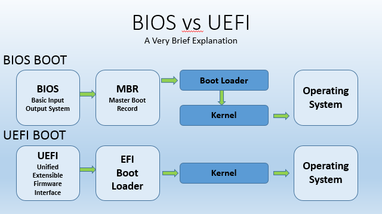

https://www.quora.com/What-is-the-difference-between-GRUB-and-the-MBR-in-Linux

## POST (Power On Self Test)

## GRUB (GRand Unified Bootloader)

If you come from Windows the easiest explanation for GRUB is **This is the program that linux writes to your MBR (Master Boot Record)**

**This program is responsible for detecting and loading any OS on your personal computer.**

---------
Basically, GRUB bootloader is the software that loads the Linux kernel. (It has other uses as well). It is the first software that starts at a system boot.

When the computer starts, BIOS first run a Power-on self-test (POST) to check hardware like memory, disk drives and that it works properly.

Then BIOS checks the Master Boot Record (MBR), which is a 512 byte section located first on the Hard Drive. It looks for a bootloader (like GRUB). The hard drive's partition tables are also located here.

https://askubuntu.com/questions/347203/what-exactly-is-grub

## [Bootloader](https://en.wikipedia.org/wiki/Bootloader)

A bootloader is software that is responsible for booting a computer.

--------

BIOS loads the boot loader.

BIOS is part of the hardware. When you power on your Computer, BIOS is loaded first. It scans all the attached devices ( eg. network card, RAM etc) and prepares them to be in a form that the operating system can use.

Once BIOS is done with its work it will load the bootloader. Bootloader is part of the OS and each OS typically has its own bootloader. Bootloader does the job of loading the OS.

There are lot more things done by both of them. This is a very top level view of the two.

> [Most of the answer is correct](https://www.quora.com/What-is-the-difference-between-the-BIOS-and-a-boot-loader). But, here is the thing. Bootloader is not part of the OS and works independent of OS which means the same bootloader can give you options to load different OSes(for ex, same installation of grub2 can load Windows, Linux, etc, separately). Also these days, BIOS is being replaced by UEFI firmware which can run bootloader directly and do more than what legacy BIOSes do.

## [Firmware](https://en.wikipedia.org/wiki/Firmware)

In computing, **firmware is a specific class of computer software that provides the low-level control for a device's specific hardware**. Firmware, such as the **BIOS** of a personal computer may contain only elementary basic functions of a device and may only provide services to higher-level software.

## [BIOS](Basic Input/Output System)

- **LEGACY BIOS**
- **UEFI BIOS**



https://www.quora.com/What-is-the-difference-between-BIOS-and-kernel

The BIOS (Basic Input/Output System) is a piece of software that is not part of the operating system or user-installed software. It's embedded in the motherboard, using read-only memory (ROM). In fact it's not entirely read-only - it's possible to update the BIOS using special tools. Under normal circumstances however, the BIOS is sacrosanct and cannot be modified.

The BIOS is a library of functions that is used to boot the system, and to perform basic read and write access to the hardware on the motherboard, for example the RAM chips. Once the system is booted, the BIOS sits inactive, waiting for the operating system to call any of its functions. The operating system, in turn, may choose to ignore the BIOS, and access the hardware directly. There are pros and cons to this. BIOS code is convenient because in theory it handles all the messy requirements of reading and writing to particular hardware. On the other hand, BIOS code is notoriously buggy, and sometimes an operating system may have no choice but to bypass it.

----------

BIOS is a program that resides on the ROM which is embedded on the motherboard. Its job is to check if all the hardware is properly installed, working or not by running the POST(power on self test) and then initialize the firmware of the Hardware. BIOS will setup all the Hardware that will be used by OS where as kernel doesn’t has all this intelligence. BIOS will have the drivers which have minimum functionality to talk to almost all the Hardware like Display, Mouse, Keyboard etc. BIOS can also detect the Storage media, through which you can Boot into OS. it has the ability to chose any of the available media and boot from them(if the storage media is boot compatible). Once it finds any bootable media it starts booting from it. **BIOS reads the MBR(Master boot record) where the boot loader(program to execute kernel and initialize OS) is present and executes it**. In case of linux this is the stage where it shows you the list of OSes present on your HDD. Once you chose the OS, the kernel will be executed and will you will boot into the OS.. Kernel is the core part of the OS which will have drivers(more advanced functionality than BIOS Drivers) to talk to the Hardware , Memory manager, Process scheduler, interrupt handlers, CPU scheduler, etc. The kernel can also detect the hardware present on the system and talk to them through the drivers. But there are limitations on the information the kernel can get about the hardware, this is where it uses the information provided by BIOS. Initially BIOS reads the Hardware information and then Dumps tables called ACPI tables into RAM which will be used by the kernel to get more detailed information about hardware.

So, BIOS has more advanced features that can probe the hardware for detailed information, initialize them, provide an environment so that user can use it to install/boot into OS and use hardware efficiently. Whereas Kernel is the core part of the OS, where the inputs from the user are taken through some UI/commands which in turn gets converted into system calls and then communicated to kernel which uses specific drivers to talk to hardware to perform some task along with.

The above explanation is as per my understanding. It may contain some incorrect information, any experts who can correct the information please comment instead of Down-voting so that i can improve my knowledge.

## LEGACY BIOS

- **BIOS + MBR** and **UEFI + GPT**
- [These are the natural pairings, but you can use BIOS+GPT or UEFI+MBR if you wish.](https://superuser.com/a/1553254/1066645)

## UEFI BIOS (Unified Extensible Firmware)
- exists means system uses UEFI
    ```
    /sys/firmware/efi
    ```
UEFI Use GPT(GUID Partition Table) partitioning scheme instead of MBR.


## GPT (GUID Partition Table)

- Linux command
  ````shell
  lshw -C disk
  sudo fdisk -l | grep Disklabel
  ````

## MBR ([Master Boot Record](https://en.wikipedia.org/wiki/Master_boot_record))
Effectively, it’s the section of the hard disk that tells the computer where the operating system is installed, how the partitions are set up, and how to utilize the data on the drive.

[The MBR is used by the BIOS to load and start code from the harddisk](https://unix.stackexchange.com/questions/306409/difference-between-installing-grub-on-mbr-sector-or-first-sector-on-boot-partiti). If you don't write anything to MBR, it will be empty and the BIOS will (usually) notify you that no operating system has been found.

## [Partition Table](https://en.wikipedia.org/wiki/Disk_partitioning#Partition_table)

[There are two main types of partition tables: **MBR** and **GPT**](https://www.freecodecamp.org/news/mbr-vs-gpt-whats-the-difference-between-an-mbr-partition-and-a-gpt-partition-solved/).


