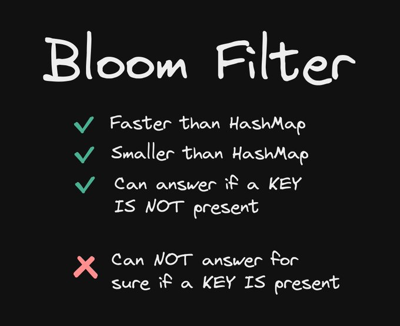
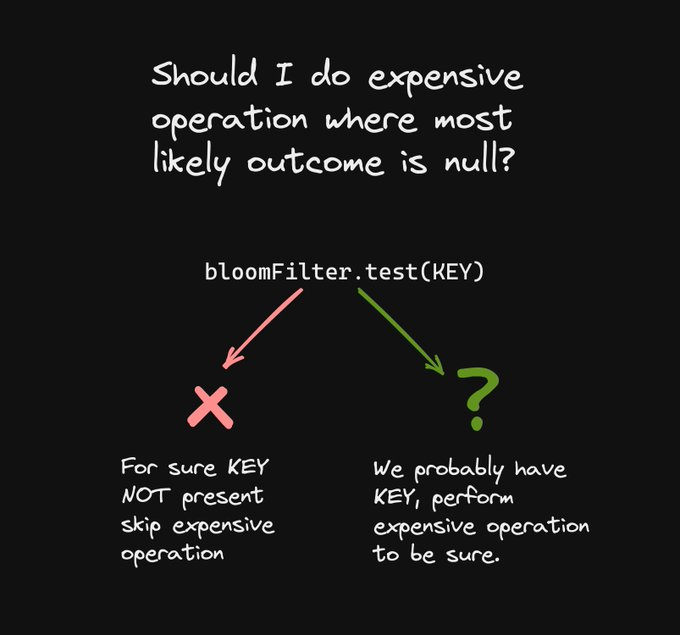
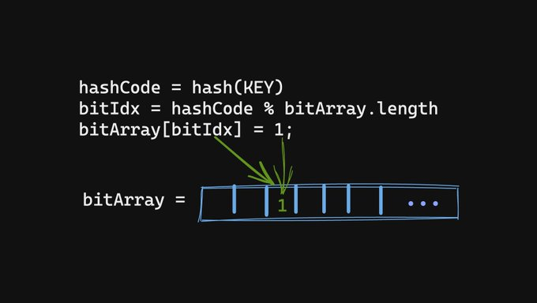
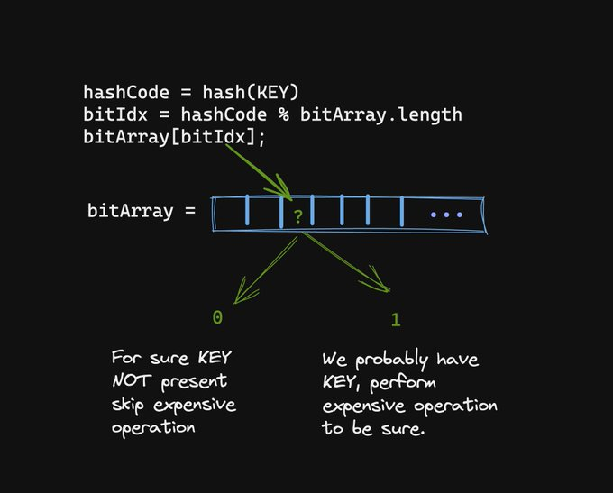
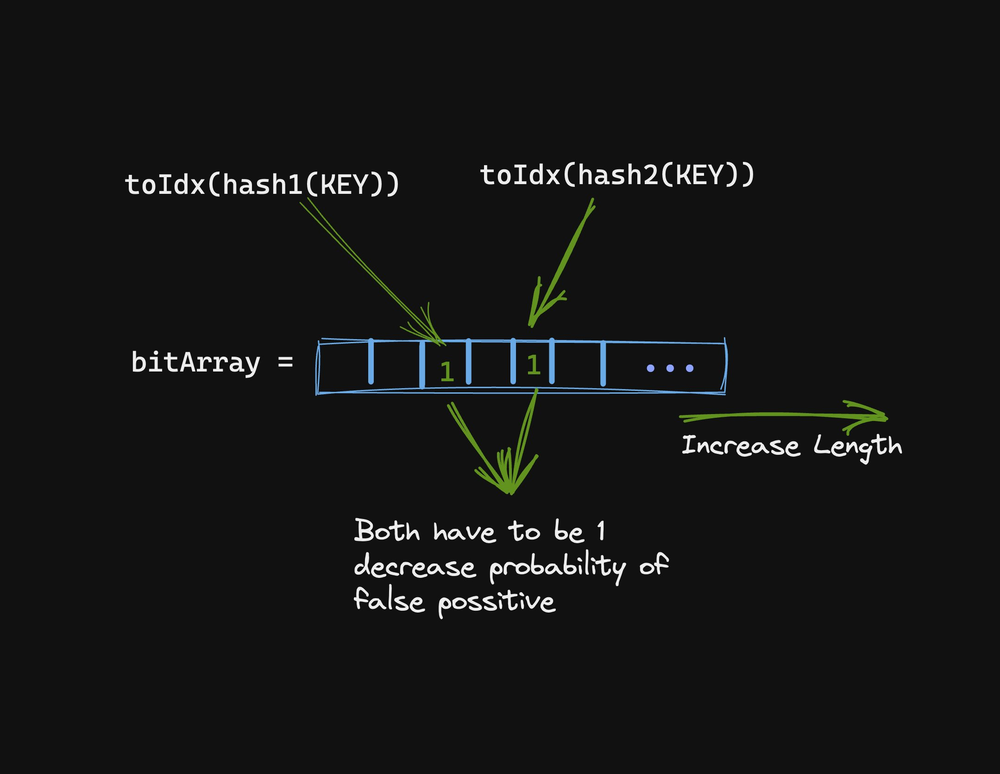
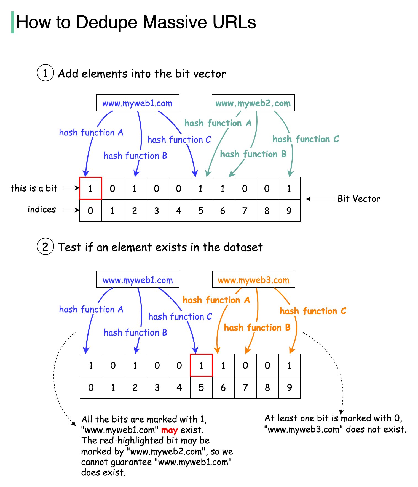
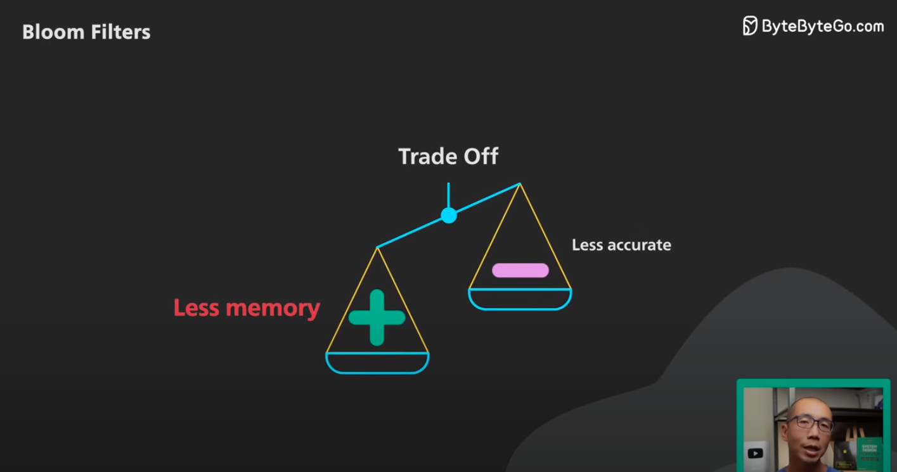

## References
- [Bloom Filters | Algorithms You Should Know #2](https://www.youtube.com/watch?v=V3pzxngeLqw)
- [Bloom Filters Explained by Example](https://www.youtube.com/watch?v=gBygn3cVP80)
- [What Are Bloom Filters? - Easy to understand](https://www.youtube.com/watch?v=kfFacplFY4Y)
- [URL Shortening using Bloom Filter](https://systemdesign.one/url-shortening-system-design/#database-cleanup)
- [Bloom Filters Explained](https://systemdesign.one/bloom-filters-explained/)
----
----
 ## [Exploring Key Distributed System Algorithms and Concepts Series: 4— Bloom Filter and HeartBeat](https://medium.com/@gurpreet.singh_89/exploring-key-distributed-system-algorithms-and-concepts-series-4-bloom-filter-and-heartbeat-38895fc9eeb4)


----
----

## [Bloom Filter Thread](https://twitter.com/mhevery/status/1628249281361747968)

Make your code faster with Bloom filters. They are like HashMaps but smaller and allow you to short-circuit more expensive operations.



----

A bloom filter is a probabilistic data structure that can answer if a key is NOT present.

bloomFilter.test(KEY):
- **TRUE**
    > we **probably** have the KEY => expensive op needed to be sure.
  - **FALSE**: 
  > **100%** sure we don't have KEY => short-circuit expensive work.



----

Imagine you have to do an expensive search operation for a KEY. You also know the most likely outcome is that the KEY will not be found. Such operations can’t be skipped on the off chance that the KEY is found.

A bloom filter allows you to skip such work


----

Bloom filters use a **hash()** to convert KEY -> number.

The number is then modulo bit array size and used to set a bit in bit-array.

**NOTE: we are talking bits => 1 byte = 8 bits => memory efficient**



----

To test() if a KEY is present

> **bits** [ **hash(KEY)** % **bits.length** ]

If a bit present, it could be our KEY, OR it could be a collision. So we are not sure.
If a bit is NOT present, then we are 100% sure that KEY can not be there.



----

To improve false positives
- We can use multiple hash() functions.
- We can make the bit-array bigger, trading false positives for memory.





----
----

## [Layman's Terms: What is Bloom filter?](https://www.quora.com/What-is-a-Bloom-filter-and-what-are-they-used-for/answer/Michal-Fori%C5%A1ek)

Imagine a shoe rack, like the one shown in the picture below.


Whenever your friend John is here, he always leaves his shoes in one particular box.

One day you happen to walk by. Suddenly you become curious: is John here? Obviously, you look at his favorite box. Now there are two cases:

1.  The box is **empty**. 
    > In this case we **are certain** that **John isn't here**.
2.  The box **contains some shoes**. 
    > They may be John's shoes, but they may also be somebody else's shoes. The only conclusion we can make is that **John might be here**.

A Bloom filter is a simple hashing-based filter that is based on the above idea. It allows us to store elements ("John arrives") and to quickly filter out many elements that aren't present ("sometimes we can be sure John isn't here").

An empty Bloom filter is a hash table full of bits set to false ("an empty shoe rack"). When inserting an element ("John arrives") a hashing function will select several bits in the hash table ("John's favorite shoe box"). To insert the element ("mark that John arrived") we set all those bits to true ("place his shoes into the box").

To check whether our Bloom filter contains a particular element ("is John here?"), use the same hash function to compute the bits that would be set upon inserting that element. 

> If all those bits are set to true, the element **might be** in the set. 

> If any of those bits is still set to false, the element **certainly isn't** in the set.

----
----

## Trade Off



## [Java code example](https://medium.com/@abhishekranjandev/demystifying-bloom-filters-with-real-life-examples-b66db7e37b37)

The following code will show you the structure of a Bloom filter and how you can use it to check the presence of an element.

```java
import java.util.BitSet;
import java.nio.ByteBuffer;
import java.nio.ByteOrder;
import java.security.MessageDigest;
import java.security.NoSuchAlgorithmException;

public class BloomFilter {
    private BitSet bitSet;
    private int bitSetSize;
    private int numOfHashFunctions;
    
    public BloomFilter(int size, int numOfHashFunctions) {
        this.bitSetSize = size;
        this.numOfHashFunctions = numOfHashFunctions;
        this.bitSet = new BitSet(bitSetSize);
    }
    
    // Add element to Bloom Filter
    public void add(String url) throws NoSuchAlgorithmException {
        for (int i = 0; i < numOfHashFunctions; i++) {
            int hashCode = getHash(url, i);
            bitSet.set(Math.abs(hashCode % bitSetSize));
        }
    }
    
    // Check if element is present in Bloom Filter
    public boolean mightContain(String url) throws NoSuchAlgorithmException {
        for (int i = 0; i < numOfHashFunctions; i++) {
            int hashCode = getHash(url, i);
            if (!bitSet.get(Math.abs(hashCode % bitSetSize))) {
                return false;
            }
        }
        return true;
    }
    
    // Computes the i-th hash function for the given URL
    private int getHash(String url, int i) throws NoSuchAlgorithmException {
        MessageDigest md5 = MessageDigest.getInstance("MD5");
        md5.update(ByteBuffer.allocate(4).order(ByteOrder.LITTLE_ENDIAN).putInt(i).array());
        md5.update(url.getBytes());
        byte[] digest = md5.digest();
        int hash = ByteBuffer.wrap(digest).getInt();
        return hash;
    }
}
```

Here is how you can use this Bloom filter:

```java
public static void main(String[] args) throws NoSuchAlgorithmException {
    BloomFilter bloomFilter = new BloomFilter(1000000, 3);

    // Add some URLs to the Bloom filter
    bloomFilter.add("http://example1.com");
    bloomFilter.add("http://example2.com");

    // Check if URLs are present in the Bloom filter
    System.out.println(bloomFilter.mightContain("http://example1.com")); // Outputs: true
    System.out.println(bloomFilter.mightContain("http://example3.com")); // Outputs: false
}
```