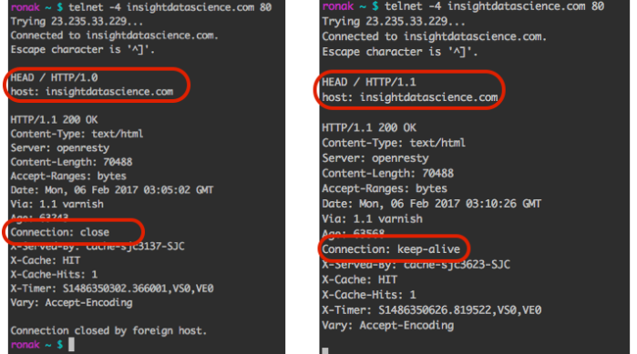

# Header

- ## Connection: keep-alive
    - https://blog.insightdatascience.com/learning-about-the-http-connection-keep-alive-header-7ebe0efa209d
  
    - 
# HTTP Decision Diagram
- https://raw.githubusercontent.com/for-GET/http-decision-diagram/master/httpdd.png

## HTTP 1/HTTP 2
- https://200lab.io/blog/giao-thuc-http2-la-gi-so-sanh-http1-va-http2/

## Safe method and Idempotent method
- [HTTP Common Method Properties](https://viblo.asia/p/http-common-method-properties-4P856NBB5Y3)

## [Difference POST and PUT](https://stackoverflow.com/a/2691891/10393067)

You can find assertions on the web that say

- [**POST** should be used to create a resource, and **PUT** should be used to modify one][1]
- [**PUT** should be used to create a resource, and **POST** should be used to modify one][2]

Neither is quite right.

Better is to choose between PUT and POST based on [idempotence][3] of the action.

**PUT** implies putting a resource - completely replacing whatever is available at the given URL with a different thing.  By definition, a PUT is idempotent.  Do it as many times as you like, and the result is the same. `x=5` is idempotent.  You can PUT a resource whether it previously exists, or not (eg, to Create, or to Update)!

**POST** updates a resource, adds a subsidiary resource, or causes a change.  A POST is not idempotent, in the way that `x++` is not idempotent.

By this argument, PUT is for creating when you know the URL of the thing you will create. POST can be used to create when you know the URL of the "factory" or manager for the category of things you want to create.

so:

    POST /expense-report

or:

    PUT  /expense-report/10929

[1]: http://java.sun.com/developer/technicalArticles/WebServices/restful/
[2]: http://awsmedia.s3.amazonaws.com/pdf/RESTandS3.pdf
[3]: http://en.wikipedia.org/wiki/Idempotent

## [HTTP PUT vs HTTP PATCH in a REST API](https://www.baeldung.com/http-put-patch-difference-spring)

When a client needs to replace an existing Resource entirely, they can use PUT. When they're doing a partial update, they can use HTTP PATCH.

## [Why PATCH method is not idempotent?](https://softwareengineering.stackexchange.com/questions/260818/why-patch-method-is-not-idempotent)