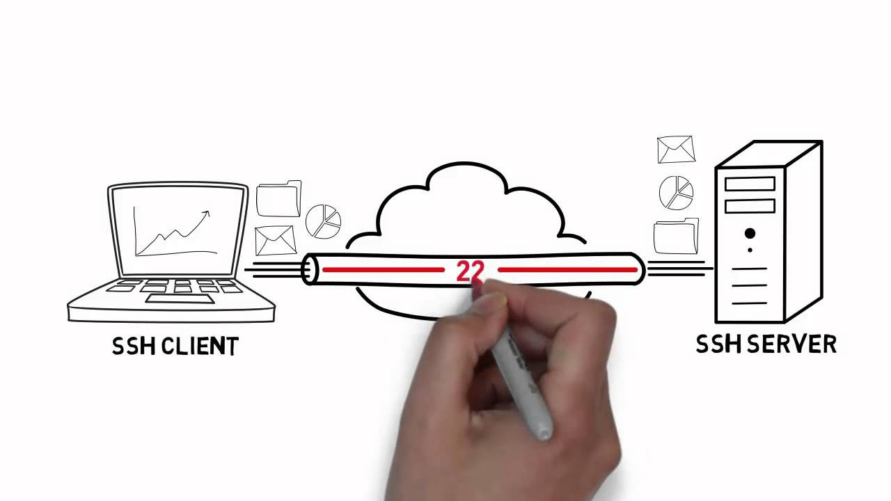
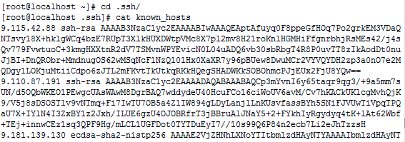

# SSH (Secured Shell)

----------
https://medium.com/@Magical_Mudit/understanding-ssh-workflow-66a0e8d4bf65

**Telnet** is used to communicate with a remote server. But, **Telnet is not a secure communication protocol** because it does not use any security mechanism and transfers the data over network/internet in a plain-text form including passwords and so any one could sniff the packets to get that important information. **So, to overcome this issue SSH came into existence**. Now, lets go ahead and understand SSH.

## What is SSH?

SSH, also known as Secure Shell or Secure Socket Shell, is a network protocol that provides administrators with a secure way to access a remote computer. SSH establishes a cryptographically secured connection between two parties(client and server), authenticating each side to the other, and passing commands and output back and forth.



HOW SSH WORKS?


SSH protocol uses symmetric encryption, asymmetric encryption and hashing in order to secure transmission of information. The SSH connection between the client and the server happens in three stages:

1. Verification of the server by the client.
2. Generation of a session key to encrypt all the communication.
3. Authentication of the client.

Now, I will discuss about these stages in different sections.

## 1. VERIFICATION OF SERVER

The client initiates a SSH connection with the server. Server listens to default port 22 (this port can be changed) for SSH connections. At this point, the server identity is verified. There are two cases:

- If the client is accessing the server for first time, client is asked to authenticate server manually by verifying public key of server. Public key of server can be found using ssh-keyscan command or can be found at different places (WHERE?GOOGLE!).Once the key is verified, the server is added in **known_hosts** file in **~/.ssh** directory on client machine. The known_hosts file contains the information about all the verified servers by the client.
- If the client is not accessing the server for the first time, the server’s identity is matched with previously recorded information in known_hosts file for verification.



## 2 .GENERATION OF SESSION KEY

After the server is verified, both the parties negotiate a session key using a version of something called the **Diffie-Hellman algorithm**. This algorithm is designed in such a way that both the parties contribute equally in generation of session key. The generated session key is shared symmetric key i.e. the same key is used for encryption and decryption.

## 3.AUTHENTICATION OF THE CLIENT

The final stage involves authentication of the client. Authentication is done using SSH key pair. As the name suggests, SSH key pair is nothing but a pair of two key to serve two different purposes. One is public key that is used to encrypt data and can be freely shared. The other one is private key that is used to decrypt data and is never shared with anyone.

After symmetric encryption has been established, the authentication of the client happens as follows:

- The client begins by sending an ID for the key pair it would like to authenticate with to the server.
- The server checks the authorized_keys file of the account that the client is attempting to log into for the key ID.
- If a public key with matching ID is found in the file, the server generates a random number and uses the public key to encrypt the number and sends this encrypted message.
- If the client has the correct private key, it will decrypt the message to obtain the random number that was generated by the server.
- The client combines the obtained random number with the shared **session key** and calculates the MD5 hash of this value.
- The client then sends this MD5 hash back to the server as an answer to the encrypted number message.
- The server uses the same shared session key and the original number that it sent to the client to calculate the MD5 value on its own. It compares its own calculation to the one that the client sent back. **If these two values match, it proves that the client was in possession of the private key and the client is authenticated.**

## Command

- [Tunnel Everything with a SOCKS proxy](https://askubuntu.com/questions/112177/how-do-i-tunnel-and-browse-the-server-webpage-on-my-laptop)
  ```shell
  ssh -D 8080 remote-host
  ```

- Tunnel a single port.
  ```shell
  ssh -L 8080:server-hostname:80 remote-host
  ```


# Question

[How does SSH encryption work?](https://superuser.com/questions/383732/how-does-ssh-encryption-work)

- I've read about generating 2 keys (private and public) on client host and copying the public key to the server host.

   **As I understand it, (correct me if i'm wrong): The server encrypts data with the public key and sends it to client, the client decrypts it with the private key.**

   **But if I need to encrypt data on the client for sending to the server, how does it happen?**

   The public key encrypts data on the client? But how can the server decrypt it, if it only has the public key?

  How does SSH encryption work?


- **[The client keypair is never used for encrypting data, only for AUTHENTICATION](https://superuser.com/a/383738/1066645)** – "publickey" is one of several available methods, where the client presents its own public key along with proof of private-key ownership. Similarly, the server keypair is only used for authenticating the server during DH or ECDH key exchanges; no data is encrypted using it.

[Are “SOCKS5 proxying” and “ssh tunneling” same thing?](https://stackoverflow.com/questions/39009401/are-socks5-proxying-and-ssh-tunneling-same-thing)
- 

[Is SOCKS secure?](https://security.stackexchange.com/questions/719/is-socks-secure?rq=1)

- SOCKS itself does nothing to protect your data. It simply allows you to proxy your connections through another connection.

  The SSH connection from your local computer to the SSH server is what is giving you the security, because all traffic that goes through that connection (including your SOCKS traffic) is encrypted.

  So, any traffic going between the client (eg a web browser) and the SOCKS proxy is not encrypted. Any traffic between the SOCK proxy and the SSH server is encrypted. Any traffic coming out the other side of the SOCKS tunnel is not encrypted. Since you are establishing the SOCK proxy on localhost, that first unencrypted part (between your browser and the proxy) is completely internal to your computer, so it doesn't matter that it is unencrypted.

----------

## Permission
7 is rwx (do anything with it), 5 is rx (gotta read it to execute it), 6 is wr (any data file you need to modify), 4 is r (we'll let you look at it), and 0 is - (sorry, nothing here to see). And the order is Me, Us, Everyone. These are the basic combinations.

755 I can change and run it, everyone else can run it.

644 I can change it, everyone else can read it.

444 Read only for everyone, we're through here.

500 I can execute it, don't want it to change, everyone else hands off.

```
chmod 700 ~/.ssh

# Only I can read.
chmod 400 ~/.ssh/id_rsa

# I can change it, everyone else can read it.
chmod 644 ~/.ssh/id_rsa.pub
```
## Debug SSH connection
```shell
# Debug ssh connection
# https://unix.stackexchange.com/questions/123091/understand-debug-messages-from-sshd
ssh -vT git@gitlab.fruitful.io
```

## [Bypassing SSH Server Verification](https://www.baeldung.com/linux/public-key-known_hosts)
SSH server verification is performed on the client side, where the SSH client prompts an interactive question whenever we try to connect to a new/unknown SSH server.
> $ ssh demo@test.rebex.net
> The authenticity of host 'test.rebex.net (195.144.107.198)' can't be established.
> ECDSA key fingerprint is SHA256:OzvpQxRUzSfV9F/ECMXbQ7B7zbK0aTngrhFCBUno65c.
> Are you sure you want to continue connecting (yes/no)?

## Jump host
- https://dev.to/claudiohigashi/ssh-tunneling-via-a-jump-host-2b5d


## SSH port forwarding
There are 3 types of port forwarding: 
  - local port forwarding 
  - remote port forwarding 
  - [dynamic port forwarding.](https://zaiste.net/posts/ssh-port-forwarding/)
    > Dynamic Port Forwarding allows a communication not on a single port, but across a range of ports. This port forwarding is created using -D parameter. This option will make SSH acts as a SOCKS proxy server.
    >
    > SOCKS5 is an internet protocol which routes packets between a server and a client using a proxy server. SOCKS5 proxy servers use both TCP and UDP protocols (SOCKS4 only uses TCP). A SOCKS proxy is simply a SSH tunnel in which specific applications forward their traffic down the tunnel to the remote server, and then on the server end, the proxy forwards the traffic out to the general Internet. Unlike a VPN, a SOCKS proxy has to be configured for each application separately on the client machine. There is, however, no need to install 3rd party applications to use it.
    >
    >Proxies usually rewrite data packet headers. This may leads to decrease performance and mislabeling errors. SOCKS5 proxy servers do not rewrite data packet headers. They are more performant and less prone to data routing errors. Unlike HTTP proxies which can only interpret and work with webpages, SOCKS5 proxies can work with any kind of traffic. This is because SOCKS proxy servers are low-level proxies that can handle any program, protocol and any type of traffic.
    >
    >Dynamic Port Forwarding can handle connections from multiple ports. It analyzes the traffic to determine the proper destination for the given connection. For example, a browser configured to use it as a SOCKS proxy can then access HTTP, HTTPS, FTP, etc. over the same connection. If you're using dynamic port forwarding, you need to configure programs to use a SOCKS proxy server

## SSH tunnel
- https://robotmoon.com/ssh-tunnels/
- https://hackertarget.com/ssh-examples-tunnels/
- [The Poor Man VPN](https://basimaly.wordpress.com/2015/11/17/the-poor-man-vpn/)
    - 
    - 
    
## Config
- https://www.digitalocean.com/community/tutorials/how-to-configure-custom-connection-options-for-your-ssh-client
- https://viblo.asia/p/cau-hinh-shortcut-ssh-config-4P8560RRZY3

## Disable hung ssh session
```shell
ssh -o ServerAliveInterval=5 logbasex@192.168.1.9
```
https://www.golinuxcloud.com/kill-disconnect-hung-ssh-session-linux/

# READ MORE

- https://www.digitalocean.com/community/tutorials/understanding-the-ssh-encryption-and-connection-process
- https://viblo.asia/p/ban-khong-hieu-ssh-3Q75wVx9lWb
