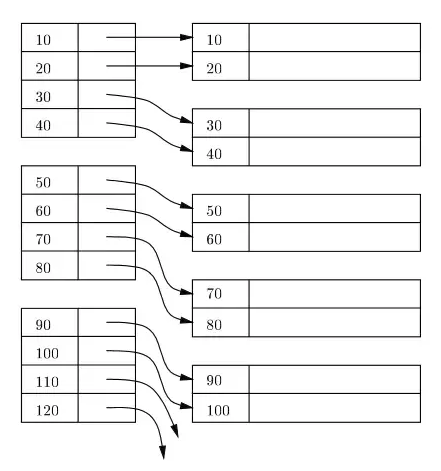
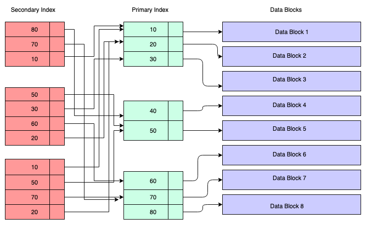

## [Database indexing](https://www.freecodecamp.org/news/database-indexing-at-a-glance-bb50809d48bd/)
- Clustered Index - primary index (or `B-tree` index)
  - 
  - performance bị giảm khi dùng DML query như delete, update vì index phải update lại.
- Secondary index - another column index
  - 
  - **Advantages of a Secondary Index**:
    Logically you can create as many secondary indices as you want. But in reality how many indices actually required needs a serious thought process since each index has its own penalty.

  - **Disadvantages of a Secondary Index**:
    With DML operations like DELETE / INSERT , the secondary index also needs to be updated so that the copy of the primary key column can be deleted / inserted. In such cases, the existence of lots of secondary indexes can create issues.

  - **Also, if a primary key is very large like a URL, since secondary indexes contain a copy of the primary key column value, it can be inefficient in terms of storage**. More secondary keys means a greater number of duplicate copies of the primary key column value, so more storage in case of a large primary key. Also the primary key itself stores the keys, so the combined effect on storage will be very high.

- Trước khi delete primary index cần xem xét kỹ vì sẽ phải update lại tất cả secondary indices.
- Càng nhiều index thì việc ghi data càng chậm.
- **Cardinality is important — cardinality means the number of distinct values in a column.** nếu cột có ít distinct value thì index không mang lại nhiều lợi ích lắm.
  - Example: if you create an index on a boolean ( int 1 or 0 only ) type column, the index will be very skewed since cardinality is less (cardinality is 2 here). But if this boolean field can be combined with other columns to produce high cardinality, go for that index when necessary.
  
  >[**More indexes means slower inserts; more indexes mean more disk & memory space occupied.**](https://towardsdatascience.com/indexing-very-large-tables-569811421ee0)
  > 
  > Reduce your footprint by modifying an existing index instead of adding more indexes mindlessly[?].
  > 
  > Partitions result in smaller B-trees/indexes, hence there’s less work to recompute those indexes on inserts.
 

