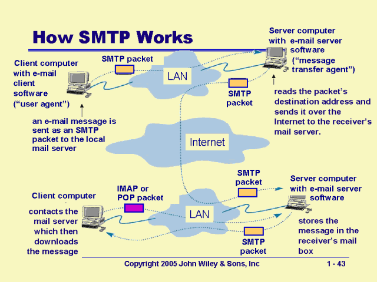
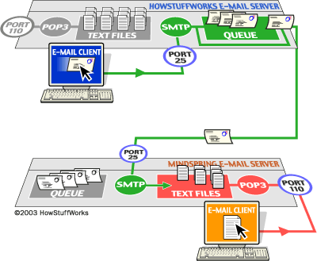
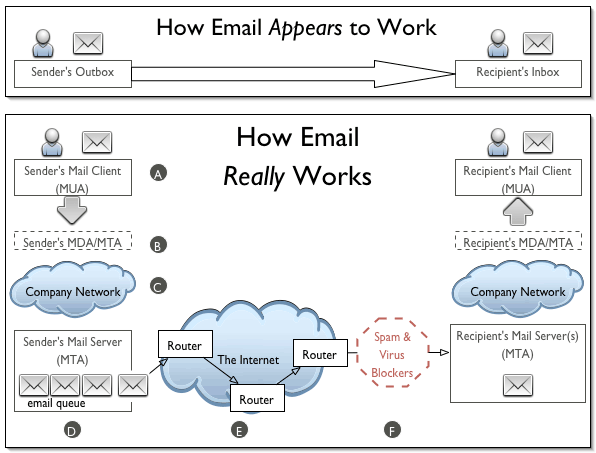

## [How does SMTP work?#](https://postmarkapp.com/guides/everything-you-need-to-know-about-smtp#how-does-smtp-work)

The best way to explain how SMTP works is to go over the sending process, the individual rules and commands that power it, and the errors you may encounter. Fair warning: This is where things start to get technical. Still, we’ll do our best to condense this protocol down into easy-to-digest chunks.

Once an SMTP server is established, email clients can connect to and communicate with it. When the user hits “send” on an email message, the email client opens an SMTP connection to the server so it can send. (The SMTP connection is built on something called a TCP connection, which stands for Transmission Control Protocol.)

From there, the SMTP client uses commands to tell the server what to do and transfer data, like the sender’s email address, the recipient’s email address, and the email’s content. The Mail Transfer Agent or Message Transfer Agent (MTA) checks to see if both email addresses are from the same email domain, such as gmail.com:

If they are, it sends the email right away
If not, the server uses the Domain Name System (DNS) to identify the recipient’s domain and then send it to the right server.

----

Whenever you send a piece of e-mail, your e-mail client interacts with the SMTP server to handle the sending. The SMTP server on your host may have conversations with other SMTP servers to deliver the e-mail.

Let’s assume that I want to send a piece of e-mail. My e-mail ID is brain, and I have my account on howstuffworks.com. I want to send e-mail to jsmith@mindspring.com. I am using a stand-alone e-mail client like Outlook Express.

When I set up my account at howstuffworks, I told Outlook Express the name of the mail server — mail.howstuffworks.com. When I compose a message and press the Send button, here’s what happens:

Outlook Express connects to the SMTP server at mail.howstuffworks.com using port 25.

Outlook Express has a conversation with the SMTP server, telling the SMTP server the address of the sender and the address of the recipient, as well as the body of the message.

The SMTP server takes the “to” address (jsmith@mindspring.com) and breaks it into two parts: the recipient name (jsmith) and the domain name (mindspring.com). If the “to” address had been another user at howstuffworks.com, the SMTP server would simply hand the message to the POP3 server for howstuffworks.com (using a little program called the delivery agent). Since the recipient is at another domain, SMTP needs to communicate with that domain.

The SMTP server has a conversation with a Domain Name Server, or DNS (see How Web Servers Work for details). It says, “Can you give me the IP address of the SMTP server for mindspring.com?” The DNS replies with the one or more IP addresses for the SMTP server(s) that Mindspring operates.

The SMTP server at howstuffworks.com connects with the SMTP server at Mindspring using port 25. It has the same simple text conversation that my e-mail client had with the SMTP server for HowStuffWorks, and gives the message to the Mindspring server. The Mindspring server recognizes that the domain name for jsmith is at Mindspring, so it hands the message to Mindspring’s POP3 server, which puts the message in jsmith’s mailbox.

If, for some reason, the SMTP server at HowStuffWorks cannot connect with the SMTP server at Mindspring, then the message goes into a queue. The SMTP server on most machines uses a program called sendmail to do the actual sending, so this queue is called the sendmail queue. Sendmail will periodically try to resend the messages in its queue. For example, it might retry every 15 minutes. After four hours, it will usually send you a piece of mail that tells you there is some sort of problem. After five days, most sendmail configurations give up and return the mail to you undelivered.

The SMTP server understands very simple text commands like HELO, MAIL, RCPT and DATA. The most common commands are:

- HELO – introduce yourself
- EHLO – introduce yourself and request extended mode
- MAIL FROM: – specify the sender
- RCPT TO: – specify the recipient
- DATA – specify the body of the message (To, From and Subject should be the first three lines.)
- RSET – reset
- QUIT – quit the session
- HELP – get help on commands
- VRFY – verify an address
- EXPN – expand an address
- VERB – verbose

------------------

-----------

## [MUA, MSA, MTA, MDA](https://afreshcloud.com/sysadmin/mail-terminology-mta-mua-msa-mda-smtp-dkim-spf-dmarc)

### MUA (Mail User Agent)
Client application that allows receiving and sending emails. It can be a desktop application such as Microsoft Outlook/Thunderbird/… or web-based such as Gmail/Hotmail/… (the latter is also called Webmail).

### MSA (Mail Submission Agent)
A server program that receives mail from an MUA, checks for any errors, and transfers it (with SMTP) to the MTA hosted on the same server.

### MTA (Mail Transfer Agent)
A server application that receives mail from the MSA, or from another MTA. It will find (through name servers and the DNS) the MX record from the recipient domain's DNS zone in order to know how to transfer the mail. It then transfers the mail (with SMTP) to another MTA (which is known as SMTP relaying) or, if the recipient’s server has been reached, to the MDA.

Examples of MTAs are Postfix, Exim, Sendmail, qmail, ...

###MDA (Mail Delivery Agent)
A server program that receives mail from the server’s MTA, and stores it into the mailbox. MDA is also known as LDA (Local Delivery Agent).

An example is Dovecot, which is mainly a POP3 and IMAP server allowing an MUA to retrieve mail, but also includes an MDA which takes mail from an MTA and delivers it to the server’s mailbox.

### Mailbox: maildir/mbox
The server’s mail storage. Maildir is a way of storing email messages. It is usually preferable over mbox.

###SMTP
Protocol used by MUAs to send emails to an MSA. The recommended SMTP port for sending mail (from an MUA to an MSA) is the port 587, which uses TLS encryption.

### IMAP/POP3
Protocols used by MUAs to retrieve emails from a server mailbox. POP3 deletes the email messages from the server after they have been downloaded. IMAP is usually preferable as it maintains all email messages on the server, permitting management of a mailbox by multiple email clients.

### MX (Mail Exchanger) record
A Mail Exchanger (MX) record in the DNS specifies which server is responsible for accepting email addresses on behalf of a domain. The host name from the MX record must map to one or more address record (A or AAAA) in the DNS, and must not point to any CNAME records.

-----

