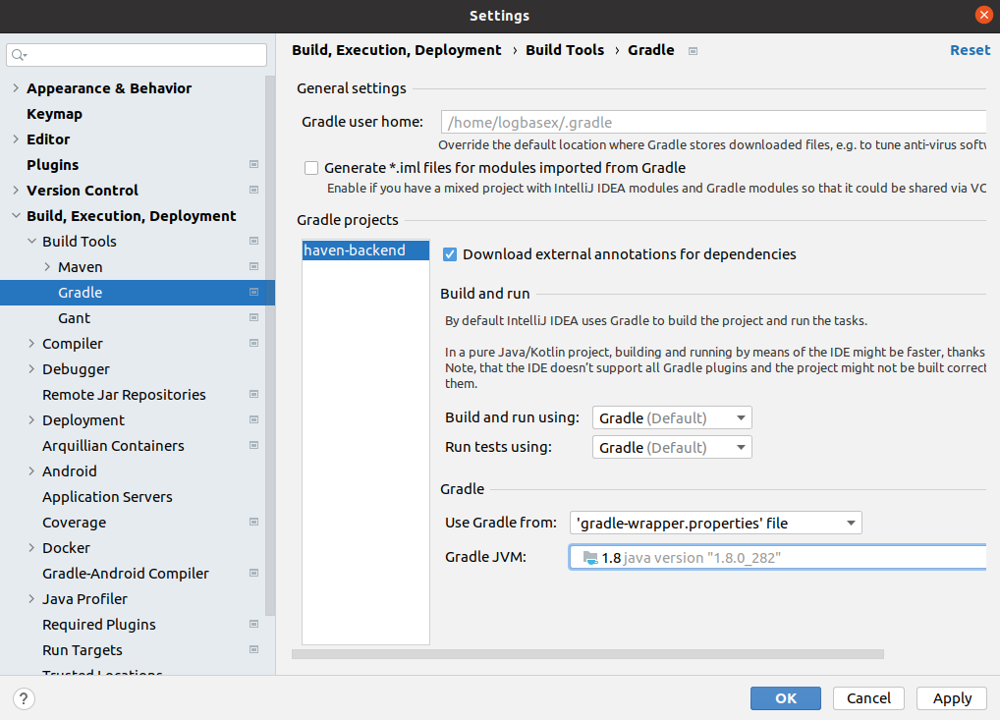

## Command line launcher

- In linux, it reside in `~/bin` folder
- Config here [here](https://stackoverflow.com/questions/26879172/how-to-open-webstorm-from-terminai) and [here](https://blog.jetbrains.com/blog/2018/08/23/toolbox-app-1-11-whats-new/)


## Navigate

<pre>
ctrl+shift+m                  # moving between bracket/parenthesis
</pre>

## See the port of all spring boot services

Help -> Find Action (ctrl + shift + a) -> Run Dashboard -> Click add service -> select spring boot


## Git double click checkout

File -> Settings -> Keymap -> Search -> Checkout Selected -> Add mouse shortcut -> Double Click


 

## IntelliJ shows decompiled .class file instead of source code

Because your source path is empty (File -> Project Structure)


Download and select which one has source path


Further reading here: https://stackoverflow.com/questions/49558009/intellij-shows-decompiled-class-file-instead-of-source-code


## Intellij Gradle JVM



## Replace empty line 
```regexp
^(?:[\t ]*(?:\r?\n|\r)){1,}
```

## Convention

Package's name cannot use reserve word (like enum, class) 


## Show white space


View -> Active Editor -> Show White Space


## Re-debug


Alt + Shift + F9

## Re-run

Alt + Shift + F10

## Shortcut

- Reformat popup
```shell script
ctrl + shift + alt + l
```

- Refactor popup
```shell script
ctrl + alt + shift + v
```

- Copy package
```shell script
ctrl + shift + c
```
- Copy file system absolute path
```shell script
ctrl + alt + shift + c
```

- Show in file
```shell script
ctrl + alt + shift + 2
```

- VCS operation pop up
```shell script
alt + shift + ,
```

- Previous Change
```shell script
Navigate -> Navigate in file -> Next change (ctrl + alt + shift + down)
```

- Next Change
```shell script
Navigate -> Navigate in file -> Previous change (ctrl + alt + shift + up)
```

- Last edit location
```shell
Ctrl + Shift + Backspace
```

- Close notifications
```shell
ctrl + shift + a -> notification
```

- View breakpoints
```shell
ctrl + shift + f8
```
## HTTP client
- Controller
    
  
    ```shell
    @PostMapping("/public/migration/user")
	 public final ResponseEntity<Object> createFan(@RequestPart MultipartFile file, @RequestPart CreateFanRequest request) {
	 	ResponseObject<Object> response = new ResponseObject<>();
	 	try {
	 		migrationSv.createFan(file, request);
	 	} catch (EkoBaseException e) {
	 		response.setError(e.getError());
	 	}
	 	return new ResponseEntity<>(response, new HttpHeaders(), HttpStatus.OK);
	 }
    ```

- HTTP request
    
  
- Data.json
    ```json
    {
      "subscriptionIds": ["60b9a6d7be63496829cdc3bc"],
      "commentToPostRequest": {
        "content": "60b5a339644051460a0b46c4",
        "targetId": "",
        "contentType": "news"
      }
    }
    ```
- https://www.vojtechruzicka.com/intellij-idea-tips-tricks-testing-restful-web-services/  


## Task and context
- [Refresh Jira Task](https://intellij-support.jetbrains.com/hc/en-us/community/posts/206824295-How-Do-You-Refresh-JIRA-Tasks-)
    - `Alt + Shift + N` will open a popup show all Jira Task, then you need to click to the ellipsis in order to refresh Jira task. 

## Plugins

- ### [Jump to line](https://plugins.jetbrains.com/plugin/14877-jump-to-line)
  - This plugin allows you jump back and forth to any line of code while debugging.
  - 
  
- ### [Key Promoter X](https://plugins.jetbrains.com/plugin/9792-key-promoter-x)
  -  

- ### [Randomness](https://plugins.jetbrains.com/plugin/9836-randomness)
  -  

- ### IdeaVim
- ### JsonParser
- ### String Manipulation
- ### [GitToolBox](https://plugins.jetbrains.com/plugin/7499-gittoolbox/)
  - 