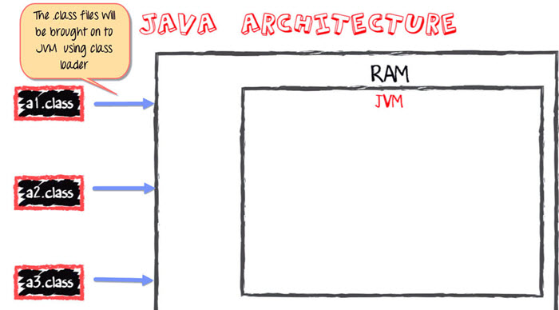

# Architecture
- https://www.freecodecamp.org/news/jvm-tutorial-java-virtual-machine-architecture-explained-for-beginners/
- https://medium.com/platform-engineer/understanding-jvm-architecture-22c0ddf09722

---------------

https://www.guru99.com/java-virtual-machine-jvm.html

Java Virtual Machine (JVM) is a engine that provides runtime environment to drive the Java Code or applications. **It converts Java bytecode into machines language**. JVM is a part of Java Run Environment (JRE). In other programming languages, the compiler produces machine code for a particular system. However, Java compiler produces code for a Virtual Machine known as Java Virtual Machine.

### JVM Architecture

**1) ClassLoader**
- The class loader is a subsystem used for loading class files. It performs three major functions viz. Loading, Linking, and Initialization.

**2) Method Area**
- JVM Method Area stores class structures like metadata, the constant runtime pool, and the code for methods.

**3) Heap**
- All the Objects, their related instance variables, and arrays are stored in the heap. This memory is common and shared across multiple threads.

**4) JVM language Stacks**
- **Java language Stacks store local variables, and it’s partial results. Each thread has its own JVM stack, created simultaneously as the thread is created**. A new frame is created whenever a method is invoked, and it is deleted when method invocation process is complete.

**5)  PC Registers**
- PC register store the address of the Java virtual machine instruction which is currently executing. In Java, each thread has its separate PC register.

**6) Native Method Stacks**
- Native method stacks hold the instruction of native code depends on the native library. It is written in another language instead of Java.

**7) Execution Engine**
- It is a type of software used to test hardware, software, or complete systems. The test execution engine never carries any information about the tested product.

**8) Native Method interface**
- The Native Method Interface is a programming framework. It allows Java code which is running in a JVM to call by libraries and native applications.

**9) Native Method Libraries**
- Native Libraries is a collection of the Native Libraries(C, C++) which are needed by the Execution Engine.

### Software Code Compilation & Execution process
In order to write and execute a software program, you need the following

- **1) Editor** – To type your program into, a notepad could be used for this

- **2) Compiler** – To convert your high language program into native machine code

- **3) Linker** – To combine different program files reference in your main program together.

- **4) Loader** – To load the files from your secondary storage device like Hard Disk, Flash Drive, CD into RAM for execution. The loading is automatically done when you execute your code.

- **5) Execution** – Actual execution of the code which is handled by your OS & processor.

### Java code Compilation and Execution in Java VM

Now in this JVM tutorial, let's look at the process for JAVA. In your main, you have two methods f1 and f2.

- The main method is stored in file a1.java
- f1 is stored in a file as a2.java
- f2 is stored in a file as a3.java

The compiler will compile the three files and produces 3 corresponding .class file which consists of BYTE code. **Unlike C, no linking is done.**

The Java VM or Java Virtual Machine resides on the RAM. During execution, using the class loader the class files are brought on the RAM. The BYTE code is verified for any security breaches.

Next, **the execution engine will convert the Bytecode into Native machine code**. This is just in time compiling. It is one of the main reason why Java is comparatively slow.

### Why is Java both Interpreted and Compiled Language?
A **compiler** is a program which converts a program from one level of language to another. Example conversion of C++ program into machine code.

The java compiler converts high-level java code into bytecode (which is also a type of machine code).

An **interpreter** is a program which converts a program at one level to another programming language at the same level. Example conversion of Java program into C++

In Java, the Just In Time Code generator converts the bytecode into the native machine code which are at the same programming levels.

Hence, Java is both compiled as well as interpreted language.

-----------

https://www.quora.com/How-does-the-Java-compiler-work

Compiler’s main functionality is to convert High level language to low level language which is understand by the machine for example in C/C++ programming language the compiler directly convert source code to Machine language code which is dependent on particular platform. where in the case of java it is totally different,

**Java has compiler name as javac** which convert source code to intermediate code which is known as java bytecode. This java bytecode is not dependent on any platform that is if you compile your source code in windows platform by using javac compiler so you can run this code in any other platforms like linux , Mac.

This bytecode is actually not native code it is intermediate code. In java there is a virtual machine which converts intermediate code into the native code which is known as JVM ( Java Virtual Machine). The JVM is actually work like an Interpreter and it’s first functionality is to verify bytecode and JVM has compiler which is known as JIT (Just In Time ) Compiler. Therefore, JVM takes bytecode and gives it to the JIT and JIT compiler actually compiles the bytecode and converts it to machine dependent native code.

---------

Please note that Java has both compiler & interpreter.
- **Compiler** - Converts Java (source) code to intermediate byte (platform independent) code
- **Interpreter** - Converts byte code to machine (platform dependent) code.

-----------

Basically Java compiler just like any other compile does the task of translation. Translation of code from one form to another, in other words translating code from human understandable form to a platform(i.e. combination of Micro processor and Operating System) understandable code.

The magic(platform independence) is actually the platform for which this conversion is done. Unlike C/C++ which compiled the code to a machine code, Java compiler does not translates Java classes directly to machine code rather it converts the Java classes to something what is called a BYTECODE(.class files). This byte code is created for a virtual platform - The Java Virtual Machine or JVM.

The bytecode verifier in the JVM first checks the bytecode then it is the JVM which is responsible to convert the bytecode to a machine understandable code. Specifically, Just In Time (JIT) compiler of the JVM is responsible for performing this conversion. JIT compiler also keeps track of the frequently repeated bytecodes and does not compiles the same code again and again.

This is how Java achieves its platform independence. Since the JVM converts the bytecode to a machine specific code we have different JVMs for different platforms. **Yes, JVMs are not platform independent**, the platform independence that Java exhibits is a layer of abstraction, under which there exists dependence on the platform.

