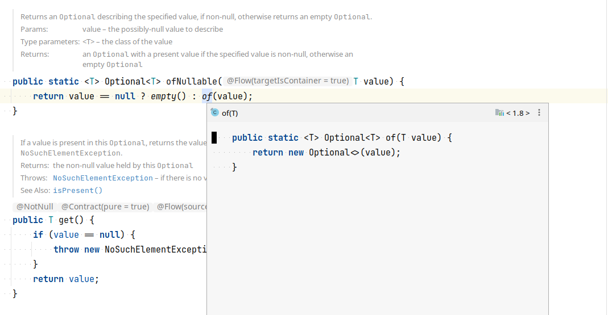

## [Best Practices for Using Optional](https://dzone.com/articles/java-8-optional-usage-and-best-practices)
Just like any other feature of a programming language, it can be used correctly or it can be abused. In order to know the best way to use the Optional class, one needs to understand the following:

### 1. What it Is Trying to Solve
   Optional is an attempt to reduce the number of null pointer exceptions in Java systems, by adding the possibility to build more expressive APIs that account for the possibility that sometimes return values are missing.

If Optional was there since the beginning, most libraries and applications would likely deal better with missing return values, reducing the number of null pointer exceptions and the overall number of bugs in general.

### 2. What it IS Not Trying to Solve
   Optional is not meant to be a mechanism to avoid all types of null pointers. The mandatory input parameters of methods and constructors still have to be tested for example.

Like when using null, Optional does not help with conveying the meaning of an absent value. In a similar way, null can mean many different things (value not found, etc.), so can an absent Optional value.

The caller of the method will still have to check the javadoc of the method for understanding the meaning of the absent Optional, in order to deal with it properly.

Also, in a similar way that a checked exception can be caught in an empty block, nothing prevents the caller of calling get() and moving on.

### 3. When to Use It

The intended use of Optional is mainly as a return type. After obtaining an instance of this type, you can extract the value if it’s present or provide an alternate behavior if it’s not.

One very useful use case of the Optional class is combining it with streams or other methods that return an Optional value to build fluent APIs. See code snippet below

```
User user = users.stream().findFirst().orElse(new User("default", "1234"));
```

### 4. When Not to Use It

**a) Do not use it as a field in a class as it is not serializable**

If you do need to serialize an object that contains an Optional value, the Jackson library provides support for treating Optionals as ordinary objects. What this means is that Jackson treats empty objects as null and objects with a value as fields containing that value. This functionality can be found in the jackson-modules-java8 project.

**b) Do not use it as a parameter for constructors and methods as it would lead to unnecessarily complicated code.**

```
User user = new User("john@gmail.com", "1234", Optional.empty());
```

### Final Thoughts

This is a value-based class; use of identity-sensitive operations (including reference equality (==), identity hash code, or synchronization) on instances of Optional may have unpredictable results and should be avoided.


##  [Avoid Chaining Optional's Methods With the Single Purpose of Getting a Value](https://dzone.com/articles/using-optional-correctly-is-not-optional)

- Avoid
  ```shell
    // AVOID
    public String fetchStatus() {

        String status = ... ;

        return Optional.ofNullable(status).orElse("PENDING");
    }
    ```
  
- Prefer
  ```shell
    // PREFER
    public String fetchStatus() {

        String status = ... ;

        return status == null ? "PENDING" : status;
    }
  ```
  
## [Advantage and disadvantage](https://medium.com/javarevisited/null-check-vs-optional-are-they-same-c361d15fade3)
**1) On Performance**: Wrapping primitive values into an optional instance shows noticeable degrading performance in tight loops. In Java 10 value types might further reduce or remove the penalty.

**2) On Serialization**: Optional is not serializable but a workaround is not overly complicated.

