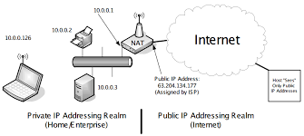

## IP (Internet Protocol)
- https://www.reddit.com/r/explainlikeimfive/comments/iz16i1/eli5_what_can_someone_do_with_your_ip_address_how/

- ### [How do websites determine your IP address](https://www.reddit.com/r/explainlikeimfive/comments/mpgtud/eli5_do_websites_determine_your_ip_address_as/)
    - Websites do not determine your IP address.
      
      You purchase an internet connection plan through a provider (Cox, Comcast, etc. in the U.S.).
      
      Your home is assigned a single IP address (usually given to your router) by your internet provider. Your router then creates and manages IP addresses for all of the devices in your home that connect to it. These IP addresses are invisible to the outside world. The outside world only sees your router's public IP address given to it by your service provider.
      
      This IP address may change whenever you restart the router or have a service interruption.
      
      To expand a little bit, skipping a whole lot of detail and parts of the process:
      
      You browse to google's website. Your device generates a request to send to google's webserver. The request will include the IP address for google's webserver and also the IP address for your device. It sends this request through your router. Your router will take that request, replace your device's IP address with the public IP address, make a note that you sent a request to that website, and then send it over the internet to the google.
      
      Goolge will then reply. The reply contains google's IP address again and your router's public IP. The reply arrives at your router. It then looks at its notes, sees your device sent the request to google, replaces the public IP with your devices IP, and sends it to your device.
      
      This scenario is based off you accessing the internet through your home wifi.
      
## IPv4 (Internet Protocol version 4)

## IPv6 (Internet Protocol version 6)


## Unicast, Multicast, Broadcast Address
- A [Broadcast address](https://en.wikipedia.org/wiki/Broadcast_address) is a special address which, if a device sends a packet to that address, any device can receive it. It is usually the all-ones address in a subnet, e.g. if you use 192.168.2/24 as a private network, the broadcast address is 192.168.2.255.
  
  [Broadcasts are used for device discovery](https://www.quora.com/Whats-a-broadcast-IP/answer/Andrew-Daviel), e.g. a device connecting to WiFi will usually send a DHCP request to the broadcast address. A DHCP server will listen for those requests and reply with a unicast response, so the client will then use the IP address of the server. 

- [What is the use of broadcast IP (eq:-192.168.1.255) address in networking?](https://www.quora.com/What-is-the-use-of-broadcast-IP-eq-192-168-1-255-address-in-networking)  
    - Broadcast IP address is used to indicate that packets being sent out should be delivered to every single client on the LAN. These addresses are always the highest number possible in a network address or subnet.
    - Routing protocols such as Routing Information Protocol (RIP) use broadcasts to send out “ads”. This advertisement is used by routers to map the topology of a network, so that the data can be routed to the required place.
    - Address Resolution Protocol (ARP) uses broadcast IPs to map physical addresses to logical addresses. A device sends a broadcast to every other device on the network to essentially find out who is where.
    - Dynamic Host Configuration Protocol (DHCP) uses broadcasts to dynamically assign an IP address to computers on a network.

- [What's a broadcast IP?](https://www.quora.com/Whats-a-broadcast-IP)
    - A broadcast IP is an IP address which contains all ‘1’ digits in the host portion of the network number
    - Broadcasting is convenient, but very resource wasteful. Broadcasts have to be replicated to the entire network and every single network interface has to ingest and process the broadcast packet. Because of this wastefulness, IPv6 eliminated the broadcast address in favor of a family of multicast and anycast addresses that could address smaller subsets of the network rather than blasting data to every device.
      
- [Why don't we use a broadcast address?](https://www.quora.com/Why-dont-we-use-a-broadcast-address)      
    - we are using a broadcast address “255.255.255.255” but its not like one is assigned to someone.
      
      Consider you are in a library and doing your work. There walks in a person completely unrelated to you and talks so loud about his day, work etc.. to a friend of his. You don’t want to hear all that because it’s unrelated to you and you don’t care. That person is just broadcasting. You don’t want that all the time. You only need it when there’s an announcement. right ?
      
      Like someone walks in and asks “hey..! where’s John ?”(broadcast) you say “he is in cafe downstairs” (unicast). You need broadcast to certain point only. Once that question is answered its no longer broadcast.
    
- [What is multicast?](https://www.quora.com/What-is-multicast)    
    - To transmit a single message to a select group of recipients. **A simple example of multicasting is sending an e-mail message to a mailing list**. Teleconferencing and videoconferencing also use multicasting, but require more robust protocols and networks.
      
      Standards are being developed to support multicasting over a TCP/IP network such as the Internet. These standards, IP Multicast and Mbone, will allow users to easily join multicast groups.
      
      The terms multicast and narrowcast are often used interchangeably, although narrowcast usually refers to the business model whereas multicast refers to the actual technology used to transmit the data.
      
      Transmission method in which one device communicates with several devices with a single transmission. In contrast to broadcasting (in which a message or signal is sent to all connected devices) a multicast message is transmitted only to the selected device(s).
    - **It's a mechanism for a server to send a single stream of data that's received by multiple clients at the same time.**

- [What is a Unicast Transmission?](http://blog.finjan.com/unicast-broadcast-multicast-data-transmissions)
    - In computing terms, unicast transmission is the most common method of information transfer which takes place on networks. Traffic in the form of streams of data packets typically moves from a single host (such as a web server) to a single endpoint (such as a client app, computer, or browser).    
    
- [What is the difference between unicast, anycast, broadcast and multicast traffic?](https://serverfault.com/questions/279482/what-is-the-difference-between-unicast-anycast-broadcast-and-multicast-traffic)    

## [Hop](https://en.wikipedia.org/wiki/Hop_(networking))
- In wired computer networking, including the Internet, a hop occurs when a packet is passed from one network segment to the next. Data packets pass through routers as they travel between source and destination. The hop count refers to the number of intermediate devices through which data must pass between source and destination.

- [Hop-by-hop transport](https://en.wikipedia.org/wiki/Hop-by-hop_transport)
    - Hop-by-hop transport is a principle of controlling the flow of data in a network. With hop-by-hop transport, chunks of data are forwarded from node to node in a **store-and-forward** manner.
      
      As hop-by-hop transport involves not only the source and destination node, but rather some or all of the intermediate nodes as well, it allows data to be forwarded even if the path between source and destination is not permanently connected during communication
    - 
    
## MAC Address (Media Access Control Address)
- **Difference between MAC Address and IP Address**
    - 
    
    - 
        - [Layer 2 uses **MAC addresses** and is responsible for packet delivery from **hop to hop**](https://www.practicalnetworking.net/series/packet-traveling/osi-model/).
        - Layer 3 uses **IP addresses** and is responsible for packet delivery from **end to end**.
    - [Reason for both a MAC and an IP address](https://networkengineering.stackexchange.com/questions/3329/reason-for-both-a-mac-and-an-ip-address)
        - MAC addresses and IP addresses operate on different layers of the internet protocol suite. MAC addresses are used to identify machines within the same broadcast network on layer 2, while IP addresses are used on layer 3 to identify machines throughout different networks.
          
          **Even if your computer has an IP address, it still needs a MAC address to find other machines on the same network (especially the router/gateway to the rest of the network/internet), since every layer is using underlying layers.**
        - https://networkengineering.stackexchange.com/a/6818/75548  
    - [MAC address changes for every new network?](https://serverfault.com/questions/438141/mac-address-changes-for-every-new-network)
- [MAC Address and IP Address](https://superuser.com/a/131180/1066645)
    - When the packet is being sent out to a statipn that is on the same network LAN segment, only the MAC address is needed. When the packet goes beyond, to different networks and travels through routers, **the MAC address is still contained in the packet, but only the IP address is used by the routers**.
      
    - MAC addresses aren't part of the discussion, simply because they never travel beyond your local network, and they can't be hidden as they're simply required for networking to work.
      
- [What is the exact use of MAC address](https://superuser.com/questions/623511/what-is-the-exact-use-of-a-mac-address)
    - They are used for packet transfer: on an Ethernet network, there are a number of devices, and the MAC address specifies which device should receive the packet
    
- [Physical addresses (MAC) change from hop to hop; logical addresses (IP) remain the same from the source to destination and that’s why logical addresses (IP) are used to identify a node uniquely in the Internet”- is it true or false?](https://www.quora.com/Physical-addresses-MAC-change-from-hop-to-hop-logical-addresses-IP-remain-the-same-from-the-source-to-destination-and-that-s-why-logical-addresses-IP-are-used-to-identify-a-node-uniquely-in-the-Internet-is-it-true)
    - Approximately true

- [Why MAC address are not used for routing and other communication instead of IP addresses?](https://www.quora.com/Why-MAC-address-are-not-used-for-routing-and-other-communication-instead-of-IP-addresses)
    - MAC addresses are determined for a device when it is manufactured. They don't change wherever you go. So assume MAC addresses as your name(assume it's unique).
      
      Ip addresses are assigned(by your ISP) when your machine connects to the network. It depends on your location. So assume it as your address.
      
      If someone needs to send you a post, if they use your unique name, then routing that post to you will be difficult. Now if they use your address, routing becomes easier.
      
      That's why IP addresses are used. Routing a packet to a IP address is easier than routing it to a MAC address.    
    
- [How to view your computer's MAC address using 'ifconfig'?](https://unix.stackexchange.com/questions/328693/how-to-view-your-computers-mac-address-using-ifconfig)
    - First, your computer doesn't have a MAC address. Your network card has a MAC address. So if you have a wireless card and an Ethernet card, you'll have two MAC addresses.
    
        ```shell script
        ip link show    
        ```
- [ELI5: what is the functional difference between an IP address and a MAC address?](https://www.reddit.com/r/explainlikeimfive/comments/2lzjzi/eli5_what_is_the_functional_difference_between_an/)      
    - Your name is your MAC address. It identifies you personally and always stays with you.
      
      Your name tag at work is your IP address. It helps identify you to others, and you can have different ones at different times.
    - The MAC address identifies the hardware. The IP address is it's location in a network.
      
- [In what ways does knowing a Mac address help me and what can I use it for?](https://www.quora.com/In-what-ways-does-knowing-a-Mac-address-help-me-and-what-can-I-use-it-for/answer/Ramez-Dous-1)
    - 
    - **Media Access Control (MAC)** addresses, also called Ethernet addresses, are 6-byte-long (48-bit-long) binary numbers. For convenience, most computers list MAC addresses as 12-digit hexadecimal numbers.
      
      MAC addresses represent a single NIC or Ethernet port, so these addresses are often called a unicast Ethernet address. The term unicast is simply a formal way to refer to the fact that the address represents one interface to the Ethernet LAN.
      
      Each device MAC Address should be unique in order to send/receive data successfully.
      
      Before a manufacturer can build Ethernet products, it must ask the IEEE to assign the manufacturer a universally unique 3-byte code, called the organizationally unique identifier (OUI). The manufacturer agrees to give all NICs (and other Ethernet products) a MAC address that begins with its assigned 3-byte OUI. The manufacturer also assigns a unique value for the last 3 bytes, a number that manufacturer has never used with that OUI. As a result, the MAC address of every device in the universe is unique
      
      **Simple example**:
      
      Imagine the MAC Address are like people addresses, you can’t have two persons have the same MAC Address.
      
      *There are some ways to change your MAC Address. You can also change it to be exactly similar to another device in the same network. People don’t usually play with MAC address unless they know what they are doing.
      
      IEEE **Institute of Electrical and Electronics Engineers** also calls the universal MAC addresses global MAC addresses.
      
      **MAC address can be used to**:
      
      - Allow or disallow certain devices from using the network based on their MAC addresses.
      - Identify and Monitor devices activity on the network “bandwidth for example” based on their MAC addresses.
    
## Private IP address


## NAT (Network Address Translation)

- 

- 

- [How NAT works - Animation videos](https://www.youtube.com/watch?v=FTUV0t6JaDA)

## DHCP (Dynamic Host Configuration Protocol)
- [](images/how-dhcp-works.png)

- [Think of it like this](https://www.reddit.com/r/explainlikeimfive/comments/1wnf0d/eli5_what_is_dhcp_and_what_is_it_used_for/). You have a package coming to your front door.
  
  The post office (router) will put your package on a truck but it needs to know where to go. So it uses your address that was assigned by the city(dhcp). In this case that's a static address unless you move, then its dynamic.
  
  All it does is give your device an IP address (192.168.1.x and the like) so network packets know where to go. The router takes care of the the traffic and tells everything where it should go.

- [How does a host receive an IP if there's no DHCP server?](https://serverfault.com/questions/610550/how-does-a-host-receive-an-ip-if-theres-no-dhcp-server)
    - if a DHCP server is not available.
       
       Reserved addresses from 169.254.0.0-169.254.255.255 is used for automatic addressing. It wont conflict because its non routable
       
       Manual config can also be done. There after TCP IP takes care.
       
- [How does host get IP address?](https://www.quora.com/How-does-host-get-IP-address)
    - A physical or a virtual host running any Operating system generally gets an IP address using DHCP(Dynamic Host Configuration Protocol).
      
      Generally in any network, there is a DHCP server running. If it is an enterprise network, you could have a standalone machine acting as a DHCP server and in home networks, there is a DHCP service running on your router.
      
      This DHCP server has a pool of addresses assigned to it so that it can give each IP from the pool to any machine that sends a request.
      
      This is how the requesting and getting an IP address process goes.
      
      1. During the boot process, the client computer sends out a broadcast packet called **DHCPDISCOVER**. Basically, the Discover packet says, "I'm looking for a DHCP server who can lease an IP address."
      
      2. DHCP servers on the network respond to the broadcast with a **DHCPOFFER**. In essence they say "I am a DHCP server and I have a lease for you". If several DHCP servers respond to the request, the client accepts the first offer that it receives.
      
      3. The client responds via a broadcast message called a **DHCPREQUEST**. This basically saying, "I accept your lease offer and would like an IP address". If other DHCP servers made offers, they also see their lease offers were not accepted by the broadcast message, so they rescind their offers.
      
      4. The DHCP server whose offer was accepted responds with a **DHCPACK** message, which acknowledges the lease acceptance and contains the client's IP address lease as well as other IP addressing information.
      
      **Note: With DHCP IP, you have to understand that the IP address lease that your host got can expire and this could result in your host having different IP addresses from time to time.**
      
      An IP address could be statically assigned to the host machine as well. You basically go into the network settings and configure the IP address, netmask, gateway, DNS server information and voila.. your host is now talking to the network with the IP address you configured statically.
      
      
- Check if `dhcp-client` is installed
    ```shell script
    sudo apt policy isc-dhcp-client
    ```      
         
#### Difference between NAT and DHCP
- You're comparing apples and oranges here. Routers connect two different networks together (your private 192.168.x.x, and your ISP's pool 71.49.x.x). NAT is the software in your router which lets many devices share a single public IP address, and it keeps track of the internet sessions for each client, called the NAT table.
  
  DHCP is a service which automatically assigns IP addresses to clients on that network. Your ISP's DHCP server assigns your router a public IP address, and your routers built-in DHCP server assigns private addresses to your home network.
  
- [DHCP just automatically gives you ip addressing information.. NAT was created due to limitation of PUBLIC ipv4 addresses.](https://www.reddit.com/r/HomeNetworking/comments/9h3hx5/what_is_the_difference_between_nat_and_dhcp/)  
- NAT is Network Address Translation. It's job is to fake the source or destination addresses of your traffic so that it appears as if it's coming from somewhere else. In the case of your home router, NAT will "hide" your private 192.168.x.x network from the Internet and all traffic from your network going towards the Internet will appear as if it originated from the router itself.
  
  DHCP is Dynamic Host Configuration Protocol. It's job is to hand out IP addresses to computers to use. In the case of your router, it's handing out the 192.168.x.x addresses to your devices. Without that, devices can't learn what IP addresses to use and how to route out of your own network.
  
  For a typical home router to work as you would expect, you need both DHCP and NAT.
  
- NAT is Network address translation. [If the IP adress inside the router is different from outside NAT is used by definition](https://www.reddit.com/r/explainlikeimfive/comments/dbc6e2/eli5_how_does_an_ip_response_know_which_pc_sent_a/).
  
  It is not needed but common for a consumer product because there is limited amount of IP adress and if a ISP can share only one to a consumer and they can used NAT for all devices it is better for them. NAT also give some protection for devices behind it as they need open a port to them or contact the network directly for a someone external to access them. Most consumer routers have NAT on by default and you cant disable it.
  
## DHCP and DNS
- Both are means for your computer to find its way on the Internet. When your computer starts up, it wants to connect to a computer network, usually the Internet but sometimes a corporate network. The reason it wants to connect is so that you can check your mailbox and surf the web.
  
  In order to be able to connect to a network, your computer needs a unique address assigned to it. Compare this to sending a Valentine card through the postal system to your sweetheart. The postal system requires you to write the address of your sweetheart on the envelope. In much the same way, every computer that wants to use a computer network needs an address. For the postal system, an address is a street name, house number, city, state and zip code. For a computer network, an address is a number, called the IP address (IP is short for Internet Protocol).
  
  [Now, back to your question](https://www.reddit.com/r/explainlikeimfive/comments/q2seq/eli5_what_is_dns_and_dhcp/).
  
  When your computer starts up and connects to the network, it needs an IP address. There are several ways of getting one. The most simple one is that your computer already knows what its IP address is (stored somewhere in a local configuration file) and it simply uses that. This is called a static IP address and is mostly used for small networks, for instance a home network.
  
  Another way of getting an IP address is to ask the network you are connecting to for an address. This is where DHCP is used. What happens here is that on startup, your computer essentially sends a "Hello! What is my IP address?" question to all the computers on the network. However, it does not speak English but DHCP gibberish instead. Most of the other computers on the network are not able to understand DHCP gibberish and will simply ignore the question.
  
  However, one or maybe two computers on the network do speak DHCP gibberish and are able to answer your question: "Your IP address is 192.168.1.101" (this is the way IP addresses are written down). Your computer understands this answer and will adopt this IP address for as long as you stay connected to the network. If you switch off the computer, it will not be able to remember what its address was the next time you power it up and the whole Q: "Hello! What is my IP address"
  A: "Your address is 198.172.1.99"
  
  will be repeated. Notice that the second time, you receive a slightly different address (ending in 99 instead of 101). This is due to the "dynamic" part of DHCP. When you shut down your computer, the address that it had (192.168.1.101) is no longer occupied by your computer. So if someone else comes along and asks for an address, the DHCP computer may decide to recycle your old and now free IP address. Since an IP address must be unique, when your computer starts up again and requests an IP address, the old address will be already given to another computer so you receive another address in response.
  
  Now, for DNS. On the Internet, each and every computer must have a unique IP address. This IP address is a number. People in general are not very adept at recalling numbers. For instance, the IP address of the Google computer is 173.194.65.105 . I had to look it up. But www.google.com is something that I can recall from memory.
  
  What DNS does, is it translates human-readable website names to computer-readable IP addresses.
  
  So when you are in your web browser and decide to go to Google, what happens is that your computer poses a question to a special other computer. The question is "Hey, can you tell me the IP address for www.google.com ?" The special other computer looks up the name www.google.com and returns the IP address for that name. The "special computer" part in this case is a DNS server. It exists to translate names into numbers.
  
  When you connect to the Internet through your provider, your provider tells your computer what the IP address is for the special other computer that provides this name-to-IP-address translation service. So every time your computers needs to translate a website name to an IP address, it uses the IP address for the DNS server to pose the question.
  
  That is what DNS does  
    
## [Static IP and Dynamic IP](https://www.quora.com/Is-a-private-IP-address-also-a-static-IP-address)
- A `private IP address` is defined in [RFC 1918](https://tools.ietf.org/html/rfc1918) as an address in one of these ranges:
  
  - 10.0.0.0 - 10.255.255.255 (10/8 prefix)
  - 172.16.0.0 - 172.31.255.255 (172.16/12 prefix)
  - 192.168.0.0 - 192.168.255.255 (192.168/16 prefix)
  
  **A `public’ IP address` is basically anything outside those ranges**.
  
- As stated elsewhere here, all public and private IP addresses can be dynamic or static; there is no connection between these two things. Public IP addresses are the ones you see across the internet. Private IP addresses are what you see inside of a home or corporate network. Routers can (and normally do) provide NAT (Network Address Translation) to allow devices with private IP addresses to share a single public IP address.
  
  Dynamic vs static is configured at the individual device (desktop, laptop, etc), not on the router.
  
  A router can (and usually does) provide DHCP service, which is how an IP address is obtained dynamically.
  
  A computer or other device on a network can be configured with a specific (i.e. static) IP address, or as a DHCP client.
  
  If it’s configured with a static IP address, it will check first if the address is in use, and if so, the network interface is disabled. This is why DHCP is normally used.
  
  If it’s configured as a DHCP client, it will broadcast a DHCP request on the network requesting an address, *but*, it will include in that request the IP address it last used, and if another device is not using it, it will get that same address.
  
  The DHCP server can include Address Reservation entries, which can be used to assign an IP address. *But*, depending on how the DHCP server is implemented, what I have seen is that when a device makes a DHCP request and includes the IP address it had before, that address is assigned even if there is a different Address Reservation for the device. This is only important if you are replacing a device (such as a file server) and you want the new device to have the same IP address as the old device.
  
  Note that Address Reservation is still part of DHCP (dynamic assignment), not static assignment.
  
## Public IP and Private IP
- **RFC 1918**: Private IP standard

- 

## Default Gateway
- Default Gateway is a point of a Network, through which your network can communicate with Internet/Other Network.
  
  [Analogy](https://www.quora.com/What-is-a-default-gateway-What-purpose-does-it-serve):
  
  Consider your house as a your network and persons, living on that house as packets. (Usually, Packets on your network are way more than Person on house, But its just an Example :-) ).
  
  If any person needs to go out/another house (Internet/another Network), he/she has to pass through Main Door (Default Gateway). Same way, Packets, in your network need Default Gateway to go out/communicate to Internet/Other Network.
  
## NAT (Network Address Translation)  


## ARP (Address Resolution Protocol )
- [ELI5: Address Resolution Protocol (ARP)](https://www.reddit.com/r/explainlikeimfive/comments/rfs1g/eli5_address_resolution_protocol_arp/)
    - ARP stands for Address Resolution Protocol. It maps the network address (IP) to the link-layer address (MAC) so that data knows the appropriate physical interface on which to send data
    


## Command

- Show network interface
    ```shell
    ip link show
    nmcli device status
    ```
- [Show wireless device](https://wiki.archlinux.org/title/Network_configuration/Wireless#Get_the_name_of_the_interface)
    ```shell
    iw dev
    ```
 
- [Common network interface](https://www.cyberciti.biz/faq/linux-list-network-interfaces-names-command/)
  - **lo** – Loopback interface.
  - **eth0** – My first Ethernet network interface on Linux.
  - **wlan0** – Wireless network interface in Linux.
  - **ppp0** – Point to Point Protocol network interface which can be used by dial up modem, PPTP vpn connection, or 3G wireless USB modem.
  - **vboxnet0, vmnet1, vmnet8** – Virtual machine interface working in bridge mode or NAT mode on Linux.
    
- [Why is my interface now wlp2s0 instead of wlan0?](https://askubuntu.com/questions/702161/why-is-my-interface-now-wlp2s0-instead-of-wlan0)