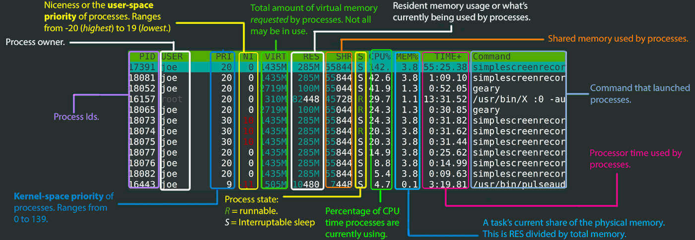

- [Why are there many processes listed under the same title in htop?](https://superuser.com/questions/118086/why-are-there-many-processes-listed-under-the-same-title-in-htop)
  - press **H** to show main process. 

- ##Htop usage
  ```
  a	Set CPU affinity. Mark which CPUs a process may use.
  u	Show processes owned by a user.
  M	Sort the process list by memory usage.
  P	Sort the process list by processor usage.
  T	Sort the process list by time (TIME+).
  F	Follow. Make the selection bar follow the currently selected process as it moves up or down in the sort order. As a movement key is pressed, the process is unfollowed.
  K	Toggle the display of kernel threads.
  H	Toggle the display of user threads.
  Ctrl L	Refresh the screen.
  Number	Select the process having the entered process id.
  s	Using strace, trace process's system calls.
  l (ell)	Using lsof, display open files for a process.
  L	Using ltrace, show library calls made by a process.
  ```
  https://www.softprayog.in/tutorials/htop-command-in-linux


- ##[Get chrome's total memory usage](https://unix.stackexchange.com/questions/288589/get-chromes-total-memory-usage)
  - Chrome using many sub-processes. 
  - ```
    smem -t -k -c pss -P chrom | tail -n 1
    ```

- ##Load averrage
    - https://www.site24x7.com/blog/load-average-what-is-it-and-whats-the-best-load-average-for-your-linux-servers
    - https://blogd.net/linux/giai-thich-ve-loadavg-tren-linux/
  
- ##[Process Memory](https://www.baeldung.com/linux/process-memory-management)
  - VSZ
  - RSS (RES - Resident Set Size) is a measurement that shows how much RAM has been allocated to a process during its execution.
  - USS
  - PSS, or Proportional Set Size, is a much more useful memory management metric. It works exactly like RSS, but with the added difference of partitioning shared libraries.
  - <br/>
  - 