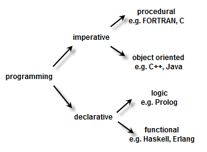

## Paradigms

- https://www.baeldung.com/cs/imperative-vs-declarative-programming
- PROCEDURAL PROGRAMMING VS OBJECT ORIENTED PROGRAMMING
    - https://www.youtube.com/watch?v=70sld4fYcqU
- Fundamental Concepts of Object Oriented Programming
    - https://www.youtube.com/watch?v=m_MQYyJpIjg 

## Imperative vs Declartive
- https://www.youtube.com/watch?v=sqV3pL5x8PI
- https://www.youtube.com/watch?v=E7Fbf7R3x6I

## Tutorials
- https://www.youtube.com/watch?v=_eR4rxnM7Lc&list=PL9D558D49CA734A02&index=4
