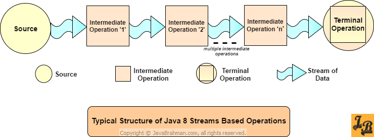

## Overview

### [Advantage](https://www.quora.com/What-are-the-advantages-of-Java-8-streams-over-Java-Collection/answer/Steve-Zara-1)
- One of the advantages of streams is that they can process things lazily. For example, you might deal with lines of text from a large file as a stream, and that would mean that lines are only loaded as required, and that could save a lot of memory.

- Another advantage of streams is that they can operate on their contents in parallel. The method .parallelStream() automatically switches to parallel processing and can be a very simple yet effective way to divide up processing between available threads, where the order of processing isn’t important.

### [Disadvantages](https://stackoverflow.com/a/44180875/10393067)

- **Performance**: A for loop through an array is extremely lightweight both in terms of heap and CPU usage. If raw speed and memory thriftiness is a priority, using a stream is worse.

- **Familiarity**.The world is full of experienced procedural programmers, from many language backgrounds, for whom loops are familiar and streams are novel. In some environments, you want to write code that's familiar to that kind of person.

- **Cognitive overhead**. Because of its declarative nature, and increased abstraction from what's happening underneath, you may need to build a new mental model of how code relates to execution. Actually you only need to do this when things go wrong, or if you need to deeply analyse performance or subtle bugs. When it "just works", it just works.

- **Debuggers** are improving, but even now, when you're stepping through stream code in a debugger, it can be harder work than the equivalent loop, because a simple loop is very close to the variables and code locations that a traditional debugger works with.

### [Intermediate And Terminal Operations](https://javaconceptoftheday.com/java-8-stream-intermediate-and-terminal-operations/)
1) The main difference between intermediate and terminal operations is that intermediate operations return a stream as a result and terminal operations return non-stream values like primitive or object or collection or may not return anything.

2) As intermediate operations return another stream as a result, they can be chained together to form a pipeline of operations. Terminal operations can not be chained together.

3) Pipeline of operations may contain any number of intermediate operations, but there has to be only one terminal operation, that too at the end of pipeline.

4) Intermediate operations are lazily loaded. When you call intermediate operations, they are actually not executed. They are just stored in the memory and executed when the terminal operation is called on the stream.

5) As the names suggest, intermediate operations doesn’t give end result. They just transform one stream to another stream. On the other hand, terminal operations give end result.

6) **Intermediate Operations:**
   - `map()`
   - `filter()` 
   - `distinct()` 
   - `sorted()` 
   - `limit()` 
   - `skip()`

7) **Terminal Operations:**
    - `forEach()` 
    - `toArray()` 
    - `reduce()` 
    - `collect()` 
    - `min()` 
    - `max()` 
    - `count()` 
    - `anyMatch()` 
    - `allMatch()` 
    - `noneMatch()` 
    - `findFirst()` 
    - `findAny(`
- <br>
- 

- 

- **Stateless Intermediate Operations**
  -  Stateful intermediate operations are those which maintain information from a previous invocation internally(aka state) to be used again in a future invocation of the method. Intermediate operations such as Stream.distinct(), which needs to remember(or store) the previous elements it encountered, have to store state information from previous passes. This state storage can become huge for instances of infinite streams and hence can potentially affect performance of the whole system. Another example of stateful intermediate operation is Streams.sorted() which requires to store elements in a temporary storage as it sorts them over multiple passes.
- **Stateful Intermediate Operations**
  - Stateless intermediate operations are the opposite of stateful and do not store any state across passes. This not only improves the performance of these operations, which include among others filter(), map(), findAny(), it also helps in executing the Stream operation invocations in parallel as there is no information to be shared, or any order to be maintained, between these invocations or passes.
### Short-circuit
> [Short-circuiting](https://stackoverflow.com/questions/46349179/why-having-a-short-circuiting-operation-in-the-pipeline-is-necessary-in-java) operations such as **limit(n)** or **findFirst()** can allow computations on infinite streams to complete in finite time.


### [Laziness](https://stackoverflow.com/questions/52685535/is-java-8-stream-laziness-useless-in-practice)
You're right that there won't be a benefit from `map().reduce()` or `map().collect()`,
but there's a pretty obvious benefit with `findAny()`, `findFirst()`, `anyMatch()`, `allMatch()`, etc. 
Basically, any operation that can be short-circuited.

### Performance
- https://jaxenter.com/java-performance-tutorial-how-fast-are-the-java-8-streams-118830.html

## Stream

- Convert Iterable to Stream using Java 8 JDK
    ```shell
    # JDK
    StreamSupport.stream(iterable.spliterator(), false)
             .filter(...)
             .moreStreamOps(...);
  
    # Guava
    Streams.stream(iterable);
    ```
  
## Internal iterator vs External iterator

### External Iterators Definition(or Active Iterators)
Ex: foreach

## Internal Iterators(or Passive Iterators)
Ex: filter

- https://howtodoinjava.com/java8/internal-vs-external-iteration/
- https://www.linkedin.com/pulse/java-8-external-iterator-vs-internal-saral-saxena/

## Stream peek()
- https://stackoverflow.com/questions/54396256/in-java-streams-using-peek-is-regarded-as-to-be-used-for-debugging-purposes-o


## [What is the advantage of IntStream over usual Stream?](https://stackoverflow.com/questions/54840920/what-is-the-advantage-of-intstream-over-usual-stream)
`Stream<Integer>` etc. have to work with boxed values (`Integer` instead of primitive `int`) which takes significantly more memory and usually a lot of boxing/unboxing operations (depending on your code). Why only `Int/Double/Long`? Just because they were expected to be used most often.

Same applies to `OptionalInt` and friends and all the functional interfaces.

For collections (lists/maps/sets) there are many third-party libraries providing primitive specialization for the same reason. Really the problem there is even more acute because with streams you don't (usually; `sorted()` is a counter-example) need to store many values in memory.

## Alternatives
- https://github.com/eclipse/eclipse-collections/blob/master/docs/guide.md#-lazy-iteration