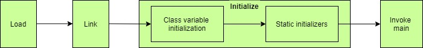

## Memory allocation
- static lưu trong Metaspace(Java8)/PermGen, nên chỉ có static mới gọi được cho nhau?
- 3: **Binding process**
  - In the static method, the method use compile-time or early binding. For this reason, we can access the static method without creating an instance. In a non-static method, the method use runtime or dynamic binding. So that we cannot access a non-static method without creating an instance.

- 4: **Overriding**
    - In the static method, we cannot override a static method, because of early binding. 
- 5: **Memory allocation**

  - In the static method, memory allocation happens only once, because the static keyword fixed a particular memory for that method in ram. So when the method is called every time in a program, each time that particular memory is used. For that reason, less memory is allocated.
  - In the non-static method, here memory allocation happens when the method is invoked and the memory is allocated every time when the method is called. So much memory is used here. Now, lastly plotting table in order to grasp altogether 


- https://www.geeksforgeeks.org/difference-between-static-and-non-static-method-in-java/
- https://www.geeksforgeeks.org/static-methods-vs-instance-methods-java/?ref=lbp
- https://www.geeksforgeeks.org/understanding-storage-of-static-methods-and-static-variables-in-java/
- https://www.linkedin.com/pulse/static-variables-methods-java-where-jvm-stores-them-kotlin-malisciuc

- https://stackoverflow.com/questions/37717885/making-all-methods-static/37717932

One rule-of-thumb: ask yourself "Does it make sense to call this method, even if no object has been constructed yet?" If so, it should definitely be static.

A few good examples here. I would add, however, that "static" is often valuable when you know something is not going to change across instances. If this is the case, I would really consider the "Single Responsability Principle", which implies a class should have one responsability and thus only one reason to change.

[Do static members help memory efficiency?](https://stackoverflow.com/questions/1496629/do-static-members-help-memory-efficiency)
- The only difference between static methods and non-static (instance) methods behind the scenes is that an extra, hidden parameter (```this``` **keyword**) is passed to instance methods and that instance methods might be called using an indirect dispatch (if virtual). There is no additional code space taken.

## [When are Static Variables Initialized in Java?](https://www.baeldung.com/java-static-variables-initialization)

