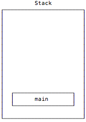
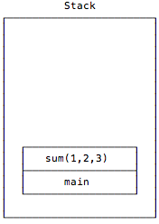
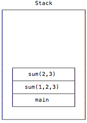
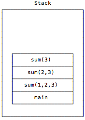
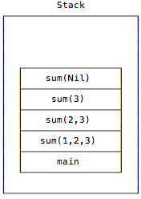
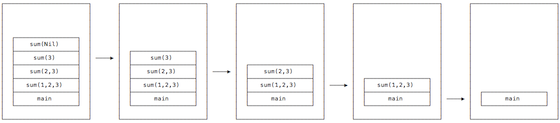

## [This keyword working mechanism](https://stackoverflow.com/questions/29472208/this-keyword-working-mechanism-in-java)
Normal method

```
int addTwo(int i, int j) {
    return i + j;
}
```
compiles to

```
Method int addTwo(int,int)
0   iload_1        // Push value of local variable 1 (i)
1   iload_2        // Push value of local variable 2 (j)
2   iadd           // Add; leave int result on operand stack
3   ireturn        // Return int result
```

---

static method

```
static int addTwoStatic(int i, int j) {
    return i + j;
}
```

compiles to

```
# iload_0: load an int value from local variable 0
# https://en.wikipedia.org/wiki/List_of_Java_bytecode_instructions

Method int addTwoStatic(int,int)
0   iload_0
1   iload_1
2   iadd
3   ireturn
```

**The only difference is that the method arguments appear starting in local variable 0 rather than 1** because [`this` is the first reference variable in this stack](https://stackoverflow.com/questions/33723123/understanding-how-aload-0-and-iload-0-work).

---

Khi gọi method A(), default là this.A() khi compiled, khi gọi tạo ra stack frame mới với parameter đầu tiên (iload_0) là `this`.

--- 

## [Recursion and stack frames](https://alvinalexander.com/scala/fp-book/recursion-jvm-stacks-stack-frames/)

- Each JVM thread has a private stack, created at the same time as the thread.
- A stack stores frames, also called “stack frames.”
- A stack frame is created every time a new method is called.
- When a method is invoked, a new stack frame is created to contain information about that method.
- Stack frames can have different sizes, depending on the method’s parameters, local variables, and algorithm.
- As the method is executed, the code can only access the values in the current stack frame, which you can visualize as being the top-most stack frame.
- “When the method returns, that information is popped off the stack, so the program can resume execution just after the point where it called the method.”
- “recursive algorithms can sometimes create extremely deep call stacks and exhaust the stack space.”
- When a recursive function calls itself, information for the new instance of the function is pushed onto the stack.
- Each time the function calls itself, another copy of the function information is pushed onto the stack. Because of this, a new stack frame is needed for each level in the recursion.
- As a result, more and more memory that is allocated to the stack is consumed as the function recurses. If the sum function calls itself a million times, a million stack frames are created

<p style="text-align: center">
  
</p>

<p style="text-align: center">
  
</p>

<p style="text-align: center">
  
</p>

<p style="text-align: center">
  
</p>

<p style="text-align: center">
  
</p>

[Recursion visual look at JVM stack frames](https://alvinalexander.com/scala/fp-book/recursion-visual-look-jvm-stack-frames/)

> **The Java stack is composed of stack frames (or frames)**. 
> 
> **A stack frame contains the state of one Java method invocation**. 
> 
> **When a thread invokes a method, the Java virtual machine pushes a new frame onto that thread's Java stack**. 
>
> **[When the method completes, the virtual machine pops and discards the frame for that method.](https://www.artima.com/insidejvm/ed2/jvm2.html)**
> 
<p style="text-align: center">
  
</p>

---

## [What is the difference between iload_1,iload_2,iload_3 and iload #index bytecode?](https://stackoverflow.com/questions/51042746/what-is-the-difference-between-iload-1-iload-2-iload-3-and-iload-index-bytecode)

When a new thread is launched,JVM create a new stack for the thread and when a thread invokes a Java method, the virtual machine creates and pushes a new frame onto the thread’s Java stack. **The stack frame consist three parts: local variable, operand stack, frame data**.

Local variable is organized as a zero-based array of words.

These iload_1, iload_2, iload_3 are entry level of local variable array.So, iload_1 means refering to first index of local variable array. Similarly, iload_2 and iload_3 means refering second and third index of the local variable array respectively.

So, there is no specific difference in these iload_1, iload_2, and iload_3, instead refering to respective index at local variable array.