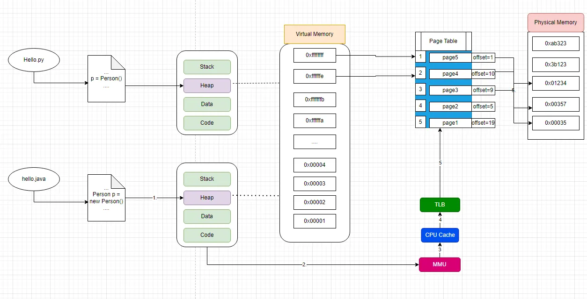
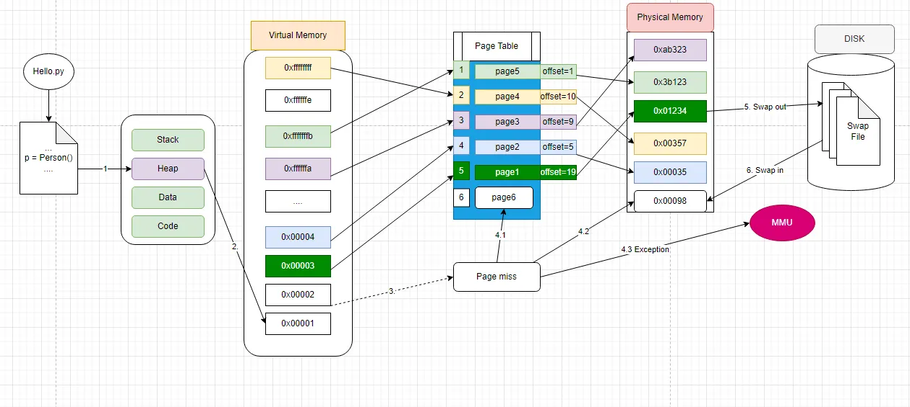

## [What exactly happens when you new() an object](https://iorilan.medium.com/what-exactly-happens-when-you-new-an-object-ea38d9740617)

---

-----
-----

## Why we need virtual memory

Virtual memory is a fundamental feature in modern operating systems, offering several important benefits:

1. **Memory Overcommitment**: Virtual memory allows the system to provide more memory to applications than is physically available. It does this by using disk space to extend the RAM, effectively allowing programs to use more memory than the system physically possesses.

2. **Isolation**: Each process is given its own virtual address space, which isolates it from other processes. This means that one process cannot read or write the memory of another process, which enhances system stability and security.

3. **Efficiency**: Not all parts of a program are used at the same time. Virtual memory allows the system to load only the necessary parts of a program into physical memory, keeping the rest on disk until needed. This makes efficient use of RAM, as it can be used by the parts of different programs that are active, rather than being tied up with inactive portions.

4. **Simplification of Programming**: Developers can write programs for an idealized model of memory where there is seemingly endless space, without worrying about the actual physical memory available. Virtual memory abstracts the details of the physical memory's size and its fragmented nature.

5. **Swapping**: With virtual memory, entire processes can be moved in and out of physical memory to run (a process known as swapping), allowing for multi-tasking and the efficient use of memory by prioritizing which processes should reside in RAM at any given time.

6. **Use of Physical Memory**: Virtual memory allows the system to prioritize the use of physical memory for frequently accessed data, while less frequently accessed data can reside on slower disk storage.

7. **Large Address Space**: Virtual memory provides a large address space to accommodate modern software's needs. This is particularly important on 32-bit systems, where the physical RAM is limited to 4 GB, but virtual memory can extend this limit substantially.

8. **Memory Mapped Files**: Virtual memory is used to map portions of files directly into a process's address space. This is useful for file I/O, allowing programs to manipulate files as part of memory, which can be faster and more convenient than reading and writing to a file using traditional I/O operations.

9. **Demand Paging**: Only the required parts of a program need to be loaded into memory, which can reduce startup times for large applications and save memory resources.

In essence, virtual memory enhances the efficiency, reliability, and security of computer systems by abstracting the memory resources and optimizing their use among multiple processes and applications.

---
---

## What is Page Table, why we need Page Table?

A page table is a data structure used by a computer's operating system in a virtual memory system. Its primary function is to map virtual addresses to physical addresses. Here's a detailed look at what a page table is and why it's necessary:

### What is a Page Table?

1. **Address Translation**: When a program accesses memory, it uses virtual addresses. The page table translates these virtual addresses into physical addresses in RAM.

2. **Memory Management**: The page table is maintained by the operating system and is used by the Memory Management Unit (MMU) of the CPU.

3. **Page Table Entries (PTEs)**: Each entry in the page table corresponds to a page in virtual memory and contains the physical address of the page frame in RAM where that page is stored, along with other metadata such as flags for protection, presence (whether the page is in physical memory), and modification status.

### Why Do We Need a Page Table?

1. **Abstraction and Isolation**: The page table allows each process to have its own separate virtual address space, providing isolation between processes. This prevents one process from accidentally or maliciously accessing the data of another process.

2. **Efficient Memory Use**: Not all parts of a program need to be in memory at once. With a page table, the operating system can load just the necessary pages into physical memory, leaving the rest on the disk.

3. **Flexibility**: The operating system can move pages in and out of physical memory as needed (paging), which means it can run programs that require more memory than the machine physically has.

4. **Protection**: Page tables hold flags that provide protection at the page level, preventing certain types of access to particular areas of memory (e.g., read-only, no execution).

5. **Support for Virtual Memory**: Without page tables, the concept of virtual memory would not be practical, as there would be no efficient way to translate virtual addresses to physical ones.

6. **Non-Contiguous Memory Allocation**: Programs can be allocated memory wherever it's available, even if it's not contiguous in physical memory. The page table takes care of mapping these non-contiguous memory chunks to appear as a contiguous block to the program.

7. **Swap Management**: When the system runs low on physical memory, the least recently used pages can be swapped out to the disk.

The page table updates to reflect these changes, ensuring that the system knows where each page resides (in RAM or on disk) and can retrieve it when needed.

8. **Demand Paging**: The page table allows for demand paging, where pages are loaded into physical memory only when they are needed. This can reduce the total amount of RAM required at any one time, allowing systems to run larger or more programs simultaneously.

9. **Shared Memory**: Multiple processes can share the same physical memory for common code or data. The page table can point entries for different processes to the same physical page if the conditions for sharing are met.

10. **Performance Optimization**: Modern CPUs include a Translation Lookaside Buffer (TLB), which is a cache of recently used page table entries. The page table structure is crucial for the TLB to function, as it relies on the mappings from the page table to accelerate the translation process.

In summary, page tables are essential for modern operating systems to manage memory efficiently, safely, and flexibly. They are a critical component of the virtual memory system that underpins the execution of programs on contemporary computing systems.

