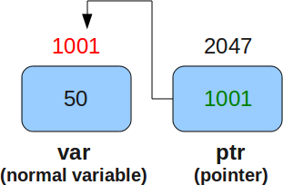
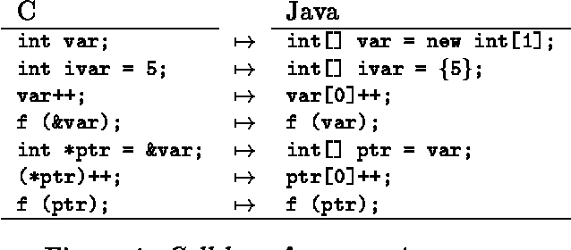

## [Pointer in C](https://viblo.asia/p/giai-thich-ve-pointer-trong-5-phut-YWOZrdpN5Q0)

Tại sao pointer lại được sinh ra? Dùng nó để làm gì? Câu trả lời đơn giản là vì nó hiệu quả. Hồi mà C mới được tạo ra thì máy tính chậm hơn bây giờ rất nhiều. Hầu hết phần mềm hồi đó được viết bằng assembly. Lập trình viên cần phải cẩn thận và hiệu quả hơn nhiều khi giải quyết các bài toán.

Câu trả lời rõ ràng hơn liên quan đến ngữ nghĩa gọi hàm. Ngôn ngữ C là ngôn ngữ tham trị. Khi bạn gọi 1 hàm trong C, giá trị của các tham số được truyền trực tiếp vào call stack của hàm đó. Cho vào 1 số nguyên int, 4 byte sẽ được truyền vào hàm. Cho vào 1 char thì 1 byte sẽ được truyền vào hàm. Điều gì sẽ xảy ra khi bạn cần đưa vào 100k phần tử của một array thuộc kiểu int vào trong 1 hàm? Bạn không muốn phải truyền 400.000 byte vào hàm đó. Như thế thì không hiệu quả chút nào. Thay vào đó bạn sử dụng một pointer tham chiếu tới array. Pointer đó, tất cả 4 hay 8 byte của nó, sẽ được truyền vào trong hàm và khi đó nó có thể được tham chiếu ngược (dereference) để lấy được giá trị của array. Tương tự đối với những struct lớn. Đừng truyền cả struct vào mà hãy dùng 1 pointer trỏ đến struct.

---
[There are no pointers in java. Java works with references](https://stackoverflow.com/questions/18249834/pointers-are-replaced-with-what-in-java).

---
[Java does have pointers, which are known under the name "reference".](https://stackoverflow.com/questions/2629357/does-java-have-pointers)

Java has pointers in the sense of variables that store references to data in memory. All variables of Object types in Java are pointers in this sense.

However, the Java language does not allow arithmetic operations on the values of pointers, like you'd be able to do in a language like C.

---

## [Why Java Does Not Support Pointers?](https://www.thejavaprogrammer.com/why-java-does-not-support-pointers/)

### Simple

The pointer concept is very confusing, difficult to understand (especially for beginners) and causes bugs in code. To make java simpler and less complex the java creators decided to remove the concept of pointers.

### Secure
Security is one of the biggest issue in programming world. Pointer provides direct access to memory address. One can access some arbitrary memory location and do read and write operations on it. This results in loss of security. So to make java secure it doesn’t support pointers.

### Memory Management

Pointers can be used to allocate and deallocate memory. This is good feature of pointers but sometimes it causes headache for programmers to manage memory manually. As java provides the automatic garbage collection feature so there is no need of pointers and it makes memory management easier.

> Java doesn’t provide any explicit option to use pointers but internally pointers are used. Java has the concept of reference which is more simple and secure than pointer.

---
## [Converting C Pointer to Java Reference](https://www.semanticscholar.org/paper/Converting-C-Pointers-to-Java-References-Demaine/2267c53045bed4eb37c936258eb2f032a3ad591c)

We consider the problem of converting C pointers to the less exible concept of references

