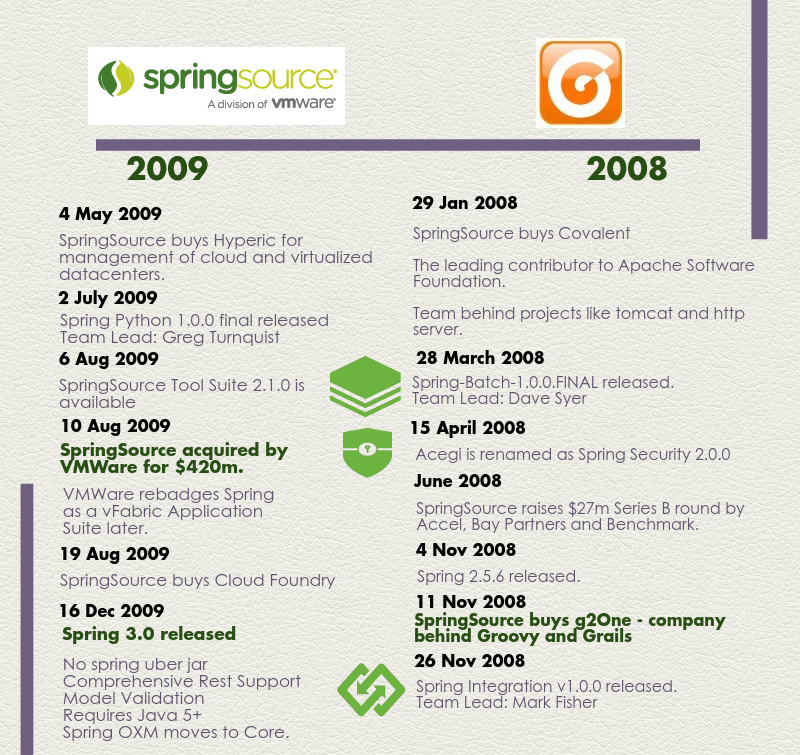

## History
- https://www.quora.com/What-is-the-history-of-The-Spring-Framework
- https://dzone.com/articles/history-of-spring-framework-spring-boot-framework

---

Back around 1998, the industry 'experts' created the EJB framework for writing enterprise class applications. Looked great on paper to computer scientist. With extensive industry support, the EJB standard was quickly adopted. In reality, it was a heavy bloated framework, which was difficult to implement and manage. The only thing the grew faster than the EJB framework adaptation, was the criticism of the EJB framework.

In 2002, Rod Johnson released the first release of the Spring Framework and published a iconic industry book titled "Expert One-on-One J2ee Development Without EJB". Spring was positioned as a lightweight easy to use alternative. Spring quickly gained popularity because of its lightweight pragmatic approach. Since 2002, Spring has continue to evolve and grow with changes in technology and the Java community. Today it is the defacto standard for building enterprise class Java applications.

The heart of Spring is Dependency Injection, Inversion of Control, and Aspect Oriented Programming. The appeal of Spring is the suite of Spring Projects which can be used for building enterprise applications. Spring MVC for web sites, Spring Security for securing access, Spring Data for persistence operations, Spring Integration for EIP, Spring Batch for batch processing, etc.

https://www.quora.com/What-exactly-is-Spring-framework/answer/John-Thompson-6?no_redirect=1

---

https://docs.spring.io/spring-framework/docs/current/reference/html/overview.html

## Java EE vs Spring boot
- https://dzone.com/articles/developers-perspective-spring

---

Spring replaces parts of Java EE that are clumsy. It is more lightweight than EE, generally requiring you to add an annotation or two to a simple class to work.

As an example, create yourself an empty class, after using Spring Boot. Add the RestController annotation above it. You have a web service that will accept and return JSON.

Spring is so successful, and so widely used, it is the only game in town.

There are other excellent frameworks, like play and Vaadin. And many more specialised one, like Drools rules engine or Quartz scheduler, say.

https://www.quora.com/What-Java-EE-frameworks-are-most-used-today/answer/Alan-Mellor

---

https://twin.sh/articles/14/migrating-from-java-ee-to-spring-boot

---

Some reasons:

1. Spring was already there: J2EE was ugly (no Dependency Injection, no conversion over configuration and lot of scares from EJB2, ouch). Java EE "stole" all good ideas from Spring, and it is in fact lighter and easier than previous versions. But now, everybody already uses Spring. It means a lot of production code, lot of well tested products and so on. In the end, why do people in UK/USA use English units? (There is a huge cost to change)

2. Spring is lighter: You do not need a heavy Java EE application server, you can deploy your application in a web container such as Tomcat.

3. Spring offers a ton of features which are not available as Java EE standards, such as Spring Batch or Spring Integration. You can use Spring features with Java EE standards, but it should be supposed Spring works better with Spring, shouldn't it?

4. Spring Aspect-oriented programming is more flexible and power that Java EE interceptors. You can use third-party AOP with Java EE but you can have this out-of-the-box from Spring.

5. Spring moves faster. Spring can release often and faster because it is no standard and only one vendor. So, it is not required JCP ballots, approvals, etc. The reaction to market requirements is much faster. Some current examples: cloud, mobile, social computing.

https://stackoverflow.com/questions/23244894/why-do-large-companies-prefer-spring-over-java-ee

---

Về cơ bản thì JEE chỉ là 1 specification. Nhưng để standardized thì sẽ có nhiều người/tổ chức cùng nhau bàn thảo về những gì sẽ được tiêu chuẩn hóa kể cả những thứ rất nhỏ. => Dần dần khiến việc code thỏa mãn được những tiêu chuẩn ấy (từ application server như Glassfish.. cho đến việc config) sẽ rất phức tạp, thời gian khởi động lâu...

Đó là lý do Spring ra đời. 

Spring được truyền cảm hứng từ Ruby and Rails áp dụng convention-over-configuration principle. Tuy vẫn phải config bằng XML nhưng khi Java5 đưa ra khái niệm Annotation thì đã giảm thiểu được độ phức tạp tương đối lớn.

JEE là 1 specification nên có nhiều implementation khác nhau. Xem danh sách ở đây:
- https://stackoverflow.com/questions/2296678/where-can-i-find-a-list-of-all-the-reference-implementations-for-java-ee-6

Còn Spring thì chỉ là single source.

Spring có sử dụng lại những ý tưởng của JEE như JDBC, servlet nhưng phát triển hoàn thiện hơn, đưa ra các khái niệm như DI, IOC...)

https://www.quora.com/What-are-the-differences-between-Java-EE-and-Spring/answer/Eduard-Korenschi

hear lots of answers that talk about JEE vs Spring and how Spring is or not JEE based and I see some of theme really miss a point.

I’m biased towards JEE, but that’s for reasons I will state later.

First of all, you have to read the history of how JEE came into being and WHY Spring appeared. JEE is a specification, but while that doesn’t say much, it is an effort for standardization. People from different, many times competing companies create a panel where they negociate and decide what can and should get into that standard. So it’s the smallest thing that all of them agree upon. This made in particular the first editions of JEE (until JEE5) to be really cumbersome to use. Lots of XML descriptors, almost always a bunch of non-portable application server specific deployment descriptors, lots of classes for even the most basic EJB, etc. Application servers satisfying the specification where some huge behemots (like old, JBoss, Glassfish, Oracle OC4J and then Weblogic, Websphere). It took ages to start them up and deploy / redeploy applications.

Spring on the other hand appeared as being the light solution to all this cumbersomeness. It only needed a simple servlet container like Tomcat, Jetty, Resin, w/e. You could pack only what you needed … life was good. They still needed xml files (before annotations were introduced in java 5, xml was the stadard way to provide configuration information), but they needed a lot less, had some sensitive defaults, etc.

But that was then and now is now.

Nowadays application servers are extremely fast and light. They switched from those monolythic behemots to very light, modular arhitectures. For example Wildfly (full JEE 7 application server) starts on my laptop in arund 2 seconds, while Tomcat (which is only Servlet / JSP container takes around 1 - 1.5s). Now, Tomcat + Spring boots longer than a modern application server. At the same time xml files almost disappeared, moving from one application server to another became almost a breeze. So there would be almost no reason to use Spring nowadays.

But you must not forget a point.

As I wrote earlier, JEE is an effort for standardization. It takes what is done, or doable by most java enterprise software providers and sticks it into a document. This allows for a very nice portability situation, but in order to do that, it still must rely on the common denominator. Spring, on the other hand, doesn’t have to do that. It is free to innovate, extend, do whatever those smart guys desire. That’s why you have so extremely nice Spring additions for some Big Data solutions, Spring Security which is so far ahead of security specifications in JSE / JEE and so on and so forth.

On the other hand, depending on what application server you deploy on (depending on the project, it may not always be your choice), you will have a difficult time explaining the aquisition of some hunreds of thousands of $$$ worth of application servers when you just use them to boot your Spring container. You may also find the situation that the software provider (like Oracle, or IBM) will deny offering any technical support for applications based on Spring, and not JEE.

So, all in all:

- JEE is a specification, implemented nowadays by: Oracle Weblogic AS, IBM Websphere AS, JBoss EAP / Wildfly, Glassfish (Payara), Apache Tomee, Apache Geronimo. If portability and standardization is a must … this is it.
- Although it can use pieces of JEE, in general Spring is a full fledged application server. The “Spring is light” argument doesn’t hold anymore. You can trim it down as much as you want, but the other JEE application servers do that anyway. This will give you some isolation benefits, but you can also run into the “let’s distribute all software as a virtual machine” kind of approach.
- There’s a very good way of doing microservices in Spring (check Spring boot). If you need that, while there are some attempts in JEE world (Wildfly Swarm), Spring is well ahead. It’s a nobrainer to use that.
- If very customized security or Big Data / NoSQL databases are a must … Spring shines again
- You may lose technical support from the software vendor if you use Spring. Check with the application software vendor.
- You may have a hard time justifying the cost of an application server when you only use it to boot Spring.
- Commercial application servers also come with very good management consoles (like Websphere or Weblogic). If you need the application server to be maintained by some operations department … well spring doesn’t help much. Also if you need clustering, high availability and other centralized tasks, with Spring and most other “free” application servers you’ll have to struggle by yourself (not very difficult, but no nice GUI interface).
- Personally, I always try to go with JEE where possible, and only think about Spring if the requirements are exotic enough and there’s no easy way around that.

## Containerless - Make Jar not War

Để adapt microservice

https://medium.com/javarevisited/evolution-of-spring-boot-and-microservices-4d1109b5a4d3

https://medium.com/@satyajit.nalavade/make-jar-not-war-josh-long-d6ce5fbb8a23

1. Runnable Jars are a convenient way to package self-contained runnable application. This way we can minimize the dependencies.
2. It is very cloud friendly and convenient. (bring your own container)
3. Sharing application server by multiple applications was one of the reasons for packing multiple applications as wars.
4. Build by Spring boot Maven and Gradle plugin
5. Version control everything that is needed to run the application
6. Easy to scale. For instance, copy it to another server, and then ‘just run it’. No installation and/or configuration necessary of a container such as TomEE, Wildfly, Websphere etc.
7. Since we have to provide all dependencies, we know exactly what they are for each build
8. We would like seen application as a single process that can be easily restarted with a service like upstart.