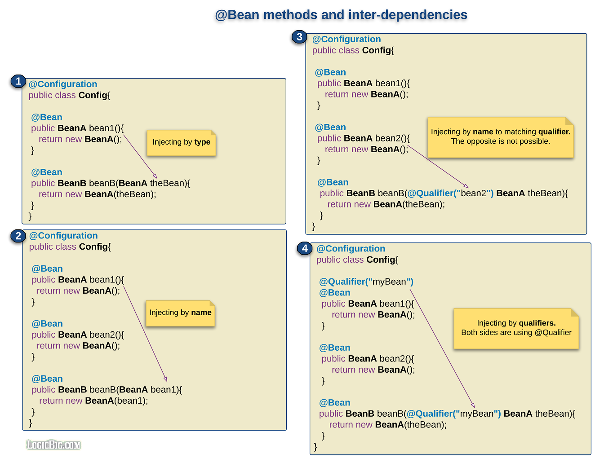

## constructor injection

## setter injection

## field injection
- [How Field Injection in Spring Boot works internally?](https://stackoverflow.com/questions/57386896/how-field-injection-in-spring-boot-works-internally)
- Now given this information, its understandable why final fields cannot be autowired. Leave alone spring, In pure Java, final fields must be instantiated directly right during the declaration (final int i = 123) or in the constructor of the class. [**But the autowiring happens after constructor, so its impossible to autowire the final fields**](https://stackoverflow.com/questions/62774713/internal-working-of-field-injection-in-spring-and-why-is-it-not-recommended-to-u).
## method lookup injection

## [Dependency injection in @Bean method parameters](https://www.logicbig.com/tutorials/spring-framework/spring-core/javaconfig-methods-inter-dependency.html)



---
## DI vs singleton

Dependency injection is a way of decoupling resource (code) needs (dependencies) from their consumers so that you can insert different suppliers of those dependencies, e.g. mocks in a testing system.

It is not related to the singleton pattern, which is a way of asserting there is only a single copy of some code running—the single(ton) copy.

Let’s look at a typical use of dependency injection. Your program has a function that needs to read data from a database. You want to test that function, but you don’t want to hook it to the real database. Thus, you make a fake (mock) database the supplies data to your program in the test scenario. But, how do you make your function use the real database in a production run and the fake one during testing. You use dependency injection to do so. Your function depends upon a database, so you make the database supplier (usually a class in OO programming) a parameter to your function. In the production case, you default that parameter to calling the real database. In the test case, you “inject” the fake database into the parameter.

Now, your database might be a singleton (there is only one of them and you want to guarantee that) or it might not be. That is completely separate from whether you use dependency injection to associate the function that needs to read from the database from the supplier.

Note, you can use dependency injection for more than just testing. DI can also be used to make your program more modular, so that the class which reads from a database can be associated with different DBs for different applications. Each application simply injects the DB it needs.

----

https://forum.codewithmosh.com/t/what-is-the-difference-between-singleton-and-dependency-injection/11652

Dependency Injection involves passing a service to an object; typically you pass an interface. The purpose of this is that the object being injected doesn’t need to create an instance of the class and makes it easier for code reuse and testing.

The Singleton design pattern ensures an object only has once instance and cannot be re-instantiated.

For Dependency Injection, typically you **would create an instance** of the service outside of the target object (the client) and pass it to the client.

For a Singleton, the object **instantiates itself** only once and you can only get/set properties or use methods of the object; you cannot create a new singleton object.

----

https://stackoverflow.com/questions/53631662/dependency-injection-and-vs-global-singleton

----
https://cult.honeypot.io/reads/5-reasons-to-use-dependency-injection-in-your-code

1. Highly Extensible Code
2. Highly Testable Code
3. Highly Reusable Code
4. Highly Readable Code
5. Highly Maintainable Code


---

[Dependency injection is a very simple concept](https://stackoverflow.com/questions/14301389/why-does-one-use-dependency-injection). Instead of this code:

```shell
public class A {
  private B b;

  public A() {
    this.b = new B(); // A *depends on* B
  }

  public void DoSomeStuff() {
    // Do something with B here
  }
}

public static void Main(string[] args) {
  A a = new A();
  a.DoSomeStuff();
}
```

you write code like this:

```shell
public class A {
  private B b;

  public A(B b) { // A now takes its dependencies as arguments
    this.b = b; // look ma, no "new"!
  }

  public void DoSomeStuff() {
    // Do something with B here
  }
}

public static void Main(string[] args) {
  B b = new B(); // B is constructed here instead
  A a = new A(b);
  a.DoSomeStuff();
}
```

> As the other answers stated, dependency injection is a way to create your dependencies outside of the class that uses it. You inject them from the outside, and take control about their creation away from the inside of your class. This is also why dependency injection is a realization of the Inversion of control (IoC) principle.
>
> IoC is the principle, where DI is the pattern.