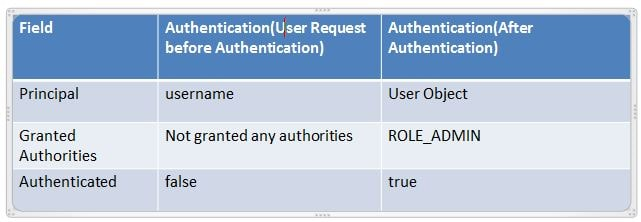

## [Under the hood](https://www.marcobehler.com/guides/spring-security)

###[The mechanism of Spring security ](https://ducmanhphan.github.io/2019-02-09-The-mechanism-of-spring-security/)

------

### https://fizalihsan.github.io/technology/spring-security.html

-----

### [PreAuthorize](https://developer.okta.com/blog/2019/06/20/spring-preauthorize)


------

### [Spring Security Context Propagation](https://www.baeldung.com/spring-security-async-principal-propagation)

[In most environments, Security is stored on a per Thread basis. This means that when work is done on a new Thread, the SecurityContext is lost. Spring Security provides low-level abstractions for working in multi-threaded environments.](https://www.linkedin.com/pulse/minute-read-concurrency-spring-security-keshavram-kuduwa/?trk=articles_directory)

------

- ### [10 Excellent Ways to Secure Your Spring Boot Application](https://tubean.github.io/2018/11/spring-boot-10-ways-security/)
- ### [Cross-Site Request Forgery ](https://stackjava.com/spring/crsf-la-gi-chong-lai-crsf-voi-spring-security.html)

- ### [Reason to disable CSRF in spring boot](https://stackoverflow.com/questions/62696806/reason-to-disable-csrf-in-spring-boot)
  - [Difference between Bearer Token and Cookie](https://stackoverflow.com/a/37635977/10393067)
- 

- 

- [How to validate a token from a OAuth server?](https://stackoverflow.com/questions/41854531/how-to-validate-a-token-from-a-oauth-server)
  - using token store?


## [How do I enable logging for Spring Security?](https://stackoverflow.com/questions/30855252/how-do-i-enable-logging-for-spring-security)
```
@EnableWebSecurity(debug = true)
public class SecurityConfiguration extends WebSecurityConfigurerAdapter {
    …
}
```