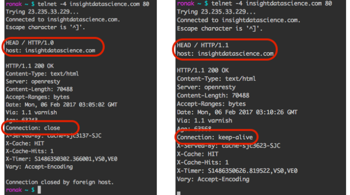

# Header

- ## Connection: keep-alive
    - https://blog.insightdatascience.com/learning-about-the-http-connection-keep-alive-header-7ebe0efa209d
  
    - 
# HTTP Decision Diagram
- https://raw.githubusercontent.com/for-GET/http-decision-diagram/master/httpdd.png

## HTTP 1/HTTP 2
- https://200lab.io/blog/giao-thuc-http2-la-gi-so-sanh-http1-va-http2/