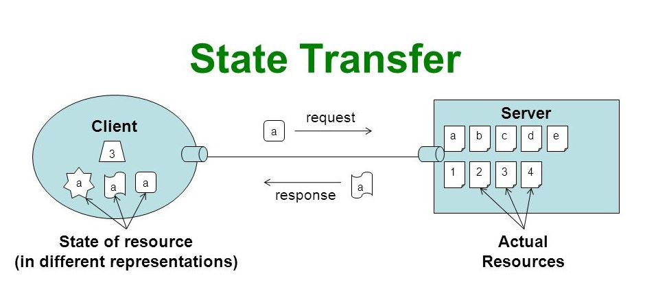
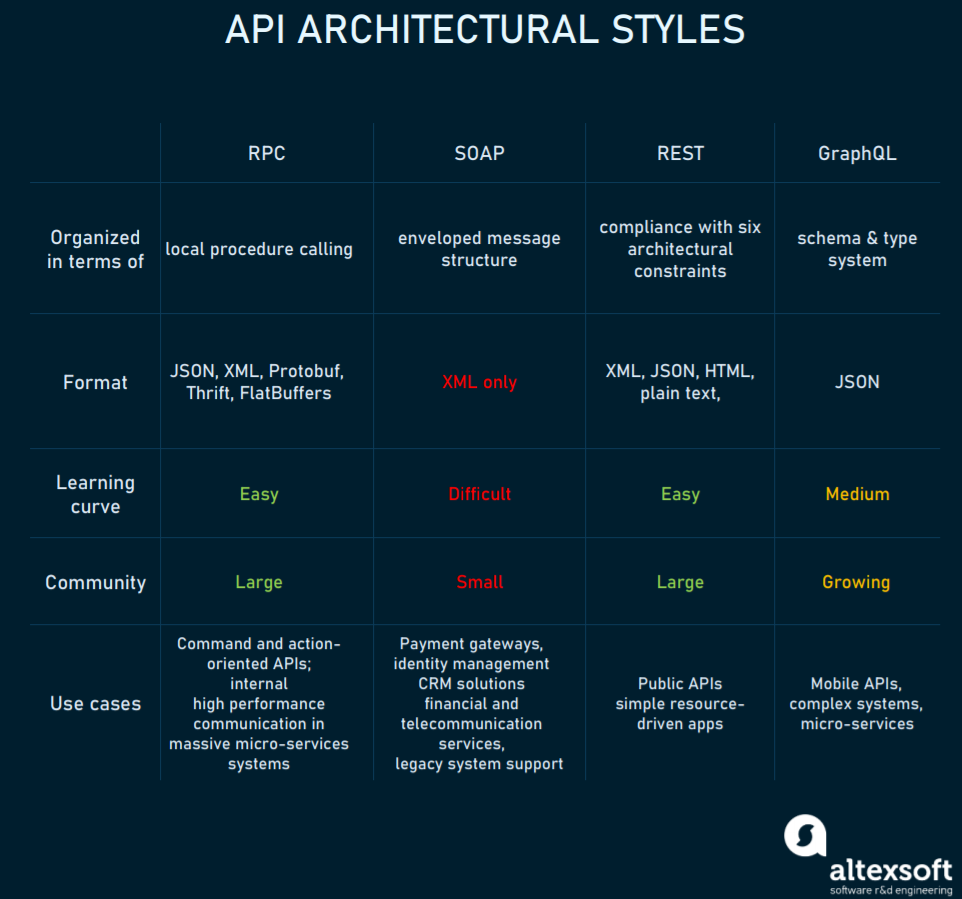
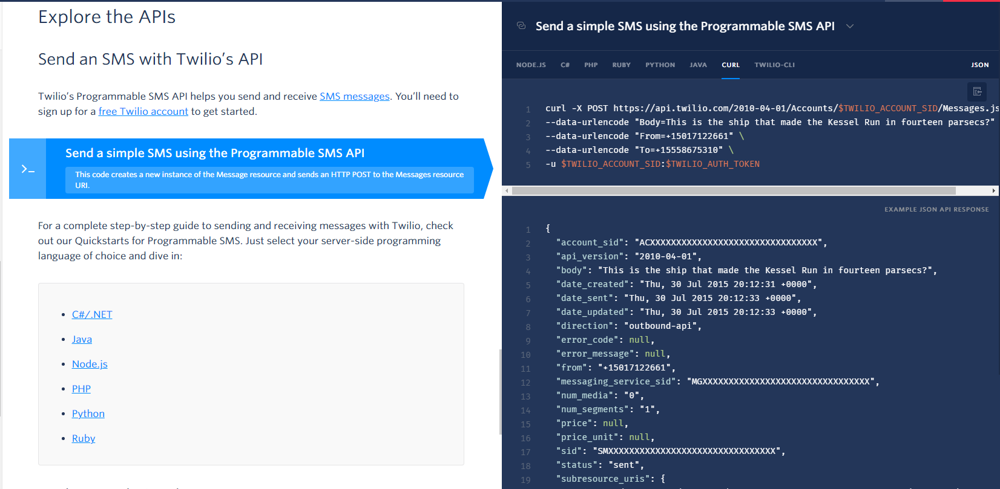

## Representational State Transfer

### [Resource](https://stackoverflow.com/a/48119872/10393067)
The key abstraction of information in REST is a resource. Any information that can be named can be a resource: a document or image, a temporal service (e.g. "today's weather in Los Angeles"), a collection of other resources, a non-virtual object (e.g. a person), and so on. In other words, any concept that might be the target of an author's hypertext reference must fit within the definition of a resource. A resource is a conceptual mapping to a set of entities, not the entity that corresponds to the mapping at any particular point in time.


### [Representation](https://stackoverflow.com/a/48119872/10393067)
A representation is a sequence of bytes, plus representation metadata to describe those bytes. Other commonly used but less precise names for a representation include: document, file, and HTTP message entity, instance, or variant.

> json document -- more precisely, the utf-8 encoded byte array, is a representation. A given resource might have many representations at any given time.

### [State]()

> Every object has some state(data) and behaviour(methods).In order to transfer state of object on server at particular instance of time to client, some sort of representation is needed like JSON or xml or any other format.
>
> So REST is about creating representation of object's current state and transferring that representation over network.

### [Transfer](https://stackoverflow.com/a/21874596/10393067)

Although REST is stateless, it has state transfer in its name. It's a little bit confusing to everyone.

**Stateless**

When you open a web page in the browser, you will act as a service consumer and the www server will act as a service provider to serve you with a webpage. If it is a normal connection, the client and the server will both perform a handshake and initiate a session (called a TCP connection).

After that, based on the server's and client's behavior, the state will change to either ESTABLISHED, IDLE, TIMEOUT, etc. But in REST, we are using the HTTP protocol which is a stateless, meaning the server will not store any session information about the client. The client is responsible for sending all of the details required by the server to get serviced, meaning when we invoke the URI http://somedomain:8080/senthil/services/page1 from the server, it has enough details about the client to serve page1 fully.

**State Transfer**

Using the same example, when you open a web page using some URL to view an image file (RESOURCE) on the server,the www server will show you (the client) the image in some format i.e a REPRESENTATION of the RESOURCE (image file).

During this process, the constant resource state of the server (i.e. the state of the image file which is stored in the server database) will be represented to client in an understandable format i.e. application state of the client. So, the resource state will remain constant in respect to clients, and only the representation of the resource will change, which in turn would change the application state.

Finally, the representation of the resource (how the image is displayed to the client), which implicitly changes the state of both the server and the client is called REST.

## Overview






## Example
- Field trả về sử dụng gạch dưới




## Design
- [REST vs RESTful](https://stackoverflow.com/a/2718235/10393067)
  - **REST** is not a standard, it just design pattern
  - Conforming to the **REST** constraints is referred to as being **RESTful**
- https://viblo.asia/p/mot-so-luu-y-khi-xay-dung-api-djeZ1VaJlWz
- https://www.vinaysahni.com/best-practices-for-a-pragmatic-restful-api

## Hisotry
- https://www.reddit.com/r/explainlikeimfive/comments/5u2c64/eli5_what_is_the_difference_between_rest_and_soap/

## HATEOAS (Hypermedia As The Engine Of Application State)
- https://gpcoder.com/5946-gioi-thieu-hateoas/

## [Reducing bandwidth and number of requests on REST APIs](https://itnext.io/reducing-bandwidth-and-number-of-requests-on-rest-apis-ec418b5fd82a)
Vấn đề của rest api là không thể chỉ định những trường mình muốn lấy, đôi khi là phải lấy hết mặc dù chỉ cần 1 vài trường

To define the data we would like to receive, we need to write a schema spec in JSON or YAML. I’ll be using JSON, because the resulting base64 is smaller (even smaller if minified first).

```
{
    "spec": {
        "_": ["id", "name"]
    }
}
```

This schema is then encoded as a base64 or base64Url string and passed through in the X-Schema-Map header. I’ll be using base64Url, again, because the resulting string is smaller (doesn’t require the = padding at the end).

```
GET /users
X-Schema-Map: eyJzcGVjIjp7Il8iOlsiaWQiLCJuYW1lIl19fQ
```

```
[{
    "id": 10, 
    "name": "John Doe"
},
{
    "id": 10, 
   "name": "John Doe"
}]
```

## [Validate Json Schema](https://www.linkedin.com/pulse/validate-rest-api-using-json-schema-sunil-kapil/)
- Đôi khi việc validate json request từ client hay json response từ server là cần thiết (chúng ta sẽ biết ngay được những field gì còn thiếu thay vì trả về mã lỗi từng field)

## [Bean Validation](https://stackoverflow.com/questions/61614879/is-is-recommended-to-use-json-schema-validation-in-the-place-of-bean-validation)

For example, if there is case where a class which has 3 attributes (say, A,B and C) and a constraint is required that is either A occurs or B & C occurs but not both, then it is not really possible to put a constraint in JSON schema directly, it has to be handled through design of the schema (similarly in XML, actually it is more complicated with XML).

On the other hand in Bean Validation a custom validator can be written to handle this situation quite easily.

## Java

[REST API: JAX-RS vs Spring](https://www.baeldung.com/rest-api-jax-rs-vs-spring)

JAX-RS hinges on providing a set of Java Annotations and applying them to plain Java objects. Indeed, those annotations help us to abstract the low-level details of the client-server communication. To simplify their implementations, it offers annotations to handle HTTP requests and responses and bind them in the code. JAX-RS is only a specification and it needs a compatible implementation to be used.

On the other hand, Spring MVC is a complete framework with REST capabilities. Like JAX-RS, it also provides us with useful annotations to abstract from low-level details. Its main advantage is being a part of the Spring Framework ecosystem. Thus, it allows us to use dependency injection like any other Spring module. Furthermore, it integrates easily with other components like Spring AOP, Spring Data REST, and Spring Security.