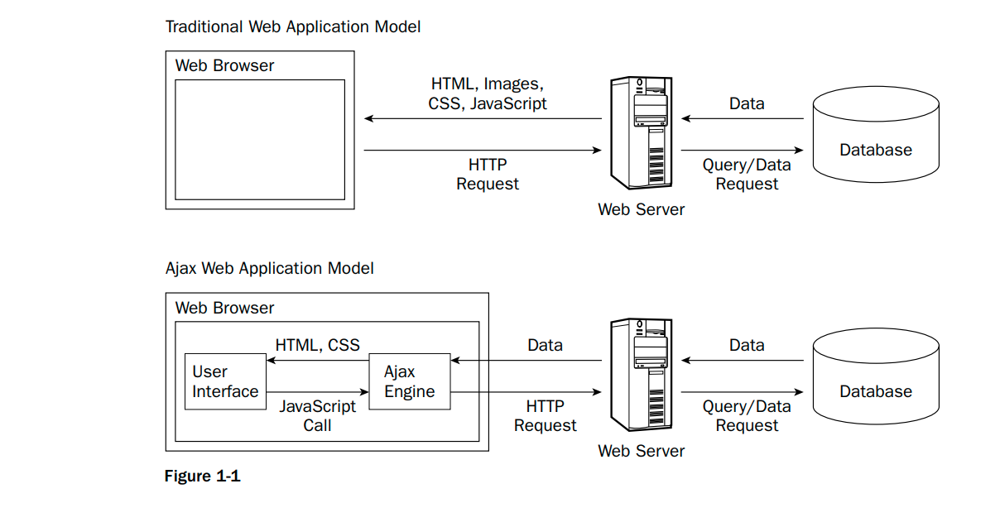

# [Scripting language](quora.com/Whats-the-difference-between-a-programming-language-and-a-scripting-language/answer/Harold-Kingsberg)

Scripting languages are a subset of programming languages.

In the old days, if you wanted to build large applications, you had to use some comparatively verbose programming languages. Because processor speeds were slower than they are now and because RAM was much more expensive, programmers really had to optimize on performance for large applications back then. Languages like COBOL, FORTRAN and C were therefore used for enterprise-level applications.

However, for automating small tasks, all of those languages are serious overkill. If you want an application that will check a directory to see if any files within it contain the letter 'E,' for example, you're looking at typing out more than a few lines of code. You then have to compile the code (turn it into machine code) and only then can you execute it.

In order to automate those quick and dirty tasks, people started writing languages that ran much slower than the compiled languages, but required much less typing to get stuff done. This really started off with shell scripts, moving on to AWK, sed and, in 1987, Perl (EDIT: Also Emacs Lisp, thank you Charles H Martin for the reminder - Lisps in general had a reputation for being scripty in nature). These languages were not compiled, but interpreted: you could type individual lines into the command line prompt and get stuff done, but this involved invoking a program that would dynamically execute whatever you'd typed in.

Throughout the 1990's and early 2000's, scripting languages were useful tools on the level of duct tape: you could use them for quick and dirty tasks, but you couldn't build anything particularly substantial out of them or else the whole structure would collapse or be too slow to be practical. However, as RAM and fast processors got cheaper, scripting languages started being fast enough for many people's purposes even on enterprise software. The distinction between scripting and non-scripting languages has therefore been blurred.

There are a few features that generally get people to label a language as a scripting one.

1) **It's interpreted**
2) It's dynamically typed
3) It has really good string processing features
4) It was designed with a specific OS, not an architecture, in mind (Unix in the case of Perl, Amoeba in the case of Python)

----------- 
[Two definitions first](https://www.quora.com/Whats-the-difference-between-a-programming-language-and-a-scripting-language/answer/%E0%A4%B0%E0%A5%81%E0%A4%9A%E0%A4%BF%E0%A4%B0-%E0%A4%97%E0%A5%81%E0%A4%AA%E0%A5%8D%E0%A4%A4%E0%A4%BE-Ruchir-Gupta):

- **Compilers**: First converts the whole program into assembly code and then converts the assembly code into machine code.
- **Interpreters**: Converts and executes the program line by line.
1. Now, the terms Scripting Language and Programming Language are becoming synonymous gradually. There's not any clear definition of these two terms too.

2. When there were small numbers of compilers and interpreters in the market, every language that had a compiler was called a Programming Language and every language that had an interpreter was called a Scripting Language.

3. For example, there were only C, C++, Pascal compilers in the past. There weren't any interpreters of these languages at that time. That's why they were called Programming Languages. The same way JavaScript was categorized as a "Scripting Language" since there were only interpreters of it, not compilers.

4. But now the scenario is different. The JavaScript Engine of the Chrome (V8) is a compiler. It compiles JavaScript code rather than interpreting it. Whereas, there are C interpreters, too.

5. So whether to call it "Programming Language" or "Scripting Language" is the Environment Thing! It's not about language. You can use these two terms interchangeably. But yeah, Markup Language and Programming/Scripting Language are markedly different. **Maybe a couple of decades ago, it was easier to define what was a scripting language and what wasn't, these days it's a very blurry line**.

And a very simple definition and example of protocol:

> Protocol is set of standards to be used by two parties from different environments while communicating.

1. Since, they're from different environments, they don't know each other's technology/language. But they have to communicate. E.g. the code of the same server and database should be used by the clients such as an Android app, iPhone app or Facebook website. They all are from different environments, but these all clients need to fetch the data from the same servers.

2. Here is where the protocol comes. Facebook clients and servers have decided to use the same standards while communicating (sending requests and getting response). And that's HTTP, a protocol.

3. Real world example: You don't know Chinese and a Chinese doesn't know Hindi. But if both of you face each other and he/she offers coffee to you and you want to deny, how would you do? Probably by nodding your face horizontally. This is the protocol. To nod the face horizontally to say NO is protocol - a standard everybody understands even if they are from different environments!

-----------
-----------


# SGML (Standard Generalized Markup Language)
-  **SGML is the parent of XML**. It started as GML (within IBM) in late 70’s. `Charles Goldfarb` was the major architect
- SGML is thus a metalanguage used to describe
tags with which documents can be marked
- **So SGML is not a fixed tagset**. It describes a standard
set of ‘punctuation’ for tags, plus char. sets to be used e
- **SGML almost totally superseded by XML over last few years**.


#### Disadvantage
- Optional tag minimisation (to optimize computer's memory in 70-80's) can make SGML parser’s job very difficult indeed.
-  SGML document needs to know character set to be used (e.g. UTF8).
-  SGML always required [DTD](Document Type Definitions) at parsing time.

# XML (Extensible Markup Language)
XML stands for extensible markup language. A markup language is a set of codes, or tags, that describes the text in a digital document. The most famous markup language is hypertext markup language (HTML), which is used to format Web pages. XML, a more flexible cousin of HTML, makes it possible to conduct complex business over the Internet.

[Whereas HTML tells a browser application how a document should look, XML describes what’s in the document](https://hbr.org/2000/07/explaining-xml). In other words, XML is concerned with how information is organized, not how it is displayed. (XML formatting is done through separate style sheets.)

[`XML` is extensible because it is not a fixed format (fixed tag) like HTML (which is a single, `predefined markup language`)](http://xml.silmaril.ie/whatisxml.html). Instead, XML is a **metalanguage — a language for describing other languages — which lets you design your own markup languages for limitless different types of documents**. XML can do this because it's written in `SGML`, the international standard metalanguage for text document markup (ISO 8879).

- XML: meta language
- HTML : markup language

1. [What are XML’s advantages over HTML?](https://hbr.org/2000/07/explaining-xml)
2. [HTML and XML compare](https://www.guru99.com/xml-vs-html-difference.html)

# HTML (HyperText Markup Language)
The origin of HTML dates back to the year 1980 when **[Tim Berners-Lee while at CERN wanted a way to navigate from one information to another set of information on another computer](https://dev.to/ziizium/history-of-html-m8h)**. This idea was proposed as a hypertext system for sharing documents and would go on to be the fundamental language of the web - HTML.

Hypertext means machine readable text and Markup means to structure it in a specific format. So,HTML is called hypertext markup language because it is a language that allows users to organize, improve the appearance of, and link text with data on the internet.
- [HTML was the first ‘mass market’ SGML application](http://www.eprg.org/computerphile/newsgml.pdf). People at last realised what SGML notation could achieve.
-  HTML adopted SGML metasyntax from the outset so it’s an application of SGML.
-  But it is essentially a fixed tagset so use of ‘ML’ suffix lamentable ! Initial tagset was arbitrarily extended, in different ways by IE and Netscape
- In early days `Tim Berners-Lee` and browser vendors didn’t fully realise importance of having DTD for HTML.
- Net result was chaos. IE and Netscape had different tags and different minimisation possibilities.
- Allowing ‘overlapping hierarchies’ as well as omitted end tags is deadly. More than 95% of Web HTML was illegal! XHTML cleanup is now under way.

# XHTML (EXtensible HyperText Markup Language)
**XHTML is a stricter, more XML-based version of HTML**. XHTML is HTML defined as an XML application. XHTML is supported by all major browsers.

- [Compare/contrast HTML, XHTML, XML, and HTML5](https://stackoverflow.com/questions/1429065/compare-contrast-html-xhtml-xml-and-html5)

# Markup language

HTML is a markup language because it is used to distinguish HTML elements from the text. There is [some interesting information on Wikipedia](https://en.wikipedia.org/wiki/Markup_language) that explains the origins of markup languages. According to the article, the term “markup” originated in the publishing industry. When proofreaders apply edits to a manuscript, they add symbols or proofreading marks that indicate their corrections. The process is called “marking up a manuscript”. Their marks are distinct from the text so that an editor can accept or reject changes.

Similarly, a web designer or web developer prepares content for a website by marking it up with HTML elements, such as paragraph tags (`<p></p>`), header tags (`<header></header>`), figure tags for images `<figure></figure>`, etc. These tags, which add structure to webpages, are used to distinguish content from HTML elements.

[Its called markup language because it marks the information by tagging them](https://www.quora.com/Why-is-HTML-known-as-markup-language).

Example:

```html
<p> hello </p> 
```
Here its marking the word “hello” by `<p>` paragraph tag. So that browser will know how to display it.

# HyperText and HyperLink

In computing, a **hyperlink**, or simply a link, is a reference to data that the reader can directly follow either by clicking, tapping, or hovering. A hyperlink points to a whole document or to a specific element within a document. **Hypertext is text with hyperlinks**.

----
- Hypertext contains Hyperlinks (e.g., Uniform Resource Locators (URLs) in HyperText Markup Language (HTML)).
- **Plain Text** does not contain hyperlinks.


# [Meta language](https://en.wikipedia.org/wiki/Metalanguage)

Metalanguage is language or symbols used when language itself is being discussed or examined. In logic and linguistics, a metalanguage is a language used to make statements about statements in another language (the object language). Expressions in a metalanguage are often distinguished from those in an object language by the use of italics, quotation marks, or writing on a separate line.

- For example: `XML`, `SGML` 

### Source
1. [SGML, HTML, XML notes](http://www.eprg.org/computerphile/newsgml.pdf)
2. [SGML HTML XML What's the Difference? (Part 1) - Computerphile](https://www.youtube.com/watch?v=RH0o-QjnwDg)
3. [HTML: Poison or Panacea? (HTML Part2) - Computerphile](https://www.youtube.com/watch?v=Q4dYwEyjZcY)
4. [Relation and differences between SGML, XML, HTML and XHTML](https://softwareengineering.stackexchange.com/questions/93296/relation-and-differences-between-sgml-xml-html-and-xhtml)
------------
------------

# YAML (YAML Ain't Markup Language)
[Here's the real story... :)](https://stackoverflow.com/a/18928199/10393067)

Clark, Oren and I started working on YAML in April 2001. Oren and Clark were part of the SML mailing list, which was trying to make XML simpler. I had just written a data serialization language for Perl called Data::Denter. Clark contacted me to tell me about an idea they had called YAML, which looked similar to Data::Denter syntax. Clark already had acquired yaml.org.

After a few months of us working together, I pointed out that YAML (which most definitely stood for **Yet Another Markup Language** at that time) was not really a markup language (marking up various elements of a text document) but a serialization language (textual representation of typed/cyclical data graphs). We all liked the name YAML, so we backronymed it to mean **YAML Ain't Markup Language**.

http://yaml.org/spec/ starts with:

> YAML™ (rhymes with “camel”) is a human-friendly, cross language, Unicode based data serialization language designed around the common native data structures of agile programming languages.

# Frame (World Wide Web)
In the context of a web browser, **[a frame is a part of a web page or browser window which displays content independent of its container, with the ability to load content independently](https://en.wikipedia.org/wiki/Frame_(World_Wide_Web))**. The HTML or media elements shown in a frame may come from a different web site as the other elements of content on display, although this practice, known as framing,[1] is today often regarded as a violation of same-origin policy and has been considered a form of copyright infringement.
 
 
# AJAX (Asynchronous JavaScript and XML)
AJAX stands for **A**synchronous **J**avaScript And **X**ML. In a nutshell, it is the use of the `XMLHttpRequest` object to communicate with servers. It can send and receive information in various formats, including JSON, XML, HTML, and text files. AJAX’s most appealing characteristic is its "asynchronous" nature, which means it can communicate with the server, exchange data, and update the page without having to refresh the page.

The two major features of AJAX allow you to do the following:
- Make requests to the server without reloading the page
- Receive and work with data from the server

--------------
# JSON (JavaScript Object Notation)

- **History**
    - Web 1.0: HTML
    - Web 1.1: XML + HTML = XHTML
    - Web 1.2: AJAX
    - Web 2.0: Single page application
    - 

- **Compare JSON and XML**
    - [JSON vs XML: What's the Difference?](https://www.guru99.com/json-vs-xml-difference.html)
    - [Advantage of XML over JSON](https://www.quora.com/What-are-the-advantages-of-XML-over-JSON/answer/Prashant-395)
    - [XML and JSON — Advantages and Disadvantages?](https://stackoverflow.com/questions/5615352/xml-and-json-advantages-and-disadvantages)
#### JSON vs XML
1. [A Deep Look at JSON vs. XML, Part 1: The History of Each Standard](https://www.toptal.com/web/json-vs-xml-part-1)
2. [https://www.toptal.com/web/json-vs-xml-part-2](https://www.toptal.com/web/json-vs-xml-part-2)
3. [Evolution of web - history to Ajax](https://catalogimages.wiley.com/images/db/pdf/0471777781.excerpt.pdf)
    
    
    
# Scaffolding
    