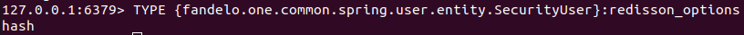
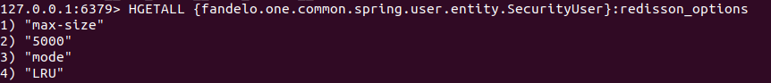
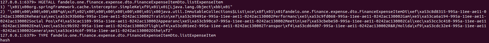

## Why Redis Hash is unreadable

### Readable 

### Unreadable

The output you're seeing from the `HGETALL` command in Redis appears to be binary data or a serialized object, rather than a simple string or a conventional Redis data structure. This is indicated by the presence of non-readable characters (like `\x01`, `\x00`, etc.) and the structured format that doesn't resemble typical Redis string values.

Here's a breakdown of what's likely happening:

1. **Serialized Data**: The value stored in the hash key `finance.expense.dto.FinanceExpenseItemDto.listExpenseItem` is probably a serialized object. Serialization is the process of converting an object into a format that can be stored or transmitted, and later reconstructed. In many applications, Java objects are serialized before being stored in Redis.

2. **Java Object Serialization**: The specific serialized format looks like Java serialization (indicated by the presence of strings like `java.util` and `org.springframework`). Java serialized objects start with a specific header (like `\xAC\xED\x00\x05` for standard Java serialization) followed by binary data representing the object's state.

3. **Interpreting the Data**: To interpret this data, you would need to deserialize it using the same method it was serialized with, typically in a Java application. Directly reading such data via `HGETALL` in Redis CLI will not give you human-readable information unless you deserialize it back to its original form in an appropriate environment or application.

4. **Why Serialize in Redis**: Serialization is used in Redis when you need to store complex objects that cannot be directly mapped to Redis's native data structures (like strings, hashes, lists, etc.). However, it's important to note that storing serialized objects limits the ability to manipulate or query these objects directly in Redis.

If you're developing or maintaining the application that interacts with this Redis instance, you'll need to understand how it serializes and deserializes objects. If you're not familiar with the application's internals, you might need to consult with the developers or the documentation for that application to understand how to properly handle this data.

----
----

## What is Redis hash

> A Redis hash is a data structure that stores a collection of field-value pairs, **similar to dictionaries in Python, HashMaps in Java, or Ruby hashes**. It's a versatile and widely used data type in Redis, offering several advantages:

**Structure and Value:**

* Each field is a unique string used to identify a specific piece of data.
* The value associated with each field can be any Redis data type, including strings, numbers, lists, or even other hashes.
* This allows you to store complex data structures within a single Redis key.

**Performance:**

* Accessing individual fields within a hash is incredibly fast, with a constant time complexity (O(1)). This makes them ideal for frequently accessed data and efficient lookups.
* Additionally, you can manipulate and update specific fields without affecting the entire data structure.

**Use Cases:**

* **Storing user profiles:** You can store a user's information as a hash, with fields like username, email, age, and preferences.
* **Caching complex objects:** Instead of storing a whole object in a string or list, you can break it down into fields and values within a hash for faster retrieval.
* **Implementing counters:** Each field can represent a specific counter, and commands like `HINCRBY` allow efficient incrementing and decrementing of individual values.
* **Managing sessions:** Store session data, cookies, and other temporary information within a hash associated with the session ID.

Here are some additional resources to learn more about Redis hashes:

* **Redis Documentation:** [https://redis.io/docs/data-types/hashes/](https://redis.io/docs/data-types/hashes/)
* **Redis Hash Commands:** [https://redis.io/docs/data-types/hashes/](https://redis.io/docs/data-types/hashes/)
* **Redis Hashes Tutorial:** [https://yuntue.com/post/47108.html](https://yuntue.com/post/47108.html)