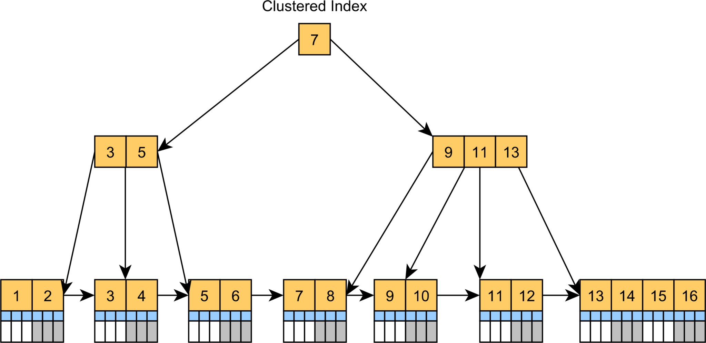
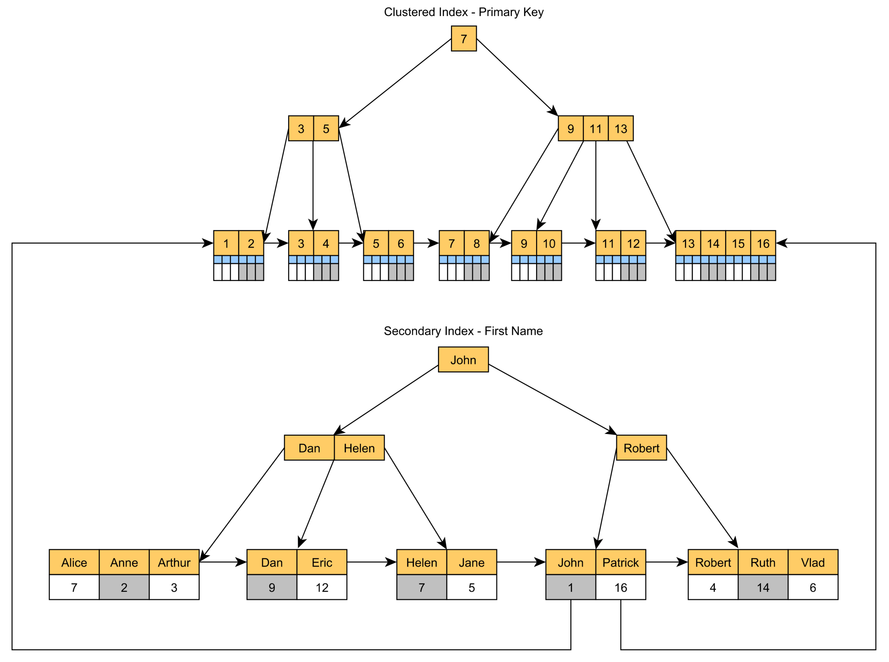

## References
- [The best UUID type for a database Primary Key](https://vladmihalcea.com/uuid-database-primary-key/)
- [NanoId vs UUID](https://blog.bitsrc.io/why-is-nanoid-replacing-uuid-1b5100e62ed2)
- [Ace the System Design Interview — Distributed ID Generator](https://towardsdatascience.com/ace-the-system-design-interview-distributed-id-generator-c65c6b568027)
- [Stop Using UUIDs in Your Database](https://levelup.gitconnected.com/stop-using-uuids-in-your-database-aae9d5d47549)

## Replica set and Sharded cluster
- Replica set: **Read heavy**
- Sharded cluster: **Write/Read and write heavy**

===
===

### [Sharding là gì? – Cách Instagram tạo ID trong database của họ bằng Sharding](https://topdev.vn/blog/sharding-la-gi/)
Đối với những hệ thống nhỏ chỉ cần 1 Database thì chắc chẳng mấy ai quan tâm đến việc tạo ra ID cho bản ghi. Vì dùng auto increment trong MySQL là có thể làm được rồi, chẳng cần phải làm gì thêm.

Thế nhưng với dữ liệu càng ngày càng to ra thì hệ thống chỉ có 1 database duy nhất có thể sẽ không thể đáp ứng được. Bởi vì traffic đang tập trung hết vào database đó.

Để giải quyết bài toán đó thì người ta đã tách database ra thành nhiều database khác nhau, và mỗi database đó sẽ chứa 1 phần dữ liệu. Ví dụ db01 chứa thông tin user từ 1 đến 1000, db02 chứa thông tin user từ 1001 đến 2000 chẳng hạn. Và khi query sẽ tìm xem user thuộc database nào và thực hiện truy vấn.

Và kĩ thuật này người ta gọi là sharding.

Thế nhưng có vấn đề xảy ra ở đây là làm thế nào sinh ra ID cho user mà không bị trùng lặp giữa các database đó? Dùng auto increment mặc định của database có giải quyết được không? Làm thế nào để từ 2 ID có thể phán đoán cái nào được sinh ra trước, cái nào được sinh ra sau?

## UUID
- [UUID can have your own format, **you can split it in 4 numbers and each one of them represent something else, for example if you group the users from 20 websites, the first number can represent the application**](https://coder.today/tech/2017-10-04_software-engineerfrom-monolith-to-cloud-auto-increment-to-uuid/)

====

## [UUID cho cách mạng 4.0](https://huydx.com/post/178413348064/uuid-cho-c%C3%A1ch-m%E1%BA%A1ng-40)

Một ngày đẹp trời, bạn quyết định viết một dịch vụ web dự định sẽ làm thay đổi cả thế giới. Dịch vụ của bạn sẽ kết nối tất cả các thiết bị di động trên thế giới lại thành một mạng lưới khổng lồ nói chuyện với nhau. Tất nhiên, bạn không muốn mạng lưới đó chạy trên blockchain, bạn muốn kiểm soát mọi thứ. Vì vậy mà bạn quyết định lưu toàn bộ dữ liệu về các thiết bị trên cơ sở dữ liệu của bạn. Code băng băng prototype, bất giác bạn băn khoan về việc làm thế nào để lưu ID cho mỗi thiết bị đó, và nhận ra việc, thiết kế một hoàn hảo là không hề dễ dàng.

Đầu tiên bạn nghĩ là sẽ lưu ID mỗi thiết bị dưới dạng tuần tự, đơn giản là 1, 2, 3, .. , N. Việc dùng ID tuần tự có những điểm lợi như, dễ lưu, ai đọc cũng hiểu (human readable), cũng như có thể sắp xếp được theo thời gian tạo (sortable). Việc sortable rất có lợi khi bạn có thêm thông tin mà không phải làm gì, vì vậy bạn có thể hiển thị bảng list thiết bị, mà không cần phải lấy thêm bảng timestamp từ cơ sở dữ liệu, tiết kiệm được khơ khớ công sức.

Tuy nhiên việc dùng id tuần tự lại có rất nhiều điểm trừ:

-   Trạng thái tuần tự là một trạng thái tập trung, bởi vậy bắt buộc phải có một chiếc máy làm nhiệm vụ lưu trạng thái, cũng như trả lời trạng thái, cập nhật trangj thái hiện tại (counter). Nói một cách khác, bạn không thể sinh id trên nhiều máy khác nhau, hay chính là “không scale"
-   ID tuần tự sẽ “tiết lộ” cho người ngoài rằng bạn có bao nhiêu thiết bị trên dịch vụ của bạn. Giả sử bạn có một api là /deviceId/:id/detail, thì người ngoài sẽ dễ dàng lần mò ra thông tin thiết bị không phải của họ (tạm bỏ qua yếu tố bảo mật ở đây)

Vậy ID tuần tự có vẻ không tốt về nhiều mặt :-?. Bạn nghĩ rằng, vậy nên qui định rõ một số tính chất của việc sinh ID, mà bạn cho rằng là tốt:

-   Đầu tiên, ID sinh ra phải có tính ngẫu nhiên, bạn không muốn người ngoài có thể mò mẫm hệ thống của bạn giống như ID tuần tự
-   Việc sinh ID, phải nhanh, và để nó nhanh một cách ổn định, nó nên diễn ra trên nhiều máy được (sinh tuần tự không làm được việc này).
-   Càng nhỏ càng tốt, càng dễ đọc càng tốt.

Bạn chợt nghĩ ra, vậy chỉ cần cho ID ngẫu nhiên (random) là được nhỉ. Sinh chuỗi ngẫu nhiên (Random Generator) là một lĩnh vực phức tạp, tôi sẽ đi qua một chút lý thuyết đơn giản trước để làm nền tảng cho đoạn sau. Đầu tiên thử suy nghĩ trong vòng 10 giây, thế nào là ngẫu nhiên. …… (hết 10 giây) Khó phết nhỉ.

Ngẫu nhiên, một cách trực quan, có thể định nghĩa là một thứ mà chúng ta không thể đoán được qui luật. Ví dụ chuỗi tăng tuần tự 1,2,3.. N không phải là ngẫu nhiên vì nó có qui luật. Định nghĩa trên wikipedia cũng cho ta:

> Randomness is the lack of pattern or predictability in events

Tuy nhiên việc “dự đoán” ở đây cũng có thể hoàn toàn là cảm tính. Mặc dù trong toán học hay xác suất, cũng khó có thể định nghĩa một cách rõ ràng và dễ hiểu được. Khi bạn tung đồng xu, bạn tự coi việc xấp hay ngửa là ngẫu nhiên, đơn giản vì có quá nhiều thứ phức tạp có thể tác động vào việc đồng xu xấp hay ngửa, nên ngay cả máy tính cũng không thể tính toán chính xác được việc đó. Vậy những thứ “thật sự” ngẫu nhiên sẽ là những thứ bị tác động bởi nhiều yếu tố vật lý, làm cho kết quả không thể dự đoán được.

Trong khoa học máy tính, khi bạn nói: tôi muốn một chuỗi ngẫu nhiên, sẽ có 2 cách:

-   Sử dụng tính chất vật lý thật sự, để đem lại giá trị ngẫu nhiên thật sự theo như định nghĩa ở trên. Cách này chính là cách mà hệ điều hành UNIX sử dụng cho /dev/random bằng cách thu thập các nhiễu (noise) từ cacs thiết bị ngoại vi. Chính vì thế một đặc điểm mà bạn cần lưu ý khi sử dụng /dev/random là: _đây là một nguồn tài nguyên CÓ HẠN_. Quên đi đặc điểm này nhiều khi sẽ dẫn đến lỗi hệ thống mà bạn không mong muốn.
-   Sử dụng “trick”, là cho chuỗi sinh ra “nhìn có vẻ giống random”. Cách này chính là pseudorandom number generators (PRNGs). Về ý tưởng , bạn có một số X gọi là “seed”, và một công thức toán học kì diệu sẽ sinh ra X’ từ X mà nhìn khác hẳn X. Lặp lại việc này N lần (sinh X’’ từ X’)… sẽ cho chúng ta một con số kì lạ, mà bạn có thể “coi" như nó là ngẫu nhiên. Công thức toán học hay được dùng nhất chính là phép module.
    -   Xn+1 = (a \* Xn + b) % m
    -   Trong thực tế thì người ta sẽ dùng một cách phức tạp hơn một chút để có phân phối tốt hơn trong một khoảng cố định, tuy nhiên idea thì vẫn tương tự.

Quá dài dòng cho anh bạn ngẫu nhiên! Quay lại bài toán chính, sinh ID, bạn đang nghĩ tại sao lại không sinh ID một cách ngẫu nhiên thay vì tuần tự. Bingo! Bạn đã có một ý tưởng không hề tồi. Tuy nhiên khi đi vào cụ thể bạn sẽ có rất nhiều cái phải suy nghĩ. Đầu tiên, giá trị ID của bạn nên là bao nhiêu bit? Ít bit thì tốt, nhưng nó sẽ tăng khả năng ID bị trùng, điều này thì không thể xảy ra. Tuy nhiên nhiều quá thì lại .. tốn chỗ. Hãy thử làm một vài phép tính toán đơn giản, điều kiện là để xác suất 2 ID trùng nhau càng thấp càng tốt. Đây chính là bài toán sinh nhật nổi tiếng ([Birthday Problem](https://en.wikipedia.org/wiki/Birthday_problem)). Bài toán này nghĩa là, sau một hồi các ông giáo sư toán đầu mưng mủ nghiên cứu, thì các ông ấy đã có công thức là xác suất trùng ID khi ta muốn generate n ID, với không gian x (X là tổng số ID có thể có, ví dụ bạn có 16 bit thì X sẽ là 2^16), sẽ là

> P(n) ~ 1 - 2 ^ (-n^2 / 2x)

Giả sử chúng ta có không gian x là 122 bit , và chúng ta chỉ có tầm 100 triệu thiết bị, khi đó xác suất trùng ID sẽ là 9.4 \* 10^-26. Tức là nếu bạn sinh 10^25 (1 tỉ là 9 số 0, đây sẽ là 1 trăm triệu tỉ tỉ ) lần 1 triệu ID thì khả năng sẽ có một lần mà trong 100 triệu ID đó có 2 ID bị trùng. Con số này lớn hơn 78 tỉ tỉ lần khả năng bạn bị sét đánh. Khiếp nhiều chữ tỉ quá! Đây chính là idea của UUID V4 khi chúng ta có 122 bits dành cho việc cho sinh số ngẫu nhiên trong tổng số 128 bit. Chúng ta sẽ đi sâu về cái gọi là UUID ở phần dưới. Thử đọc phần cài đặt UUID V4 trên một thư viện khá nổi tiếng của golang chúng ta sẽ hiểu idea của thuật toán đơn giản là, lấy một chuỗi random sau đó set các bit cần thiết như version bit và variant bit.

Với UUID V4, cái vài điểm trừ bạn cần suy nghĩ chính là cái tôi đã nói ở trên về việc: tài nguyên để sinh số ngẫu nhiên trên máy tính (qua /dev/random) là hữu hạn. Khi nguồn tài nguyên này hết, đơn giản là việc đọc số ngẫu nhiên sẽ bị blocking, và chương trình của bạn sẽ bị “đứng hình” cho đến khi nó có trở lại. Ngoài ra một điểm trừ nữa là … nó tốn quá nhiều bit. 1 tỉ ID với 128 bit sẽ là tầm 14GB, có lẽ không là gì nếu bạn lưu trên đĩa cứng, tuy nhiên nếu bạn cần cache đống ID đó lại trên NAND memory thì 14GB cũng không phải là một con số nhỏ.

Trước khi đi tiếp về việc, liệu chúng ta có cần đến 128 bit, đi sâu một chút về cái gọi là UUID trước nhỉ. UUID là một dạng ID “dùng cho mọi thứ (universal), và độc nhất (unique)”, được qui định trong RFC4122. Tại sao lại cần một qui định thống nhất về UUID ? Theo như RFC thì chúng ta cần một chuẩn thống nhất để miêu tả mọi thứ, đủ lớn để mô tả hết, và đủ tốt để có thể tự động hoá quá trình sinh ID bởi một bên thứ 3 (completely automated).

Có nhiều biến thể của UUID, hiện tại bao gồm từ V1 đến V5. Các biến thể có đặc điểm chung là, cùng có 128 bit và biến thể nào sẽ được qui định ở vài bit đầu tiên tại octet thứ 8 (hay bit thứ 57 trở đi). Mỗi biến thể có một mục đích khác nhau nhưng về ý tưởng thì nó được chia làm 3 nhóm:

-   V1 là biến thể đầu tiên, cũng là biến thể hay được sử dụng nhất. V1 có đặc điểm là dùng các yếu tố mang tính cục bộ (local properties) như là : địa chỉ MAC của máy đang sử dụng và clock sequence (bạn có thể hiểu clock sequence giống như timestamp, nhưng lại được bổ sung một số tính toán nhằm tránh trường hợp clock bị sai). Version1, ngoài việc gúp tính “ngẫu nhiên” của chuỗi sinh ra thông qua clocksequence, còn nhằm mục đích là việc sinh chuỗi có thể diễn ra trên nhiều máy khác nhau (nhờ MAC address).
-   V2 về ý tưởng cũng tương tự V1, tuy nhiên lại có thêm 8 bit gọi là “local domain” nằm trong clock sequence. Nghe thiên hạ đồn đại local domain phục vụ cho mục đích security trên hệ thống phân tán (DCE security), cơ mà cụ thể qui định về localdomain này không ghi rõ trong RFC!!! Thế nên rất nhiều cài đặt của UUID bỏ qua V2. Các cụ đã nói, không có RFC đố mày làm nên quả không sai.
-   V3 và V5 sử dụng một khái niệm gọi là “name space”. Nôm na là bạn sẽ có thể chia ra ID cho thiết bị và ID cho người dùng khác nhau. Khác nhau ở V3 với V5 là V3 dùng MD5 để hash “name space” (ví dụ tên loại thiết bị / tên thành phố user ở) thì V5 dùng SHA1 (an toàn hơn MD5). Mặc dù ý tưởng có vẻ thú vị, nhưng bạn nghĩ, chả có lý do gì phải tách namespace cả, bạn đoán là trong thực tế chắc cũng chả có nhiều người dùng V3 hay V5.
-   V4 tôi đã nói ở trên, ý tưởng chỉ đơn thuần là 1 chuỗi ngẫu nhiên! Tuy nhiên ngẫu nhiên quá cũng có cái hại, là nó làm dữ liệu của bạn bị phân mảnh (fragmentation) trong nhiều hoàn cảnh.

Chắc bạn thấy đã quá mệt, bạn chỉ muốn sinh ID thôi mà nhiều thứ loằng ngoằng quá :-? Tuy nhiên tôi phải thông báo cho bạn một tin buồn mà sẽ không có báo chí nào nhắc đến là, nếu mới vậy bạn đã mệt thì bạn vẫn chưa sẵn sàng cho cách mạng 4.0 …

RFC4122 cung cấp cho bạn rất nhiều lựa chọn tốt. V1 giúp bạn vừa có một ID đủ tốt (không bị trùng), vừa có thể sinh trên nhiều máy khác nhau. Tuy nhiên hãy thử nhìn một ID sinh ra bởi UUID V1

> 6639aa25-de02-4d7c-86a2-01ee0e01fd73

Bạn có thấy nó dài vãi 4.0 không? Ngoài ra sử dụng V1 đòi hỏi chúng ta phải có máy tính vật lý với MAC address cố định.

Quay lại một chút cái tôi đã nói ở trên:

-   Liệu chúng ta có cần đến 128 bit???
-   Liệu có một cách nào đó mô tả ID vừa ngắn gọn, lại vừa dễ đọc, vừa dễ nhìn không??

Trong thực tế, có rất nhiều người đã nghĩ ra những cách sinh ID không theo chuẩn, nhưng lại vừa đủ để giải quyết bài toán của họ.

[Twitter SnowFlake](https://github.com/twitter-archive/snowflake) là một ví dụ. Tại twitter thì họ cần ID cho user, và quan trọng hơn là cho tweet. Tweet có một thuộc tính vô cùng cần thiết để hiển thị là tính tuần tự theo thời gian. Và tweet ID, để cho dễ đọc thì twitter nghĩ họ muốn một con số, hơn là một chuỗi kí tự dài cả cây số như UUID. Twitter Snowflake, hay còn gọi là twitter id, là 64bit unsigned integer. Chuỗi này được sinh bằng cách nhét timestamp, machine id (quản lý trung tâm thông qua zookeeper) và một chút ngẫu nhiên vào 64bit. Bằng cách nhét timestamp vào họ đã có một id mà có thể sắp xếp được. Nhờ cách dùng machine id (1,2,3..N) mà họ có thể sinh ID trên nhiều máy khác nhau, qua đó scale xử lý lên đến hàng triệu ID mỗi giây.

Một ví dụ khác là [ULID](https://github.com/ulid/spec) (Universally Unique Lexicographically Sortable Identifier). Ví dụ này khác SnowFlake ở chỗ thuật toán sinh này hướng đến số đông hơn (thay vì SnowFlake được thiết kế để phù hợp với hoàn cảnh twitter). ULID cũng có 128 bit, để dễ dàng thay thế cho UUID khi bạn đã lỡ thiết kế mất rồi. Có 2 đặc điểm khiến cho ULID đặc biệt:

-   Được nhét 48 bit timestamp vào đầu chuỗi bit, cho độ chính xác lên đến millisec
-   Thay vì sử dụng hex để encode chuỗi bit thành string như UUID, ULID sử dụng Crockford Base32, là một cách encode đơn giản hơn, và loại bỏ các kí tự dễ gây nhầm lẫn như I (nhìn giống 1) hay 0 (nhìn giống O) và chỉ dùng chữ hoa (uppercase) Cách sinh ULID vô cùng đơn giản, 48 bit đầu cho timestamp từ EPOCH, và 80 bit còn lại là … ngẫu nhiên. ULID không có yếu tố cục bộ như MAC address hay machine ID, bởi vậy sẽ không dễ dàng để sử dụng trong môi trường phân tán, nhưng chắc không phải ai cũng là twitter để phải sinh ra hàng triệu ID mỗi giây nhỉ. Ngoài ra ngay cả sử dụng ULID trên môi trường phân tán, 80 bit ngẫu nhiên cũng quá đủ tốt để cho bạn không phải lo lắng quá nhiều về việc xung đột (collision).

Phù! Có lẽ bạn đã mệt vì có quá nhiều lựa chọn. Sau khi sản phẩm của bạn ra thị trường, bạn nhận thấy bạn chỉ có nhiều nhất 100 người dùng, vì vậy bạn quyết định, sử dụng 8 bit ID ngẫu nhiên, va chỉ tốn 1 byte để lưu trong bộ nhớ, và bạn nghĩ thầm, không hiểu với 100 người dùng thì bạn sẽ làm cách mạng ra sao đây….

Tuy nhiên bạn cũng đã học cho mình được một bài học:

-   Không phải lúc nào bạn cũng cần đến những chuẩn có sẵn. UUID và các biến thể của nó cũng vậy. Bạn có thể tự chế cho mình một thuật toán sinh ID sử dụng các ý tưởng có sẵn kết hợp với nhu cầu bản thân.
-   Mỗi một thuật toán sinh ID sẽ có những điểm yếu cũng như điểm mạnh riêng. Trong bài [blog của mình](https://lemire.me/blog/2016/06/27/a-fast-alternative-to-the-modulo-reduction/), Lemire tác giả của lucene đã tìm hiểu xem các loại ID sẽ có ảnh hưởng khác nhau đến performance thế nào.

Quả thật làm cách mạng không phải dễ dàng nhỉ.

====
====

## The best UUID type for a database Primary Key

In this article, we are going to see what UUID (Universally Unique Identifier) type works best for a database column that has a Primary Key constraint.

While the standard 128-bit random UUID is a very popular choice, you’ll see that this is a terrible fit for a database Primary Key column.

### Standard UUID and database Primary Key

A universally unique identifier (UUID) is a 128-bit pseudo-random sequence that can be generated independently without the need for a single centralized system in charge of ensuring the identifier’s uniqueness.

The RFC 4122 specification defines [five standardized versions of UUID](https://en.wikipedia.org/wiki/Universally_unique_identifier#Versions), which are implemented by various database functions or programming languages.

For instance, the [`UUID()`](https://dev.mysql.com/doc/refman/5.7/en/miscellaneous-functions.html#function_uuid) MySQL function returns a version 1 UUID number.

And the Java [`UUID.randomUUID()`](https://docs.oracle.com/en/java/javase/17/docs/api/java.base/java/util/UUID.html#randomUUID()) function returns a version 4 UUID number.

For many devs, using these standard UUIDs as a database identifier is very appealing because:

-   The ids can be generated by the application. Hence no central coordination is required.
-   The chance of identifier collision is extremely low.
-   The id value being random, you can safely send it to the UI as the user would not be able to guess other identifier values and use them to see other people’s data.

But, using a random UUID as a database table Primary Key is a bad idea for multiple reasons.

First, the UUID is huge. Every single record will need 16 bytes for the database identifier, and this impacts all associated Foreign Key columns as well.

Second, the Primary Key column usually has an associated B+Tree index to speed up lookups or joins, and B+Tree indexes store data in sorted order.

However, indexing random values using B+Tree causes a lot of problems:

-   Index pages will have a very low fill factor because the values come randomly. So, a page of 8kB will end up storing just a few elements, therefore wasting a lot of space, both on the disk and in the database memory, as index pages could be cached in the Buffer Pool.
-   Because the B+Tree index needs to rebalance itself in order to maintain its equidistant tree structure, the random key values will cause more index page splits and merges as there is no pre-determined order of filling the tree structure.

If you’re using SQL Server or MySQL, then it’s even worse because the entire table is basically a [clustered index](https://vladmihalcea.com/clustered-index/).

And all these problems will affect the secondary indexes as well because they store the Primary Key value in the secondary index leaf nodes.

In fact, almost any database expert will tell you to avoid using the standard UUIDs as database table Primary Keys:

-   [Percona: UUIDs are Popular, but Bad for Performance](https://www.percona.com/blog/2019/11/22/uuids-are-popular-but-bad-for-performance-lets-discuss/)
-   [UUID or GUID as Primary Keys? Be Careful!](https://tomharrisonjr.com/uuid-or-guid-as-primary-keys-be-careful-7b2aa3dcb439)
-   [Identity Crisis: Sequence v. UUID as Primary Key](https://brandur.org/nanoglyphs/026-ids)

======
======

======
======

### TSID – Time-Sorted Unique Identifiers

If you plan to store UUID values in a Primary Key column, then you are better off using a TSID (time-sorted unique identifier).