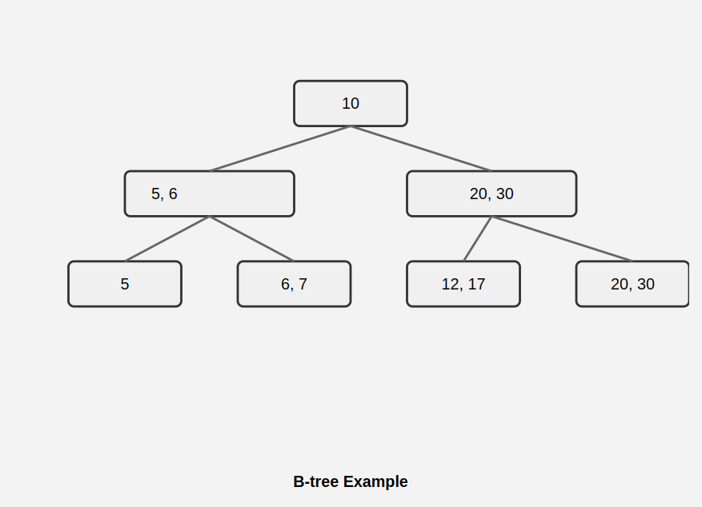
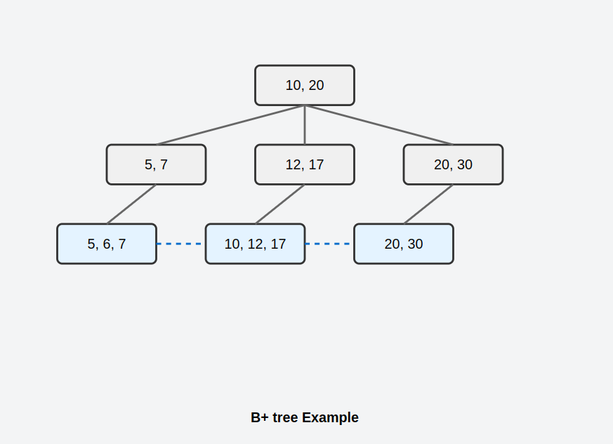

### 1. Chi tiết về cấu trúc và cơ chế của B-tree
B-tree là một cấu trúc cây cân bằng, với các đặc điểm chính là:
- **Nút nội bộ và nút lá đều có thể chứa dữ liệu:** Điều này giúp giảm chiều sâu của cây, đặc biệt hữu ích khi bạn tìm kiếm một phần tử đơn lẻ. Mỗi nút có thể chứa từ *m/2* đến *m* khóa (với *m* là bậc của cây), và có *m+1* con trỏ con trỏ, điều hướng các khóa vào đúng vị trí.
- **Tự cân bằng sau khi chèn/xóa:** Khi chèn một phần tử mới, nếu một nút đầy, nút này sẽ bị tách (split), tạo ra một nút mới. Quá trình này được thực hiện ở tất cả các cấp độ để đảm bảo chiều sâu cây không quá lớn.

#### Ví dụ minh họa:

Giả sử bạn có một B-tree với bậc 3 (m = 3), mỗi nút chứa tối đa 2 khóa. Nếu chúng ta chèn các phần tử lần lượt là: 10, 20, 5, 6, 12, 30, 7, 17.

1. **Bước 1:** Chèn 10, 20 → Nút gốc chứa [10, 20].
2. **Bước 2:** Chèn 5 → Nút gốc chứa [5, 10, 20].
3. **Bước 3:** Chèn 6 → Nút gốc bị tách thành hai nút mới: [5, 6] và [10, 20].
4. **Bước 4:** Tiếp tục chèn các phần tử khác, cây sẽ tiếp tục tự cân bằng sau mỗi lần chèn.

Khi tìm kiếm một phần tử, chẳng hạn như 12, bạn chỉ cần duyệt qua các nút theo chiều sâu tối thiểu (O(log n)).

#### **Nhược điểm khi quét dãy trong B-tree:**
Khi bạn cần quét qua một dãy các giá trị liên tiếp (ví dụ: từ 6 đến 30), phải duyệt qua nhiều nút và đi qua các nút nội bộ, làm giảm hiệu suất. Do các nút không liên kết trực tiếp với nhau, bạn phải quay lại các nút nội bộ sau mỗi lần tìm kiếm, làm tăng số lần truy cập đĩa và chi phí I/O.

Giả sử bạn muốn quét từ 6 đến 20. Quá trình sẽ như sau:
1. Tìm 6 ở nút lá bên trái.
2. Để tìm giá trị tiếp theo (7), phải quay lại nút cha.
3. Sau 7, phải quay lại nút gốc để tìm đường đến 10.
4. Tiếp tục quá trình này cho đến khi đạt đến 20.

Mỗi bước này đều yêu cầu truy cập đĩa, làm chậm quá trình quét dãy.

---

### 2. Chi tiết về cấu trúc và cơ chế của B+ tree
B+ tree là một phiên bản cải tiến của B-tree, với cấu trúc tách biệt rõ ràng hơn:
- **Nút nội bộ chỉ chứa khóa:** Các nút nội bộ không chứa dữ liệu thực sự, chỉ lưu trữ các khóa để điều hướng.
- **Dữ liệu chỉ nằm ở các nút lá:** Điều này giúp việc tìm kiếm nhanh chóng hơn vì các nút lá chứa toàn bộ dữ liệu. Tất cả các nút lá của B+ tree được liên kết với nhau bằng một danh sách liên kết kép (doubly linked list), cho phép quét tuần tự hiệu quả.

#### Ví dụ minh họa:

Với cùng dãy số (5, 6, 7, 10, 12, 17, 20, 30) được chèn vào B+ tree, các nút lá sẽ chứa các giá trị như sau:

- **Nút nội bộ:** Chỉ chứa các khóa để điều hướng (ví dụ, [10, 20]).
- **Nút lá:** [5, 6, 7] → [10, 12, 17] → [20, 30]. Các nút lá này được liên kết với nhau thông qua các con trỏ.

Khi bạn muốn quét qua các giá trị từ 6 đến 30, bạn chỉ cần đi theo các con trỏ giữa các nút lá, không cần quay lại các nút nội bộ, giảm thiểu số lần truy cập đĩa và tăng tốc độ quét dãy.

#### **Quét dãy trong B+ tree:**
Nếu bạn cần tìm tất cả các giá trị từ 6 đến 30, B+ tree thực hiện việc này cực kỳ hiệu quả nhờ vào liên kết giữa các nút lá. Một khi tìm thấy nút chứa 6, bạn có thể tiếp tục quét qua các giá trị tiếp theo mà không cần quay lại các nút nội bộ.

1. Tìm 6 trong nút lá đầu tiên [5, 6, 7].
2. Di chuyển trực tiếp đến nút lá tiếp theo [10, 12, 17] thông qua liên kết.
3. Tiếp tục đến nút lá cuối cùng [20, 30] để tìm 20.

Quá trình này đòi hỏi ít truy cập đĩa hơn nhiều so với B-tree, vì bạn chỉ cần đi theo các liên kết giữa các nút lá mà không cần quay lại các nút nội bộ.

---

### 3. So sánh hiệu suất và ứng dụng của B-tree và B+ tree

#### **Hiệu suất tìm kiếm giá trị đơn lẻ:**
- **B-tree:** Vì các nút nội bộ chứa dữ liệu, việc tìm kiếm một phần tử đơn lẻ có thể nhanh hơn trong một số trường hợp, đặc biệt khi phần tử cần tìm nằm ở nút nội bộ. Điều này giúp giảm số lần truy cập vào các nút lá.
- **B+ tree:** Vì dữ liệu chỉ nằm ở nút lá, tìm kiếm một phần tử đơn lẻ có thể phải duyệt qua nhiều nút nội bộ hơn, dẫn đến số lần truy cập đĩa cao hơn.

#### **Hiệu suất quét dãy:**
- **B-tree:** Quét dãy trong B-tree gặp khó khăn vì không có liên kết giữa các nút lá, và dữ liệu bị phân tán trong các nút nội bộ.
- **B+ tree:** Nhờ liên kết giữa các nút lá, B+ tree được tối ưu hóa cho các truy vấn dãy và quét tuần tự. Điều này rất quan trọng trong các hệ thống cơ sở dữ liệu lớn, nơi các truy vấn thường yêu cầu duyệt qua nhiều bản ghi liên tiếp.

#### **Tối ưu hóa cho cơ sở dữ liệu:**
- **B-tree:** Dữ liệu phân tán ở cả các nút nội bộ và nút lá, điều này gây ra việc khó tối ưu hóa quét tuần tự, điều quan trọng đối với cơ sở dữ liệu lớn như MySQL hoặc các file system.
- **B+ tree:** Được sử dụng rộng rãi trong các cơ sở dữ liệu như MySQL, MongoDB, và các hệ thống lưu trữ tệp như NTFS, B+ tree cung cấp hiệu suất tốt hơn cho các truy vấn quét dãy và giảm chi phí I/O.

---

### 4. Cách B+ tree giải quyết hạn chế của B-tree

#### **Tối ưu hóa cho quét tuần tự:**
Trong B-tree, quét tuần tự là một hạn chế lớn vì bạn phải liên tục quay lại các nút nội bộ. Trong B+ tree, nhờ liên kết giữa các nút lá, bạn có thể dễ dàng duyệt qua toàn bộ cây theo thứ tự mà không cần quay lại các nút nội bộ, điều này giảm thiểu số lần truy cập I/O và tăng tốc độ xử lý.

#### **Tối ưu hóa bộ nhớ và I/O:**
Trong B+ tree, các nút nội bộ chỉ chứa khóa, không chứa dữ liệu thực, giúp tăng số lượng khóa có thể lưu trữ tại mỗi tầng. Điều này giảm chiều cao của cây và giảm số lần truy cập đĩa khi tìm kiếm và chèn/xóa dữ liệu.

---

### 5. Ví dụ cụ thể về hiệu suất của B+ tree trong cơ sở dữ liệu
Giả sử bạn đang làm việc với một cơ sở dữ liệu có 1 triệu bản ghi. Bạn cần thực hiện một truy vấn tìm tất cả các bản ghi có giá trị trong khoảng từ 1000 đến 2000.

- **Với B-tree:** Bạn sẽ phải duyệt qua các nút nội bộ và sau đó quay lại nhiều lần để tìm các nút lá tương ứng. Mỗi lần truy cập nút nội bộ và nút lá đều tốn chi phí I/O.
- **Với B+ tree:** Khi đã tìm thấy nút lá chứa giá trị 1000, bạn chỉ cần đi qua các nút lá liên tiếp để quét toàn bộ các giá trị trong khoảng từ 1000 đến 2000 mà không cần quay lại các nút nội bộ, giúp giảm chi phí I/O và tăng tốc độ truy vấn.

---

### 6. Tổng kết

**B-tree** có thể nhanh hơn trong các tìm kiếm đơn lẻ nhưng gặp hạn chế lớn khi quét dãy. **B+ tree**, với khả năng liên kết giữa các nút lá và tối ưu hóa cho quét tuần tự, cung cấp hiệu suất vượt trội cho các ứng dụng yêu cầu xử lý lượng dữ liệu lớn hoặc truy vấn dãy liên tục, điển hình là trong cơ sở dữ liệu.

----

Tầm quan trọng trong hệ thống cơ sở dữ liệu lớn:
- Trong các hệ thống cơ sở dữ liệu lớn, các truy vấn thường yêu cầu quét qua nhiều bản ghi liên tiếp (ví dụ: "Tìm tất cả đơn hàng từ ngày 1/1/2023 đến 31/3/2023").
- B+ tree cho phép thực hiện các truy vấn này hiệu quả hơn nhiều so với B-tree, đặc biệt khi làm việc với lượng dữ liệu lớn.
- Giảm số lần truy cập đĩa dẫn đến cải thiện đáng kể về hiệu suất, đặc biệt quan trọng khi xử lý hàng triệu hoặc hàng tỷ bản ghi.

Đây là lý do tại sao B+ tree thường được ưa chuộng hơn trong các hệ thống quản lý cơ sở dữ liệu và hệ thống tệp, nơi hiệu suất quét dãy là một yêu cầu quan trọng.

