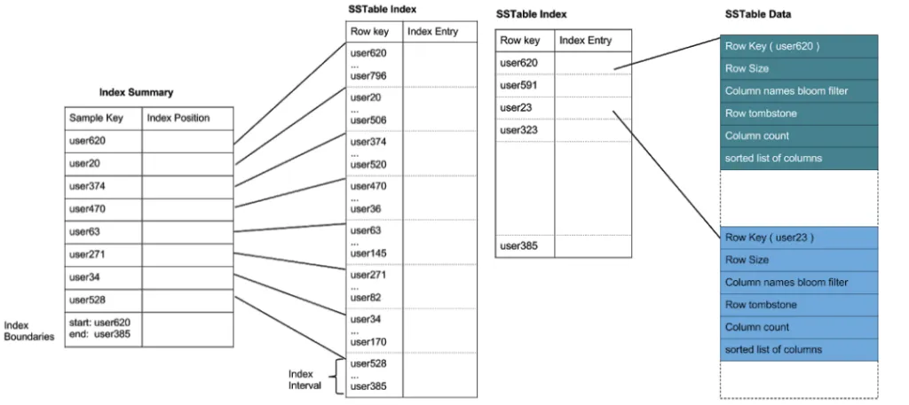
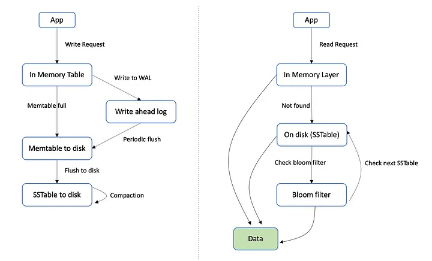

## References
- [From Log-Structured Merge-Tree storage engine to a toy database](https://careers.coccoc.com/blogs/from-log-structured-merge-tree-storage-engine-to-a-toy-database)
- [Secret Sauce Behind NoSQL: LSM Tree — System Design](https://interviewnoodle.com/secret-sauce-behind-nosql-lsm-tree-system-design-b928e81e9a25)
- [What is a LSM Tree?](https://dev.to/creativcoder/what-is-a-lsm-tree-3d75)
- [The Secret Sauce Behind NoSQL: LSM Tree](https://www.youtube.com/watch?v=I6jB0nM9SKU)
- [Log Structured Merge Tree](https://blog.devgenius.io/log-structured-merge-tree-a8733ce152b2)

====
====

> LSMTree is a data structure that allows append-only operations, that’s why it stands by its name, “Log-structured”. **The database is simply a very big log containing all the key-value pairs, and all the modifications such as create, update, and delete are treated the same — insert new records into the big log**. The design sounds very unintuitive at first look, but it brings to the table a remarkable benefit that no other engines can afford: being append-only means writes will always be sequential, maintaining high throughput, low latency, no disk seek, no write amplification (as in BTree)... Now you have a faint idea of why LSMTree is write-preferable. Let’s go on, a database is not that simple.

Yes, the initial idea behind an LSM (Log-Structured Merge) tree is quite simple and elegant. Let's break it down to its core components:

### Initial Idea of LSM Tree

1. **Log-Structured Writes**:
    - **Sequential Writes**: Instead of writing data in place (as with traditional B-trees), all writes are appended to a log. This means that every write operation (insert, update, delete) is simply added to the end of the log. This approach takes advantage of the efficiency of sequential writes, which are much faster than random writes.

2. **In-Memory Buffer**:
    - **Memtable**: Incoming writes are first written to an in-memory buffer called the memtable. This buffer is typically implemented as a sorted data structure (like a balanced tree or a skip list) to allow for fast inserts and lookups.

3. **Persistent Storage**:
    - **SSTables**: When the memtable reaches a certain size, it is flushed to disk as a Sorted String Table (SSTable). SSTables are immutable, sorted files on disk. Each SSTable contains a batch of writes that were in the memtable.

4. **Read Path**:
    - **Searching**: To read a value, the system first checks the memtable. If the value is not found in the memtable, it searches through the SSTables. Since SSTables are sorted and immutable, they can be searched efficiently.

5. **Compaction**:
    - **Merging**: Over time, multiple SSTables accumulate, which can slow down read operations. To address this, a process called compaction is used. Compaction merges multiple SSTables into a single SSTable, discarding any obsolete entries (like deleted records) and consolidating the data to maintain read performance.

### Simplified Diagram

```
Write Operation:
Client -> Memtable (In-Memory, Sorted Structure) -> SSTable (On Disk, Immutable)

Read Operation:
Client -> Memtable -> SSTables

Compaction:
Multiple SSTables -> Compaction Process -> Fewer, Larger SSTables
```

### Example

Imagine a simple key-value store using an LSM tree:

1. **Insert (key1, value1)**: Append to the memtable.
2. **Insert (key2, value2)**: Append to the memtable.
3. **Memtable Full**: Flush to disk as SSTable1.
4. **Insert (key3, value3)**: Append to the (now empty) memtable.
5. **Delete (key1)**: Append a delete marker (tombstone) to the memtable.
6. **Memtable Full Again**: Flush to disk as SSTable2.
7. **Read (key1)**: Check memtable (find tombstone, key1 deleted), then SSTables if necessary.
8. **Compaction**: Merge SSTable1 and SSTable2, removing the tombstone and any obsolete entries.

### Key Benefits

1. **High Write Throughput**: Sequential writes to the log and memtable ensure high write performance.
2. **Efficient Read Performance**: Even though multiple SSTables may need to be searched, the use of Bloom filters and sorted data structures keeps reads efficient.
3. **Compaction**: Periodic compaction ensures that the number of SSTables remains manageable, improving read performance and reclaiming storage space.

### Conclusion

The initial idea of the LSM tree is to use a log-structured approach to handle writes efficiently, leveraging an in-memory buffer (memtable) for fast writes and periodic flushing to disk as immutable, sorted tables (SSTables). This simple yet powerful concept allows for high write throughput and effective management of storage and read performance through compaction.

====
====

## Update/Delete operation

In an LSM (Log-Structured Merge) tree, updates and deletes are handled differently compared to traditional data structures due to its append-only nature. Let's go into detail about how these operations are managed.

### Update Operations

**Concept**:
- In an LSM tree, an update is treated as a new write operation rather than modifying an existing record in place.

**Process**:
1. **Write to Memtable**:
    - When an update for a key is received, it is written to the in-memory structure (memtable). The new value for the key overwrites the previous value in the memtable if it exists.
2. **Write-Ahead Log (WAL)**:
    - The update is also appended to the write-ahead log to ensure durability. This ensures that in case of a crash, the update can be recovered.
3. **Flushing to SSTable**:
    - When the memtable is flushed to disk (due to reaching its size limit), the updated key-value pair is written to a new SSTable file on disk.
4. **Compaction**:
    - During compaction, the old value of the key (if it exists in older SSTables) is discarded, and the new value is retained. This process ensures that there is only one version of the key in the resulting SSTable after compaction.

### Delete Operations

**Concept**:
- Deletes are handled by writing a special marker called a "tombstone" to indicate that the key has been deleted.

**Process**:
1. **Write to Memtable**:
    - A tombstone marker is written to the memtable for the key that needs to be deleted. This tombstone effectively marks the key as deleted.
2. **Write-Ahead Log (WAL)**:
    - The tombstone is also appended to the write-ahead log to ensure durability.
3. **Flushing to SSTable**:
    - When the memtable is flushed, the tombstone is written to a new SSTable.
4. **Read Handling**:
    - During a read operation, if a tombstone is encountered for a key, it indicates that the key has been deleted, and the key is ignored in the results.
5. **Compaction**:
    - During compaction, SSTables are merged, and any keys marked with tombstones are removed from the resulting SSTable. This process reclaims space and ensures that deleted keys do not persist indefinitely.

### Example Walkthrough

#### Update Operation Example

1. **Initial State**:
    - Key `key1` with value `value1` exists in the memtable.
    - Memtable is flushed to SSTable1: `(key1, value1)`.

2. **Update Operation**:
    - Update `key1` to `value2`.
    - Memtable now contains: `(key1, value2)`.

3. **Flushing**:
    - When the memtable is flushed, it creates SSTable2 with: `(key1, value2)`.

4. **Compaction**:
    - SSTable1: `(key1, value1)`
    - SSTable2: `(key1, value2)`
    - Compaction merges these, resulting in: `(key1, value2)` in the new SSTable.

#### Delete Operation Example

1. **Initial State**:
    - Key `key1` with value `value1` exists in the memtable.
    - Memtable is flushed to SSTable1: `(key1, value1)`.

2. **Delete Operation**:
    - Delete `key1`.
    - Memtable now contains: `Tombstone(key1)`.

3. **Flushing**:
    - When the memtable is flushed, it creates SSTable2 with: `Tombstone(key1)`.

4. **Read Operation**:
    - A read for `key1` checks the memtable first (if it's still there) and then SSTable2. The tombstone indicates `key1` is deleted, so no value is returned.

5. **Compaction**:
    - SSTable1: `(key1, value1)`
    - SSTable2: `Tombstone(key1)`
    - Compaction merges these, resulting in no entry for `key1` in the new SSTable (both the old value and the tombstone are discarded).

### Key Points

- **Updates** are new writes with the same key. The latest value is determined during reads or compaction.
- **Deletes** use tombstones to mark keys as deleted. These tombstones are processed and removed during compaction to free up space.

This approach ensures high write throughput and efficient management of updates and deletes, leveraging the strengths of the append-only and log-structured nature of LSM trees.

====
====

Yes, LSM Trees (Log-Structured Merge Trees) are indeed a fascinating and efficient way to handle high-throughput write operations in databases. They differ significantly from traditional B-trees, which makes them particularly suitable for modern workloads with heavy write demands. Here’s a deeper look into LSM Trees and how they function within a database context:

### Basic Concept of LSM Trees

**Append-Only Design**: As you've mentioned, LSM Trees employ an append-only design. Instead of updating records in place, they simply append new versions of records to a log. This means:

1. **Sequential Writes**: Since all writes are sequential, this eliminates the costly random disk I/O operations, leading to higher throughput and lower latency.
2. **No Write Amplification**: Unlike B-trees, where an update might necessitate multiple disk writes (to maintain tree balance), LSM Trees minimize this by appending data.

### Components of an LSM Tree

1. **Memtable**: This is an in-memory data structure (often a sorted tree or skip list) where incoming writes are initially stored. It ensures very fast write operations.
2. **SSTables (Sorted String Tables)**: Once the memtable reaches a certain size, it is flushed to disk as an immutable SSTable. SSTables are sorted and can be efficiently read.
3. **WAL (Write-Ahead Log)**: To ensure durability, writes are also logged to a WAL before being added to the memtable. This guarantees that data is not lost in case of a crash.

### Operations in LSM Trees

- **Write Operations**: New records are written to the WAL and memtable. When the memtable is full, it is flushed to disk as an SSTable.
- **Read Operations**: Reads first check the memtable, then any SSTables on disk. To optimize this, Bloom filters are often used to quickly check if an SSTable might contain the desired record.
- **Compaction**: Over time, multiple SSTables accumulate, which can slow down reads. Compaction is the process of merging and reorganizing SSTables to maintain read efficiency. This process consolidates SSTables and removes deleted or obsolete entries.

### Advantages of LSM Trees

1. **High Write Throughput**: Sequential writes ensure that the system can handle high write rates efficiently.
2. **Efficient Storage Management**: Compaction helps in reclaiming space by removing outdated records and merging smaller SSTables into larger ones.
3. **Scalability**: LSM Trees can handle very large datasets due to their efficient write and storage management.

### Challenges and Considerations

1. **Compaction Overhead**: While compaction improves read performance, it can introduce overhead and latency. Effective strategies and configurations are essential to balance this.
2. **Read Amplification**: While writes are efficient, reads might need to check multiple SSTables, which can introduce read amplification. Optimizations like Bloom filters and proper tuning of compaction can mitigate this.
3. **Tuning**: Proper tuning of memtable size, SSTable size, and compaction frequency is critical for optimal performance.

### Conclusion

LSM Trees provide a robust solution for databases that need to handle high write volumes efficiently. They offer unique advantages over traditional B-trees, particularly in write-heavy workloads, by leveraging sequential writes and minimizing write amplification. However, they require careful management of read operations and compaction processes to maintain overall system performance. This makes LSM Trees a powerful tool in the design of modern, high-performance databases.

====
====

## What is Sequential Writes in context of SSD?

In the context of SSDs (Solid State Drives), sequential writes refer to the process of writing data in a continuous, linear order to the storage medium. This is in contrast to random writes, where data is written to non-adjacent locations on the storage device. Sequential writes are particularly beneficial for SSDs due to their unique architecture and operational characteristics.

### Key Characteristics and Benefits of Sequential Writes on SSDs

1. **Performance**:
    - **Higher Throughput**: Sequential writes can be executed more quickly than random writes because they take advantage of the SSD’s ability to write large contiguous blocks of data efficiently.
    - **Lower Latency**: By minimizing the overhead associated with addressing multiple disparate locations on the drive, sequential writes can achieve lower latency compared to random writes.

2. **Wear-Leveling**:
    - **Prolonged Lifespan**: SSDs have a limited number of write/erase cycles per memory cell. Sequential writes can contribute to more even wear-leveling, which helps in extending the lifespan of the SSD by spreading the write/erase cycles more evenly across the storage cells.

3. **Reduced Write Amplification**:
    - **Efficiency**: Write amplification is a phenomenon where the actual amount of data written to the storage cells is greater than the amount of data intended to be written. Sequential writes reduce write amplification by minimizing the need for frequent erasure and rewriting of data blocks, thus improving the efficiency of the write process.

### How Sequential Writes Work in SSDs

- **NAND Flash Memory**: SSDs are built on NAND flash memory, which stores data in cells organized in pages and blocks. Writing data sequentially aligns well with the way NAND flash memory operates, allowing for efficient utilization of pages and blocks.
- **Garbage Collection**: SSDs periodically perform garbage collection to clean up and consolidate free space. Sequential writes can simplify garbage collection by reducing fragmentation, which in turn can enhance write performance and endurance.
- **Controller Optimization**: Modern SSD controllers are designed to optimize sequential write operations. They can buffer and write data in large chunks, further enhancing the performance of sequential writes.

### Comparison with Random Writes

- **Random Writes**:
    - Involve writing data to non-sequential addresses on the SSD.
    - Typically result in higher latency and lower throughput due to the need to manage non-contiguous data locations.
    - Increase write amplification and can lead to more frequent garbage collection cycles, thereby potentially reducing the SSD's lifespan.

### Practical Applications

- **Log-Structured Merge Trees (LSM Trees)**: As mentioned earlier, LSM Trees benefit from sequential writes because they append data in a continuous manner. This aligns well with SSDs’ strengths, leading to improved performance.
- **Database Systems**: Many modern databases optimize for sequential writes to take advantage of SSD characteristics, ensuring high write throughput and durability.
- **File Systems**: Some file systems are designed to optimize for sequential writes, especially in environments where large files are frequently written and modified.

### Conclusion

Sequential writes are a critical aspect of optimizing SSD performance and longevity. By writing data in a linear, contiguous fashion, sequential writes leverage the inherent strengths of SSD architecture, providing higher throughput, lower latency, and more efficient use of the storage medium. This makes them particularly suitable for applications and systems that require high write performance and durability.

====

## Random I/O vs Sequential I/O

Certainly! Let's delve into more detail about how LSM Trees and SSDs handle I/O operations, and why sequential writes are preferred over random writes even for SSDs.

### LSM Trees

Log-Structured Merge (LSM) Trees are a data structure designed to optimize write-intensive workloads. They work by batching multiple write operations into a single, large sequential write. This approach has several benefits:
1. **Reduction of Write Amplification**: By batching writes and writing them sequentially, LSM Trees can significantly reduce the overhead caused by write amplification.
2. **Improved Write Throughput**: Sequential writes are generally more efficient than random writes, especially on traditional HDDs, but also on SSDs to a lesser extent.
3. **Compaction**: LSM Trees periodically merge smaller, sorted runs of data into larger ones in a process called compaction. This process helps in maintaining read performance and reduces fragmentation.

### Random vs. Sequential I/O on SSDs

#### SSD Architecture
1. **Flash Memory Cells**: SSDs use NAND flash memory cells to store data. These cells are grouped into pages, which are the smallest writable units. Pages are further grouped into blocks, which are the smallest erasable units.
2. **Access Latency**: SSDs have much lower access latency compared to HDDs because they do not have moving parts. However, the performance of random writes can still be lower than sequential writes due to the internal workings of SSDs.

#### Random Writes
1. **Write Amplification**: When an SSD performs random writes, it often needs to read, modify, and rewrite entire blocks even if only a small part of the data changes. This increases write amplification.
2. **Garbage Collection**: Random writes can lead to fragmentation and the need for frequent garbage collection, where the SSD reorganizes data to consolidate free space. This process can temporarily degrade performance.
3. **Wear Leveling**: Random writes can cause uneven wear on flash memory cells, necessitating more complex wear leveling algorithms to ensure all cells are used evenly.

#### Sequential Writes
1. **Efficiency**: Sequential writes can fill entire pages and blocks more efficiently, minimizing the need for read-modify-write cycles.
2. **Garbage Collection**: Sequential writes can reduce the frequency and complexity of garbage collection because data is written in contiguous blocks, reducing fragmentation.
3. **Wear Leveling**: Sequential writes help SSDs in distributing writes more evenly across all blocks, aiding in effective wear leveling.

### How LSM Trees Leverage Sequential Writes

1. **Write Buffers (Memtables)**: LSM Trees use in-memory write buffers, called memtables, to accumulate incoming writes. Once the memtable is full, it is written to disk as a new sorted run (SSTable) in a sequential manner.
2. **Compaction**: During compaction, multiple SSTables are merged and written back to disk sequentially. This process consolidates fragmented data, making future reads more efficient and reducing the overhead of garbage collection.

### Example Workflow of LSM Trees on SSDs

1. **Initial Writes**: Writes are first stored in a memtable (in-memory structure).
2. **Flushing**: When the memtable reaches its capacity, it is flushed to disk as an SSTable in a sequential write.
3. **Compaction**: Periodically, smaller SSTables are merged into larger SSTables in a sequential process, optimizing disk usage and maintaining read performance.

### Performance Impact on SSDs

1. **Reduced Latency**: Sequential writes minimize latency by avoiding the need for frequent read-modify-write cycles and reducing the burden on garbage collection.
2. **Increased Throughput**: By transforming random writes into sequential writes, LSM Trees can sustain higher write throughput.
3. **Longevity**: Improved wear leveling and reduced write amplification help in prolonging the lifespan of SSDs.

### Conclusion

While SSDs mitigate some of the performance disparities between random and sequential I/O due to their lack of moving parts, the principles behind LSM Trees still hold significant value. By converting random writes into sequential writes, LSM Trees can enhance the performance, efficiency, and longevity of SSDs, much like they do for HDDs, albeit through different mechanisms related to flash memory management.


====

## Flow of read





Certainly! Let's break down the components of the image and illustrate the flow of a search request in an LSM tree.

### Components of the Image

1. **Index Summary**:
   - **Sample Key**: A subset of keys from the SSTable.
   - **Index Position**: The position of these sample keys in the SSTable Index.

2. **SSTable Index**:
   - **Row Key**: All keys stored in the SSTable.
   - **Index Entry**: The entries corresponding to each key, pointing to their positions in the SSTable Data.

3. **SSTable Data**:
   - **Row Key**: The actual key of the data.
   - **Row Size**: The size of the row.
   - **Column names bloom filter**: A bloom filter for column names to quickly check for the presence of columns.
   - **Row tombstone**: Marks if the row is deleted.
   - **Column count**: Number of columns.
   - **Sorted list of columns**: The actual data columns, sorted.

### Flow of a Search Request

Here is the step-by-step process of a search request using the LSM tree structure illustrated:

1. **Initiate Search**:
   - The system receives a request to find the value associated with a specific key (e.g., `user470`).

2. **Consult Index Summary**:
   - The search starts by consulting the Index Summary to narrow down the range in the SSTable Index.
   - For example, if the key is `user470`, the Index Summary shows that this key falls between `user374` and `user528`.

3. **Locate in SSTable Index**:
   - Using the range identified in the Index Summary, the search then moves to the SSTable Index to find the exact position.
   - The SSTable Index contains every key, so it locates `user470` directly.

4. **Fetch Data from SSTable Data**:
   - The Index Entry for `user470` points to its corresponding position in the SSTable Data.
   - The system fetches the row from the SSTable Data, which includes row size, bloom filter, tombstone marker, column count, and the sorted list of columns.

5. **Return Result**:
   - The system returns the data associated with `user470` to the requester.

### Example Illustration

#### Index Summary
| Sample Key | Index Position |
|------------|----------------|
| user620    | 0              |
| user374    | 5              |
| user470    | 10             |
| user63     | 15             |
| user271    | 20             |
| user528    | 25             |
| ...        | ...            |
| start: user620 end: user385 | - |

#### SSTable Index
| Row Key | Index Entry |
|---------|-------------|
| user620 | Entry 0     |
| user20  | Entry 1     |
| user796 | Entry 2     |
| user506 | Entry 3     |
| user374 | Entry 4     |
| user520 | Entry 5     |
| user470 | Entry 6     |
| ...     | ...         |
| user385 | Entry 10    |

#### SSTable Data
- **Row Key: user470**
   - Row Size: (size in bytes)
   - Column names bloom filter: (bloom filter data)
   - Row tombstone: (tombstone marker if deleted)
   - Column count: (number of columns)
   - Sorted list of columns: (actual data columns)

### Summary

- **Step 1**: Search starts with Index Summary.
- **Step 2**: Index Summary points to the range in SSTable Index.
- **Step 3**: SSTable Index locates the exact position of the key.
- **Step 4**: SSTable Data fetches the row associated with the key.
- **Step 5**: Return the result.

This process ensures efficient and fast data retrieval by leveraging the hierarchical index structure of the LSM tree.