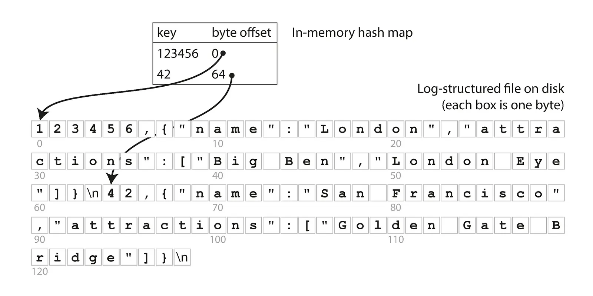
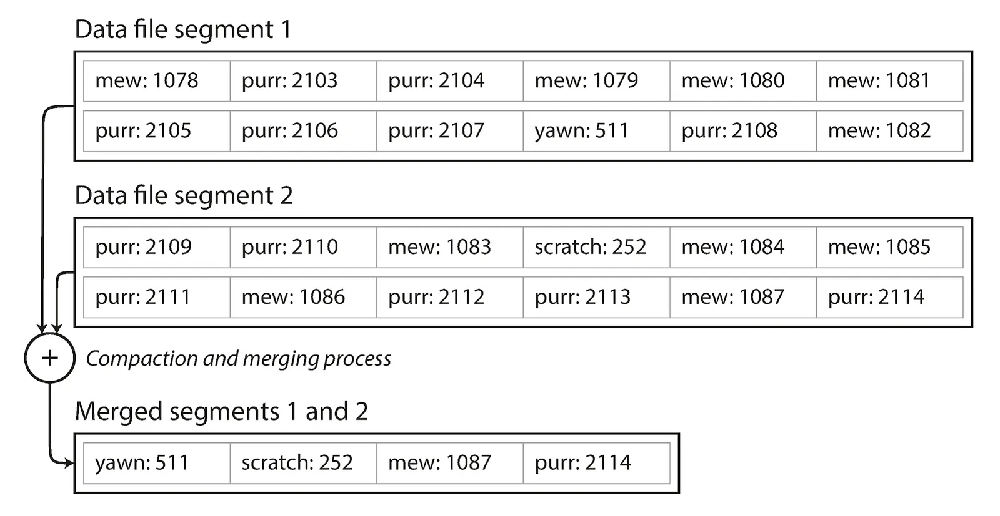
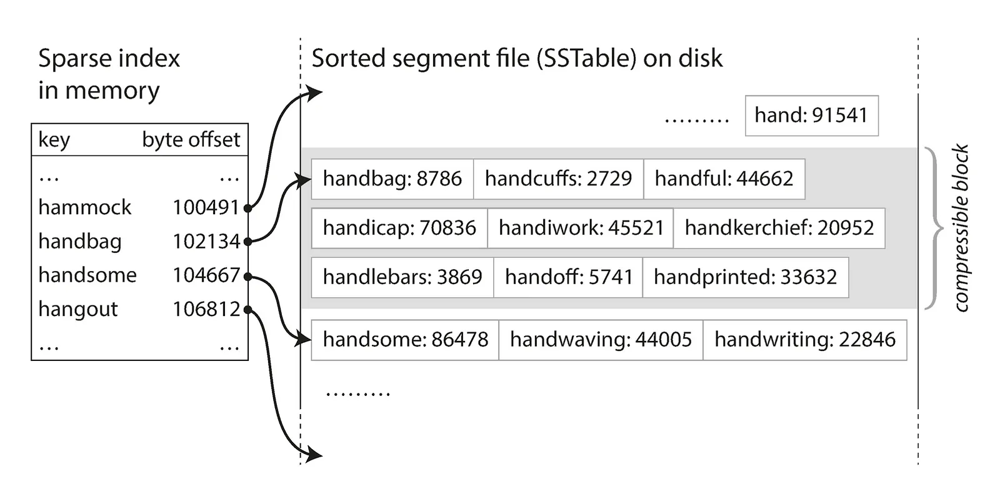
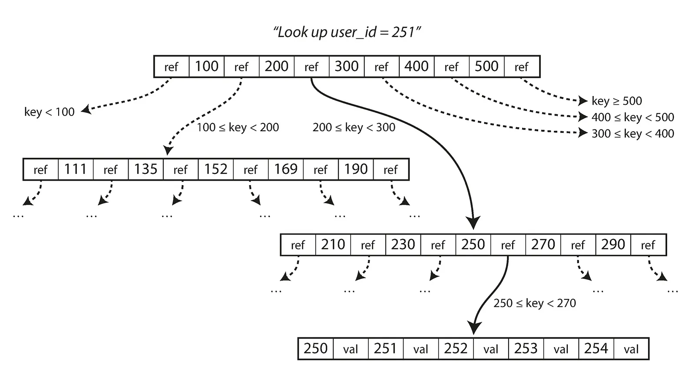
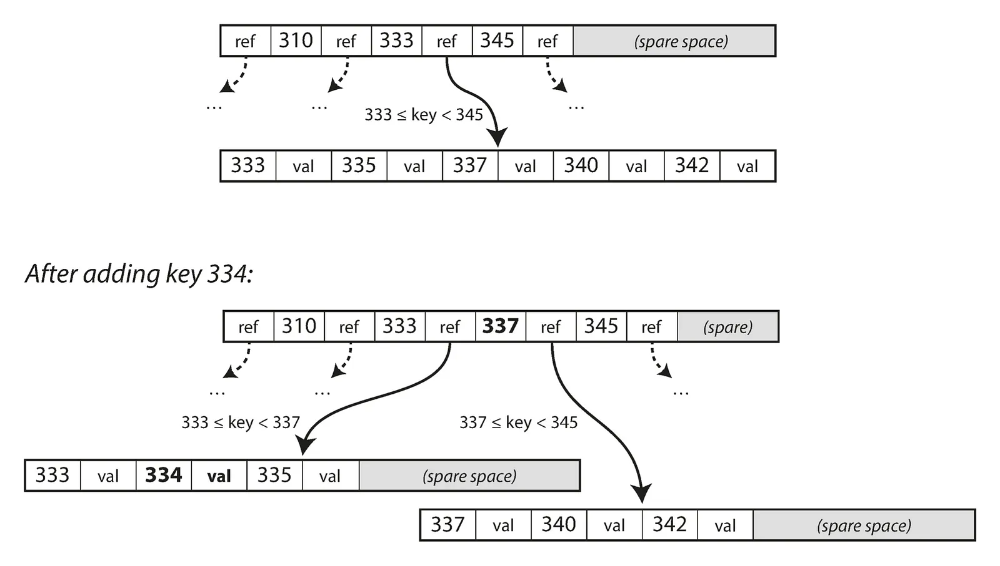
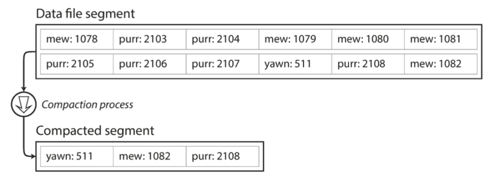
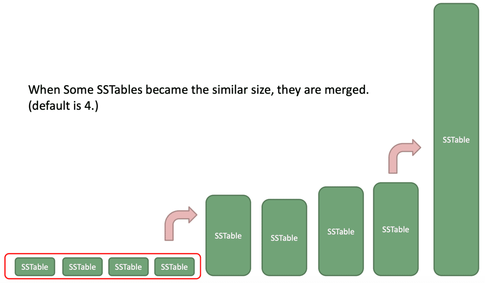
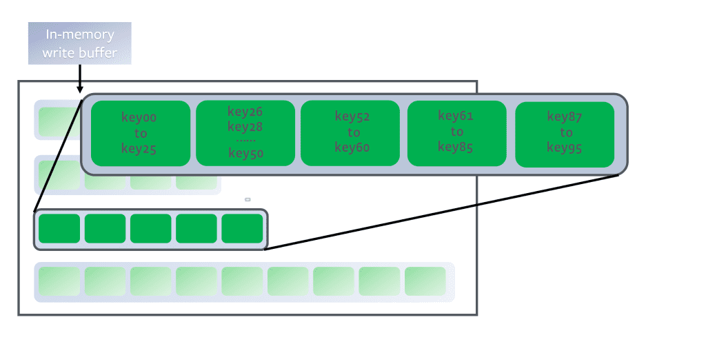
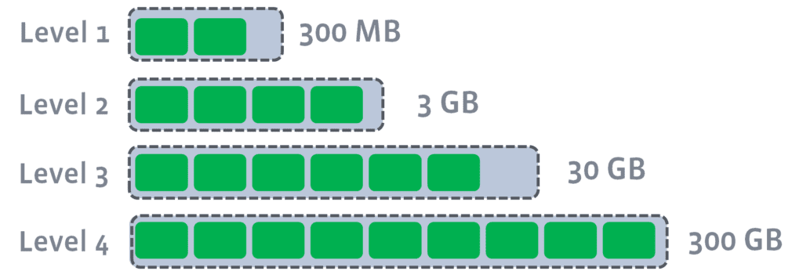
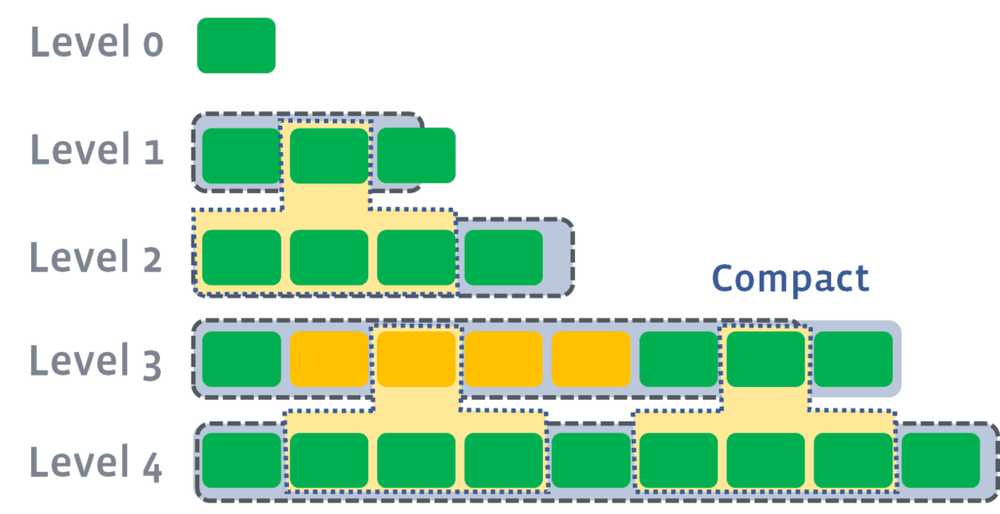

## References
- [Storage Engines: How Data is Stored](https://bigdatarepublic.nl/articles/storage-engines-how-data-is-stored/)
- [Database 101: Log Structured Storage](https://dogy.io/2020/10/12/database-101-log-structured-storage/)

====
====

## An introduction to commonly used data structures

How do modern data stores actually store their data? What are the fundamental data structures used? This blog post covers a few popular data structures and techniques used by data stores nowadays. Instead of jumping directly into discussing these data structures we'll build towards them. We start with an overly simplistic key-value data store, from here we add more complicated and optimized techniques. Each addition addresses a common issue we might encounter when building a data store from scratch. Let's dive in!

_Disclaimer: the content of this blog is an attempt to spread the gospel of "Designing Data Intensive Applications, by M. Kleppmann", specifically verse (read: chapter) 3._

## Simplest key-value data store

We can implement a simple (or rather _simplistic_) key-value data store in Bash as follows:

`#!/usr/bin/env bash`

`db_set () {   echo "$1,$2" >> datastore   }`

`db_get () {   grep "^$1," datastore | sed -e "s/^$1,//" | tail -n 1   }`

Our data store is represented by a text file, named `datastore`. The function `db_set` is used to add a key-value pair to the data store by appending a CSV style row consisting of two columns (first one being the key and the second one the value). The other function, `db_get`, we use to retrieve the latest value for a given key (if it exists).

This is how it might be used:

`$ db_set 42 '{"name": "John", "colors": ["blue", "red"]}'`

`$ db_get 42   {"name": "John", "colors": ["blue", "red"]}`

I find this example very insightful as it shows just how simple a data store can be.

In this example we’ve implemented a data store that’s more adept at writing than reading. It’s difficult to imagine a more write-optimized data store as the only operation we perform is appending to a file which is a very efficient operation. In general these types of data stores, where writes equate to appending to a file (also called a log), are referred to as log-structured.

There are of course glaring limitations that will prevent such a solution from being useful for any serious use case. However for a local, perhaps temporary, key-value store it could actually suffice in some way.

### Limitations

Two of the biggest limitations of this key-value data store can defined as follows:

1.  Searching for a key scans the whole data store, i.e. it has time complexity `O(n)`. How can we improve this?
2.  We can only _append_ entries. How do we prevent running out of disk space?

For the first limitation we can implement a form of indexing to speed up retrieval. For the second limitation we can implement a background process that periodically performs a form of garbage collection removing stale entries and reducing used disk space. Adding these processes will introduce the first bit of complexity to our simple key-value data store. In the next section we will see how these solutions work to improve retrieval and disk space pressure.

## Indexing & Compaction

Indexes used in data stores are similar to the concept of indexes we might find in a book. The overview of words and page numbers at the back of the book which can be used to quickly find the relevant pages where a particular word is mentioned.

### Hash Index

A relatively straightforward index for key-value stores is one based on the in-memory data structure hash map. Leveraging the properties of a hash map we can quickly store and retrieve metadata of the key-value entries. We use the keys in our data store as the keys of the hash map. The value assigned to each key in the hash map is the byte offset of where the particular entry can be found in the data store file on disk.

So when retrieving an entry we don’t have to scan the whole file anymore but instead we use the index to find the byte offset of the key we’d like to retrieve. When writing a new entry we now update the in-memory hash map as well as appending the entry to the file on disk.

The following image shows an overview of this index:



Source: Designing Data-Intensive Applications, M. Kleppmann. O’Reilly Media Inc., 2017

This makes retrieval by key an `O(1)` operation as we directly read the relevant bytes of an entry from disk. To make retrieval yet more efficient we could opt to store data in a binary instead of text (CSV) format.

### Merging & Compaction

To relieve disk space pressure, as a result of only appending entries to the data store, merging and compaction can be used. These processes periodically run in the background and remove stale or duplicated key entries.

To accomplish this we first split our data store file into segment files. This means that we keep appending to a segment file until it has reached a threshold size (a few MB for instance) after which it becomes immutable and entries are appended to a new segment file. Each segment file has an in-memory index and when retrieving an entry the segment files’ indexes are sequentially searched to find the key.

The merging and compaction process runs in the background reading multiple frozen segment files and merging them into a single new segment file. Any keys encountered more than once are “compacted” which means only the most recent entry will end up in the resulting new segment file. Once done the new segment file replaces the segment files read which can subsequently be removed.

The follow image shows the process:



Source: Designing Data-Intensive Applications, M. Kleppmann. O’Reilly Media Inc., 2017

This process improves the storage concerns. Of course it only really works if there are duplicate keys, if all/most keys are unique this won’t help. In that case compression and distributed storage are more relevant solutions.

To delete an entry a reserved keyword can be used, for instance using `null` as in `$ db_set 42 null`. When this keyword is encountered during merging and compaction, as the most recent key’s entry, the entry can be left out of the resulting merged segment file.

### Limitations

Firstly, the hash index has to be kept in-memory and so if there are enough unique keys in the data store we might run out of memory. Additionally, range queries, which are quite common, are not very efficient as the data isn’t stored in sorted order.

## LSM-tree

LSM-trees are part of the log-structured family of data stores. Commonly characterized by the fact they use an append-only log as their core data structure to store data.

### String Sorted Table (SSTable)

LSM-trees address some of the limitations described in the previous section. LSM-trees still use segment files but data is stored in sorted order, these types of segment files are commonly referred to as Sorted String Tables or SSTables. In addition to the data being stored in sorted order, so too are their indexes.

This has a couple of benefits:

-   Range queries are possible.
-   Merging and compaction can be done more efficiently, leveraging the merge-sort algorithm.

To alleviate memory and disk space concerns it is common to use sparse indexes and compress parts of segment files to save both memory and disk space.

The following image shows what this looks like:



Source: Designing Data-Intensive Applications, M. Kleppmann. O’Reilly Media Inc., 2017

Even if we want to retrieve an entry using a key that’s not in the index we can find it because the index and data are in sorted order and the index tells us which compressed block in the SSTable on disk to read for the key-value entry.

### Memtable

The SSTable on disk is stored in sorted order but how do we guarantee keys get stored this way in the first place, as keys are added in random order? For this purpose there are in-memory data structures that remain sorted order after addition, in the context of LSM-trees this data structure is called a memtable. One such data structure that can be used for this is a red-black tree.

The following image shows the basic structure of a red-black tree:


Example of a red-black tree.

The red-black tree is a self-balancing binary search tree. I won’t go into detail on how this works, but it’s relevant to mention that the self-balancing process makes the insertion and retrieval complexity `O(log n)`. Importantly, this means that adding a new entry is not as straightforward anymore as simply appending to a file and registering the byte offset in an in-memory hash index. However, it is still considered an efficient process.

**Adding a new entry**  
Adding a new entry now means it is initially only added to the memtable (e.g. a red-black tree). Once it reaches a certain size, a few kB generally, a new memtable is created to add new entries to. The full memtable is then written to disk as the latest SSTable and subsequently discarded.

**Retrieving an entry**  
First the memtable is searched, if the key isn’t found in there, the SSTables’ indexes are sequentially read until the key is found.

One notable optimization often implemented is a way to more quickly determine if a key is at all present in the data store without having to read _all_ segment files. Commonly a Bloom Filter is used for this which is a memory-efficient data structure for approximating the contents of a set.

### LSM-tree conclusion

So we’ve seen that LSM-trees enable us to perform range queries and improve the merging and compaction process by entries being stored in sorted order. Also we’ve seen that compressing sections of SStables and indexing only those sections can relieve memory space concerns. Finally we’ve seen that using an in-memory sorted data structure, referred to as a memtable, is used to make sure new entries are stored in sorted order.

The following are some relatively well-known data stores using LSM-tree as (part of) their implementation: Apache Casandra, Elasticsearch, Google BigTable, RocksDB.

## B-tree

It’s worth mentioning B-trees as well. B-trees have been used by storage engines since around the 1970s. It has been around as a commonly used data structure longer than LSM-trees. It also has some fundamental differences in how it stores data as we’ll see.

### Retrieving data from a B-tree

The following image shows both the structure of a B-tree and how an entry is retrieved from it.



Source: Designing Data-Intensive Applications, M. Kleppmann. O’Reilly Media Inc., 2017

A B-tree is a self-balancing tree data structure that maintains sorted data. Data stores using a B-tree store this data structure on disk. Data is split up into pages (or blocks), represented by nodes in the B-tree. A page is fixed-size, generally a few kB, and commonly has a branching factor of several hundreds.

Each page holds a range of keys with references to smaller ranges, those being the tree vertices pointing to child pages. Reads and writes always happen on a per page level, meaning a whole page is loaded into memory. This design corresponds more closely to the underlying hardware of spinning disks which is also arranged in fixed-size blocks.

When retrieving an entry by key the tree is searched from the root down to the page where the key can be found.

### Adding to a B-tree

Updating a B-tree is a bit more involved. When adding a new entry first the relevant page or pages of the tree need to be located. Next, if the page where the entry should be added is full the B-tree needs to restructure itself to make space.

The following image shows this process:



Source: Designing Data-Intensive Applications, M. Kleppmann. O’Reilly Media Inc., 2017

Generally updates require a type of lock to be used on the affected pages. This blocks any other writes from taking place on these pages while the update is in progress.

The following are some relatively well-known data stores using B-tree as (part of) their implementation: PostgreSQL, MySQL, SQLite, Microsoft SQL Server.

## LSM-tree vs B-tree

B-tree implementations are generally more mature than LSM-tree implementations. As a rule of thumb, LSM-trees are typically faster for writes, whereas B-trees are thought to be faster for reads.

Reads are typically slower on LSM-trees because they have to check several different data structures and SSTables at different stages of compaction. Reads are faster on B-trees because there’s only a single data structure where all entries are stored.

Writes are faster on LSM-trees because entries need only be added to the memtable. Writes are slower on B-trees because of the potential tree balancing and page locking that happens.

Deciding which type of storage engine to use is generally more involved than following the rule of thumb. Performing tests using your particular workload is required to make an informed decision.

## Conclusion

The main aim of this article has been to shine a light on a couple popular data structures used by row-oriented data stores nowadays. The storage data structures discussed are log-structured (represented by the LSM-tree) and B-tree based data stores. Personally, working as a data engineer, gaining a deeper understanding of the underlying data structures of some of the more widely-used storage engines has been very helpful and hopefully it can be for you as well.

=====
=====

## Database 101: Log Structured Storage

Log Structured Storage là trường phái Database dựa trên Append-only Log, tức là dữ liệu được ghi lưu lại dưới dạng log, chỉ có ghi xuống cuối file chứ không thể ghi đè. Chỉ mới được phổ biến gần đây, tuy nhiên xét về sự đơn giản (mà vẫn hiệu quả) thì nó xứng đáng được nằm trong chương đầu của bất kỳ giáo án sách nào viết về Database 🙂

Để minh họa cho trường phái Log Structured Storage, ta sẽ bắt đầu với 1 Database Key-Value Store đơn giản nhất trên đời này, được tạo bởi 2 hàm bash rất ngắn sau:

```
#!/bin/bash
db_set () {
    echo "$1,$2" &gt;&gt; database
}

db_get () {
    grep "^$1," database | sed -e "s/^$1,//" | tail -n 1
}
```

Để lưu thì ta gọi hàm `db_set key value` và dùng hàm `db_get key` để lấy lại giá trị gần nhất mà mình đã insert vào key tương ứng:

```
$ db_set 123456 '{"name":"London","attractions":["Big Ben","London Eye"]}' 

$ db_set 42 '{"name":"San Francisco","attractions":["Golden Gate Bridge"]}'

$ db_get 42
{"name":"San Francisco","attractions":["Golden Gate Bridge"]}
```

Dữ liệu được lưu trong 1 file text với định dạng khá giống với format csv, bỏ qua các yếu tố lặt vặt khác như escape ký tự,… Mỗi dòng gồm key và value, được cách nhau bởi dấu phẩy. Mọi lần gọi hàm `db_set` sẽ append thêm dòng mới vào cuối file, do đó nếu ta update giá trị của 1 bản ghi, thì phiên bản cũ của nó sẽ không bị ghi đè lên -> Khi lấy ra, cần lọc bỏ và giữ lại giá trị cuối cùng (`tail -n 1`).

```
$ db_set 42 '{"name":"San Francisco","attractions":["Exploratorium"]}' 

$ db_get 42
{"name":"San Francisco","attractions":["Exploratorium"]}

$ cat database
123456,{"name":"London","attractions":["Big Ben","London Eye"]} 
42,{"name":"San Francisco","attractions":["Golden Gate Bridge"]} 
42,{"name":"San Francisco","attractions":["Exploratorium"]}
```

Dù trông đơn giản, hàm `db_set` của chúng ta lại đạt hiệu suất khá là tốt, bởi vì việc append vào cuối file thực sự rất hiệu quả. Tương tự với cách thức của hàm `db_set`, rất nhiều database đang sử dụng log (1 loại file text chỉ có thể append vào cuối).

Database trong thực tế còn phải quan tâm tới rất nhiều thứ khác (quản lý bất đồng bộ, thu hồi bộ nhớ, xử lý lỗi), nhưng nguyên tắc cơ bản thì giống nhau.

Nhưng ngược lại, hàm `db_get` lại có hiệu suất rất là tệ nếu như mình có 1 lượng record cực lớn. Mỗi lần tìm kiếm 1 key nào đó, `db_get` cần phải scan toàn bộ file database từ đầu tới cuối. Chi phí của việc tìm kiếm đó là O(n)… Quá tệ!

Để tìm kiếm hiệu quả hơn, chúng ta cần 1 cấu trúc dữ liệu khác tốt hơn: index. Index là 1 cấu trúc bổ sung cho dữ liệu chính. Nhiều database hiện nay còn cho phép tạo và xóa index dễ dàng, mà không ảnh hưởng tới nội dung bên trong của database.

Sử dụng Index giúp cải thiện hiệu suất cho câu truy vấn, tuy nhiên càng nhiều Index sẽ càng làm chậm việc ghi dữ liệu (Write). Mỗi lần data được ghi vào, thì index cũng cần phải được cập nhật lại. Chính vì lý do này, một số database thường không sử dụng index ngay mặc định, mà chúng ta phải tự tạo chúng bằng tay (dựa theo nhu cầu của ứng dụng).

Ở những phần tiếp, ta sẽ điểm qua 1 số loại Index hay được dùng cho kiến trúc Log Structured Storage.

-----

## Database 102: Hash Index

Ta sẽ tiếp tục cải tiến từ cấu trúc log file của bài trước ([Database 101: Log Structured Storage](https://dogy.io/2020/10/12/database-101-log-structured-storage/)). Ý tưởng lần này bắt nguồn từ sự tương đồng giữa Key-Value Store và cấu trúc dữ liệu HashMap (Hash Table) – thường đã có sẵn trong hầu hết các ngôn ngữ lập trình hiện nay. Ta sẽ tận dụng HashMap để lưu index cho dữ liệu trên disk vào trong RAM.

Nhớ lại từ phần trước, dữ liệu ở trong disk được lưu nối tiếp nhau trong 1 file, và được ngăn cách nhau bởi ký tự xuống dòng. Hạn chế của việc này đó là khi truy vấn, ta sẽ phải quét toàn bộ file từ đầu tới cuối, rồi chọn ra line cuối cùng trong các kết quả tìm được.

Giải pháp đơn giản cho vấn đề này đó là: lưu 1 HashMap ở trong RAM, trong đó mỗi key sẽ ánh xạ tới offset trong file log – nơi mà giá trị đang được lưu trữ (minh họa như trong hình bên dưới). Khi bạn lưu 1 cặp key-value mới vào DB, đồng thời hãy update vào HashMap giá trị của offset mà bạn vừa mới ghi (cách này dùng được cho cả trường hợp insert và update). Còn khi bạn truy vấn, sử dụng HashMap để lấy ra offset tương ứng, thực hiện seek file tới vị trí đó và đọc giá trị.


Nguồn: Designing Data-Intensive Applications

Cách này vô cùng đơn giản, nhưng cũng là 1 hướng tiếp cận khả thi. Thực tế, đây chính là cách mà Bitcask (storage engine mặc định của Riak) đang làm. Bitcask cho phép đọc-ghi với hiệu suất cao, điểm trừ đó là index bị giới hạn bởi dung lượng RAM. Dữ liệu trong DB được load trực tiếp từ disk thông qua việc seek file nên không bị ảnh hưởng bởi kích thước bộ nhớ. Chưa kể, filesystem cũng có cơ chế cache, nên nhiều khi ta còn chẳng cần phải đụng tới thao tác disk IO để đọc dữ liệu.

Storage engine như Bitcask phù hợp với những bài toán mà giá trị được cập nhật liên tục. Chẳng hạn, Key là URL của 1 video, và Value là số lượng lượt xem (tăng dần mỗi khi có người nhấn vào play video). Tổng quát hơn thì Hash Index phù hợp với bài toán mà có rất nhiều lượt ghi vào DB, tuy nhiên số lượng Key là không nhiều (đủ để chứa được trong bộ nhớ).

Nếu ta tính xa hơn, sẽ nhận ra rằng DB của mình chỉ toàn append vào file log mà không có xóa bớt đi, vậy cuối cùng rồi nó sẽ bị đầy dung lượng disk mất sao? 1 phương án rất hay đó là dừng việc ghi file log hiện tại khi nó đã đạt tới 1 ngưỡng kích thước nhất định, và tiếp tục ghi sang 1 file log mới. Sẽ có 1 tiến trình ngầm gọi là _**compaction**_, chuyên định kỳ quét các phần log (segment) cũ, loại bỏ các giá trị Key trùng lặp và giữ lại giá trị gần nhất.



Minh họa: Số lượng lượt xem của video

Segment không bị sửa đổi trong quá trình compact, nó vẫn được sử dụng để phục vụ cho việc truy vấn của DB. Kết quả của quá trình compact sẽ được ghi ra 1 file mới (merged segment). Tới khi hoàn thành, DB chuyển hướng read request từ đọc segment cũ sang đọc merged segment, lúc này ta có thể xóa các segment đã được compact kia đi. Quá trình compact có thể xử lý cùng lúc 1 hoặc nhiều segment, như hình bên dưới:


Merge cùng lúc 2 segment

Chú ý: mỗi segment có 1 HashMap của riêng nó, ánh xạ từ key tới offset của segment. Để tìm giá trị của Key trong DB, ta kiểm tra lần lượt từ HashMap của segment gần đây trước: nếu Key không tồn tại trong HashMap, ta tiếp tục kiểm tra tới segment cũ hơn tiếp theo,… Vì quá trình compaction sẽ luôn cố giữ số lượng segment ít nhất có thể, nên yên tâm rằng DB sẽ không cần phải kiểm tra quá nhiều HashMap.

Phía trên là ý tưởng cơ bản của Hash Index, trong thực tế để có thể chạy được thì ta còn phải chau chuốt rất nhiều chi tiết nhỏ nhặt khác, dưới đây sẽ liệt kê 1 số vấn đề đáng chú ý:

-   File format: CSV không phải là format tốt dành cho log. Nó sẽ nhanh hơn và đơn giản hơn nếu dữ liệu được lưu dưới dạng binary, trong đó những byte đầu dùng để lưu kích thước của data được ghi, phía sau là giá trị String được encode dưới dạng mảng byte (không cần escape ký tự như CSV).
-   Xóa: Nếu bạn cần xóa 1 Key, ta append vào file log 1 giá trị đặc biệt được quy ước để **_đánh dấu xóa_**.
-   Crash Recovery: Trong trường hợp DB bị restart, HashMap trong bộ nhớ sẽ bị mất. Về lý thuyết, bạn hoàn toàn có thể khôi phục lại HashMap của mỗi segment dựa vào việc quét lại từ đầu tới cuối file log segment. Tuy nhiên, việc này có thể gây tốn rất nhiều thời gian nếu kích thước của segment lớn. Bitcask giải quyết vấn đề này bằng cách lưu snapshot của HashMap vào disk, ta có thể load nó lại vào bộ nhớ 1 cách nhanh chóng.
-   Partially written record: Đây là tình trạng mà đang ghi giữa chừng thì bỗng dưng DB bị crash. Bitcask sử dụng cơ chế checksum để phát hiện các phần bị hư hỏng, và bỏ qua.
-   Kiểm soát đồng bộ (concurrency control): Cách tiếp cận thông dụng nhất đó là chỉ sử dụng 1 luồng (thread) cho việc ghi. Trong khi đó, vì data là append-only và immutable (bất biến) nên ta có thể dùng nhiều thread cho việc đọc.

### Tại sao không ghi đè lên giá trị cũ?

Việc sử dụng append-only log (AOL) nhìn qua có vẻ lãng phí, ta đã có offset của Key, vậy tại sao không ghi đè Value mới lên vị trí cũ trên Disk. Thực ra thiết kế append-only log hóa ra lại rất tốt vì những lý do sau đây:

-   Việc ghi append và compaction là các thao tác ghi tuần tự, nên nó nhanh hơn và tốn ít disk I/O hơn việc ghi ngẫu nhiên, đặc biệt là trên ổ đĩa cứng từ tính thông thường (trong đó có HDD). Lý do liên quan tới việc con trỏ phải quét từ vị trí ngẫu nhiên này sang vị trí ngẫu nhiên khác sẽ tốn kém thời gian hơn là chỉ cần nhích sang ô bên cạnh (Đọc sâu hơn thì xem link này: [https://stackoverflow.com/a/61753068/4728650](https://stackoverflow.com/a/61753068/4728650)). Việc ghi ngẫu nhiên trên ổ đĩa SSD sẽ nhanh hơn nhiều, tuy nhiên ghi tuần tự vẫn được ưa thích hơn (lý do liên quan tới thuật toán garbage collector của ổ đĩa).
-   Việc quản lý đồng bộ và crash recovery đối với append-only log là đơn giản hơn rất nhiều. Ta sẽ không cần phải quan tâm tới việc đang ghi đè lên giá trị cũ giữa chừng thì bị crash, dẫn tới “mất cả chì lẫn chài” (dữ liệu mới và cũ lẫn lộn lên nhau, không thể dịch ra được).
-   Tránh được vấn đề phân mảnh dữ liệu theo thời gian.

### Nhược điểm của Hash Index

-   Kích thước HashMap không được lớn hơn kích thước bộ nhớ, nên nó không phù hợp với bài toán cần lưu trữ rất nhiều Key.
-   Không hỗ trợ range query: Ví dụ, bạn không thể scan những bản ghi có key trong đoạn `kitty00000` – `kitty99999`, thay vào đó phải duyệt (foreach) lần lượt từng key và tìm kiếm trong HashMap.

-----

## Database 103: SSTable và LSM-Tree

### SSTable là gì?

Trước khi tiếp tục cái series về Database, ta sẽ tìm hiểu qua trước về **_Sorted String Table_**, hay còn được gọi là SSTable. Về bản chất thì nó khá giống với kiến trúc Log file được đề cập từ 2 phần trước:

-   [Database 101: Log Structured Storage](https://dogy.io/2020/10/12/database-101-log-structured-storage/)
-   [Database 102: Hash Indexes](https://dogy.io/2020/10/15/database-102-hash-indexes/)

Điểm khác biệt duy nhất đó là: mỗi key trong SSTable đều chỉ xuất hiện 1 lần duy nhất (không có chuyện trùng lặp Key), và các row được sắp xếp theo Key.

SSTable có nhiều ưu điểm lớn so với việc sử dụng Hash Index:

-   Việc merge segment SSTable là đơn giản và hiệu quả hơn. Cách triển khai của nó khá giống với thuật toán MergeSort: Ta bắt đầu bằng việc đồng thời quét bản ghi đầu tiên của từng Segment. Sau đó chọn ra Key nhỏ nhất để ghi vào Merged Segment (trong trường hợp có Key cùng có mặt trên nhiều Segment, ta chọn bản ghi gần nhất và bỏ qua giá trị trên các Segment cũ hơn).  
    Nếu bản ghi hiện tại có Key trùng với giá trị được ghi vào Merged Segment, ta quét sang bản ghi kế tiếp, và lặp lại bước bên trên.


Merge nhiều SSTable cùng 1 lúc, chỉ giữ lại giá trị gần nhất của mỗi Key

-   Để tìm 1 giá trị Key nào đó trong SSTable, ta không cần phải đánh index cho toàn bộ Key vào bộ nhớ nữa. Xem hình minh họa bên dưới để dễ hình dung: giả thiết rằng bạn đang cần tìm key `handiwork`, bạn không biết chính xác offset của nó là gì. Tuy nhiên, bạn lại biết rằng offset của key `handbag` và `handsome`, nhờ vào tính chất thứ tự được sắp xếp của SSTable nên `handiwork` sẽ nằm giữa 2 key kia.  
    Như vậy: ta sẽ seek tới offset của key `handbag`, và scan cho tới khi tìm thấy key `handiwork` hoặc `handsome`. Nếu không thấy `handiwork`, tức là nó không tồn tại trong SSTable.


Minh họa SSTable sử dụng Index “thưa”

Như vậy, ta vẫn cần in-memory index để chỉ dẫn offset tới key của SSTable, nhưng nó sẽ thưa hơn so với Hash Indexes vì chỉ cần lưu offset 1 vài key đại diện cho từng block. Mỗi block chứa đâu đó vài KB là ok, đủ để scan bên trong nó không quá tốn kém. Kiến trúc Index này còn có tên gọi là LSM-Tree Index.

-   Nén từng block thay vì nén cả file: bên cạnh việc tiết kiệm được kha khá kích thước của file SSTable, thì điều này cũng giúp giảm được kha khá băng thông disk I/O.

### Khởi tạo và duy trì SSTable bằng cách nào?

Quay trở lại với thiết kế Log-Structured Engine, ta sẽ áp dụng SSTable như nào?

Việc duy trì cấu trúc dữ liệu có thứ tự ở trên Disk là hoàn toàn có thể làm được (ví dụ như BTree Index ta sẽ tìm hiểu ở bài sau). Tuy nhiên, thực hiện điều đó ở trên memory sẽ đơn giản hơn nhiều: có thể dùng Red-Black Tree hoặc AVL Tree. 2 loại cấu trúc dữ liệu dạng cây nhị phân này đều cho phép insert key rồi đọc ra theo thứ tự đã được sắp xếp, tùy vào mục đích sử dụng thì ta sẽ xem xét sử dụng cái nào:

-   AVL có độ cân bằng tối ưu hơn so với RBTree, chính vì thế, chi phí để duy trì độ cân bằng này lớn hơn.
-   AVL truy vấn nhanh hơn, nhưng insert, delete chậm hơn. Bạn read nhiều hãy chọn AVL Tree, bạn insert, delete nhiều, hãy chọn Red-Black Tree.
-   Red-Black Tree được Java chọn để implement TreeMap.

Luồng xử lý của chúng ta sẽ thay đổi thành như sau:

-   Khi có request ghi mới, ta cập nhật nó vào trong 1 cây nhị phân in-memory (thường là Red-Black Tree), còn được gọi là memtable.
-   Khi memtable trở nên lớn hơn ngưỡng kích thước cho trước, ta sẽ lưu nó xuống Disk dưới định dạng SSTable và tạo LSM-Tree Index đi kèm. Việc này có thể thực hiện dễ dàng, vì cây nhị phân vốn đã hỗ trợ cho việc duyệt từ giá trị nhỏ nhất tới lớn nhất rồi. SSTable mới được tạo sẽ trở thành segment gần đây nhất của DB, trong lúc đó thì chương trình sẽ tiếp tục ghi ra 1 memtable mới.
-   Để tìm kiếm 1 Key trong DB, đầu tiên ta tìm trong memtable hiện tại, nếu không thấy thì tìm tới segment gần đây nhất, cho tới các segment cũ hơn.
-   Định kỳ theo thời gian, chạy 1 tiến trình compaction để gom các file segment và lọc bỏ đi các giá trị đã bị xóa/ghi đè.

Yếu điểm duy nhất của cách làm trên đó là: nếu DB bị crash, những giá trị gần nhất nằm trong memtable sẽ bị mất. Để giải quyết vấn đề đó, ta ghi vào append-only log trên disk, giống như bài trước. Mỗi memtable sẽ có file log riêng, nó được lưu theo thứ tự insert, thay vì được sắp xếp theo key, nhưng không sao cả, vì nó chỉ dùng cho mục đích khôi phục DB mà thôi. Ngay khi memtable được ghi xuống SSTable, ta có thể xóa file log cũ đi.

### Ứng dụng thực tế:

Kiến trúc LSM-Tree Index này lần đầu được công bố bởi _Patrick O’Neil_ và cộng sự vào năm 1996 dưới cái tên **_Log-Structured Merge-Tree_**. Những storage engine dựa trên nguyên lý của LSM-Tree thường được gọi là LSM Storage Engine, có thể kể đến những cái tên rất quen thuộc sau đây:

-   **_RocksDB_**, **_LevelDB_**: 2 thư viện key-value storage rất nổi tiếng thường được dùng làm embedded DB bên trong các chương trình. LevelDB còn được dùng trong Riak như 1 sự thay thế cho Bitcask (vốn bị giới hạn bởi RAM).
-   **_Cassandra_**, **_HBase_**: cả 2 con hàng này đều được lấy cảm hứng từ paper **_BigTable_** của Google (trong đó có đề xuất tới 2 khái niệm _memtable_ và _SSTable_).
-   **_Lucene_**: được sử dụng bởi **_Elasticsearch_** và **_Solr_**, đang dùng kiến trúc tương tự với LSM-Tree. Full-text index phức tạp hơn key-value index rất nhiều, tuy nhiên cũng dựa trên ý tưởng giống nhau: dựa vào những _từ_ trong câu truy vấn search, tìm tất cả các document có đề cập tới _từ_ đó -> key là 1 _từ_ (hoặc 1 _cụm từ_), và giá trị là danh sách ID của tất cả các document có chứa nó.

### Tối ưu hiệu suất

Như thường lệ, có rất nhiều chi tiết lặt vặt cần được giải quyết khi chạy trong thực tế:

-   Thuật toán LSM-Tree sẽ bị chậm nếu như truy vấn Key không tồn tại trong DB: ta sẽ phải tìm trong memtable rồi tìm lần lượt trong từng SSTable từ mới nhất tới cũ nhất (phải scan dưới disk). Để tối ưu cho trường hợp này, ta có thể sử dụng thêm cấu trúc dữ liệu [Bloom Filter](https://dogy.io/2020/10/06/bloom-filter/) (mình có từng đề cập ở [đây](https://dogy.io/2020/10/06/bloom-filter/), mọi người có thể vào đọc tham khảo).
-   Có nhiều kiểu chiến thuật khác nhau để quyết định thứ tự và thời điểm mà các SSTable sẽ được compact và merge. Có 2 lựa chọn phổ biến nhất là size-tiered compaction và leveled compaction:
    -   LevelDB và RocksDB sử dụng leveled compaction (đúng như cái tên gọi của LevelDB)
    -   HBase sử dụng size-tiered, và Cassandra thì hỗ trợ cả 2.

#### Chiến lược size-tiered:

Tiến trình compaction sẽ được kích hoạt khi mà có đủ n SSTable kích thước tương đương nhau.



Nhược điểm của nó là kích thước dữ liệu trong disk lớn (cho tới khi được compact), và key sẽ nằm rải rác trong nhiều SSTable nếu ta liên tục sửa giá trị của nó (không thích hợp cho việc scan key range vì mỗi phần của kết quả truy vấn lại nằm ở các SSTable khác nhau).

#### Chiến lược leveled compaction:

Chia thành nhiều level, bắt đầu từ L0 (SSTable gần đây sẽ nằm ở level thấp, càng lên cao thì càng cũ). Trong cùng level thì mỗi SSTable sẽ đảm nhiệm lưu trữ dải Key nhất định, không trùng (overlap) với SSTable khác. Điều này giúp cho kích thước dữ liệu trong disk nhỏ, và truy vấn trở nên nhanh hơn vì không phải quét quá nhiều SSTable. Nếu có L tầng thì trường hợp xấu nhất chỉ phải quét L SSTable, thực tế 90% là chỉ phải quét 1 SSTable.





Ta có thể compact song song nhiều segment cùng 1 lúc (miễn là chúng không overlap lẫn nhau). Tuy nhiên tầng L0->L1 không thể compact song song được, ngoài ra nó sử dụng nhiều Disk I/O hơn và thời gian cho 1 lần compact cũng lâu hơn so với Size-tiered Compaction.



Khi sử dụng Leveled Compaction, ta phải cẩn thận với những ứng dụng write nhiều, DB sẽ không compact kịp. Chi tiết hơn thì mọi người có thể xem thêm ở [đây](https://www.bookstack.cn/read/rocksdb-en/ea2cf66a598da322.md).

### Ưu điểm:

Thuật toán LSM-Tree đã giải quyết được hết những nhược điểm lớn của Hash Index, hiện nó đang là thuật toán phổ biến nhất trong các DB sử dụng Log-Structured Engine (đa phần là các DB NoSQL). Nó vẫn chạy trơn tru kể cả khi dữ liệu trong DB đã vượt quá rất nhiều so với kích thước của bộ nhớ. Vì dữ liệu được lưu trữ 1 cách có thứ tự, ta có thể thực hiện những câu truy vấn range (bản chất là scan trong 1 khoảng key). Dữ liệu được ghi 1 cách tuần tự xuống disk nên Log-Structured nói chung và LSM-Tree nói riêng có thể đáp ứng được nhu cầu ghi cực lớn.

-------

## Database 201: B-Tree
B-Tree là 1 kiến trúc index được mô phỏng dựa trên cấu trúc dữ liệu B-Tree, nhờ đó nó cũng được thừa kế tính năng lưu trữ cặp key-value dưới dạng có thứ tự. Điều này giúp cho nó có thể đáp ứng các loại truy vấn tìm kiếm key cũng như range query.


Tuy có những ưu điểm gần giống với SSTable, B-Tree lại đi theo 1 trường phái hoàn toàn khác hẳn. Được giới thiệu lần đầu vào năm 1970, và dần dần phổ cập chỉ trong chưa đầy 10 năm sau đó, B-Tree liên tục giữ vững vị thế của mình và tới giờ vẫn đang là loại index được sử dụng rộng rãi nhất hiện nay. B-Tree cùng gắn bó và là chứng nhân lịch sử cho sự phát triển của các loại cơ sở dữ liệu quan hệ (RDMS), trải qua rất nhiều trào lưu DB khác nhau rộ lên rồi lại thoái trào. Liệu NoSQL với LSM-Tree có thoái trào giống như các trào lưu trước đó không hay sẽ lật đổ RDMS? Câu trả lời này chỉ có thời gian mới trả lời được, nhưng chắc chắn rằng nó sẽ khó có thể thay thế được B-Tree trong nhiều ngữ cảnh, đặc biệt là khi ứng dụng của bạn cần tới sự hỗ trợ của transaction.

B-Tree chia nhỏ DB thành các khối (hay còn gọi là page) với kích thước bằng nhau, thường là 4KB (đôi khi lớn hơn). Khi đọc thì ta sẽ read toàn bộ page, và tương tự lúc ghi thì mình cũng write cả page xuống disk. So với SSTables, thiết kế này tương đồng hơn với phần cứng bên dưới, vì disk cũng được sắp xếp thành các khối có kích thước cố định.

### Truy vấn tìm kiếm trong B-Tree

Mỗi page được xác định bởi địa chỉ của nó, điều này cho phép từ page này tham chiếu tới một page khác (tương tự như con trỏ địa chỉ trong ngôn ngữ lập trình, chỉ khác là nó ở trên disk thay vì nằm trong mem).


Tìm kiếm 1 key sử dụng B-Tree index

1 page sẽ được chỉ định làm gốc của B-Tree; bất kể khi nào bạn cần tìm kiếm 1 key trong index, ta đều cần phải bắt đầu từ page này. Mỗi page sẽ chứa nhiều key và cũng có thể chứa cả tham chiếu tới các page con. Mỗi page con sẽ chịu trách nhiệm cho 1 dải key nhất định, được bao ngoài bởi key đứng cạnh nó trong page cha.

Ví dụ với hình minh họa trên, ta đang tìm kiếm key 251, vì vậy ta cần tìm tới tham chiếu nằm giữa key 200 và 300. Từ tham chiếu thu được ta tiếp tục nhảy sang page con đó, và thực hiện lặp lại cho tới khi tìm được tới page lá (page chỉ chứa key, không có page con). Cuối cùng ta sẽ kết luận key 251 có tồn tại trong DB hay không, và nếu có thì giá trị của nó là gì.

Số lượng tham chiếu ở trong mỗi page được coi là 1 tham số cần điều chỉnh tùy vào nhu cầu của ứng dụng và kích thước của ổ đĩa, nó được gọi là _**branching factor**_. Ở hình bên trên branching factor là 6, còn thực tế thì nó lên tới con số hàng trăm.

### Ghi giá trị vào B-Tree


-   Update key có sẵn: tìm tới page lá có chứa key, cập nhật giá trị của page rồi ghi page lại vào vị trí cũ trên disk.
-   Insert key mới: bạn cần tìm page có dải bao trùm key mới và thêm nó vào page đó.
    -   Trong trường hợp page không còn không gian trống để cấp phát thêm key mới: page sẽ bị tách làm 2 page con và ta cập nhật tham chiếu của chúng đệ quy ngược lại lên các page cha.

Thuật toán này đảm bảo cho cây luôn được cân bằng: 1 B-Tree với N key sẽ luôn luôn có độ cao tối đa là O(logN). Hầu hết DB đều chỉ cần sử dụng tới 3-4 tầng, nhờ vậy ta sẽ không cần phải duyệt qua quá nhiều page để tìm kiếm 1 key nào đó.

> ### Thực tế: 1 cây B-Tree 4 tầng với 4KB mỗi page và branching\_factor=500 có thể lưu trữ lên tới 256TB.

### Chú ý khi sử dụng B-Tree index

Cũng như các bài trước, phía trên mới chỉ dừng lại ở nguyên lý cơ bản. Để chạy được trong môi trường thực tế, ta cần phải lưu ý và trau chuốt rất nhiều chi tiết như sau:

-   Xử lý khi bị crash: trong trường hợp crash, dữ liệu rất dễ bị hỏng (kiểu dạng như đang ghi được 1 nửa thì bị đứt).
    -   Cách khắc phục đơn giản nhất đó là trước mỗi lần ghi xuống disk, ta cần phải backup trước vào 1 append-only file. File này có tên gọi là Write Ahead Log (WAL), được sử dụng để khôi phục dữ liệu sau khi ta khởi động DB trở lại.
    -   Cách thứ 2 được 1 số loại DB sử dụng đó là copy-on-write: kết quả update của page sẽ được ghi vào 1 địa chỉ mới, thay vì ghi đè lên địa chỉ cũ. Sau đó ta cập nhật lại tham chiếu từ page cha nối tới địa chỉ mới.
-   Khi có nhiều tiến trình cùng update trên 1 page: ta cần phải có cơ chế lock để đảm bảo dữ liệu page được nhất quán.
-   Tối ưu không gian lưu trữ page bằng cách chỉ lưu dạng rút gọn của key đối với những page cha, vừa đủ để đánh dấu bao ngoài của page con. Ví dụ: `(AAAAA, BBBBB) -> (A, B).`
-   Bổ sung thêm con trỏ nối tới các page sibling, giúp tiết kiệm được chi phí truy vấn trên 1 dải key lớn, đỡ được việc phải jump qua jump lại giữa page con và page cha.

### So sánh với LSM-Tree

Như đã từng đề cập ở bài [Database 102: Hash Index](https://dogy.io/2020/10/15/database-102-hash-indexes/), B-Tree đi theo trường phái random write, nên ta có thể thấy ngay được rằng nó sẽ ghi chậm hơn so với LSM-Tree (sử dụng sequential write). Ngược lại, B-Tree lại tối ưu cho việc truy vấn hơn. Việc đọc trên LSM-Tree chậm hơn là bởi vì ta sẽ phải duyệt qua rất nhiều cấu trúc dữ liệu khác nhau và rất nhiều tầng SSTable.

#### Ưu điểm của LSM-Tree so với B-Tree

-   B-Tree phải ghi 2 lần xuống disk: 1 lần để ghi vào WAL, và 1 lần để cập nhật dữ liệu của cây (chưa kể tới việc page bị chia làm 2 vì không đủ không gian cấp phát). Điều này gây lãng phí vì thông thường ta chỉ thay đổi có một vài byte.
-   LSM-Tree sử dụng sequential write nên hiệu suất khi ghi của nó là cao hơn hẳn so với B-Tree, đặc biệt là trên các ổ đĩa từ tính (như HDD).
-   LSM-Tree nén dữ liệu tốt hơn, thông thường kích thước dữ liệu trên disk của LSM-Tree là nhỏ hơn so với B-Tree (đặc biệt là khi sử dụng Leveled Compaction). Chưa kể, B-Tree còn hay bị xảy ra hiện tượng phân đoạn trong, khi không sử dụng hết các không gian đã được cấp phát.
-   B-Tree Index tận dụng lại cơ chế đọc ghi file theo từng block của ổ đĩa (1 số tài liệu gọi là page), cho nên kích thước mỗi bản ghi sẽ chỉ gói gọn không được phép vượt quá 1 block. Mỗi khi xóa hoặc thêm/cập nhật bản ghi, B-Tree sẽ phải kiểm tra và rebalance lại chiều cao của cây (nếu cần thiết), gây tốn kém hơn LSM-Tree rất nhiều.

#### Nhược điểm của LSM-Tree so với B-Tree

-   Quá trình compaction của LSM-Tree có thể gây ảnh hưởng tới hiệu suất đọc-ghi của DB. Trong trường hợp tài nguyên có hạn, các request sẽ phải chờ đợi nhường cho tiến trình compaction hoàn thành, dẫn tới response time bị nhảy vọt lên 1 cách khó hiểu, sau đó lại trở lại bình thường. Điều này khiến cho dev của ứng dụng khó debug và lý giải được nguyên nhân.
-   Quá trình compaction tiêu tốn nhiều Disk I/O, sẽ bóp băng thông của các tiến trình ghi khác quan trọng hơn (ghi memtable xuống SSTable, log vào append-only file để khôi phục memtable nếu crash).
-   Nếu cấu hình compact không hợp lý, sẽ dẫn tới tình trạng tốc độ compaction sẽ không theo kịp với tốc độ ghi vào của dữ liệu (Xem thêm ở phần Leveled Compaction trong bài [Database 103: SSTable và LSM-Tree](https://dogy.io/2020/10/17/database-103-sstables-va-lsm-trees/)).
-   Mỗi key của B-Tree chỉ xuất hiện ở 1 nơi trong Disk, không bị phân tán ra khắp các Segment như LSM-Tree. Số lượng tầng page cũng không lớn, nên tốc độ đọc của B-Tree là nhanh hơn.
-   B-Tree phù hợp với các loại DB cần tới tính năng transaction cực mạnh: ở rất nhiều RDMS, transaction ở mức độ cô lập được thực thi bằng cách lock trên nhiều dải Key cùng 1 lúc. Điều này có thể dễ dàng làm được với B-Tree bằng cách lock trực tiếp trên page.