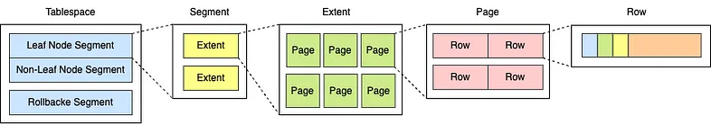

## References
- [MySQL Storage Structure](https://medium.com/@r844312/mysql-storage-structure-abbd4846e47b)

====
====



1. Tablespace:
    - Cấp cao nhất trong hệ thống lưu trữ logic.
    - Mục đích: Nhóm các đối tượng cơ sở dữ liệu liên quan.
    - Bao gồm một hoặc nhiều segment.
    - Cho phép quản lý dữ liệu ở mức cao, như phân chia dữ liệu giữa các ổ đĩa vật lý.

2. Segment:
    - Đại diện cho một đối tượng cơ sở dữ liệu cụ thể (ví dụ: bảng, chỉ mục).
    - Có ba loại được hiển thị:
      a) Leaf Node Segment: Chứa dữ liệu thực tế.
      b) Non-Leaf Node Segment: Thường dùng cho cấu trúc chỉ mục.
      c) Rollback Segment: Dùng cho quản lý giao dịch và khôi phục.
    - Mỗi segment bao gồm một hoặc nhiều extent.

3. Extent:
    - Một đơn vị cấp phát không gian liên tục.
    - Bao gồm một số lượng cố định các page liên tiếp.
    - Giúp quản lý việc cấp phát và giải phóng không gian hiệu quả.

4. Page:
    - Đơn vị cơ bản của I/O trong cơ sở dữ liệu.
    - Kích thước cố định (ví dụ: 4KB, 8KB).
    - Chứa các row dữ liệu hoặc thông tin chỉ mục.
    - Quan trọng cho việc cache và quản lý bộ nhớ.

5. Row:
    - Đơn vị nhỏ nhất, đại diện cho một bản ghi dữ liệu cụ thể.
    - Chứa trong page.
    - Cấu trúc của row phụ thuộc vào schema của bảng.

Tại sao cấu trúc này vẫn quan trọng, kể cả với SSD:

1. Quản lý logic:
    - Giúp tổ chức dữ liệu một cách có cấu trúc, dễ quản lý.
    - Hỗ trợ các tính năng như phân vùng, nén dữ liệu.

2. Hiệu quả cache:
    - Cấu trúc page vẫn quan trọng cho việc cache ở cấp độ DBMS và hệ điều hành.

3. Kiểm soát đồng thời:
    - Các cấp độ khác nhau cho phép lock ở nhiều mức, tối ưu hóa truy cập đồng thời.

4. Quản lý giao dịch:
    - Rollback segment hỗ trợ quản lý giao dịch và khôi phục dữ liệu.

5. Tính linh hoạt:
    - Cho phép DBMS hoạt động hiệu quả trên nhiều loại phương tiện lưu trữ khác nhau.

6. Tối ưu hóa hiệu suất:
    - Mặc dù SSD giảm tầm quan trọng của việc lưu trữ dữ liệu liên tục, cấu trúc này vẫn hỗ trợ các thuật toán tìm kiếm và lập chỉ mục hiệu quả.

7. Khả năng mở rộng:
    - Hỗ trợ quản lý cơ sở dữ liệu từ nhỏ đến cực lớn một cách nhất quán.

Tóm lại, mặc dù công nghệ lưu trữ như SSD đã thay đổi một số giả định về hiệu suất, cấu trúc phân cấp này vẫn cung cấp một framework linh hoạt và mạnh mẽ cho việc quản lý và tối ưu hóa cơ sở dữ liệu. Nó cho phép các DBMS thích nghi với các loại phương tiện lưu trữ khác nhau trong khi vẫn duy trì tính nhất quán và hiệu quả trong quản lý dữ liệu.

====
====

Hãy xem xét một ví dụ minh họa để so sánh cách tiếp cận truyền thống (với đầy đủ cấu trúc phân cấp) và cách tiếp cận chỉ sử dụng row + page. Chúng ta sẽ lấy ví dụ về một hệ thống quản lý thư viện đơn giản.

Giả sử hệ thống quản lý thư viện của chúng ta có:
- 1 triệu cuốn sách
- 100,000 tác giả
- 10 triệu giao dịch mượn/trả

1. Cấu trúc dữ liệu chi tiết:

a) Cách tiếp cận truyền thống:

```
Tablespace: LibraryData (100GB)
│
├── Segment: Books (50GB)
│   ├── Extent 1 (1MB)
│   │   ├── Page 1 (8KB): Book rows 1-100
│   │   ├── Page 2 (8KB): Book rows 101-200
│   │   └── ... (128 pages per extent)
│   ├── Extent 2 (1MB)
│   └── ... (Khoảng 50,000 extents)
│
├── Segment: Authors (5GB)
│   ├── Extent 1 (1MB)
│   │   ├── Page 1 (8KB): Author rows 1-80
│   │   └── ...
│   └── ... (Khoảng 5,000 extents)
│
└── Segment: Borrowings (45GB)
├── Extent 1 (1MB)
│   ├── Page 1 (8KB): Borrowing rows 1-50
│   └── ...
└── ... (Khoảng 45,000 extents)
```

b) Cách tiếp cận Row + Page:
```
Books (50GB):
├── Page 1 (8KB): Book rows 1-100
├── Page 2 (8KB): Book rows 101-200
└── ... (Khoảng 6,250,000 pages)

Authors (5GB):
├── Page 1 (8KB): Author rows 1-80
├── Page 2 (8KB): Author rows 81-160
└── ... (Khoảng 625,000 pages)

Borrowings (45GB):
├── Page 1 (8KB): Borrowing rows 1-50
├── Page 2 (8KB): Borrowing rows 51-100
└── ... (Khoảng 5,625,000 pages)
```

2. Phân tích sâu:

a) Quản lý không gian và phân bổ:

- Truyền thống:
    + Ưu điểm:
        * Dễ dàng quản lý không gian lớn thông qua extents.
        * Có thể cấp phát nhanh 1MB (1 extent) khi cần mở rộng.
        * Giảm thiểu phân mảnh bên ngoài.
    + Nhược điểm:
        * Có thể lãng phí không gian nếu extent không được sử dụng hết.
        * Overhead trong quản lý metadata của extents và segments.

- Row + Page:
    + Ưu điểm:
        * Đơn giản, không có overhead của extents và segments.
        * Linh hoạt trong việc cấp phát từng page.
    + Nhược điểm:
        * Có thể dẫn đến phân mảnh không gian khi xóa dữ liệu.
        * Khó khăn trong việc quản lý và tối ưu hóa không gian lớn.

b) Hiệu suất truy vấn:

Ví dụ truy vấn: "Tìm tất cả sách của tác giả 'J.K. Rowling' được mượn trong tháng trước"

- Truyền thống:
    + Ưu điểm:
        * Có thể sử dụng segment Authors để nhanh chóng tìm tác giả.
        * Segment Books và Borrowings có thể được quét hiệu quả theo extents.
        * Dễ dàng áp dụng các kỹ thuật như parallel scan trên các extent.
    + Nhược điểm:
        * Overhead khi chuyển đổi giữa các segment.

- Row + Page:
    + Ưu điểm:
        * Truy cập trực tiếp đến pages chứa dữ liệu cần thiết nếu có index tốt.
        * Ít overhead hơn khi không cần quản lý cấu trúc phân cấp.
    + Nhược điểm:
        * Có thể phải quét nhiều pages rời rạc nếu không có cấu trúc index phù hợp.
        * Khó áp dụng các kỹ thuật quét song song hiệu quả.

c) Caching và Buffer Management:

- Truyền thống:
    + Ưu điểm:
        * Có thể cache theo extent, hiệu quả cho truy cập tuần tự lớn.
        * Dễ dàng prefetch dữ liệu dựa trên cấu trúc extent.
    + Nhược điểm:
        * Có thể cache dữ liệu không cần thiết trong cùng extent.

- Row + Page:
    + Ưu điểm:
        * Cache chính xác từng page cần thiết.
        * Phù hợp với đặc tính random access của SSD.
    + Nhược điểm:
        * Có thể tăng số lượng I/O operations cho truy cập tuần tự lớn.

d) Concurrency Control:

- Truyền thống:
    + Ưu điểm:
        * Có thể lock ở nhiều mức: tablespace, segment, extent, page, row.
        * Giảm xung đột khi cập nhật dữ liệu ở các segment khác nhau.
    + Nhược điểm:
        * Phức tạp trong quản lý lock ở nhiều cấp độ.

- Row + Page:
    + Ưu điểm:
        * Đơn giản hóa cơ chế lock, chủ yếu ở mức page và row.
        * Phù hợp với các hệ thống có workload chủ yếu là read.
    + Nhược điểm:
        * Có thể tăng xung đột khi cập nhật đồng thời trên cùng page.

e) ACID Properties và Recovery:

- Truyền thống:
    + Ưu điểm:
        * Dễ dàng implement point-in-time recovery cho từng segment.
        * Có thể rollback transactions hiệu quả sử dụng rollback segments.
    + Nhược điểm:
        * Phức tạp trong việc duy trì tính nhất quán giữa các segment.

- Row + Page:
    + Ưu điểm:
        * Đơn giản hóa quá trình recovery, chỉ cần quan tâm đến các pages bị ảnh hưởng.
        * Có thể áp dụng kỹ thuật như ARIES (Algorithm for Recovery and Isolation Exploiting Semantics) một cách trực tiếp.
    + Nhược điểm:
        * Khó khăn trong việc thực hiện selective recovery cho một phần dữ liệu.

f) Scalability và Partitioning:

- Truyền thống:
    + Ưu điểm:
        * Dễ dàng implement horizontal partitioning bằng cách chia segments.
        * Hỗ trợ tốt cho distributed database systems.
    + Nhược điểm:
        * Có thể phức tạp trong việc cân bằng lại dữ liệu giữa các partitions.

- Row + Page:
    + Ưu điểm:
        * Linh hoạt trong việc di chuyển các pages giữa các nodes.
        * Phù hợp với các hệ thống key-value store phân tán.
    + Nhược điểm:
        * Cần phát triển cơ chế quản lý phân tán riêng cho pages.

g) Analytical Workloads:

- Truyền thống:
    + Ưu điểm:
        * Hiệu quả cho các thao tác full table scan nhờ cấu trúc extent liên tục.
        * Dễ dàng áp dụng các kỹ thuật như columnar storage trong segments.
    + Nhược điểm:
        * Có thể chậm cho các truy vấn cần join nhiều segments.

- Row + Page:
    + Ưu điểm:
        * Đơn giản hóa việc implement các kỹ thuật như in-memory analytics.
        * Phù hợp với các workload mixed OLTP/OLAP trên SSD.
    + Nhược điểm:
        * Có thể kém hiệu quả cho các thao tác scan lớn nếu không có tối ưu hóa bổ sung.

Kết luận:
Cả hai cách tiếp cận đều có ưu và nhược điểm riêng. Cấu trúc truyền thống phù hợp hơn cho các hệ thống lớn, phức tạp với nhiều loại workload khác nhau. Trong khi đó, cách tiếp cận Row + Page có thể hiệu quả hơn cho các hệ thống nhỏ hơn, đặc biệt là khi sử dụng SSD và có workload chủ yếu là random access. Việc lựa chọn phụ thuộc vào đặc thù của ứng dụng, hardware, và yêu cầu cụ thể về hiệu năng và quản lý.