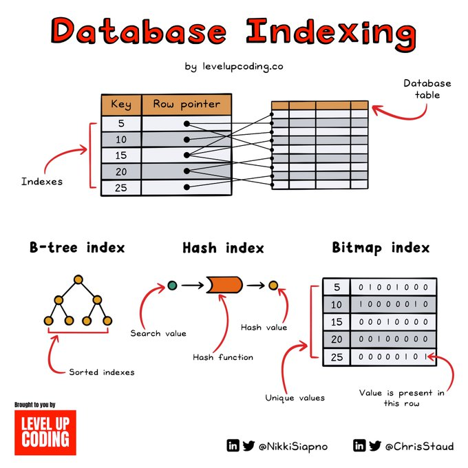

## References
- [Database Indexing Explained.](https://twitter.com/NikkiSiapno/status/1719352895169265797)
- [Indexing 101](https://dev.to/shofiya2003/indexing-101-2nbe)
- [How database indexing actually works internally?](https://www.pankajtanwar.in/blog/how-database-indexing-actually-works-internally)

## Overview

### The world with no indexes!

To find a record that satisfies a particular query a database engine does a **full table scan**, which means it checks the entire row one by one. The full table scan is called a **sequential scan**.

However, databases have a way of making this sequential search faster even without indexing. Like, **Postgres** uses **parallel sequential scan**, in which several workers together scan different range of rows in a table so that the full table scan is completed faster. 🤝

A full scan on a table with billions of records will be a nightmare!!

