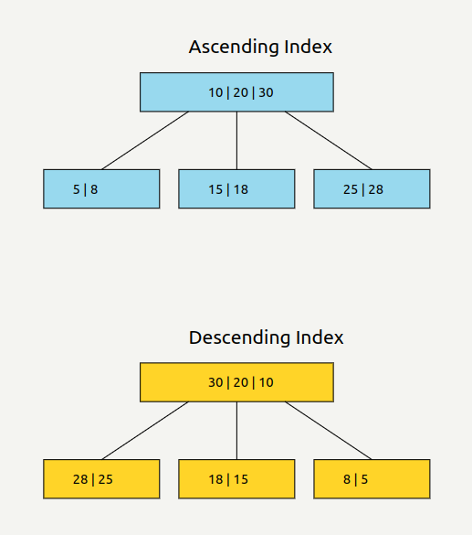

## Ascending Index vs Descending index



## 1. Cấu trúc dữ liệu B-Tree

MySQL sử dụng cấu trúc dữ liệu B-Tree cho cả ascending và descending index. B-Tree là một cây cân bằng, cho phép tìm kiếm, chèn và xóa trong thời gian logarit.

### Đặc điểm của B-Tree:
- Mỗi nút có thể chứa nhiều khóa
- Các khóa trong mỗi nút được sắp xếp
- Mỗi nút có con trỏ đến các nút con và các bản ghi dữ liệu

## 2. Lưu trữ vật lý

### Ascending Index:
- Các khóa trong mỗi nút được sắp xếp từ trái sang phải theo thứ tự tăng dần
- Ví dụ: [1, 5, 9, 13]

### Descending Index:
- Các khóa trong mỗi nút vẫn được sắp xếp từ trái sang phải, nhưng theo thứ tự giảm dần
- Ví dụ: [13, 9, 5, 1]

## 3. Quá trình tìm kiếm

### Ascending Index:
1. Bắt đầu từ nút gốc
2. So sánh giá trị cần tìm với các khóa trong nút
3. Di chuyển sang nút con phù hợp (bên trái nếu nhỏ hơn, bên phải nếu lớn hơn)
4. Lặp lại cho đến khi tìm thấy giá trị hoặc đến nút lá

### Descending Index:
- Quá trình tương tự, nhưng so sánh ngược lại
- Di chuyển sang nút con bên phải nếu giá trị cần tìm lớn hơn, bên trái nếu nhỏ hơn

## 4. Hiệu quả trong truy vấn range và sorting

### Ascending Index:
```sql
SELECT * FROM users WHERE age BETWEEN 20 AND 30 ORDER BY age ASC;
```
- MySQL có thể duyệt từ trái sang phải trên các nút lá, thu thập dữ liệu đã được sắp xếp sẵn

### Descending Index:
```sql
SELECT * FROM users WHERE age BETWEEN 20 AND 30 ORDER BY age DESC;
```
- MySQL có thể duyệt từ phải sang trái trên các nút lá, thu thập dữ liệu đã được sắp xếp giảm dần

## 5. Cơ chế đọc dữ liệu

- MySQL sử dụng page access để đọc dữ liệu từ đĩa
- Mỗi page thường chứa nhiều nút của B-Tree
- Khi duyệt index, MySQL đọc các page liên tiếp, giảm thiểu số lần truy cập đĩa

## 6. Optimizations

### Prefix Compression:
- Trong các nút không phải lá, MySQL có thể lưu trữ chỉ một phần của khóa để tiết kiệm không gian

### Bulk Loading:
- Khi tạo index cho một lượng lớn dữ liệu, MySQL sử dụng thuật toán đặc biệt để xây dựng B-Tree hiệu quả hơn

## 7. Ảnh hưởng đến Cache

- Index giúp tối ưu việc sử dụng bộ nhớ đệm
- Các page của index thường được giữ trong bộ nhớ, giảm thiểu I/O đĩa

## 8. Hiệu quả trong JOIN operations

- Index giúp tối ưu hóa các phép JOIN bằng cách giảm số lượng bản ghi cần quét
- Nested Loop Join có thể sử dụng index để tìm kiếm nhanh chóng các bản ghi khớp


Dựa trên giải thích chi tiết trong artifact trên, chúng ta có thể thấy tại sao ascending và descending index lại hiệu quả ở mức low level:

1. Cấu trúc dữ liệu tối ưu: B-Tree cho phép tìm kiếm, chèn và xóa trong thời gian logarit, rất hiệu quả cho các tập dữ liệu lớn.

2. Sắp xếp sẵn: Dữ liệu trong index đã được sắp xếp, giúp truy vấn range và sorting không cần thêm bước sắp xếp.

3. Đọc tuần tự: Khi duyệt index, MySQL có thể đọc các page liên tiếp, giảm thiểu số lần truy cập đĩa ngẫu nhiên.

4. Tối ưu bộ nhớ đệm: Index giúp sử dụng bộ nhớ đệm hiệu quả hơn, giảm I/O đĩa.

5. Hỗ trợ JOIN: Index cải thiện đáng kể hiệu suất của các phép JOIN phức tạp.

6. Linh hoạt trong truy vấn: Có cả ascending và descending index cho phép tối ưu hóa cho nhiều loại truy vấn khác nhau.

=====
=====