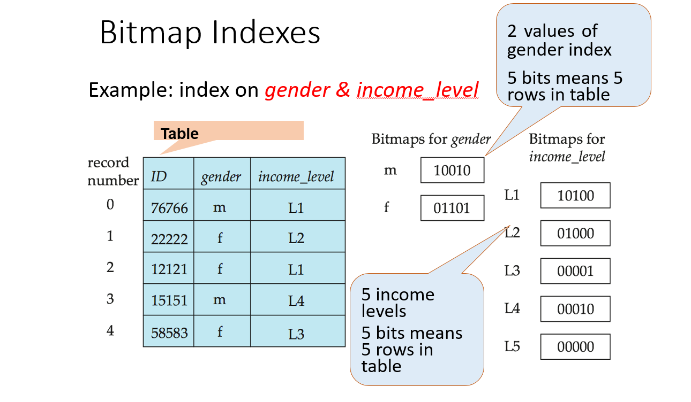
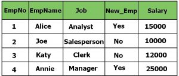
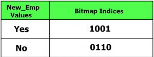
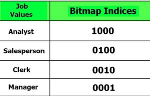
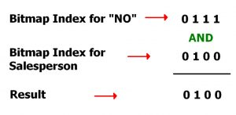

## References
- [Bitmap Indexing in DBMS](https://www.geeksforgeeks.org/bitmap-indexing-in-dbms/)
- [Insights into Bitmap Index](https://levelup.gitconnected.com/insights-into-indexing-using-bitmap-index-c28a3db1ad97)
- [003: Hiểu về Index để tăng performance với PostgreSQL P2](https://viblo.asia/p/003-hieu-ve-index-de-tang-performance-voi-postgresql-p2-m68Z049MZkG)
- [Bitmap indexes in Go: unbelievable search speed](https://medium.com/bumble-tech/bitmap-indexes-in-go-unbelievable-search-speed-bb4a6b00851)

## Overview
> Bitmap Indexing is a data indexing technique used in database management systems (DBMS) to improve the performance of read-only queries that involve large datasets. It involves creating a bitmap index, which is **a data structure that represents the _`presence`_ or _`absence`_ of data values in a table or column**.

> In a bitmap index, each distinct value in a column is assigned a bit vector that **represents the _`presence`_ or _`absence`_ of that value in each row of the table**. The bit vector contains one bit for each row in the table, where a set bit indicates the presence of the corresponding value in the row, and a cleared bit indicates the absence of the value

> A bitmap is the combination of two words: **bit** and **map**. A bit can be termed as the smallest unit of data in a computer and a map can be termed as a way of organizing things.

4 rows -> 4 bits 

Only the second bit value = 1 => Only row 2 is the matching row.

----
----

## How does bitmap index matching rows, show example with data

Bitmap indexing is a highly efficient method for querying databases, especially when the data has low cardinality (i.e., a small number of distinct values). Here's a basic explanation of how a bitmap index works, followed by an example:

### How Bitmap Index Works:
1. **Bitmap Creation**: For each distinct value of the indexed column, a bitmap (a string of bits) is created. Each bit in the bitmap corresponds to a row in the table.
2. **Bit Value**: If the row contains the value for which the bitmap was created, the corresponding bit is set to 1; otherwise, it's set to 0.
3. **Query Processing**: When a query is executed, the database engine uses these bitmaps to quickly find matching rows. Logical operations like AND, OR, and NOT are performed on these bitmaps to satisfy query conditions.

### Example:

Suppose you have a table `Employees` with two columns: `EmployeeID` and `Department`, where `Department` can have three values (HR, IT, Sales).

**Table: Employees**

| EmployeeID | Department |
|------------|------------|
| 1          | HR         |
| 2          | IT         |
| 3          | Sales      |
| 4          | HR         |
| 5          | IT         |

**Bitmap Index on `Department`:**
- Bitmap for HR: 10110
- Bitmap for IT: 01001
- Bitmap for Sales: 00100

Each position in the bitmap corresponds to a row in the table. For example, in the HR bitmap (10110), the 1st, 3rd, and 4th bits are set to 1 because the 1st, 3rd, and 4th rows in the table have 'HR' in the Department column.

**Query Example:**
Find all employees in the HR or IT department.

**Process:**
1. Retrieve the bitmaps for HR (10110) and IT (01001).
2. Perform a logical OR operation: 10110 OR 01001 = 11111.
3. The result bitmap (11111) indicates that all rows match the condition.

In this simplified example, the bitmap index allows the database to quickly identify matching rows without scanning the entire table. This method is particularly effective for columns with a limited set of values and is widely used in data warehousing and analytical systems for fast query processing.

----
----

## High cardinality problem

Let's illustrate the problem of bitmap indexes with high cardinality using a simple example. Consider a `Users` table in a database with the following structure:

- `user_id` (integer, unique)
- `country` (string, low cardinality, e.g., 'USA', 'Canada')
- `email` (string, high cardinality, unique for each user)

### Sample Data Table `Users`

| user_id | country | email                |
|---------|---------|----------------------|
| 1       | USA     | user1@example.com    |
| 2       | Canada  | user2@example.com    |
| 3       | USA     | user3@example.com    |
| 4       | USA     | user4@example.com    |
| 5       | Canada  | user5@example.com    |
| ...     | ...     | ...                  |

### Bitmap Index on `country` (Low Cardinality)

Creating a bitmap index on `country` is efficient because there are only a few distinct values (e.g., 'USA', 'Canada'). The index might look something like this:

- Bitmap for `USA`: [1, 0, 1, 1, 0, ...]
- Bitmap for `Canada`: [0, 1, 0, 0, 1, ...]

This is efficient for queries like `SELECT * FROM Users WHERE country = 'USA'`, as the database can quickly use the bitmap to find relevant rows.

### Bitmap Index on `email` (High Cardinality)

Now, consider a bitmap index on `email`, which has a unique value for each row. The index would need as many bitmaps as there are users, each bitmap almost entirely composed of 0s, except for a single 1:

- Bitmap for `user1@example.com`: [1, 0, 0, 0, 0, ...]
- Bitmap for `user2@example.com`: [0, 1, 0, 0, 0, ...]
- Bitmap for `user3@example.com`: [0, 0, 1, 0, 0, ...]
- ...and so on for each user.

### Problems with High Cardinality

1. **Space Inefficiency**: Each bitmap is as long as the number of rows, but only has one bit set to 1. This is a huge waste of space, especially as the number of unique emails (rows) grows.

2. **Maintenance Overhead**: Every time a new user is added or an email is changed, a new bitmap needs to be created or updated. This becomes increasingly inefficient as the number of unique emails grows.

3. **Performance**: Querying based on `email` with a bitmap index is not efficient. The system has to check through a large number of bitmaps, each representing a unique email, which is resource-intensive and slow compared to using a B-tree index.

4. **Concurrency Issues**: If the table is frequently updated, the constant updating of bitmaps can lead to concurrency issues and reduced performance in multi-user environments.

### Better Approach for High Cardinality

For the `email` column, a better indexing strategy would be to use a B-tree index, which is more suited for high-cardinality data. B-tree indexes maintain a balance between the depth of the tree and the number of entries per node, making them efficient for columns with a large number of unique values.

In summary, while bitmap indexes are excellent for columns with low cardinality, they become inefficient and space-consuming for columns with high cardinality, such as unique identifiers or emails.

The image above provides a visual representation of the `Users` table with columns `user_id`, `country`, and `email`. As depicted, the `country` column demonstrates low cardinality with repeated values ('USA' and 'Canada'), while the `email` column shows high cardinality, with each row having a unique email address. This visualization helps in understanding the concept of low and high cardinality in a database table.