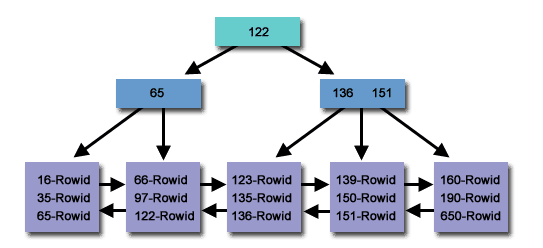
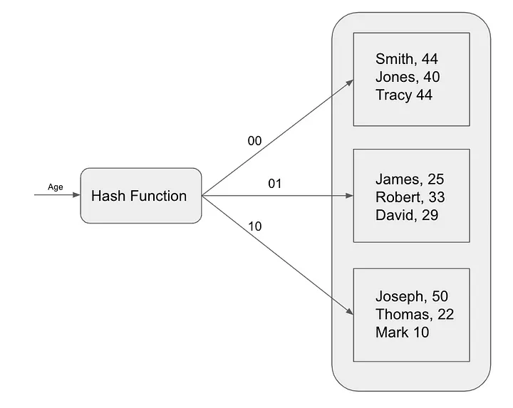

# References
- [The Power of Database Indexing Algorithms: B-Tree vs. Hash Indexing](https://dip-mazumder.medium.com/the-power-of-database-indexing-algorithms-b-tree-vs-hash-indexing-6e3a4112a81)

----
----

## [The Power of Database Indexing Algorithms: B-Tree vs. Hash Indexing](https://dip-mazumder.medium.com/the-power-of-database-indexing-algorithms-b-tree-vs-hash-indexing-6e3a4112a81)

Database indexing is a critical component of optimizing the performance of any database system. Without effective indexing, your database queries can become slow and inefficient, leading to a poor user experience and decreased productivity. In this post, we’ll explore some best practices for creating and using database indexes.

There are several indexing algorithms used in databases to improve query performance. Here are some of the most commonly used indexing algorithms:

## B-Tree Indexing:

A B-tree index is a self-balancing tree data structure that **keeps data sorted and allows searches, sequential access, insertions, and deletions in logarithmic time.** The B-tree index structure is widely used in databases and file systems. B-Tree indexing is widely used in relational databases such as MySQL and PostgreSQL.



B-tree indexes are **optimized for range queries** because they can efficiently find all records within a range of values. This is because the records are stored in sorted order in the index. Leverages to use **column comparisons** in expressions that **_use the =, >, >=, <, <=, or BETWEEN operators_**

For example, suppose we have a table of products with the following schema:

```
CREATE TABLE products (
    id INT PRIMARY KEY,
    name VARCHAR(255),
    price DECIMAL(10,2)
);
```

We can create a B-tree index on the `price` column using the following command:

```
CREATE INDEX products_price_index ON products (price);
```

## **Hash Indexing:**

Hash indexing is another popular indexing algorithm that is used to speed up queries. Hash indexes use a hash function to map keys to an index position. This indexing algorithm is **most useful for exact-match queries, such as searching for a specific record based on a primary key value**. Hash indexing is commonly used in in-memory databases such as Redis.

Hash indexes work by **mapping each record in the table to a unique bucket based on its hash value.** The hash value is calculated using a **hash function,** which is a mathematical function that takes a data item as input and **returns a unique integer value**.



To find a record in a hash index, **the database calculates the hash value of the search key and then looks up the corresponding bucket.** If the record is in the bucket, the database returns it. Otherwise, the database performs a full table scan.

Hash indexes are **very fast for lookups**, but they **cannot be used to efficiently query ranges of data**. This is because the hash function does not preserve any order between the records in the table.

To perform a query using a hash index,

1.  The **database calculates the hash value for the query condition**
2.  Looks up the corresponding **hash bucket in the hash table**.
3.  The database then **retrieves the pointers to the rows in the table** that have the corresponding hash value
4.  Uses those **pointers to retrieve the actual rows** from the table.

Suppose we have a table of products with the following schema:

```
CREATE TABLE products (
    id INT PRIMARY KEY,
    name VARCHAR(255),
    price DECIMAL(10,2)
);
```

## Q. Cases where Hash-Indexing is not optimized like B-Tree?

However, there are some scenarios where hash indexing **may not be the best choice**:

-   **Hash indexes are faster than tree indexes for lookups (for equality comparisons** that use the = or <=> operators**)**, but they **cannot be used to efficiently query ranges of data**.
-   **Tree indexes are slower than hash indexes for lookups**, but they can be used to **efficiently query ranges of data.**

**Range queries**: Hash indexes are **not optimized for range queries,** where you need to find records within a range of values(**_that use the =, >, >=, <, <=, or BETWEEN operators_**). In such cases, a **B-tree index would be more appropriate**.

**Sorting**: Hash indexes are **not optimized for sorting**, where you need to order records based on a particular column. In such cases, a **B-tree index or a clustered index** would be more appropriate.

**Large datasets**: Hash indexes **can take up a significant amount of memory,** so they may not be suitable for large datasets where memory usage is a concern.

We can create a hash index on the `name` column using the following command:

```
CREATE INDEX products_name_hash ON products (name);
SELECT * FROM products WHERE name = 'iPhone 13 Pro';
```

```
CREATE INDEX products_name_tree ON products (name);
SELECT * FROM products WHERE name = 'iPhone 13 Pro';
```

If we use the hash index, the database will **calculate the hash value of the search key “iPhone 13 Pro”** and then look up the **corresponding bucket**. Since the hash function is deterministic, the database will always find the record in the same bucket, regardless of the order in which the records are stored in the table.

If we use the tree index, the **database will start at the root of the tree** and **compare the search key “iPhone 13 Pro” to the value of the key stored at the root.** Since the tree is sorted, the database will quickly find the record containing the search key.

## Q. Why B-Tree is optimized than Hash-index for Range Query?

Now, let’s say we want to find all products with prices between $100 and $200. We can use the following query:

```
SELECT * FROM products WHERE price BETWEEN 100 AND 200;
```

**B- tree** indexes work by **storing the records in a sorted order**. To find a record in a B-tree index,

-   The **database starts at the root of the tree** and **compares the search key to the value of the key stored at the root**.
-   If the **search key is equal to the root key**, the database **returns the record.**
-   Otherwise, the **database determines which subtree to search next** based on the comparison result.

**Hash indexes** work by mapping each record in the table to a unique bucket based on its hash value. The hash value is calculated using a hash function. Hash indexes distribute data randomly across buckets, making range queries inefficient. Retrieving a range of values, like prices between $100 and $200, **would require scanning all buckets within the range, essentially leading to a full table scan**. Hash indexes excel at fast exact-match lookups but lack data ordering needed for efficient range queries.

## Q. Why B-Tree index is optimized than Hash-index for sorting?

**B-tree** indexes are more efficient for sorting data than hash indexes because they **store the records in a sorted order.** This allows the database to quickly **iterate over the records in sorted order**.

Hash indexes work by mapping each record in the table to **a unique bucket based on its hash value.** This means that the **order of the records in the buckets is random**. To sort the records, the database would need to **iterate over all of the buckets and then sort the records in each bucket.** This would be slower than using a B-tree index, which stores the records in a sorted order.

We can create a B-tree index on the `price` column using the following command:

```
CREATE INDEX products_price_index ON products (price);
```

Now, let’s say we want to sort the products by price in ascending order. We can use the following query:

```
SELECT * FROM products ORDER BY price ASC;
```

The database will use the B-tree index to quickly iterate over the products in sorted order.

**Hash Index Cons**:  
- Hash indexing does **not support range queries or sorting**  
- Hash indexes can **consume a lot of memory**  
- Hash indexing is **not suitable for databases that are frequently updated**