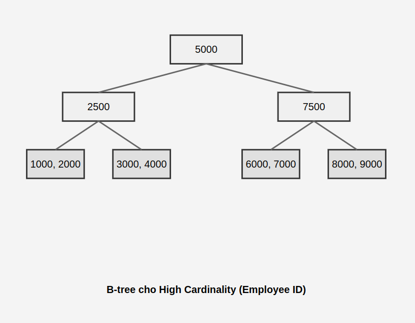
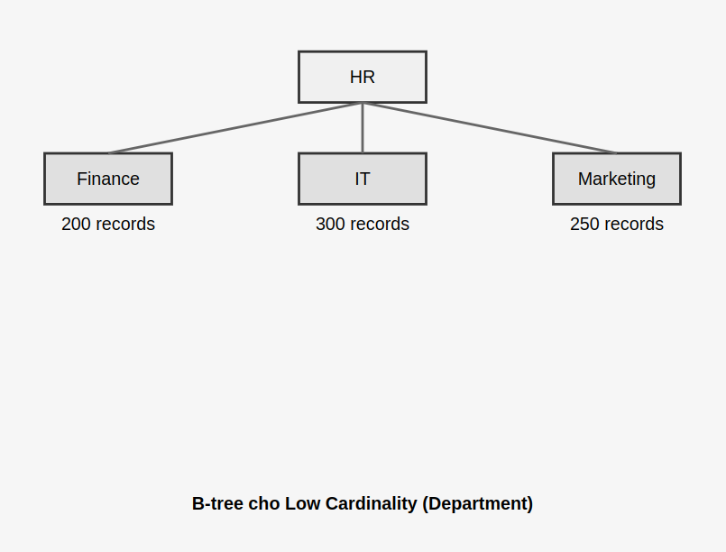

## Overview

Cardinality (Bản số):

- Là số lượng giá trị duy nhất trong một cột của bảng.
- Ví dụ: Cột "Giới tính" có cardinality thấp (thường chỉ có 2-3 giá trị), trong khi cột "Số điện thoại" có cardinality cao (mỗi người thường có số riêng).
- Cardinality cao nghĩa là cột đó có nhiều giá trị khác nhau.

Selectivity (Độ chọn lọc):

- Là tỷ lệ giữa số lượng giá trị duy nhất (cardinality) và tổng số hàng trong bảng.
- Công thức: Selectivity = Cardinality / Số hàng
- Ví dụ: Nếu bảng có 1000 hàng, cột "Giới tính" có 2 giá trị duy nhất, selectivity sẽ là 2/1000 = 0.002 (thấp).
- Selectivity cao nghĩa là cột đó có khả năng phân biệt dữ liệu tốt.

Tầm quan trọng:
- Cardinality và selectivity ảnh hưởng đến hiệu suất truy vấn và việc tạo index.
- Cột có selectivity cao thường là ứng cử viên tốt để tạo index, giúp tìm kiếm nhanh hơn.

-------
-------

1. Ảnh hưởng của Cardinality:

- Index Efficiency:
    - Cột có cardinality cao thường là ứng cử viên tốt để tạo index.
    - Index trên cột có cardinality cao giúp thu hẹp kết quả tìm kiếm nhanh hơn.

- Query Optimization:
    - Bộ tối ưu hóa truy vấn sử dụng thông tin về cardinality để chọn kế hoạch thực thi tốt nhất.
    - Với cột cardinality cao, có thể ưu tiên sử dụng index scan thay vì table scan.

- Join Operations:
    - Cardinality ảnh hưởng đến cách hệ thống chọn thuật toán join và thứ tự join các bảng.

2. Ảnh hưởng của Selectivity:

- Index Usage:
    - Cột có selectivity cao (gần 1) thường là ứng cử viên tốt để tạo index.
    - Index trên cột có selectivity cao giúp lọc dữ liệu hiệu quả hơn.

- Query Performance:
    - Truy vấn trên cột có selectivity cao thường nhanh hơn vì cần xử lý ít dữ liệu hơn.
    - Ví dụ: Tìm kiếm theo số CMND (selectivity cao) nhanh hơn so với tìm theo giới tính (selectivity thấp).

- Data Distribution:
    - Selectivity ảnh hưởng đến cách hệ thống ước tính số lượng hàng sẽ được trả về từ một truy vấn.
    - Điều này quan trọng cho việc lựa chọn kế hoạch thực thi truy vấn tối ưu.

3. Tối ưu hóa dựa trên hai yếu tố này:

- Index Creation: Tạo index trên các cột có cardinality và selectivity cao.
- Query Rewriting: Viết lại truy vấn để tận dụng các cột có selectivity cao.
- Statistics Update: Cập nhật thống kê cơ sở dữ liệu thường xuyên để có thông tin chính xác về cardinality và selectivity.

Hiểu về cardinality và selectivity giúp các nhà phát triển và DBA tối ưu hóa cấu trúc cơ sở dữ liệu, viết truy vấn hiệu quả, và cải thiện hiệu năng tổng thể của hệ thống.

=======
=======

Bây giờ, hãy phân tích sự khác biệt giữa hai B-tree này:

1. B-tree cho High Cardinality (Employee ID):

- Cấu trúc: B-tree có nhiều nút và nhiều mức.
- Các nút chứa các giá trị ID duy nhất.
- Mỗi nút lá chỉ chứa một số lượng nhỏ các giá trị.
- Tìm kiếm hiệu quả: Chỉ cần vài bước so sánh để tìm đến giá trị cụ thể.

Ví dụ truy vấn: `SELECT * FROM Employees WHERE Employee_ID = 3000`
- B-tree sẽ nhanh chóng dẫn đến nút lá chứa giá trị 3000.
- Chỉ cần đọc một số ít bản ghi để tìm kết quả chính xác.

2. B-tree cho Low Cardinality (Department):

- Cấu trúc: B-tree có ít nút và ít mức hơn.
- Các nút chứa tên phòng ban (chỉ có 5 giá trị duy nhất).
- Mỗi nút lá liên kết với nhiều bản ghi (hàng trăm).
- Tìm kiếm ít hiệu quả hơn: Nhanh chóng tìm được nút, nhưng phải quét nhiều bản ghi.

Ví dụ truy vấn: `SELECT * FROM Employees WHERE Department = 'IT'`
- B-tree nhanh chóng dẫn đến nút lá 'IT'.
- Tuy nhiên, phải quét qua 300 bản ghi để tìm tất cả nhân viên thuộc phòng IT.

Sự khác biệt chính:

1. Độ sâu của cây:
    - High Cardinality: Cây sâu hơn, nhiều mức hơn.
    - Low Cardinality: Cây nông hơn, ít mức hơn.

2. Phân bố dữ liệu:
    - High Cardinality: Mỗi nút lá liên kết với ít bản ghi.
    - Low Cardinality: Mỗi nút lá liên kết với nhiều bản ghi.

3. Hiệu quả tìm kiếm:
    - High Cardinality: Tìm kiếm nhanh, chính xác đến từng bản ghi.
    - Low Cardinality: Tìm kiếm nhanh đến nút lá, nhưng phải quét nhiều bản ghi.

4. Sử dụng bộ nhớ:
    - High Cardinality: Sử dụng nhiều bộ nhớ hơn do có nhiều nút.
    - Low Cardinality: Sử dụng ít bộ nhớ hơn do có ít nút.

5. Hiệu quả của index:
    - High Cardinality: Index rất hiệu quả, tăng tốc truy vấn đáng kể.
    - Low Cardinality: Index ít hiệu quả hơn, có thể không cải thiện nhiều cho một số loại truy vấn.

Kết luận:
- High Cardinality (như Employee ID) thích hợp cho tìm kiếm chính xác và nhanh chóng.
- Low Cardinality (như Department) thích hợp cho truy vấn thống kê hoặc nhóm, nhưng ít hiệu quả cho tìm kiếm cụ thể.

Hiểu được sự khác biệt này sẽ giúp bạn thiết kế cấu trúc dữ liệu và index hiệu quả hơn, cũng như tối ưu hóa các truy vấn dựa trên đặc điểm của dữ liệu.