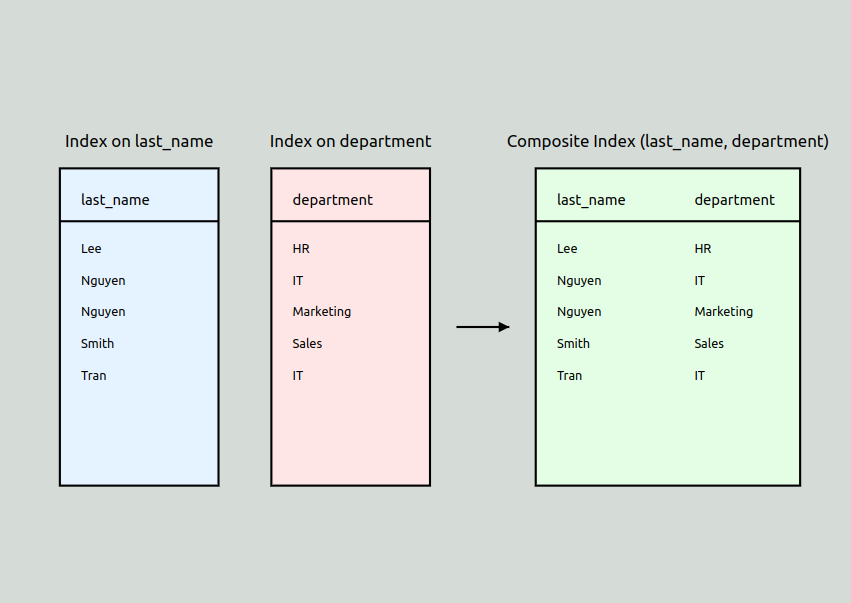

## Composite index vs multi single column index

Tất nhiên, tôi sẽ so sánh composite index với việc sử dụng hai single column index riêng biệt. Để minh họa sự khác biệt, tôi sẽ tạo một hình ảnh so sánh.



Bây giờ, hãy so sánh cách sử dụng composite index với hai single column index:

1. Cấu trúc:
    - Hai Single Column Indexes: Tạo hai index riêng biệt, một cho last_name và một cho department.
   ```sql
   CREATE INDEX idx_lastname ON employees (last_name);
   CREATE INDEX idx_department ON employees (department);
   ```
    - Composite Index: Tạo một index kết hợp cả hai cột.
   ```sql
   CREATE INDEX idx_lastname_department ON employees (last_name, department);
   ```

2. Hiệu suất tìm kiếm:
    - Hai Single Column Indexes:
        + MySQL phải quét qua index last_name để tìm 'Nguyen'.
        + Sau đó, nó phải quét qua index department để tìm 'IT'.
        + Cuối cùng, nó phải kết hợp kết quả từ cả hai index.
    - Composite Index:
        + MySQL có thể tìm kiếm trực tiếp các bản ghi có last_name = 'Nguyen' VÀ department = 'IT' trong một lần quét.

3. Độ chọn lọc (Selectivity):
    - Hai Single Column Indexes: Mỗi index có độ chọn lọc riêng, nhưng không kết hợp được.
    - Composite Index: Cung cấp độ chọn lọc cao hơn vì nó kết hợp cả hai điều kiện.

4. Không gian lưu trữ:
    - Hai Single Column Indexes: Chiếm nhiều không gian hơn vì mỗi index được lưu trữ riêng biệt.
    - Composite Index: Thường tiết kiệm không gian hơn vì thông tin được lưu trữ một lần.

5. Cập nhật dữ liệu:
    - Hai Single Column Indexes: Khi dữ liệu thay đổi, cả hai index cần được cập nhật riêng biệt.
    - Composite Index: Chỉ cần cập nhật một index, giảm overhead khi thực hiện các thao tác INSERT, UPDATE, DELETE.

6. Linh hoạt trong truy vấn:
    - Hai Single Column Indexes: Có thể sử dụng riêng lẻ cho các truy vấn chỉ liên quan đến một trong hai cột.
    - Composite Index: Hiệu quả nhất khi cả hai cột được sử dụng trong truy vấn, nhưng vẫn có thể sử dụng cho truy vấn chỉ liên quan đến cột đầu tiên (last_name trong trường hợp này).

7. Thứ tự của các cột:
    - Hai Single Column Indexes: Thứ tự không quan trọng.
    - Composite Index: Thứ tự rất quan trọng. Index (last_name, department) sẽ hiệu quả cho truy vấn về last_name hoặc cả hai, nhưng không hiệu quả cho truy vấn chỉ về department.

Trong hầu hết các trường hợp, nếu bạn thường xuyên truy vấn dựa trên cả last_name VÀ department, composite index sẽ hiệu quả hơn. Tuy nhiên, nếu bạn cũng có nhiều truy vấn chỉ liên quan đến department, bạn có thể cân nhắc giữ một single column index cho department bên cạnh composite index.

======
======

## Index (last_name, department) sẽ hiệu quả cho truy vấn về last_name hoặc cả hai, nhưng không hiệu quả cho truy vấn chỉ về department.

Hãy để tôi giải thích lại về hiệu quả của composite index (last_name, department) đối với các loại truy vấn khác nhau:

1. Truy vấn chỉ với last_name:
    - Ví dụ: SELECT * FROM employees WHERE last_name = 'Nguyen'
    - Hiệu quả: Cao
    - Lý do: Index được sắp xếp theo last_name, nên MySQL có thể nhanh chóng tìm tất cả các 'Nguyen'.

2. Truy vấn với cả last_name và department:
    - Ví dụ: SELECT * FROM employees WHERE last_name = 'Nguyen' AND department = 'IT'
    - Hiệu quả: Rất cao
    - Lý do: MySQL tìm 'Nguyen', sau đó trong nhóm 'Nguyen', nó dễ dàng lọc ra những người ở department 'IT'.

3. Truy vấn chỉ với department:
    - Ví dụ: SELECT * FROM employees WHERE department = 'IT'
    - Hiệu quả: Thấp
    - Lý do: Index không được sắp xếp theo department. MySQL phải quét toàn bộ index để tìm tất cả bản ghi có department là 'IT'.

4. Nguyên tắc "Leftmost Prefix":
    - MySQL có thể sử dụng các cột bên trái của composite index.
    - Trong (last_name, department), MySQL có thể sử dụng:
        - Chỉ last_name
        - Cả last_name và department
    - Nhưng không thể sử dụng hiệu quả chỉ department.

5. Ảnh hưởng đến hiệu suất:
    - Truy vấn về last_name hoặc cả hai: Rất nhanh, chỉ cần một phần nhỏ của index.
    - Truy vấn chỉ về department: Chậm, có thể phải quét toàn bộ index.


Tưởng tượng index như một cuốn sách điện thoại:
- Sắp xếp theo họ (last_name), sau đó theo tên (department).
- Dễ tìm người theo họ (truy vấn 1).
- Rất dễ tìm người theo họ và tên (truy vấn 2).
- Khó tìm tất cả người có cùng tên mà không biết họ (truy vấn 3) - phải đọc cả cuốn sách.

