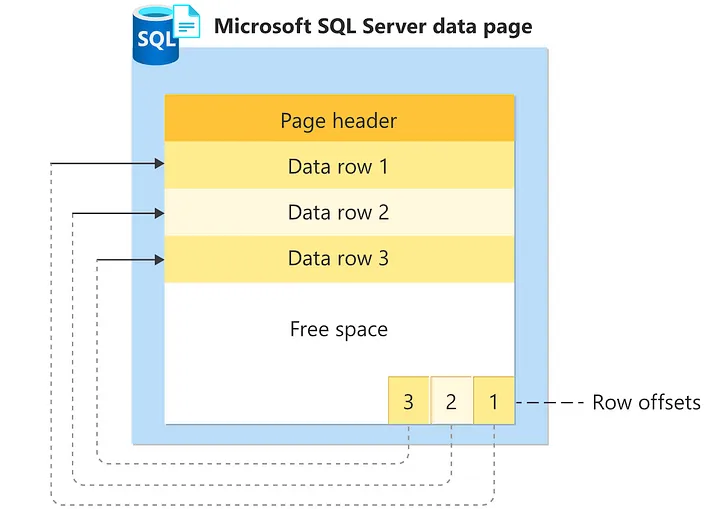

## References
- [Why is the default page size for databases so small?](https://dba.stackexchange.com/questions/294587/why-is-the-default-page-size-for-databases-so-small)
- [Database Pages — A deep dive](https://medium.com/@hnasr/database-pages-a-deep-dive-38cdb2c79eb5)
- [Understanding the Internals of a Data Page](https://www.sqlservercentral.com/articles/understanding-the-internals-of-a-data-page)
- [Following a database read to the metal](https://medium.com/@hnasr/following-a-database-read-to-the-metal-a187541333c2)

---
---

## [Why is the default page size for databases so small?](https://dba.stackexchange.com/questions/294587/why-is-the-default-page-size-for-databases-so-small)

In PostgreSQL and SQL Server, the default page size is **8 KB**, in MySQL is **16 KB** and in IBM DB2 and Oracle it is only **4 KB**.

Why are these page sizes so small?

Is there a historical or memory usage reason?

-----

> Disk I/O operations are performed at the page level. That is, SQL Server reads or writes whole data pages.

> For example, if a query you run **only needs to return 4 KB of data**, but your **Page Size is set to 1 GB**, that means you'll need to wait for an entire 1 GB of data to be loaded off disk to serve just 4 KB of data. Likely, that's not going to be great performance-wise.

> Also, that's only under the assumption your 4 KB of data is consecutively stored on the same Page, which will be dependent on your data and the predicates of your query. If **your data was spread across 4 Pages**, for example, now 4 **GB of data needs to be loaded off disk to serve only 4 KB of data**.
 
> For reference, 4 KB of data is roughly 1,000 rows for a single integer or datetime column. So even if we're talking about a dataset that is 10 columns wide with an average data size of an integer data type, that's still 100 rows of data that 4 KB can hold.

> So the Page Size is chosen to **not be too big** such that **wasted I/O is spent loading more data off disk** than necessary to serve queries, but conversely **not too small** either, otherwise you can run into a performance bottleneck due to an **increase in the number of operations needed to load many Pages for a small amount of data**. 

----
----

## [Database Pages — A deep dive](https://medium.com/@hnasr/database-pages-a-deep-dive-38cdb2c79eb5)

> **Databases read and write on pages**. 
> 
> When you **read a row from a table**, the **database finds the page where the row lives** and **identifies the file and offset** where the page is located on disk. 
> 
> The database then asks the OS to **read from the file on the particular offset** for the length of the page. The OS checks its filesystem cache and if the required data isn’t there, the OS issues the read and pulls the page in memory for the database to consume.

-----

> **How page are stored on Disk**
> 
> There are **many ways we can store and retrieve pages** to and from disk. 
> 
> One way is to make a **file per table** or **collection as an array of fixed-size pages**. Page 0 followed by page 1 followed by page 2. 
> 
> **To read something from disk** we need to information, the **file name**, **offset** and the **length**, with this design we have all three!
>
> To read page **X**, we know the file name from the table, to get the offset it is **X * Page_Size**, and the length in bytes are the page size.
>
> Example reading table **test_page**, assume a **page size** of **8KB**, to read pages **2** through **10**, we read the file where table **test_page** live, with an offset 16484 (2*8192) for 65536 bytes ((10–2)*8192).

----
----

## How database read row's data using index at page level

Certainly! Let's delve into a more detailed explanation of how a database reads row data using an index at the page level. This process is central to the performance and efficiency of database systems, especially in handling large datasets.

### 1. **Query Initiation**

- **User Query**: The process begins when a user or application issues a SQL query requesting data (e.g., `SELECT * FROM table WHERE column = value`).
- **Query Planner/Optimizer**: The database's query planner evaluates the query and decides the best way to execute it. If an appropriate index exists, the planner will opt to use it.

### 2. **Index Lookup**

- **Index Structure**: Most relational databases use B-tree indexes. A B-tree index is a balanced tree structure that allows fast data retrieval.
- **Index Search**: The database searches the index to find the entry corresponding to the query's criteria. This search is efficient due to the sorted nature of the B-tree.

### 3. **Identifying Data Pages**

- **Index Leaves**: In a B-tree index, leaf nodes contain pointers (references) to the data pages. These pointers are the result of the index search.
- **Page Location**: The index provides the specific location (like a file offset) of the data page where the desired row(s) can be found.

### 4. **Data Page Retrieval**

- **Reading the Page**: The database system reads the identified page into memory. This involves a disk I/O operation unless the page is cached.
- **Page Structure**: A page, typically a few kilobytes in size, contains multiple rows. It has a header that includes metadata like row offsets.

### 5. **Row Offsets and Data Access**

- **Row Offsets**: These are essentially pointers within the page, indicating where each row starts. The offsets are stored in the page header.
- **Direct Access**: The database uses these offsets to jump directly to the desired row(s) within the page, bypassing other rows.

### 6. **Extracting Row Data**

- **Reading Rows**: The database reads the row data based on the offset information. For queries involving specific columns, only those columns are read.
- **Handling Multiple Rows**: If multiple rows match the query criteria, this process is repeated for each relevant page as indicated by the index.

### 7. **Data Processing**

- **Result Set Creation**: The retrieved data is processed according to the query (e.g., applying SELECT filters, sorting, aggregating).
- **Returning Data**: The final result set is compiled and returned to the user or application.

### 8. **Updates and Transaction Management**

- **Locking**: For data updates, the database might lock the page to ensure data integrity during concurrent transactions.
- **Index Maintenance**: If the update involves indexed columns, the database also updates the index to reflect the changes.

### 9. **Efficiency and Performance**

- **Avoiding Full Table Scans**: By using an index, the database avoids scanning the entire table, which is crucial for performance, especially with large tables.
- **Cache Utilization**: Frequently accessed pages might be kept in cache (memory), which further speeds up data retrieval.

### 10. **Special Considerations**

- **Variable-Length Data**: Databases handle variable-length columns (like VARCHAR) by using additional metadata in the page structure.
- **Non-Indexed Queries**: If no index is available, the database resorts to a full table scan, reading each page and row sequentially.

This detailed view demonstrates how sophisticated the process of reading data using indexes at the page level is. It's a blend of smart indexing strategies, efficient data storage formats, and optimized algorithms, all working together to ensure quick and reliable data access in database systems.