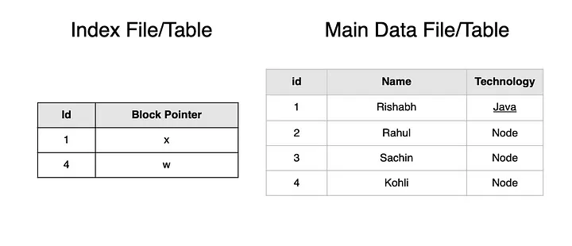
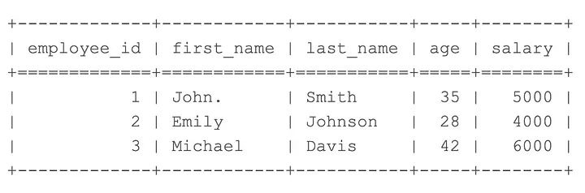

## References
- [Indexes in Relational Databases(Detailed)](https://medium.com/@rishabh171192/indexes-in-relational-databases-detailed-ba5926121c38)
- [Understanding Database Internals: How Tables and Indexes are Stored on Disk and Queried](https://vipulvyas.medium.com/understanding-database-internals-how-tables-and-indexes-are-stored-on-disk-and-queried-7cf09a6a48a4)
- [How does the database index work?](https://www.linkedin.com/pulse/how-does-database-index-work-tushar-goel/)
- [Database Indexes Explained](https://www.codeproject.com/Articles/5164742/Database-Indexes-Explained)

## Notes
>  In the context of databases, the terms **page** and **block** are often used interchangeably.


----
----

## [Indexes in Relational Databases(Detailed)](https://medium.com/@rishabh171192/indexes-in-relational-databases-detailed-ba5926121c38)

Before jumping directly on indexing in relational DBMS. **Do you know tables are stored on disk ?**

Tables are stored as files in memory. Files in turn consist of **continuous** blocks of storage. Tables are stored in these blocks.


**File consisting of contiguous blocks**

**Files can store data(records) in two ways:**
1. Sorted way
2. Unsorted way

**Sorted:**

With Sorted records , **Searching**  becomes faster. We can also take advantage of Binary Search(O(logn)).

Due to ordered data, insertion becomes pretty slow. Need to identify the correct position and then insert with some shifting.

**Unsorted:**

With Unsorted records, Insertion becomes easier(insert at any available places). But to search we need to traverse in linear fashion that contribute to time complexity of O(n)

**How data mapped into file blocks?**

Take a block size of 1KB (1024 B). Start inserting records of size 200B.

After 5 blocks 1000B is used. Now for inserting 6th block, there are 2 ways we can follow:
1. Store 24B in the first block and remaining 176B in the next block. Also known as **Spanned Mapping** .
2. Store full 200B in the next block. Also known as **Unspanned Mapping** .

Mostly database systems using Unspanned Mapping as it helps in accessing elements quickly.

### **We will move in an unorthodox way to learn Indexing.** First we will learn **why indexing?**  and then we will move to **what is Indexing?**

### Why Indexing?

Take a file with 10000 blocks and each block contains 100 items.

**Case 1**  : File contains ordered(sorted) data. So here we can use Binary Search to find the block(Finding a block consumes time , find record from block is fast):

**Time Taken:**  log2(10000) = 13.287

Binary Search is not an optimal solution as file size will keep on increasing. We will go through multilevel indexing with B+ trees.

**Case 2** : File contains unordered data. Time Taken will be O(n) where n = number of blocks.

**With ordered or unordered records of files we will not get an optimal solution.**

**Note:**  Finding a block where data exists is the actual time taken for search. Data within the block can be searched in negligible time.

**What is Indexing?**

**Indexing is required to access elements from a big database table quickly** . Indexing **improves the query performance** of the table by minimising the running time. Basically it reduces the number of block access to find a solution.

For **Indexing**  a table, internally a separate table/file(index file) is created. This file contains indexed attributes and block references where it exists in the main table.

Size of the **Indexed file**  is very less as compared to the main file as it contains minimal data.


**How to optimise Index file size when file contains sorted records?**

As records are ordered, we can put the Block id from the main table and its corresponding block reference in the Indexed file. Block id will map to all records present in that block.

With this approach we can reduce the index file size.

**Number of entries in Index file = Number of blocks in main table.**

This is also called **Sparse Indexing(Not all records in Index file)**



**Here 1–3 id will be taken care by one id =1 , rest by 4**

**Note:** In case of unordered records, in the data file we can’t store the block id, instead we need to simply put all the records in the index file. But still it will more efficient than looking directly on data file.This is called Dense Indexing(All records are present in Index file)

**Types of Indexing:**
1. **Single level Index**
- Primary Index
- Secondary Index
- Clustered Index

**2. Multi level Index**

**Primary Indexing:**

Data file is sorted on Primary Key. Here the primary key is used as a search attribute. As the file is sorted it will use sparse indexing internally.

Number of records in index file = Number of blocks in data file

**Cluster Indexing**

Data file is sorted but on a non primary key. Entries corresponding to non key can be duplicate.

Number of records in index file = Number of unique records based on indexed key.

**Secondary Indexing:**

Data file in file is unordered and is indexed on any candidate key(unique) or non keys having duplicate entries.

**Multilevel Index:**

As the data grows in tables then the index table will also grow. So keeping data in a single index file is not efficient as we need to keep that one big file. To keep our indexing work effectively, we can make use of Multilevel Indexing.

**Multilevel Index** breaks a big index file into multiple small internal and outer indexes. We just need to store a small outer index in main memory.


**Multilevel Index**

Adding these indexes will reduce the blocks access(traversing blocks to get the desired data).

Multilevel trees in Databases are implemented from B+ trees which are in turn based on m way trees.

**Advantages of Indexing:**
1. Faster Access of records / Better Response time.
2. Primary/ Unique indexes added more power to our tables by adding constraints.

**Disadvantages of Indexing:**
1. Indexes take up Disk/Memory.
2. Decrease the performance with insert, updates and delete. As the tree needs to be rebalanced so performance decreases for above operations.

----
----

## [Understanding Database Internals: How Tables and Indexes are Stored on Disk and Queried](https://vipulvyas.medium.com/understanding-database-internals-how-tables-and-indexes-are-stored-on-disk-and-queried-7cf09a6a48a4)

Databases play a crucial role in storing and retrieving vast amounts of data efficiently. To achieve this, they employ various storage concepts and data structures. In this article, we will delve into the internals of databases, specifically focusing on how tables and indexes are stored on disk and how they are queried. We will explore the concepts of logical tables, rows, pages, I/O operations, heap data structure, index data structure (such as B-trees), and provide an example of a query.


**Storage Concept:**  At the heart of a database system, tables serve as containers for organizing and storing data logically. Behind the scenes, tables are stored as a sequence of pages on the disk. Each page typically has a fixed size, such as 8KB in PostgreSQL or 16KB in MySQL. The number of rows contained within a page depends on the storage model, which can be either row-based or column-based.
## Table

A table in a database is a structured collection of related data organized into rows and columns. It represents a logical entity or concept, such as “Customers” or “Products,” and provides a way to store and organize data in a tabular format. Each row in a table represents a unique record or instance of the entity, while each column represents a specific attribute or characteristic of the entity.

A logical table refers to the conceptual representation of a table in a database. It represents the structure and organization of the data, including the column names and their data types. The logical table provides a blueprint for creating the physical storage for the table’s data.

On the other hand, a **row_id**  (also known as a row identifier or tuple identifier) is a unique identifier assigned to each row in a table. It serves as an internal reference that allows the database system to locate and access a specific row efficiently. The row_id is typically an integer value that is automatically generated by the database system when a new row is inserted into the table.

Let’s consider an example to understand these concepts better. Suppose we have a table called “Employees” with the following structure:



In this example, **Employees** is the table name, and each row represents information about an employee. The columns represent attributes such as employee ID, first name, last name, age, and salary. The table provides a structured way to store and organize employee data.

The logical table for the **Employees** table would include the table name and the column names with their respective data types:

**Table**: Employees

**Columns**: employee_id (integer), first_name (string), last_name (string), age (integer), salary (integer)

The row_id is an internal identifier assigned to each row. In this example, the row_id is not explicitly shown in the table but is present in the database system’s internal storage structure. When accessing or manipulating data in the “Employees” table, the row_id helps identify and locate specific rows. For instance, if we want to update the salary of the employee with employee_id 2, the database system would use the row_id associated with that employee to locate the correct row and perform the update operation efficiently.
## Page

In a database, a page is a unit of data storage that represents a fixed-size block of data on disk. Pages are used to store and read data efficiently, and they play a crucial role in database I/O operations. Here are some important points to consider about pages in a database:

**1.**  **Storage Model and Logical Pages:**  Depending on the storage model employed by the database, such as a row-based or columnar storage model, the data is stored and read in logical pages. The storage model determines how the data is organized and accessed within each page.

**2. Reading Pages Instead of Single Rows:**  When retrieving data from a database, the system typically reads a page or multiple pages in a single I/O operation. This is because accessing a single row at a time would be inefficient due to disk I/O overhead. By reading a page, the database system can fetch multiple rows in one I/O operation, which improves performance.

**3. Page Size:**  Each page has a fixed size, which is determined by the database system. The page size can vary between different database systems. For example, in PostgreSQL, the default page size is typically 8KB, while in MySQL, it is commonly 16KB. The page size is important for optimizing storage and I/O operations.

**4. Rows per Page:**  Within each page, a certain number of rows can be stored. The number of rows per page depends on factors such as the size of the rows and any additional metadata stored with each row. In your example, assuming each page holds 3 rows, with a total of 1001 rows, you would have approximately 333 pages (1001/3 ≈ 333).

Pages serve as a fundamental unit of data storage and retrieval in a database. They allow the database system to efficiently organize and access data, minimizing the number of I/O operations required. By reading and writing data in page-sized chunks, databases can optimize performance and improve overall system efficiency.

It’s important to note that these details can vary between different database systems and storage implementations. Database engines may provide configuration options to adjust page sizes or employ different storage models to optimize performance for specific use cases.
## IO

IO (Input/Output) operations are crucial for reading and writing data to disk storage. An IO operation represents a read or write request to the disk, and minimizing these operations is essential due to their relatively slower speed compared to memory operations.

During an IO operation, the database fetches one or more pages, which are fixed-size blocks of data, optimizing data access by retrieving multiple rows at once. As a result, the database doesn’t read individual rows during IO, but rather reads all rows in the fetched pages. To enhance performance, developers and administrators work on reducing IOs by caching frequently accessed data in memory, employing efficient data structures like indexes, and utilizing query optimization strategies. Furthermore, the operating system cache can help reduce IO latency by storing recently accessed data in memory, serving subsequent read requests from the cache instead of the disk. By employing these techniques, databases achieve high performance and efficient data retrieval.
## Heap

Heap in the context of databases refers to the data structure where the table’s actual data is stored in consecutive pages. **It serves as the physical storage for the table and contains all the rows and columns** . Traversing the heap to find specific data can be expensive since it requires reading a substantial amount of data, which can be time-consuming. This is where indexes come into play. Indexes are data structures separate from the heap that provide optimized search mechanisms. They serve as pointers to the relevant data in the heap, helping quickly identify what part of the heap needs to be read and which pages to pull. By utilizing indexes, databases can efficiently retrieve specific data without scanning the entire heap, thereby improving query performance and reducing the overhead of reading excessive data.
## Index

Index in the context of database systems is a separate data structure distinct from the heap, and **it contains “pointers” to the heap where the actual data is stored.**  Indexes are utilized to facilitate quick and efficient data retrieval based on specific search criteria. They store a portion of the data, allowing for rapid searching and filtering of records. Database systems offer the flexibility to create indexes on one or more columns of a table, enabling targeted searches on various attributes. When querying data, the database first searches the index for the desired value or range of values. Once the value is found in the index, the system uses the corresponding pointers to navigate to the appropriate pages in the heap, where all the necessary data resides. This targeted approach avoids the need to scan every page in the heap, significantly reducing the time and resources required for data retrieval.

Indexes themselves are also stored as pages on disk, and fetching the entries of the index incurs IO operations. **To optimize index performance, database administrators aim to keep the index size as small as possible, as a smaller index can fit more easily into memory** . When an index fits entirely in memory, search operations become faster due to reduced disk access and latency. **One of the most popular data structures for implementing indexes is the B-tree.**  B-trees efficiently organize and sort the index entries, providing logarithmic search and retrieval times, making them well-suited for database index structures. By leveraging B-trees and other efficient indexing techniques, databases can significantly enhance query performance and overall system efficiency.

## Example of Query

Let’s consider a simple example of a database table named “Employees” with the above structure:

Suppose you want to retrieve all employees with the last name “Smith” from the “Employees” table. Let’s see how the query works with and without an index on the “last_name” column.

Without an index on the “last_name” column, the database system would need to perform a full table scan to find all rows with the last name “Smith.” It would sequentially read each row in the table and check if the last name matches the search criteria. This can be time-consuming, especially for large tables.

```
SELECT * FROM Employees WHERE last_name = 'Smith';
```


With an index on the “last_name” column, the database system can use the index to quickly locate the rows with the last name “Smith” without scanning the entire table. The index stores pointers to the actual rows in the heap that have the specified last name.

```
- Assuming an index on the "last_name" column exists
SELECT * FROM Employees WHERE last_name = 'Smith';
```


 1. **Without Index:**  The database performs a full table scan, reading each row in the “Employees” table one by one. It compares the “last_name” value for each row to the search criterion (‘Smith’) and includes matching rows in the result set.

2. **With Index:**  The database uses the index to perform an index seek. It directly accesses the entries in the index associated with the “last_name” value ‘Smith.’ The index provides pointers to the corresponding rows in the heap, where the actual data resides. The database retrieves those rows without scanning the entire table, resulting in a more efficient and faster query.

We can also check different with Explain query

```
EXPLAIN ANALYZE SELECT * FROM Employees WHERE last_name = 'Smith';
```


Notes:
- **Clustered Index:**  In some cases, **a heap table can be organized around a single index, which is known as a clustered index or an index-organized index.**  This means the data in the heap is physically sorted in the order of the clustered index. The primary key of a table is often implemented as a clustered index by default, unless specified otherwise. The presence of a clustered index can significantly improve the performance of range-based queries, as the data is already sorted.
- **Primary Key and Clustered Index:**  As mentioned earlier,**the primary key of a table is typically implemented as a clustered index.**  A primary key is a unique identifier for each row in the table, and by organizing the table data around this unique key, the database system can quickly locate and retrieve specific rows based on their primary key values.
- **MySQL InnoDB and Clustered Index:**  InnoDB is a storage engine used in MySQL. **InnoDB tables always have a primary key, which automatically becomes the clustered index.**  Any additional indexes created on the table will point to the primary key “value,” meaning that they will use the clustered index for accessing the corresponding rows.
- **Postgres and Secondary Indexes:**  In **PostgreSQL (Postgres), unlike MySQL InnoDB, only secondary indexes exist.**  These secondary indexes do not have the data itself; instead, they **directly point to the row_id, which serves as the identifier for each row in the heap** . When using a secondary index in Postgres, the database looks up the row_id from the index and then fetches the complete row from the heap based on that row_id.

----
----

## [What does physical data organization mean?](https://www.freecodecamp.org/news/database-indexing-at-a-glance-bb50809d48bd/)

Physically, data is organized on disk across thousands or millions of disk / data blocks. For a clustered index, it’s not mandatory that all the disk blocks are contagiously stored. Physical data blocks are all the time moved around here & there by the OS whenever it’s necessary. A database system does not have any absolute control over how physical data space is managed, but inside a data block, records can be stored or managed in the logical order of the index key. The following simplified diagram explains it:


- The yellow coloured big rectangle represents a disk block / data block

- The blue coloured rectangles represent data stored as rows inside that block

- The footer area represents the index of the block where red coloured small rectangles reside in sorted order of a particular key. These small blocks are nothing but sort of pointers pointing to offsets of the records.

Records are stored on the disk block in any arbitrary order. Whenever new records are added, they get added in the next available space. Whenever an existing record is updated, the OS decides whether that record can still fit into the same position or a new position has to be allocated for that record.

So position of records are completely handled by OS & no definite relation exists between the order of any two records. In order to fetch the records in the logical order of key, disk pages contain an index section in the footer, the index contains a list of offset pointers in the order of the key. Every time a record is altered or created, the index is adjusted.

In this way, you really don’t need to care about actually organizing the physical record in a certain order, rather a small index section is maintained in that order & fetching or maintaining records becomes very easy.

### explain
