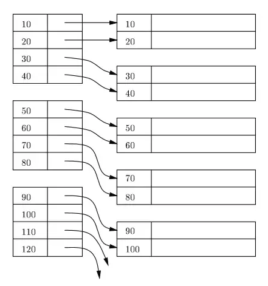
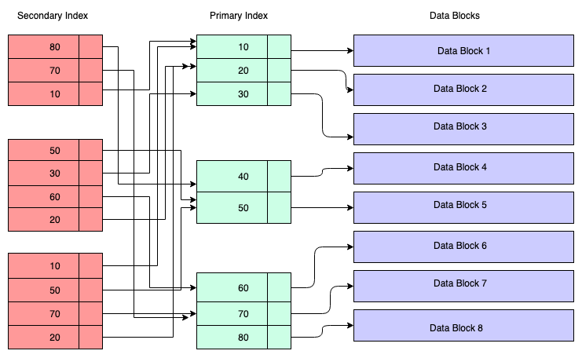

## [Database indexing](https://www.freecodecamp.org/news/database-indexing-at-a-glance-bb50809d48bd/)
- Clustered Index - primary index (or `B-tree` index)
  - 
  - performance bị giảm khi dùng DML query như delete, update vì index phải update lại.
- Secondary index - another column index
  - 
  - **Advantages of a Secondary Index**:
    Logically you can create as many secondary indices as you want. But in reality how many indices actually required needs a serious thought process since each index has its own penalty.

  - **Disadvantages of a Secondary Index**:
    With DML operations like DELETE / INSERT , the secondary index also needs to be updated so that the copy of the primary key column can be deleted / inserted. In such cases, the existence of lots of secondary indexes can create issues.

  - **Also, if a primary key is very large like a URL, since secondary indexes contain a copy of the primary key column value, it can be inefficient in terms of storage**. More secondary keys means a greater number of duplicate copies of the primary key column value, so more storage in case of a large primary key. Also the primary key itself stores the keys, so the combined effect on storage will be very high.

- Trước khi delete primary index cần xem xét kỹ vì sẽ phải update lại tất cả secondary indices.
- Càng nhiều index thì việc ghi data càng chậm.
- **Cardinality is important — cardinality means the number of distinct values in a column.** nếu cột có ít distinct value thì index không mang lại nhiều lợi ích lắm.
  - Example: if you create an index on a boolean ( int 1 or 0 only ) type column, the index will be very skewed since cardinality is less (cardinality is 2 here). But if this boolean field can be combined with other columns to produce high cardinality, go for that index when necessary.
  
  >[**More indexes means slower inserts; more indexes mean more disk & memory space occupied.**](https://towardsdatascience.com/indexing-very-large-tables-569811421ee0)
  > 
  > Reduce your footprint by modifying an existing index instead of adding more indexes mindlessly[?].
  > 
  > Partitions result in smaller B-trees/indexes, hence there’s less work to recompute those indexes on inserts.
 
-----------
## [BẠN BIẾT GÌ VỀ INDEX?](https://www.facebook.com/1516243098686660/posts/2486168548360772/)

Index là một thành phần không thể thiếu khi tối ưu việc truy vấn cơ sở dữ liệu, hiểu rõ về nó là yêu cầu bắt buộc với người thiết kế, và cả người lập trình ứng dụng cơ sở dữ liệu.

❗️Trong bài viết này mình sẽ nói chi tiết về cách thức lưu trữ, vận hành cũng như các yếu tố ảnh hưởng đến Index, nếu bạn chưa biết gì về Index thì đây không phải là bài viết dành cho bạn. Nội dung tập trung vào CSDL Mysql, tuy nhiên các kiến thức này đều có thể áp dụng vào các cơ sở dữ liệu khác như MSSQL hay Oracle, vì hầu hết chúng lưu trữ và vận hành giống nhau, ngoại trừ một số dạng dữ liệu đặc biệt.

👉 Index được tạo ra dựa trên nguyên tắc: Tìm dữ liệu trên một tập đã sắp xếp sẽ nhanh hơn nhiều so với tìm trên tập sắp xếp ngẫu nhiên.

👉 Index được lưu trữ trên đĩa dưới dạng B-Tree, với kích thước 16KB, mỗi lá trong B-Tree gọi là một trang, chứa một hoặc nhiều record, mỗi record tương ứng với một dòng trong CSDL.

👉 Luôn có một index chính, gọi là CLUSTERED index, cũng chính là nơi chứa dữ liệu của table, mỗi record trong index này sẽ chứa toàn bộ dữ liệu của một dòng. Các record này được lưu trữ theo thứ tự của PRIMARY KEY (PK), nếu bảng này không có PK, nó sẽ tìm một UNIQUE NOT NULL (tất cả các cột trong index đó đều NOT NULL), nếu không có nữa thì nó sẽ tự tạo một cột ẩn để làm khóa.

👉 Như vậy ta biết rằng, tất cả dữ liệu của ta sẽ luôn được lưu một cách có thứ tự, và mỗi dòng luôn có một giá trị khóa duy nhất trong bảng. Để đơn giản, khi nhắc đến PK, có nghĩa ta đang nhắc đến cột (hoặc nhóm cột) đang được dùng để sắp xếp trong CLUSTERED INDEX.

👉 Trong thực tế, ta luôn có nhu cầu tìm kiếm dựa trên những cột khác nhau, ví dụ ta có thể tìm một người theo tên, nhưng cũng có thể tìm theo năm sinh. Nhưng người có tên A lại có thể già hơn người có tên Z. Nếu tên là khóa chính, vậy năm sinh sẽ không thể được lưu trữ một cách có thứ tự, ta sẽ phải tìm ra một cách sao cho có thể sắp xếp cả những cột không phải khóa chính. Từ đây ta có thêm SECONDARY INDEX.

👉 SECONDARY INDEX cũng là một B-Tree, tuy nhiên mỗi record sẽ chỉ chứa giá trị của PK, và các cột được chọn làm Index (ở đây ta thấy vì PK luôn xuất hiện trong tất cả các Index, cũng như sẽ được dùng làm khóa so sánh, nên việc chọn một PK có kích thước nhỏ sẽ giúp tối ưu rất nhiều, đó là lý do vì sao người ta chuộng dùng INT auto_increment làm khóa chính).

👉 Khi ta tìm kiếm một hoặc nhiều giá trị, Mysql sẽ tìm các index tương ứng với thứ tự từ trái sang. Ví dụ, nếu có một index A với 2 cột (ID, Name), vậy nó sẽ được dùng mỗi khi ta tìm kiếm theo ID, hoặc ID và Name, nhưng A sẽ không được dùng nếu ta tìm kiếm chỉ dựa trên Name.

👉 Khi một dòng bị xóa khỏi CSDL, các record trong CLUSTERED INDEX và SECONDARY INDEX cũng sẽ bị xóa (bằng cách đánh dấu record đó không dùng nữa), dữ liệu vẫn nằm theo đúng thứ tự, MySql không cần làm gì thêm.

👉 Khi cập nhật hoặc thêm một dòng mới, Mysql sẽ phải đảm bảo dữ liệu trong các index vẫn nằm đúng thứ tự sau khi thực hiện cập nhật. Khi đó nó sẽ tìm xem vị trí tương ứng có record nào chưa dùng (hoặc đã bị xóa) không, nếu có nó chỉ việc đưa dữ liệu vào đó, nếu không, nó sẽ phải dịch chuyển dữ liệu của các record trong cùng trang lên trên hoặc xuống dưới để tạo record trống và đưa dữ liệu vào.

👉 Nếu trang hiện tại không còn chỗ trống, Mysql sẽ tạo một trang mới, chuyển bớt dữ liệu từ trang cũ vào đó, và đưa record mới vào đúng vị trí của nó.

👉 Vậy ta thấy nếu các trang trong một CSDL còn trống nhiều, việc cập nhật, xóa sửa sẽ diễn ra nhanh hơn nhiều, nhưng bù lại nó sẽ chiếm nhiều dung lượng đĩa. Ngược lại, nếu tỷ lệ chỗ trống trên mỗi trang thấp, việc cập nhật sẽ chậm hơn, nhưng tiết kiệm đĩa (Các CSDL này phù hợp với các dữ liệu ít thay đổi, như dữ liệu thống kê, back up...)

👉 Sau một thời gian, Mysql sẽ cần sắp xếp lại các trang, khi đó ta có thể yêu cầu nó giữ một tỷ lệ chỗ trống mong muốn, tùy vào mục đích sử dụng của loại dữ liệu, tỷ lệ này thường được gọi là fill factor (bạn có thể google cách thiết đặt với từng CSDL cụ thể).

Index ít quan trọng trên các bảng nhỏ, và trên thực tế không hẳn lúc nào Index cũng mang lại lợi ích (nhưng đa số là có). Hiểu rõ về nó giúp các bạn làm việc được với các CSDL lớn và rất lớn, trở thành các chuyên gia về CSDL, và nắm được những vai trò quan trọng trong nhóm dự án.

🧨 Một điều thú vị ở đây là bạn lại nghe về B-Tree khi nói về CSDL. Đó là lý do tại sao bạn phải học kỹ các môn cơ sở, bao gồm cấu trúc dữ liệu và thuật toán nếu muốn tiến xa trong nghề lập trình.

---
## Memory access and disk access
### Consequences of the memory hierarchy
- Accessing a variable can be fast or slow, depending on various factors
- If a variable is in slow memory, acessing it will be slow
- However, when it is accessed, the operating system will typically move that variable to
faster memory (“cache” or “buffer” it), along with some nearby variables
- **The idea is: if a variable is accessed once in a program, it (and nearby variables) is likely to be accessed again**
- So it is possible for one access of a variable to be slow, and the next access to be faster;
possibly orders of magnitude faster
  ```
  x = z[i]; // if z[i] is on disk this takes a long time
  z[i] = 3; // now z[i] is in cache, so this is very fast!
  z[i+1] = 9; // nearby variables also moved, so this is fast
  ```
- The biggest speed difference is between disk access and semiconductor memory access,
so that’s what we will pay most attention to

### [Accesssing data on disk](https://cseweb.ucsd.edu//~kube/cls/100/Lectures/lec16.btree/lec16.pdf)
- Data on disk is organized into blocks
- Typical block size: 1 kilobyte (1024 bytes), 4 kilobytes (4096 bytes), or more
- Because of the physical properties of disk drives (head seek time, platter rotation time),
it is approximately as fast to read an entire disk block at once as it is to read any part of
the block
- So, if you access a variable stored on disk, the operating system will read the entire disk
block containing that variable into semiconductor memory
- While in semiconductor memory, accessing any item in that block will be fast
- Because disk accesses are many (thousands!) of times slower than semiconductor
memory accesses, if a datastructure is going to reside on disk, it is important that it can
be used with very few disk accesses
- The most commonly used data structure for large disk databases is a B-tree, which can
  be designed to use disk accesses very efficiently
-----------------
## [Cache hit vs cache miss](https://stackoverflow.com/questions/18559342/what-is-a-cache-hit-and-a-cache-miss-why-would-context-switching-cause-cache-mi)

A cache miss, generally, is when something is looked up in the cache and is not found – the cache did not contain the item being looked up. The cache hit is when you look something up in a cache and it was storing the item and is able to satisfy the query.

-------------

## [M-way search tree](https://www.geeksforgeeks.org/m-way-search-trees-set-1-searching/)


> một cây với nhiều children, node, mục đích là để giảm độ cao của cây, hiệu quả hơn trong khi làm việc với index.

[An m-way tree is a tree structure that has `m` values and `m + 1` links.](https://stackoverflow.com/questions/814819/difference-between-binary-search-tree-and-m-way-tree)

A binary tree is a special case of an m-way tree with `m` equal to one, meaning only one value per node and two links (you either move down to the left or the right link). Here's an example of a binary tree that shows this:

                 +----+
                 | 20 |
                 +----+
                /      \
          +----+        +----+
          | 14 |        | 23 |
          +----+        +----+

An m-way tree can have more than one value per node but the theory is still the same. You choose which link to move down to based on the values, and there's `m + 1` possible choices. An m-way tree (where `m` is 2) may look like this:

                  +----+----+
                  | 17 | 30 |
                  +----+----+
           ______/     |     \______
          /            |            \
    +----+----+   +----+----+   +----+----+
    | 11 | 15 |   | 19 | 28 |   | 33 | 34 |
    +----+----+   +----+----+   +----+----+

These m-way trees are often used in situations where you can fit more than one value in an efficient block. By efficient, I mean one that can be read and written efficiently, like a disk block, sector, cluster or cylinder depending on how your storage subsystem operates.

For example, let's say that:

- a disk block is 512 bytes;
- the values in your tree take up 122 bytes; and
- the links take up 4 bytes.

In this situation, you can fit 4 values into a disk block, calculated as follows:

    numvals = int ((blocksize - linksize) / (valuesize + linksize))
            = int ((   512    -     4   ) / (   122    +     4   ))
            = int (          508          /            126        )
            = int (                    4.0317                     )
            =                             4

That gives you four values and five links for a total of 508 bytes:

    4 * 122 = 488
    5 *   4 =  20
              ---
              508

Although there's some wastage (four bytes in this case), this has the advantage of storing an integral number of values in each efficiently-retrievable block.


## [How much do B-trees reduce disk accesses?](https://stackoverflow.com/questions/34471493/how-much-do-b-trees-reduce-disk-accesses/70912717#70912717)

There is an excellent lecture that I have found [here](https://courses.cs.washington.edu/courses/cse373/20su/lectures/11.pdf).

[![enter image description here][1]][1]


[![enter image description here][2]][2]


[![enter image description here][3]][3]


[![enter image description here][4]][4]


[![enter image description here][5]][5]


[1]: https://i.stack.imgur.com/WcWJI.png
[2]: https://i.stack.imgur.com/HTAsN.png
[3]: https://i.stack.imgur.com/pa0Gc.png
[4]: https://i.stack.imgur.com/0PrAW.png
[5]: https://i.stack.imgur.com/RHHIS.png

-------------

You have to understand that B-trees are usually used in systems where you have paged data access. This is most commonly a database system. A page is essentially a block of memory which you have to read (and write) at once. You cannot read individual parts of the page without reading the whole page.

The important thing is: Reading pages from disk into memory is expensive; way more expensive than doing whatever with a page that is already in memory. As such, you want to minimize the number of pages you have to read.

B-trees have several benefits over binary trees for that purpose—which is little surprising considering that they were especially designed for that purpose.

One of these benefits is a reduced height. If you take normal binary trees, you can quickly search within those. But while doing that, you walk very deep into the tree. A tree with 1 million elements already has a depth of 20. So, assuming it is balanced, you need to walk down 20 nodes. Comparing that with a B-tree, the height is a lot lower. With a children count of 10 (which is *very low* btw.) we already have the height down to approximately 6. So we need to make a lot less comparisons, and likely load a lot less pages. Usually, the order of a B-tree (that is the number of children each node has) is chosen in a way, so *a single node* fills a complete page. Now that may sound stupid as you would need to search within that node’s keys then, but it heavily reduces the depth and as such the amount of pages you have to read.

Another benefit is that B-trees are balanced. This ensures that all nodes at all time are filled approximately with an equal amount of children. Often, this is about 75% of its capacity. Since nodes fill a complete page, this means that every page holding a node is filled to that amount of its capacity. That is very good since that optimizes the space used by nodes and avoids holes in pages that don’t contain information (this would be a big issue with binary trees since they are not balanced by design). Another very important impact is that this also ensures that the number of operations (and as such the run time) to find elements is consistent. So you have a very predictable performance *for all cases*. For databases, this is usually a lot more important than having better best or average cases which may vary in performance.

There are other benefits too, like having leaves not only all at the same level but also being physically located close to each other, as this improves seek time when iterating through elements.

Basically, B-trees are optimized for paged data access which makes them very special and fine-tuned for those purposes, allowing them to outperform classic binary trees (which are simpler and more efficient in many other applications).

-------

- https://stackoverflow.com/questions/52854582/is-not-the-benefit-of-b-tree-lost-when-it-is-saved-in-file
-------

## [Advantage of B+ trees over BSTs?](https://stackoverflow.com/questions/15485220/advantage-of-b-trees-over-bsts)

The major advantage of the B+ tree (and B-trees in general) over binary search trees is that they play well with caches.  If you have a binary search tree whose nodes are stored in more or less random order in memory, then each time you follow a pointer, the machine will have to pull in a new block of memory into the processor cache, which is dramatically slower than accessing memory already in cache.

The B+-tree and the B-tree work by having each node store a huge number of keys or values and have a large number of children.  They are typically packed together in a way that makes it possible for a single node to fit nicely into cache (or, if stored on disk, to be pulled from the disk in a single read operation).  You then have to do more work to find a key within the node or determine which child to read next, but because all memory accesses done on a single node can be done without going back to disk, the access times are very small.  This means that even though in principle a BST might be better in terms of *number* of memory accesses, the B+-tree and the B-tree can performed better in terms of the *runtime* of those memory accesses.

The typical use case for a B+-tree or B-tree is in a database, where there is a huge amount of information and the data are so numerous that they can't all fit into main memory.  Accordingly, the data can then be stored in a B+-tree or B-tree on a hard disk somewhere.  This minimizes the number of disk reads necessary to pull in the data during lookups.  Some filesystems (like ext4, I believe) use B-trees as well for the same reason - they minimize the number of disk lookups necessary, which is the real bottleneck.

Hope this helps!

---------

## [What are the differences between B+Tree and B-Tree?](https://www.quora.com/What-are-the-differences-between-B+Tree-and-B-Tree)
- B+ trees don't store data pointer in interior nodes, they are ONLY stored in leaf nodes. This is not optional as in B-Tree. This means that interior nodes can fit more keys on block of memory.
- The leaf nodes of B+ trees are linked, so doing a linear scan of all keys will requires just one pass through all the leaf nodes. A B tree, on the other hand, would require a traversal of every level in the tree. This property can be utilized for efficient search as well since data is stored only in leafs.
-
- https://stackoverflow.com/questions/870218/what-are-the-differences-between-b-trees-and-b-trees
- 
- Vì B+ trees interior node không chứa data nên [**BRACHING FACTOR**](https://www.quora.com/What-are-the-advantages-of-B+-Trees-over-B-Trees) sẽ nhỏ hơn, cây sẽ thấp hơn và sẽ giảm thiểu được disk access.
----------

## Some useful overview
- https://towardsdatascience.com/why-we-need-indexes-for-database-tables-25198145a8ca
- https://towardsdatascience.com/how-b-tree-indexes-are-built-in-a-database-6f847fb3cfcc

---------

## Great tutorial explain well about sector, block, multilevel index

- https://www.youtube.com/watch?v=aZjYr87r1b8

-------

## Btree height, I/O complexity
- https://www.fatalerrors.org/a/mysql-basics-37-how-to-query-b-tree-height-and-how-much-data-the-tree-can-store.html
- https://stackoverflow.com/questions/60716446/how-to-predict-the-io-count-of-mysql-query